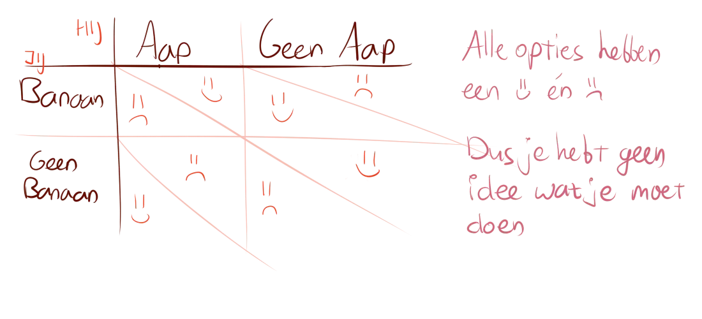
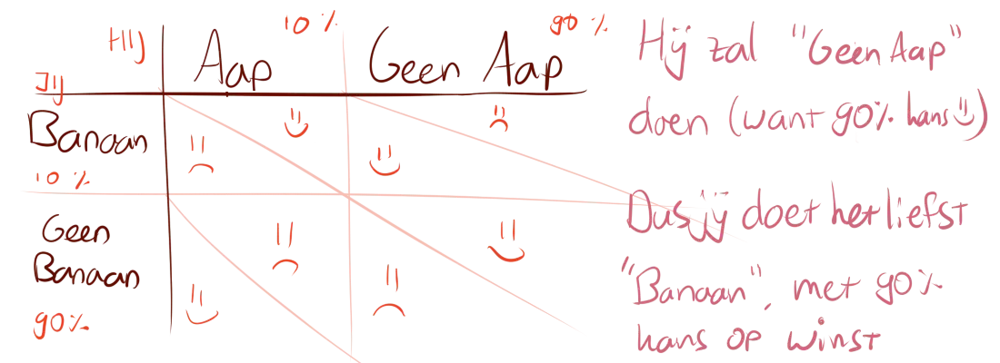

Regelmatig hoor ik mensen iets zeggen dat lijkt op het volgende:

> Ja, het is maar beter als we vroeg vertrekken, want 's middags is het het drukst, en dan hebben wij tenminste een fatsoenlijke plek!

Hoewel er in principe niks mis is met deze gedachte, heb je er praktisch weinig aan. Want, wat doet de rest van de mensen? Die denkt hetzelfde. Die gaan ook wat eerder in de hoop op een betere parkeerplek. Of in de hoop dat een bepaald product nog niet is uitverkocht, of hopend op een zitplaats in plaats van een staanplaats.

Het gevolg is dan natuurlijk dat niemand heeft bereikt wat ie wilde, maar iedereen is wel eerder uit bed gestapt en heeft zich meer gehaast. En dan de volgende keer dat zo'n situatie voorkomt, gaan mensen allemaal nóg ietsjes eerder. En de volgende keer nog eerder, totdat mensen ofwel denken "het heeft toch geen zin, we gaan niet", of mensen denken "het heeft toch geen zin, we komen op het allerlaatste moment wel aan".

Hier gebeurt iets raars. Vanwege het initiële doorzettingsvermogen van die mensen, hebben ze uiteindelijk geen zin meer om ook maar iets te doen en nemen ze met alles genoegen. Het lijkt wel alsof langdurige moeite doen niet loont. Sterker nog, het maakt je lusteloos.

Een soortgelijke situatie dan. Je speelt een blufspel met een vriend, waarin hij beweert dat hij de zogenaamde "Aapkaart" heeft. Jij hebt de zogenaamde "Banaankaart", en zou verliezen als hij daadwerkelijk de aap heeft. Maar, als hij elke andere mogelijke kaart heeft, win je wel. En je weet niet of die ander bluft of niet, dus je gaat beredeneren. Stel hij heeft wel de Aapkaart, dan zou hij dat nooit zeggen want dan speel ik mijn Banaan niet. Tenzij hij denkt dat ik een andere kaart heb, dan is het veilig en zou hij het wel zeggen. Maar stel hij denkt dat ik denk dat hij denkt dat ik de banaan heb, dan zou hij het juist niet zeggen. Zo kun je oneindig doorgaan, en je komt er niet uit.

Tenzij iemand een hele slechte pokerface heeft of zichzelf verraadt, zal een bluf-spel nooit met enige zekerheid te voorspellen zijn. Het resultaat is wederom weer dat je niks doet of "maar wat doet", omdat je toch geen idee hebt wat het gaat worden.

Dit is jammer, want de oneindige bluf kan wel degelijk voorkomen worden. Iedereen past automatisch in zijn hoofd de "mogelijkheden-analyse" toe, wat leidt tot varianten op het gevangenendilemma:

Maar, je kunt ook gewoon een andere strategie toepassen. Zoals, in enigszins simpele spellen of situaties, kun je de kansen uitrekenen dat iets gebeurt en zo uitkomen op je beste zet:

Of, als je een spel vaak speelt, kun je stiekem bijhouden hoe vaak iemand op welke manier bluft, en zo binnen een aantal potjes iedereen er uit spelen. (Niet echt doen, dat is flauw.)

Of, als je weet wat de waarde is van elk deel van een situatie (bijvoorbeeld, door de regen naar huis fietsen maakt jou tien keer ongelukkiger dan gewoon naar huis fietsen), kun je uitrekenen van welke optie je het minste spijt gaat krijgen.

Kortom, er zijn meer dan genoeg mogelijkheden om de oneindige bluf te voorkomen, en meer voordeel te halen uit situaties. Je moet alleen soms een strategie kiezen en niet je gevoel het over laten nemen :p (Grapje, altijd naar je gevoel luisteren. Nouja, nadat je ergens goed over na hebt gedacht.)

 