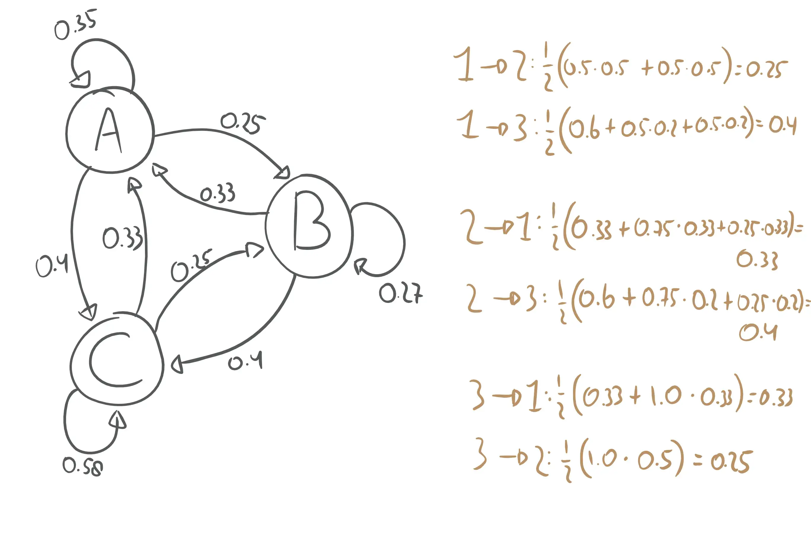
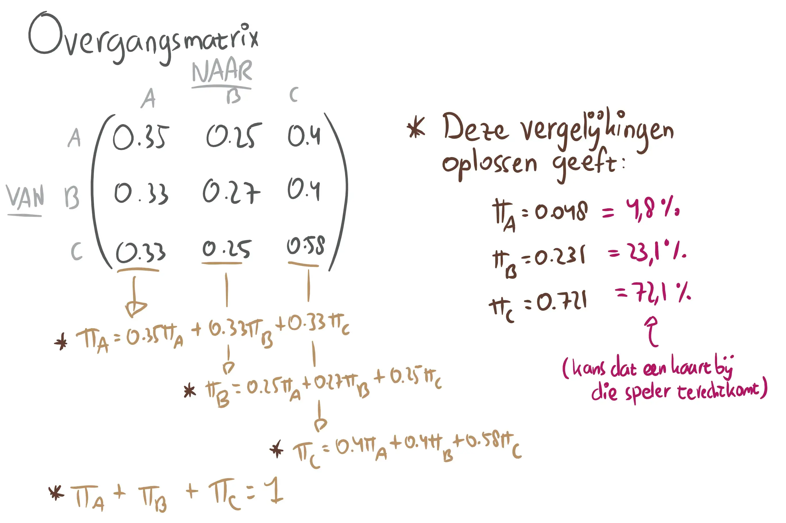

Kakerlakenpoker is een blufspel uit een reeks spellen die allemaal met "kakerlaken" beginnen. Het heeft niks te maken met kakkerlakken of poker (gelukkig). Nouja, er komt wel een kakkerlak in voor als één van de kaarten, maar daar houdt het ook wel op.

Hoe dan ook, het is een leuk spel dat makkelijk uit te leggen is, en net zo goed met een stel reguliere speelkaarten gespeeld kan worden. Het is vooral ook een spel dat _niet_ pesten of levensweg is, en daarom één van mijn favorieten.

## Hoe werkt het?

Het spel kent geen winnaar, maar een verliezer. Je verliest als je als eerste 4 kaarten van dezelfde soort voor je hebt liggen. Of, als je als eerste al je kaarten kwijt bent. (In totaal zijn er 8 soorten, die elk 8 kaarten in het deck hebben zitten. Het hele deck wordt opgedeeld tussen de spelers.)

De eerste speler (noem deze A) kiest een kaart uit zijn hand, en schuift deze gedekt naar een andere speler (B). A zegt welke kaart het is, waarbij hij alles mag beweren. Bijvoorbeeld, je schuift een _vleermuis_ naar iemand anders, maar zegt dat het een _kakkerlak_ is.

B kan drie dingen zeggen: _daar ben ik het **wel** mee eens, daar ben ik het **niet** mee eens, _en _ik geef de kaart door_.

  * Als B **gelijk heeft**, wordt de kaart teruggeschoven naar A en moet deze voor zich neer leggen. 
      * Ofwel, als A heeft gelogen en B zegt "ik ben het er niet mee eens".
      * Of, als A de waarheid vertelt en B zegt "ik ben het er mee eens".
  * Als B **geen gelijk** heeft, houdt hij de kaart en legt deze voor zich neer.
  * Als B kiest om door te geven, bekijkt hij de kaart, en schuift deze gedekt naar een andere speler (die de kaart nog niet heeft gezien) en beweert wat ie wil.

De persoon die uiteindelijk de kaart krijgt, begint de volgende ronde, en zo gaat het door tot iemand verliest.

## Klinkt super tof

_Inderdaad!_ Ik heb dit spel een keer met een grote groep gespeeld (10 man), en toen won elke keer dezelfde persoon, die zei dat ze een vaste strategie had die altijd werkte. Die ga ik proberen te achterhalen.

In eerste instantie denk je: dit is een bluf spel, dus je weet nooit precies wat de ander gaat doen! Je kunt geen vaste strategie hebben!

Het is, echter, ook een spel waar informatie wordt opgebouwd. Uit je eigen hand, wat al op tafel ligt, en wat spelers in de vorige beurten hebben gedaan, kun je afleiden wat de beste actie is.

**Voorbeeld!** Stel ik heb al 3 vleermuizen voor me liggen, en iemand schuift een kaart naar me toe en zegt "dit is een vleermuis". Stel het is inderdaad een vleermuis, dan kan ik het beste zeggen dat ik hem geloof, want dan moet hij hem terugnemen (en ben ik gered). Stel het is geen vleermuis, dan maakt het niet uit als ik zeg dat ik hem geloof, want dan krijg ik toch een ander beest op mijn stapel (die geen gevaar vormt). Dus, je zou in dit soort situaties altijd kunnen zeggen dat je iemand gelooft.

**Voorbeeld!** Er liggen al 4 spinnen verspreid over tafel, en jij hebt er 3 in je hand. Dat betekent dat er überhaupt nog maar één spin in het spel is. Als iemand dan een kaart naar je toeschuift en zegt dat het een spin is, dan is de kans klein dat het er daadwerkelijk eentje is. (Sterker nog, stel jij hebt nog helemaal geen spin voor je liggen en bent niet in gevaar, dan wil die persoon waarschijnlijk een ander beest aansmeren.)

## Een klein beetje wiskunde

Als iedereen compleet random speelt, is de strategie makkelijk te bepalen. Als iemand zegt "dit is X", dan is er een kans van 7 op 8 (87.5%) dat het _niet_ waar is. Immers, die persoon zegt maar wat, en het kan maar 1 van de 8 soorten zijn. Dus, iedereen zegt de hele tijd dat de ander liegt, en de startspeler verliest vrijwel altijd. Hij krijgt namelijk steeds zijn eigen kaart terug, terwijl de rest nauwelijks iets hoeft te doen.

We doen er een schepje bovenop. Stel we gaan er vanuit dat mensen onbewust heel evenwichtig zijn met hun keuzes; 50% van de tijd zeggen ze de juiste soort, 50% van de tijd niet. Wat doen we dan? Dat is alsof je gokt of een muntstuk op kop of munt valt; je weet het niet, en het muntstuk vaker opgooien helpt ook niet.

Het slimst zou zijn om de kaart door te geven. Immers, diegene na jou zal de kaart ook weer doorgeven, en dan ben je 100% veilig, en dat is beter dan 50% kans dat je faalt. Dus iedereen geeft de kaart door, en uiteindelijk staat de laatste speler altijd voor hetzelfde probleem. Aangezien de laatste geen kaart aan zichzelf kan geven, zal deze strategie zorgen voor een gelijke verdeling over alle spelers, en verliest de persoon die net toevallig pech heeft met het soort kaarten.

We gaan nog een stapje verder. Je hebt jarenlang iemand bestudeerd terwijl ze dit spel speelde (want zowel jij als zij blijken geen leven te hebben), en je weet dat zij 70% van de tijd de waarheid spreekt. Andersom, 50% van de tijd geeft ze een kaart door, en 30% van de tijd zegt ze dat ze je gelooft. Stel je speelt met alleen maar mensen zoals zij. Iemand geeft jou een kaart, wat zijn jouw kansen?

  * Kans dat je verliest als je zegt "ik geloof je": 30%
  * Kans dat je verliest als je zegt "ik geloof je niet": 70%
  * Kans dat je verliest als je zegt "ik geef 'm door" en liegt: 100---50---30 = 20%
  * Kans dat je verliest als je zegt "ik geef 'm door" en de waarheid spreekt: 100---50---20 = 30%

Ofwel, jouw beste strategie is altijd doorgeven, en altijd liegen.

## Markovketens!

Kunnen we dit soort dingen hardmaken? Kunnen we meerdere mensen met verschillende strategieën tegen elkaar opzetten? _Jazeker! _Mits je een aantal dingen even over het hoofd ziet.

Zogenaamde _Markovketens_ beschrijven een systeem (in dit geval een spel) met bepaalde toestanden (in dit geval bij welke speler een kaart is) en de kans dat ie naar een andere toestand springt.

In ons spel zit er afhankelijkheid tussen toestanden; je kunt de kaart niet meer doorgeven aan iemand die hem al heeft gezien, bijvoorbeeld. Dit vergeten we even als we met Markovketens gaan werken, want daar moet alles onafhankelijk zijn. (De kans dat een kaart van speler 3 naar 1 gaat moet onafhankelijk zijn van waar die kaart daarvoor allemaal is geweest.) Verder zou alles moeten werken.

We introduceren drie imaginaire spelers:

  * _**A**lbert de Evenwichtige:_ geeft 33% door, gelooft 33%, en gelooft 33% niet. Als hij zelf een kaart geeft, spreekt hij 50% de waarheid, en 50% niet.
  * _**B**ertrand de Arrogante:_ geeft 0% door, geloof 50%, en gelooft 50% niet. Als hij zelf een kaart speelt, spreekt hij 75% de waarheid, en 25% niet.
  * _**C**lara de Leugenaar:_ geeft 60% door, gelooft 20%, en gelooft 20% niet. Als ze zelf een kaart speelt, spreekt ze 0% de waarheid, en 100% niet.

We gaan ervan uit dat spelers even graag naar beide andere spelers geven. (Dus 50% kans dat A aan B geeft, en 50% dat A aan C geeft.) Als we voor elke speler kijken wat de kans is dat ze een kaart succesvol bij een andere speler krijgen, ziet de Markovketen er zo uit:

_Top! En nu?_ Nu kunnen we volgens een formule die ik niet helemaal ga uitleggen de _limietverdeling_ berekenen. Ofwel: stel we zouden oneindig veel rondes spelen, welke fractie van de tijd zal een kaart bij een speler belanden? Ook al doen we nu of onze neus bloedt qua enkele regels en restricties, de uitkomst zou een goede benadering moeten zijn.

Zoals je ziet gaat speler C waarschijnlijk verliezen, en heeft speler A het goed voor elkaar. Teveel doorgeven is een slechte zaak, en consistent hetzelfde doen is te voorspelbaar. Wat we hiervan leren is dat ons vermoeden wordt bevestigd: evenwichtig spelen is goed. (En dat Markovketens veel rekenwerk zijn, en ik daarom het voorbeeld niet ga uitbreiden voor meer dan 3 spelers.)

Op zich kun je het spel op deze manier benaderen, ware het niet dat mensen hun tactiek natuurlijk veranderen op basis van wat jij doet. Als jij altijd doorgeeft, geven mensen al hun kaarten aan jou zodat ze daarna veilig zullen zijn. Dat zet jou juist in een kwetsbare positie waarin je vaak een kaart voor je krijgt. Als jij altijd liegt, gaan mensen op een gegeven moment standaard zeggen dat ze je niet geloven en je bent de grote verliezer. Daarnaast zullen mensen zich niet aan exacte percentages houden.

Dit wordt allemaal erg lastig om met wiskunde te berekenen, dus doen we een ... SIMULATIE!

ZIE DEEL 2: [Kakerlakenpoker---Deel 2][1]

 
 [1]: /blog/2017/2017-08-26-kakerlakenpoker-deel-2/