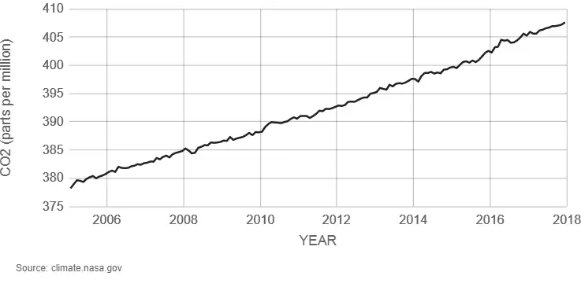
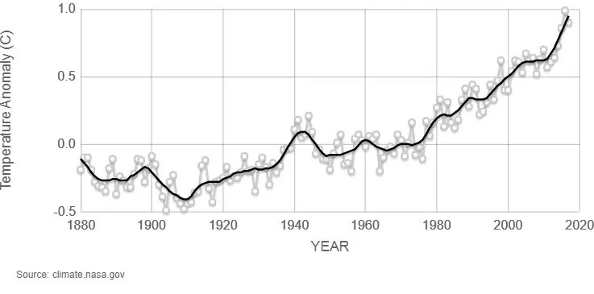

Vergeet alles wat je weet over klimaatverandering. Vergeet alles wat je _denkt _te weten over klimaatverandering. Vergeet wie wat heeft gezegd, en welke meningen of redeneringen je hebt, en schuif dat allemaal opzij. We beginnen helemaal opnieuw.

## De wetenschap van temperatuur

Er zijn redelijk wat mensen die denken dat zonnestralen direct onze aarde opwarmen. Ik dacht dat ook lange tijd, totdat ik eindelijk een fatsoenlijke aardrijkskundedocent kreeg. (Belachelijk eigenlijk dat ik eerst jarenlang moest leren wat de hoofdstad was van een land dat nu niet meer bestaat, terwijl niemand me de basisprincipes van klimaat uitlegde. Oh, onderwijssysteem.)

In werkelijkheid zit het namelijk zo:

  * Zonnestralen komen richting onze aarde, en bereiken eerst de atmosfeer.
  * De ozonlaag filtert gelukkig de zeer schadelijke UV-straling.
  * De warme zonnestralen gaan nog een eindje door, totdat ze de aarde raken.
  * Hierdoor warmt de grond op.
  * De grond geeft deze warmte af aan de lucht om ons heen.
  * (De reden dat wij überhaupt lucht hebben, en dat de warmte op onze planeet blijft, is omdat wij een _atmosfeer _hebben.)
  * De zogenaamde "broeikasgassen" in deze atmosfeer (waarvan CO2 de bekendste is) zijn verantwoordelijk voor het binnenhouden van de warme lucht.

Dat is maar goed ook. Zonder die broeikasgassen zou het hier behoorlijk kouder zijn. Er is geen enkele twijfel over dat de aarde op deze manier aan haar temperatuur komt. (Natuurlijk, er zijn nog veel secundaire factoren die meespelen, zoals de grote oceaanstromen, maar uiteindelijk komt alles voort uit deze basis.)

**Opmerking!** De meeste mensen weten nog wel dat tientallen jaren geleden alarmbellen afgingen omdat er een gat in de ozonlaag zat. En terecht. Dit was heel gevaarlijk, want als dat gat te groot werd, kreeg iedereen kanker of een andere enge ziekte van de UV-straling. Toentertijd hebben wetenschappers onderzocht dat bepaalde schadelijke stoffen daar de oorzaak van waren, vervolgens deze stoffen uitgefaseerd, en voilà: een grote ramp werd voorkomen. Houd dit in je achterhoofd. Wetenschappers doen hun best om de wereld te redden.

**Vervolg opmerking!** Het duurt trouwens nog even voordat de ozonlaag helemaal is hersteld, en de hoeveelheid binnengekomen straling heeft nog wel een kleine uitwerking. De laatste decennia is het aantal gevallen van huidkanker enorm toegenomen---hoewel dat ook kan komen door onverantwoordelijk zonnebaadgedrag (of het feit dat alle zonnecrèmes ineens tegelijk zijn gestopt met werken).

## De huidige situatie

De logische conclusie is natuurlijk: meer CO2 in de lucht betekent meer warmte vastgehouden op aarde.

**Opmerking!** Er zijn dus ook andere broeikasgassen, waarvan de bekendste _methaan _is. Dit komt bijvoorbeeld vrij uit de scheten van koeien. Het is zelfs een sterker broeikasgas dan CO2, maar het is in deze hele discussie even niet van belang, aangezien er veel minder van is en wij het ook niet in grote getale de lucht inpompen.

**Opmerking!** Sterker nog, _waterdamp_ is ook een broeikasgas, nog veel sterker dan CO2. Zoals later ook uitgelegd, zorgt een verhoogde uitstoot van CO2 ook dat er meer waterdamp in de atmosfeer komt. Het is immers warmer, en dus verandert meer water in waterdamp, wat in de atmosfeer blijft hangen. Dit versterkt het broeikaseffect enorm, maar kunnen we natuurlijk niet oplossen door dan maar al het water weg te halen. Nee, alles staat en valt bij CO2.

Deze conclusie is consistent met wat we observeren. De afgelopen jaren waren---gemiddeld genomen over de hele wereld---bijna allemaal de warmste ooit, terwijl de hoeveelheid CO2 in de lucht almaar stijgt en hoger is dan ooit in de geschiedenis van de mens.

Om het visueel te maken, hier de twee grafieken van NASA zelf:

Dit is natuurlijk geen bewijs. Dat is ook niet nodig, want het is al bewezen dat CO2 de warmte op aarde vasthoudt. De grafieken zijn slechts een bevestiging. Ze laten zien hoe de situatie er nu uit ziet, en hoe we daar gekomen zijn.

## Waarom zou ik daar om geven?

Natuurlijk heeft iedereen deze vraag. _Dus, het wordt een paar graden warmer, waarom zou dat een probleem zijn? Eindelijk lekker weer in Nederland! Terrasje pakken in Januari! En ik was toch al een tegenstander van de Elfstedentocht!_

Er zijn talloze redenen waarom dit een groot probleem is. Ze komen allemaal voort uit het volgende beetje wijsheid:

> Als de temperatuur over de hele aarde omhoog gaat, verandert er wel meer dan alleen de temperatuur.

Planten en diersoorten kunnen zich niet op magische wijze aanpassen. Mensen gaan zich niet zomaar redden in maandenlange temperaturen van 50 graden Celsius. De zeespiegel stijgt enorm. (Wij in Nederland zijn natuurlijk weer de eerste die daar grote problemen mee gaan krijgen.) Weersomstandigheden worden extremer omdat de waterhuishouding wordt verpest (wat ik dadelijk uitleg). Dit zijn slechts enkele gevolgen van een gemiddeld hogere temperatuur.

Veel mensen denken dat "klimaatverandering" slechts betekent dat het overal een beetje warmer wordt. Dat is niet waar. Wetenschappers hebben voorspeld dat het klimaat in alle opzichten _extremer_ wordt, en dat zien we ook gebeuren.

**Voorbeeld!** We zien nu al een toename in heftige weersomstandigheden, extreme temperaturen (zowel hoog als laag), dieren- en plantensoorten die met uitsterven worden bedreigd, en ga zo maar door. Je zou kunnen zeggen dat het toeval is. Je zou kunnen zeggen dat het nou eenmaal pech is voor de slachtoffers. (Wat, overigens, een van de gemeenste uitspraken is die ik kan bedenken. Hij deelt de derde plek met "kan ik er wat aan doen dat die persoon het kruispunt overstak terwijl ik dronken door rood reed!") Maar, het is te heftig en gebeurt te snel achter elkaar, om weg te wuiven.

**Voorbeeld!** Omdat ik het toevallig net voorbij zag komen: door compleet onverwachte nachtvorst in April is een groot deel van de wijnteelt van Franse boeren mislukt.

**Voorbeeld!** Nu we toch bezig zijn: laatst was er een storm die door het hele land bomen uit de grond trok en over straat uitstrooide. Eventjes later was het waterpeil zo gevaarlijk hoog dat alle zeilen werden bijgezet om een eventuele ramp te voorkomen. Moet je nagaan; dat is nog maar een snelle greep uit gebeurtenissen de laatste tijd. Wederom, je kunt het toeval noemen, maar op een gegeven moment wordt dat ongeloofwaardig.

## Hoe weten wij zeker dat dit waar is?

Niet. Niemand weet hoe de toekomst eruitziet. Maar de enige manier waarmee de mensheid de toekomst kan voorspellen, is met behulp van _modellen_. Een model volgt de regels die in het verleden waar zijn geweest, en simuleert zo hoe de toekomst eruit gaat zien.

Sterker nog, je kunt de precisie en accuraatheid van een model testen. Stel je hebt een model waarmee je de zeespiegel wilt voorspellen. Je pakt de voorgaande twintig jaar als data en voert ze allemaal in. Uiteindelijk heb je misschien wel vijftig factoren met verschillende gewichten en relaties tot elkaar, en is je model af. Om hem te testen, voer je de data in van enkele jaren die je _niet hebt gebruikt_, en kijkt hoe ver je model van de juiste waarde af zit. (Dit is maar één van vele manieren.)

Er zijn vele klimaatmodellen gemaakt, op vele verschillende manieren. Ja, de voorspellingen waren vaak onjuist. Ja, de foutmarge was in het begin erg groot. Maar met elk nieuw onderzoek wordt de foutmarge kleiner, en komen voorspellingen steeds meer uit. Dat is hoe wetenschap werkt: je experimenteert, de rest kijkt ernaar en verbetert, en zo gaat het door.

Veel onafhankelijke onderzoeken met verschillende modellen en invalshoeken komen allemaal op hetzelfde antwoord uit: _ja, de verhoogde CO2-concentratie in de lucht zorgt voor een extremer klimaat._

De precieze gevolgen zijn natuurlijk onduidelijk. Geen enkel model zegt "de zeespiegel stijgt met precies 50,6 cm" en heeft het sowieso juist. Maar de grote lijnen zijn duidelijk, en dat zijn ze al heel lang, en we zijn nu zelfs op het punt dat we het in de praktijk zien gebeuren.

## Kritische vraag

_Waarom zorgt klimaatverandering dan precies voor extreme omstandigheden? _

Pak je favoriete natuurramp, en ga er eens goed voor zitten. Denk logisch na: wat is de oorzaak van zo'n ramp, en zorgt klimaatverandering dat die oorzaken gebeuren of samenkomen met een grotere kans?

Ik doe het voor: _bosbranden_. Warmere temperaturen zorgen voor meer, langere en intensere droogtes. Vuur kan makkelijker beginnen, en zich veel makkelijker verspreiden. (Hoewel natuurlijk het overgrote deel nog steeds door mensen wordt aangestoken, zorgt een droger klimaat wel dat het sneller gebeurt en verspreidt.)

Nog eentje die daarop aansluit: _hevige regen_. Een warmere atmosfeer kan meer water vasthouden (want, water moet warm zijn om als gas op te stijgen). Dus de kans is groter dat, als het regent, het in een gigantische en langdurige hoosbui gebeurd.

Daar weer op aansluitend: _extreme sneeuw/hagel_. Doordat het over het algemeen warmer wordt, gaat het natuurlijk minder vriezen. Dit zorgt dat 's winters meer water verdampt dan zou moeten, om vervolgens in een grote hagel- of sneeuwstorm ergens omlaag te komen. (Want, sneeuw en hagel ontstaat als regen bevriest bovenin de atmosfeer, waar het wél kouder is.)

En als we toch bezig zijn: _extreme temperaturen (zowel warm als koud)_. Door de oceanen van onze wereld lopen enkele grote, belangrijke stromen. Deze nemen warm en koud water met zich mee, en bepalen voor een groot deel de temperaturen. Door het verstoren van hun patroon (meer water verdampt, komt op de verkeerde plekken in te grote getale naar beneden, etc.) kan deze tot een halt komen, waardoor sommige plekken véél kouder worden, en andere plekken véél warmer.

Nog eentje dan: _overstromingen_. De ijskappen houden een gigantisch volume aan water vast. Als ze smelten stijgt de zeespiegel aanzienlijk, en zitten alle steden die ook maar enigszins dichtbij water zitten met de gebakken peren.

**Opmerking!** Er zijn mensen die ontkennen dat de ijskappen smelten. Dat is gewoon niet waar. Vaak citeren ze dan dat het oppervlakte ijs gelijk is gebleven, of zelfs groter is geworden, maar dat is iets compleet anders dan het totale volume. Dat wordt al decennia kleiner en kleiner, en loopt---goh wat toevallig---precies gelijk met de opwarming.

Het is niet erg om hier kritisch op te zijn. Kritisch zijn is waar de wetenschap om draait! Maar kritisch zijn is iets anders dan wetenschap negeren, of zomaar belachelijk maken. Kritisch zijn is iets anders dan feiten of logica negeren. Als iemand de onderzoekers niet gelooft, nodig ik diegene uit om zich te verdiepen in hoe de wereld werkt, en eigen modellen op te stellen of eigen data te vergaren. Op eerlijke en wetenschappelijke wijze, vanzelfsprekend.

## Zijn mensen hiervoor verantwoordelijk?

De juiste reactie hier is: het maakt geen reet uit of het onze schuld is, we moeten het toch oplossen.

(Dat is een beetje hetzelfde als dat je huis in de fik staat, en je gaat discussiëren of het de schuld is van je zusje, de hond, of de buurman die altijd gemeen kijkt. Uiteindelijk is het hele huis afgebrand, de helft van je gezin overleden, en je roept slechts dat je 100% zeker bent dat het de schuld van je konijnen was.)

Ik wil er, echter, toch nog iets dieper induiken. Zojuist is vastgesteld dat globale opwarming, en dus klimaatverandering, in ieder geval deels wordt veroorzaakt door CO2 in de atmosfeer. Wij pompen die CO2 in de atmosfeer. Wij kappen bomen die de CO2 om zouden kunnen zetten. Daar kun je niet omheen, dus dat is sowieso onze schuld.

Er is namelijk geen complot onder eekhoorns om op een geheime plek zoveel mogelijk bomen in de fik te steken. Er zijn geen giraffen die met een rotvaart alle blaadjes vreten omdat ze in de winter willen zonnebaden. Er zijn geen olifanten die met hun slurf een (heel diep) gat in de grond graven en olie omhoog brengen.

CO2 is de grote boosdoener. Wij halen het uit de grond en stoppen het in de lucht, terwijl de natuur precies het tegenovergestelde wil doen om in balans te blijven. Er is geen enkele reden om aan te nemen dat alle onderzoeken en logische redeneringen onjuist zijn, en CO2 totaal geen rol speelt.

(Zoals men waarschijnlijk weet: er is maar één tegenvoorbeeld nodig om een theorie te ontkrachten. Dat tegenvoorbeeld blijft uit. Als iemand kon bewijzen dat CO2 helemaal geen broeikasgas is, dan zouden alle wetenschappers dat accepteren en toegeven dat ze verkeerd zaten. Maar tot nog toe hebben we alleen overweldigend bewijs dat CO2 de warmte vasthoudt.)

## Leren van de geschiedenis

_Maar, in de geschiedenis van de aarde was het vaak veel warmer, en toen waren er nog geen mensen die broeikasgassen uitstootten!_ Dat is helemaal waar. Niet dat het mijn vorige statement ontkracht, maar het kan wel inzicht bieden in andere factoren die meespelen in het klimaat.

De temperatuur, en daarmee natuurlijk ook het CO2-gehalte, heeft altijd gefluctueerd. Zoals te zien in weer een mooie grafiek van de NASA:

**Opmerking!** Laten we het er over eens zijn dat NASA _niet_ met de data knoeit, en dat het ook geen complot heeft met alle andere onderzoekers in de wereld om allemaal op exact dezelfde manier met de data te knoeien.

_Wat is hiervoor de reden?_ Heel ruw gezegd: de natuur is niet constant. De natuur houdt zichzelf in balans door te golven; denk aan de seizoenen, dag/nacht cyclus, wanneer een populatie te groot wordt sterft deze meteen af (omdat het te weinig voedsel kan vinden om de populatie te onderhouden), elk organisme wordt geboren en sterft een keer (waarmee het zijn grondstoffen/energie teruggeeft aan de aarde), etc.

Op diezelfde manier heeft de aarde gewisseld tussen hele hoge en hele lage CO2-concentraties. Wanneer er teveel planten komen, zetten ze alle CO2 om in zuurstof, en krijgen we juist een ijstijd. In de ijstijd sterven veel planten, totdat een punt wordt bereikt waarin de aarde weer aan wederopbouw kan beginnen. Het bouwt, en bouwt, en bouwt, en het CO2-gehalte blijft stijgen, en er komen steeds meer planten die daarvan genieten---totdat er weer teveel planten zijn. De cyclus herhaalt zich.

**Opmerking!** Dit is in (hele) grove lijnen de koolstofcyclus. Doe meer onderzoek daarover als je wilt. Het is een heel belangrijk---maar vaak vergeten---fenomeen.

**Opmerking!** Sommige grote schommelingen in het verleden zijn veroorzaakt door o.a. vulkanische activiteit. Vulkanische activiteit was vroeger vele, vele malen hoger dan nu. Maar, zelfs als je kijkt naar hoeveel CO2 zo'n vulkaan uitstoot, zie je dat mensen misschien wel honderd keer meer dan dat de lucht in pompen.

**Interessant feitje!** In zekere zin begon de aarde als één grote bal van hitte, en vulkanen, en omhoog spuitende stoom. Deze stoom koelde af, gedurende miljoenen jaren, kwam als water omlaag, en zo zijn wij aan onze oceanen gekomen. Toentertijd was de aardkorst gevuld met enorme concentraties ijzer, en toen hier water op kwam, begon dit natuurlijk te _roesten_. Daardoor kwam zuurstof omhoog, en zo zijn wij aan onze atmosfeer gekomen. (Denk hieraan, de volgende keer dat je boos bent dat je fiets weer is gaan roesten. We moeten roest ongelofelijk dankbaar zijn.)

## Conclusie uit de geschiedenis

Dus, dit fluctueren is inderdaad natuurlijk, maar ook---tja---dodelijk. Zeker nu we vele malen harder gaan dan in ons verleden is gebeurd (zoals te zien in bovenstaande grafiek).

In de geschiedenis van de aarde zijn vijf "moments of mass extinction" aan te wijzen. Het uitsterven van de dinosauriërs, bijvoorbeeld, was er één van. Door het uitsterven van deze oppermachtige beesten, kregen kleinere en laag-bij-de-grondse beesten een kans, en zonder dit moment waren wij nooit ontstaan. Het is niet alsof het de _schuld_ was van de dinosauriërs dat er een komeet tegen de aarde vloog, maar ze zijn er wel mooi aan ten onder gegaan (net als het overgrote deel van de andere organismen toentertijd).

Als wij klimaatverandering zijn gang laten gaan, gebeurt in essentie hetzelfde met ons. Wij verliezen onze voedselvoorraden, onze woonplekken, onze energiebronnen, en we overleven het niet. Nadat wij zijn verdwenen keert de temperatuur terug naar normale niveau's, en leven enkele gelukkige organismen voort. Ze zullen zelfs opbloeien. Misschien hebben wij de _honden_ wel tegengehouden door ze als huisdier te nemen, en als we eenmaal weg zijn, worden ze de baas van het universum.

Het CO2-gehalte stijgt nu sneller dan het ooit heeft gedaan, naar een niveau dat al in _hele lange tijd_ niet is bereikt. Dat is niet natuurlijk. Dat kan de natuur niet in balans houden. Althans, niet op een manier waarbij wij er goed vanaf komen.

Mijn punt is het volgende:

  * Ja, het klimaat schommelde vroeger, maar minder snel en heftig dan nu.
  * Ja, het klimaat schommelde vroeger, _maar toen waren wij er nog niet, en leefden niet op deze manier_. Als onze huidige soort in die extreme tijden had geleefd, waren we van de aarde geveegd. 
      * De enige schommelingen die de moderne mens en zijn voorouders hebben meegemaakt, waren (lichte) ijstijden. Deze zijn, bijvoorbeeld, verantwoordelijk voor het feit dat de mens zich over de hele wereld heeft kunnen verspreiden. Tussen de continenten ontstond een "ijsbrug", en de mensheid kon zo naar alle uithoeken van de wereld trekken. (Onze primitieve voorouders waren niet in staat om boten te bouwen, en zeker niet om deze succesvol maandenlang naar een ander continent te sturen.)
  * Nee, het maakt niet uit of de mens _verantwoordelijk_ is, we moeten er toch iets aan doen.

**Opmerking!** Interessant is wel dat men vermoedt dat we misschien een ijstijd hebben voorkomen door onze uitstoot. Toen de aarde net was ontstaan, fluctueerde het tussen ijstijden en extreem hete periodes, maar eigenlijk sinds onze komst is het klimaat relatief zeer stabiel. De kans is aanwezig dat ergens weer een ijstijd zou ontstaan, en dat wij dat per ongeluk hebben voorkomen. Food for thought.

## "Maar ... ik geloof gewoon niet in klimaatverandering"

Ah, het aloude "gevoelens zijn belangrijker dan feiten", gekoppeld met een beetje "jouw logica en wetenschap kan niet op tegen mijn koppigheid". Jammer genoeg heb ik dit vaak gehoord; net als mensen die niet geloven in evolutie, of dat de aarde ouder is dan de Bijbel beweert, of dat de aarde niet plat is.

Klimaatverandering is niet iets waarin je _gelooft._ God, daar kun je in geloven. Je kunt geloven dat er een mythische kracht is die ons allemaal verbindt, of dat dieren stiekem prima kunnen praten maar dat op meesterlijke wijze voor ons verbergen. Maar, zeggen dat je niet gelooft in de wetenschap achter klimaatverandering, is als zeggen dat je niet gelooft in zwaartekracht, of het bestaan van de zon, of het feit dat geluid door luchtgolven wordt gemaakt.

Het is alsof je zegt "oké, ik heb hier een iPhone in mijn hand die geweldige dingen kan doen waar ik elke dag van geniet, maar ik geloof niet dat dit echt kan. Nee, het is allemaal een truc. Wetenschappers kunnen écht niet technologie ontwikkelen en voorspellen hoe iets gaat werken. Onmogelijk. Het is allemaal een complot. Er zit een piepkleine dwerg in mijn iPhone die mij voor de gek houdt en het idee geeft dat dit een ding is dat werkt. Pff, wetenschap, één grote bende. Maar ik blijf wel mooi mijn iPhone gebruiken voor alles in mijn leven."

Zelfs als dat enigszins zou kunnen---_geloven_ in klimaatverandering---heeft zo'n reactie niks te maken met alles wat ik hiervoor heb gezegd. Het is alsof ik zeg "kijk, deze zak chips is goedkoper dan die", en dat die ander dan zegt "hmm, ik denk toch dat tijgers helemaal niet van chips houden". Er komt wel hetzelfde woord in voor, maar verder is dit compleet langs elkaar heen praten.

## Conclusie

Aan het begin van dit artikel vroeg ik om alle vooroordelen te vergeten. Ik heb, puur gebaseerd op feiten en wat we observeren, miniem uiteengezet wat het probleem van klimaatverandering inhoudt. Ik heb er veel over nagedacht, en het zo simpel mogelijk gepresenteerd, en ik snap niet hoe iemand hier tegenin kan gaan.

  * De link tussen onze uitstoot en een verhoogd CO2 gehalte is bewezen.
  * De link tussen CO2 en opwarming van de aarde is bewezen.
  * De link tussen opwarming van de aarde en klimaatverandering is bewezen.
  * De link tussen klimaatverandering en dat de gevolgen catastrofaal zouden kunnen zijn is bewezen.

Ik weet niet waarom mensen ervoor kiezen om geen moeite te doen om een catastrofe te voorkomen. Natuurlijk, met hele kleine kans gebeurt het niet en zat iedereen er naast, maar dat is de onzekerheid die je altijd hebt over de toekomst. Op diezelfde manier zou je kunnen zeggen "oké, de Duitsers zijn binnengevallen met bommen, tanks, en geweren---maar misschien komen ze wel in vrede, doen ze ons helemaal niks, en willen gewoon op vakantie in Engeland!". Geloof je het zelf nog?

Ik heb debatten gekeken---en vele artikelen en comments gelezen---van mensen uit alle invalshoeken. Er komen de meest rare uitspraken naar boven. (Van beide kampen trouwens: sommige mensen steunen de strijd tegen klimaatverandering zonder te weten wat het inhoudt.)

In **deel 2** wil ik specifiek deze uitspraken uitlichten en uitleggen waarom ze onjuist zijn. (Ik heb in dit deel ook enkele tegenargumenten al weerlegt, maar die waren zo fundamenteel onjuist dat het wel moest. Anders was dit een heel kort en incompleet artikel geworden. Natuurlijk, het is nu ook incompleet, want het hele klimaatprobleem is miljoenen keren groter dan deze 3000 woorden, maar ik denk dat ik de meest belangrijke onderdelen wel heb gehad.)

> [Over Klimaatverandering---Deel 2](/blog/2018/2018-02-20-klimaatverandering-deel-2/)

In **deel 3** ga leg ik uit _wat_ men dan precies zou kunnen ondernemen.

> [Over Klimaatverandering---Deel 3](/blog/2018/2018-02-27-klimaatverandering-deel-3/)

In **deel 4** wil ik op een compleet andere manier kijken naar het hele klimaatprobleem, omdat het misschien eerder mensen overtuigt om actie te ondernemen, in plaats van alleen maar discussie opwekken.

> [Over Klimaatverandering---Deel 4](/blog/2018/2018-03-03-klimaatverandering-deel-4/)

 

 