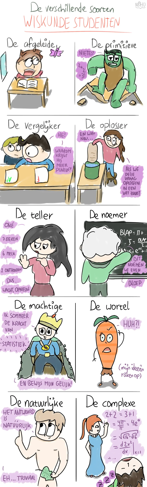

Na lang beraad heb ik besloten "de aftrekker" toch maar niet mee te nemen.

Mocht het opgevallen zijn: ja, dit is een andere stijl dan normaal. Ik test een nieuw tekenprogramma uit (**FireAlpaca**, gratis te downloaden voor elk besturingssysteem. Ik vond alleen de naam al geweldig.), en omdat ik nog niet wist hoe alles werkte, veranderde zelfs per ongeluk tijdens deze cartoon een paar keer de stijl.

_Waarom test je een nieuw programma? _Tot nog toe tekende ik alles in Photoshop, maar om eerlijk te zijn lijkt die met elke update langzamer en raarder te worden. (Oude versies werken niet meer, want daarvoor is mijn tekentablet weer te nieuw 🙁 ) Dus ik zal van tijd tot tijd een nieuw programma uitproberen.

Dit programma werkt prima. Het is sneller dan Photoshop, instellingen zijn wat makkelijker/sneller te wijzigen, en het kan dezelfde mooie lijnen maken. _Maar_, en dat is een grote maar, het heeft wat probleempjes. Soms dan besluit het ineens geen mooie lijnen te maken, en om je pen niet goed te volgen (waardoor je eerder een soort spijkerschrift krijgt, in plaats van een mooie ronde lijn). Dus dan moet je vijf keer iets opnieuw doen (totdat dezelfde beweging wel gewoon perfect is).

Ik kan de oorzaak niet vinden. Het ligt niet aan mijn apparaat of pen (andere programma's doet ie helemaal perfect), dus tenzij ik het probleem ooit oplos, weet ik niet of ik nog veel met dit programma zal werken. (Ik heb goede dingen gehoord over Clip Studio Paint, misschien daar maar eens een demo van proberen.)