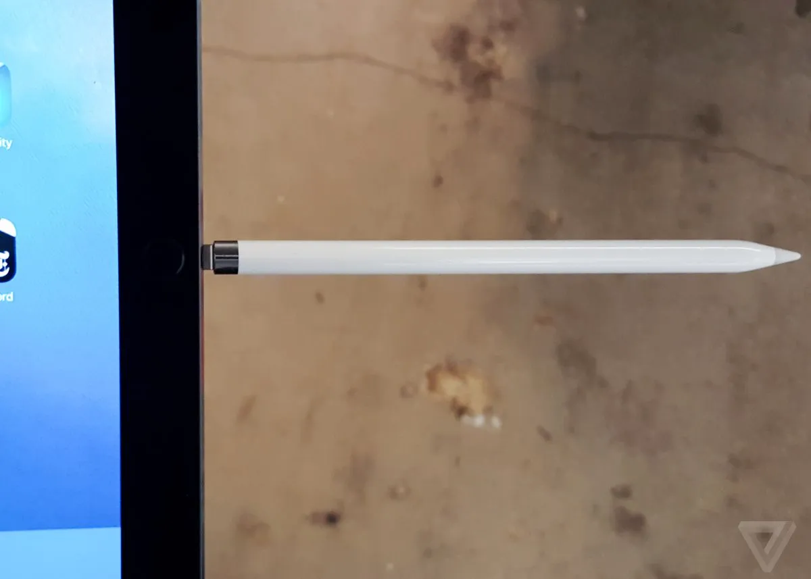
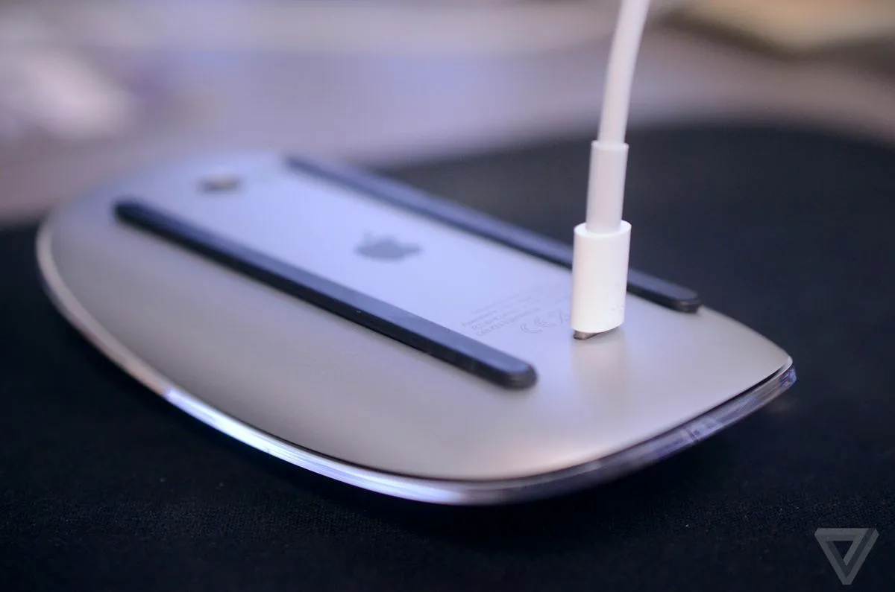

Voor veel mensen staat Apple (het merk) bekend als het toonbeeld van design. Apple producten mogen dan veel duurder zijn, maar dan heb je tenminste een goed _design_. Apple producten mogen dan minder goed, sterk of snel zijn, maar ze zien er tenminste goed uit en werken altijd. Het bedrijf werd waarschijnlijk nog het meest populair puur door de haat van mensen jegens Microsoft en hun constant crashende producten.

Ik was een van die mensen. Wij hadden thuis in eerste instantie een gigantische kast, inclusief gigantisch beeldscherm, dat als computer door moest gaan. Het enige wat ik me herinner is dat er een "RESET" knopje op de kast zat, en dat ik daar tien keer per dag met een pen inprikte. Zo vaak moest de computer opnieuw opgestart omdat hij het niet meer deed.

Mijn broer had toen onderzoek gedaan en voor zichzelf een Apple computer gekocht. (De iMac Core Duo, om precies te zijn.) Wat een prachtig ding! De computerkast en het beeldscherm zitten _samen_! Wow! En alles werkt meteen, zonder crashes! Iedereen was enorm onder de indruk.

Vanaf dat moment brak de Apple-periode bij mij thuis aan. Eerst kocht mijn zus er een, daarna ik, daarna mijn andere zus, toen mijn ouders, ga zo maar door. Ondertussen nam ook de helft van de mensen thuis een iPhone en werden overal extra Apple-accesoires aangeschaft. Waarom? "Het werkt allemaal zo goed en makkelijk." Waarom ook? "Het ziet er allemaal zo goed uit. Het is zo mooi _gedesigned_."

Apple was de voorloper van (functioneel) design. Ze waren niet bezig met nieuwe mogelijkheden bedenken, hun producten nóg krachtiger maken, nieuwe wegen bewandelen. Nee, ze hadden heel hard nagedacht over hoe alles makkelijker, intuïtiever en eleganter kon. Geen losse computerkast en beeldscherm, maar samen. Geen heel toetsenbord op een mobieltje proberen te proppen, maar gewoon het hele mobieltje touchscreen maken. Geen constant crashende computer die dingen doet die je niet wilt, maar gewoon duidelijke limieten zetten op wat de gebruiker wel en niet mag. Geen niet-te-onthouden ALT-codes als je een trema op een "e" wilt zetten, maar gewoon een simpele sneltoets (SHIFT+u, en dan de letter waarop je de trema wilt).

Maar aan alle gouden tijdperken komt een einde.

De snoeren van Apple waren zo dun dat ze almaar bleven knappen, waardoor men langzamerhand alsnog andere muizen, toetsenborden en opladers ging gebruiken. Ik wilde meer uit mijn computer halen door o.a. computerspellen te ontwikkelen, maar mijn iMac stond dat niet toe, want alles was netjes dichtgetimmerd en afgeschermd binnen het besturingssysteem. De computer van mijn zus deed van de ene op de andere dag niks meer, en toen we hem (binnen de garantie) naar de Apple store brachtten, moesten ze voor veel honderden euro's dat ding weken in beslag nemen. (Mijn huidige laptop heb ik al meerdere keren gered door gewoon de achterkant open te maken en dingen terug op hun plek te duwen, of er tegenaan te blazen. Maar nee, de iMac zit stevig dichtgeschroefd.) Mijn moeder had een "magic mouse" aangesmeerd gekregen, die voor geen meter werkte en iedereen handkrampen gaf. De Macbook van mijn zusje stopte uit het niets compleet met werken; uiteindelijk bleek het een welbekend probleem omdat Apple weigerde genoeg ruimte te maken voor de reserve-accu binnen het ding. Als je deze zelf stevig terugduwde deed hij het weer.

Langzamerhand groeide het besef: hartstikke mooi, maar we hebben toch liever een product dat werkt. We kopen toch liever een goedkope muis in de aanbieding, dan een superdure muis van Apple, omdat de goedkope variant beter werkt en langer meegaat ook. We kopen toch liever een computer die veel aankan en veel (USB-)poorten heeft, dan een slechtere (maar duurdere) computer die om de een of andere reden zo plat als een dubbeltje moet zijn.

En daar hield het niet op. Apple zette door. Ze dachten: wij zijn van de design, dus wij blijven van het design! En toen kreeg je dit soort dingen:

Of deze.

Of het verwijderen van de koptelefoonaansluiting in de iPhone. (Hoewel ik heb meegekregen dat mensen die probeerden terug te krijgen door zelf in hun iPhone te boren. En ik weet niet wat dommer is.) Of het constant verplichten dat mensen online zijn en van alles in de cloud gaan opslaan. Of het feit dat men nog steeds de meest gebruikte knoppen op de iPhone (zoals "terug") bovenaan zet, terwijl je de telefoon onderaan vasthoudt en bedient.

Waar Apple ooit voorop stond, lijkt het nu de grote tegenstander van design. Ze zijn de rebellen die zeggen: "Wat maakt het design uit? Zolang het maar snel oplaadt en uiteindelijk doet wat het moet doen! WEG MET DESIGN! WEG MET DESIGN!" En dat juist in een wereld waar alle andere bedrijven opkeken naar Apple, leerden van hun filosofie, en nu zelf heel goed op weg zijn om hun producten beter te ontwerpen. Microsoft heeft bijvoorbeeld gigantische stappen gezet om hun besturingssysteem en apparaten gebruiksvriendelijker te maken. En zo'n beetje alle telefoonproducenten hebben designelementen van Apple gejat voor hun smartphones.

En dat is eigenlijk waarom ik dit artikel schrijf. Het gaat niet om hoe Apple de mist in gaat, maar het gaat om het bredere verhaal. Over hoe design nog altijd verkeerd geïnterpreteerd wordt. Ik heb me namelijk jaren erin verdiept, en allerlei boeken over ontwerpen gelezen, en ik denk echt dat het overgrote deel van de bevolking nog beter design begrijpt dan de makers van die producten. Waarom? Omdat de bevolking daadwerkelijk _de producten gebruikt_.

Ik weet nog dat vroeger stoelen stonden in het theater waar mijn vader werkte. Een tijdje maar, daarna kwam een nieuwe aankleding. Deze stoelen waren geen standaardstoelen, het waren _design_stoelen. Althans, dat maakten wij ervan. Wij probeerden erin te zitten, erop te zitten, ertegenaan te leunen, maar _niks_ was comfortabel of bruikbaar. Dus dan kwam al snel de grap: "Nee, je begrijpt het niet, het is _design_." Op dezelfde manier als een groep scholieren naar een schilderij kan kijken waarop slechts willekeurige strepen in willekeurige kleuren staan, en zegt "nee, je begrijpt het niet, dat is _abstracte kunst_!" In onze ogen betekende "design" dat iets óf zo mooi mogelijk was óf zo gek/experimenteel mogelijk was.

Terwijl design juist het tegenovergestelde is. Design maakt het niet uit of iets mooi is, of gek, of vernieuwend, zolang het maar _zo goed mogelijk is ontworpen_. Design gaat erom dat je niet alleen iets maakt dat werkt, maar ook iets dat zo goed en gebruiksvriendelijk mogelijk werkt. Een piano waarbij de toetsen ondersteboven staan kan best werken, maar het is veel beter ontworpen als de toetsen gewoon naar boven staan. Een bank van glas kan best hartstikke mooi zijn, maar zit het lekker? Nee. Op diezelfde manier is een designstoel waarop je niet kunt zitten, niet eens een stoel, maar gewoon een nutteloos voorwerp.

De ontwerper had dit kunnen weten als hij gewoon zijn stoelen aan een stuk of 10 gezinnen had gegeven. Zij hadden het thuis neergezet, geprobeerd om het in hun leven in te bouwen, en vervolgens de feedback gegeven dat het prutstoelen zijn. Op diezelfde manier had Apple kunnen weten dat ze niet de koptelefoonaansluiting uit hun mobiel moesten halen als ze honderd fans de nieuwe telefoon wekenlang hadden laten uitproberen. Het overgrote deel zal vrij snel hebben gezegd: "ik gebruik de iPhone om muziek te luisteren in de bus/auto/op de fiets/in bed ... en dat kan nu niet. (Tenzij ik allemaal extra dingen ga aanschaffen.) Dus dit product krijgt van mij een 0."

Vandaar dat ik oproep tot het doorbreken van de designleugen! Iedereen moet leren wat design wél betekent, en alle bedrijven moeten luisteren naar de mensen die hun producten daadwerkelijk gebruiken. Ik wil geen glimmende, glansende, gloeiende muis die mij een tennisarm geeft en na drie weken kapot is. Ik wil een keilelijke muis die superfijn werkt en jaren meegaat. Ik wil geen telefoon die niet eens in mijn broekzak past, en als ik dat wel probeer doorbuigt en kapotgaat. Ik wil een telefoon die werkt, makkelijk meegenomen kan worden, en ik duizend keer kan laten vallen. Ik wil geen stoel waarbij je een raketgeleerde moet zijn om hem uit te klappen. Ik wil een stoel die werkt zoals de eerste of tweede gedachte van de meeste mensen zal zijn.

Eigenlijk is het heel erg simpel:

> Maak stevige, werkende, gebruiksvriendelijke producten. Meer hoeft echt niet.

Zo. Dan mogen mensen nu ophouden met schermen steeds dunner maken, onnodige dingen toevoegen aan apparaten die zorgen dat ze niet of minder goed werken, of kabels en stekkers maken die bij de eerste scheet al kapotgaan. Desnoods stop je computers in knuffels, of maak je kabels vier keer zo dik, of doe je een bumper om producten heen, of maak je 3 verschillende besturingssysteem om de állerbeste te vinden. Ik wil ertegenaan kunnen hangen, ermee kunnen leven, ze ten volste kunnen gebruiken, en dat ze dan alsnog jarenlang doen wat ze horen te doen. Dát is goed design.

_Opmerking_: natuurlijk, het is altijd fijn als dingen er goed uitzien, of als mensen nieuwe dingen uitproberen. Maar dat moet nooit ten koste gaan van goed design.

_Opmerking:_ Apple doet natuurlijk nog steeds hier en daar goede dingen. (Hoewel ik nog steeds geen enkele reden heb om ooit nog een Appleproduct te kopen. Hun grote voordelen zijn allemaal weggegaan, en alleen de nadelen, zoals hoge prijs en mindere kwalificaties, blijven.) Maar de beslissingen die ze namen aan het begin hebben de wereld verandert (zoals de introductie van de iPhone of het combineren van computerkast en beeldscherm), terwijl de beslissingen die ze nu nemen vooral lachwekkend lijken te zijn en niet aanslaan.

_Opmerking:_ de laatste tijd is vooral Google (met o.a. Material Design) het toonbeeld geworden van goed design, hoewel zij pas aan het begin staan van hun carrière qua fysieke producten.