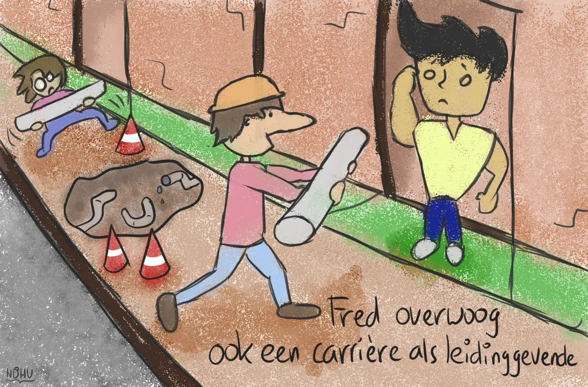

Deze tekening heb ik gemaakt in een rijdende en vooral wiebelende auto :p Daarom zijn veel lijnen wat wiebeliger. (Dat schijnt geen woord te zijn, maar ik vind van wel.)

Daarnaast heb ik wederom een nieuw programma uitgetest (omdat Photoshop moeilijk doet). Vandaar een aantal opmerkingen:

  * Om de een of andere reden zijn de lijnen hier een stuk dunner dan bij Photoshop. Na heel lang checken heb ik denk ik de boosdoener gevonden: dit nieuwe programma tekent automatisch op een veel hogere resolutie. Dus de volgende keer moet ik even extra werk verrichten om exact dezelfde penstijl van de vorige tekeningen te krijgen. (Want ik vind dikkere lijnen bij deze stijl significant beter eruit zien.)
  * Ook het inkleuren is minder goed gelukt. In Photoshop had ik een standaard brush die een beetje losjes/spikkelig was, maar niet overdreven. Die heb ik niet echt kunnen simuleren in dit programma. Het inkleuren hier voelt eigenlijk vooral chaotisch/rommelig/druk. Dat vind ik stom, maar ik heb nog niet zo snel een antwoord op dit probleem.
  * De kleuren zijn niet zo goed gekozen als normaal, maar dat kwam omdat ik vergeten was de "nachtlamp" op mijn tablet uit te zetten. (Als het avond wordt, gaat die automatisch aan, en maakt het scherm meer rood/oranje zodat het minder zwaar is voor je ogen. Maar dat vertekent ook de kleuren.)
  * De woordgrap is slecht. Ik weet het.
  * Fred lijkt niet helemaal op hoe hij er normaal gesproken uitziet. Dat komt omdat ik dus geen referentie had. Vandaar de wijze les: als je consistent wilt zijn, GEBRUIK ALTIJD REFERENTIES.

Hopelijk kan men wel lachen om deze cartoon, al is het vooral een leerproces voor mij om de juiste stijl en het juiste werkproces te vinden.

{}
Bij nader inzien moet een "leiding" natuurlijk een opening/gat hebben, wat die van Fred nu niet heeft. Ook mist de gespierde/verbaasde persoon een linkeroor. Leerproces, leerproces :p
{}