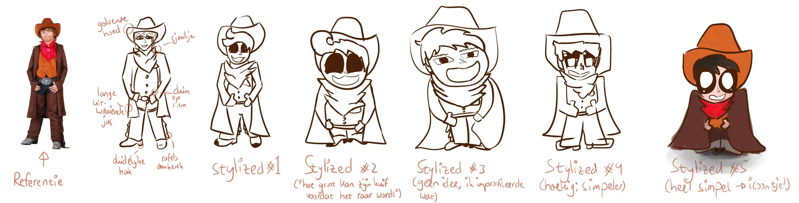

Ik ben op zoek naar een cowboy (en tekenstijl) voor een nieuw spel dat ik aan het ontwikkelen ben. Dit was de eerste poging. Ik vind ze wel leuk geworden 🙂 Ik vind die hoekige nog het meest bijzonder en veelbelovend, hoewel die niet helemaal goed gelukt was. (Hoe teken je hoekig haar!?)

Het laatste poppetje is snel ingekleurd om te kijken hoe dat er ongeveer uitzag. In de uiteindelijke versie van het spel wil ik een hele andere stijl ("stoepkrijt"-achtig) en kleurenschema gebruiken.

Verwacht binnenkort een deel 2 van cartoony cowboys tekenen :p