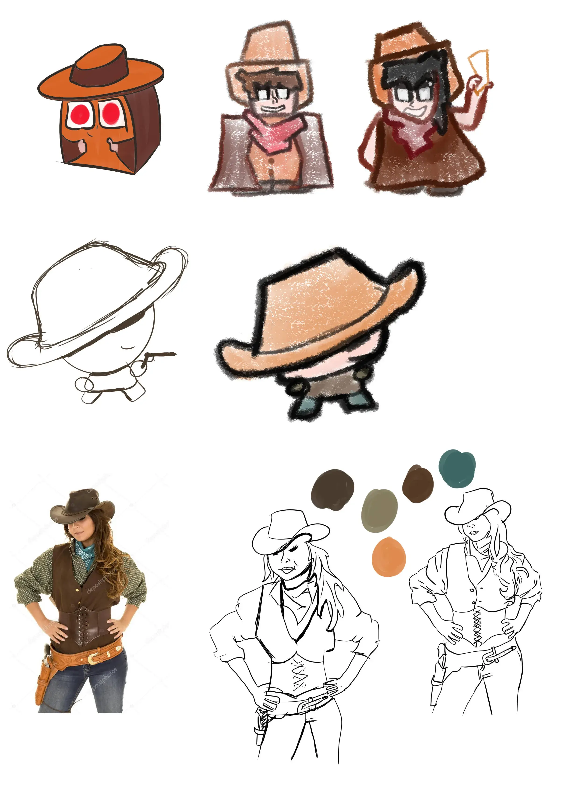

Hieronder mijn tweede verzameling "gestileerde cowboys". De eerste tekening ziet eruit als een icoontje dat ik waarschijnlijk in de spelregels wil gebruiken. De twee tekeningen daarna waren mijn eerste poging om een "krijt"-look aan de cowboys te geven. (Ik heb ook geprobeerd om gewoon een cowboy te tekenen en achteraf een krijtfilter eroverheen te doen in Photoshop, maar dat zag er voor geen meter uit.)

Ik ben eigenlijk een beetje teleurgesteld over de krijtstijl. In dat geval ga ik altijd de tekening analyseren! De lijnen moeten dikker en donkerder (meer contrast), anders wordt het té vaag en chaotisch. Misschien is het een idee om details weg te laten of buiten de omlijning te plaatsen (zoals ogen die buiten de randen van het gezicht gaan). Kan het haar wel zo buiten de hoed? Het plaatje is ook vrij statisch. Kan ik poppetjes in beweging tekenen, of misschien vanaf de zijkant (3/4 view) bekeken?

Daarnaast moet ik leren om meer verschillende lijndiktes te gebruiken. Uit automatisme laat ik hem de hele tijd op hetzelfde getal staan, om vervolgens verbaasd te zijn als dingen niet passen of goed eruit zien :p In het algemeen geldt: dikkere lijn voor de _buitenkant_ of _plekken met schaduw_, dunnere lijn voor _binnenkant/details_ en _highlights_. Maar dat is een algemeen principe, geen wet.

Toen kreeg ik een geweldig idee! Het hele spel leunt op het idee van "cowboys die in duel zijn met elkaar, maar voor geen meter kunnen richten". Oftewel: blinde cowboys. Wat nou als ik een cowboy tekenen met z'n hoed _zo ver_ over de ogen dat hij nauwelijks meer ziet? Dat werd de volgende tekening. Die vond ik meteen al een stuk karakteristieker! Waarschijnlijk ga ik met dat idee door (en meer details/variaties toevoegen in de uiteindelijke versie).

Helemaal onderaan zie je nog een meer realistische tekening van een cowgirl. Ik twijfelde namelijk of ik niet tóch een realistische stijl moest aanhouden. Ik wilde even oefenen en kijken wat eruit kwam. Daarnaast vond ik de kleurencombinatie in de referentiefoto wel leuk. (Ja, de eerste poging is niet echt fenomenaal. Mijn eerste pogingen zijn altijd slecht. Maar daar gaat het niet om: het gaat erom dat er uiteindelijk iets moois uitkomt!

 