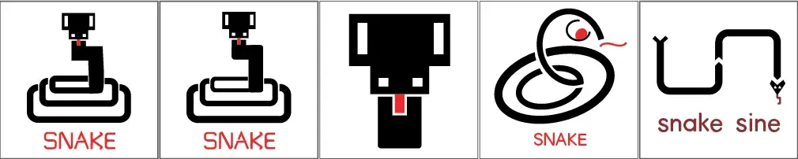

Vanochtend werd ik wakker met een urgente gedachte in mijn hoofd: "snake sine = logo". Hoewel ik niet wist waar het vandaan kwam, vond ik dat mijn hoofd gelijk had en ik weer moest oefenen met logo's ontwerpen. Dus ik zette een timer van een uur en schetste logo ideeën. Omdat ik al heel veel "speelse" of "losse" logo's heb gemaakt, vond ik dat deze logo's strak en modern moesten zijn. (Anders had ik weer een schattig slangetje getekend met veel kleuren.) Ook kreeg ik maar één kleur (zwart) en een klein beetje accentkleur (rood).

Hieronder staat het resultaat. (De grijze omlijning is om te laten zien waar een vierkant logo zou eindigen. Het is niet onderdeel van het logo.)

Het eerste logo was op zich leuk, maar het bovenlichaam van de slang paste niet helemaal bij het onderlichaam. Het onderlichaam bestond namelijk uit perfecte "rounded rectangles", terwijl ik het bovenlichaam uit de losse pols had getekend. Daardoor matchten de stijlen niet. Dat heb ik gefikst in het tweede logo.

{} 
Ik was zo dom om het hoofd (van de slang) geen ronde hoeken te geven. Dat is wederom inconsistent. Daarnaast ben ik niet tevreden over de representatie (en vooral lijndikte) van het slangenlichaam. Dus ik heb stiekem nóg een versie gemaakt nadat mijn uur voorbij was. (Blijkbaar heet een opgerolde slang in het Engels een "coiled snake". Dat maakte referenties zoeken ietsje makkelijker.)
{}

Veruit de meeste tijd ging zitten in het woord "SNAKE". Ik vind het leuk om voor logo's eigen letters te tekenen, in plaats van een standaardlettertype te downloaden en gebruiken, maar dat kost wel veel tijd. Ik ben wel trots op het resultaat 🙂 Misschien dat ik het ooit uitbouw tot een volwaardig "snake"-lettertype.

Het derde logo is de "kleine versie" van die andere. Deze zou je dan gebruiken op plekken waar je weinig ruimte hebt en alleen het logo héél klein wilt of kunt laten zien.

Bij de vierde versie wilde ik het tegenovergestelde proberen: een slang opbouwen uit perfecte ovalen. Op zich vind ik hem wel leuk, maar hij heeft nog veel aandacht nodig om echt goed te worden.

De laatste versie vind ik het schattigst en past ook het meest bij die woorden die in mijn hoofd opkwamen ("snake sine"). (Voor de niet-ingewijden: "sine" is Engels voor "sinus", wat de naam is voor een golvende wiskundige formule.) Ik zou die gebruiken als het voor mijn eigen bedrijf/website/etc. was.

_Opmerking:_ het klinkt in mijn hoofd wel een beetje als een deel uit de Game of Thrones boekenreeks. "Game of Thrones: A Sign of Snakes!"

Zo, dat was de oefening voor vandaag.