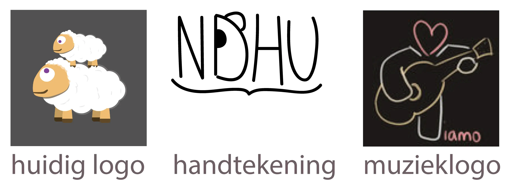
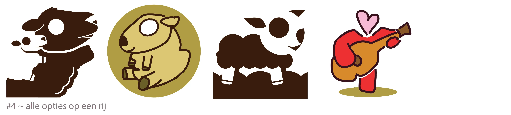

Dit blog begon ooit als een simpele plek voor mezelf. Inmiddels is het uitgegroeid tot véél meer. Daarom ben ik bang dat het oude logo niet meer volstaat.

_Wat is het oude logo?_ Het is---ehm---twee schapen bovenop elkaar. Ik zag het altijd als een moederschaap (of vaderschaap), met op diens rug haar kindje. Ik heb het heel snel in elkaar geflanst, omdat WordPress me bleef lastigvallen over een icoontje.

Ik ben nogal verknocht geraakt aan dit logo. Jarenlang zag ik dit logo elke keer als ik mijn browser opende (en natuurlijk als ik het blog zelf bezocht), dus voor mij is "twee witte bolletjes bovenop elkaar" gelijk aan "niet dat het uitmaakt!". Maar andere mensen hebben géén idee wat het voorstelt. Het slaat ook nergens op. Ik denk dat ik het woord "schaap" twee keer heb gebruikt in de 500,000 woorden op dit blog.

Enerzijds is dat juist het idee van dit blog. "Niet dat het uitmaakt". Het logo maakt niet uit. Waarom zou het iets moeten voorstellen?

Anderzijds is dat een beetje makkelijk gedacht. Wat ik op dit blog schrijf en doe maakt wel degelijk uit, anders zou ik het niet doen. Het logo is enorm belangrijk voor een website, en zeker voor een bedrijfje (dat ik sinds kort ben begonnen). Dus ik ga een poging doen een nieuw logo te ontwerpen.

## Het oude logo

Op dit moment gebruik ik drie logo's voor verschillende dingen. (Het zijn eerder "tekeningen" die je als logo's zou kunnen bestempelen.)

Het eerste logo is het huidige logo van de website. Het tweede is mijn "handtekening" die ik onderaan cartoons en andere tekeningen zet. Het derde is mijn logo voor de muziek die ik maak (die ik ook op andere plekken zet, zoals YouTube en Bandcamp).

Ik vind ze alle drie wel iets hebben, maar in hun huidige vorm zijn ze niet geschikt als logo. Dus ik ga voor alle drie de varianten enkele nieuwe ideeën genereren en schetsen.

## #1: Schaap op schaap

Er zijn een paar problemen met het huidige logo:

  * Het is lelijk en onafgewerkt. (De hoofden van de schapen lijken wel eieren. En waarom zijn hun ogen paars?! What was I thinking?)
  * Het logo is wit (en de omringende ruimte transparant). Ik heb toevallig een browser met zwarte tabbladen, maar als iemand dat niet heeft ... is het logo onzichtbaar/onherkenbaar. Ik heb twee opties: iets _achter_ de schapen plaatsen (zoals het grijze vlak in bovenstaande foto) of de schapen een _omlijning_ geven.
  * Het is té klein/gedetailleerd. Niet alleen zijn veel details onnodig (en doen ze zelfs afbreuk aan het plaatje), het logo is niet te herkennen in het klein.

So, let's try to fix them.

Bij het fiksen ontdekte ik iets belangrijks: dit blog heeft niet echt een kleurenschema. Het heeft er wel eentje (want het is niet zwart-wit), maar die is bij toeval ontstaan en niet heel sterk gedefinieerd. Dit vond ik dan ook het uitgelezen moment om naar wens nieuwe kleuren uit te proberen. (Het logo dat ik uiteindelijk kies zal het kleurenschema bepalen van het blog :p)

### Eerste pogingen

Het eerste logo probeert om schaap-op-schaap te bewaren. Om het meer dynamisch te maken gedraagt het schaap zich als een steigerend paard (waaraan de baby zich vastklampt). Zoals je ziet zoomde ik steeds méér en méér in, omdat het anders te klein en onduidelijk werd. Dit logo maakt sterk gebruik van "negative space": de baby wordt als het ware uit de vorm van de ouder gesneden, in plaats van op zichzelf getekend. Daarom was het niet mogelijk om echt veel (schaap)kleuren toe te voegen.

Uiteindelijk vind ik het zwart-witte logo dan ook het beste. Natuurlijk kan ik hier wel kleur aan toevoegen door de achtergrondkleur te veranderen:

Op zich hebben de kleuren wel iets (het krijgt een soort washed-out, vintage look), maar eigenlijk is het zonder kleuren het sterkst. Simpeler is beter. (Dan kan het ook op veel verschillende achtergronden.) Ik heb wel de kleur iets donkerder gemaakt (voor extra contrast) en meer naar bruin/beige toe getrokken.

_Opmerking:_ het tweede logo was op (zeer) kleine grootte wel het duidelijkst, omdat het babyschaapje eruit sprong met de lichte kleur. Dat zou een reden zijn om toch voor zo'n constructie te kiezen. Ik moet sowieso even kijken of ik het logo niet nóg verder simplificeer voor de allerkleinste groottes.

Het vraagteken staat voor het traditionele pauzemoment. Ik weet dat er nog veel beter kan aan het logo, maar ik ben al zo lang bezig dat ik het niet meer objectief zie. Dus ik neem een pauze. Bij terugkomst schreef ik deze opmerkingen:

  * Schapen hebben een rechte lijn aan de bovenkant van het hoofd (geen vallei zoals nu) 
      * Nu lijken het meer op honden. Dat was ook de eerste gok van mijn zusje dit binnen kwam lopen. Haar tweede gok was pas schapen.
      * Gek genoeg is het oude logo dus beter dan ik dacht: de schapenhoofden zijn veel meer echte schapenhoofden, met een diagonale lijn aan de bovenkant.
      * Je kunt ook zeggen: waarom moeten het schapen zijn? Honden zijn ook schattig? En ik heb geen idee wat ik daarop moet antwoorden.
  * Schapen hebben hoeven (of is dat te complex?)
  * Schapen zijn wollig (vooral rond lichaamsgedeelte, niet gezicht)
  * Schapen hebben niet zulke oren (geen enkele diersoort heeft zulke oren :p)
  * De "uitgesneden lijnen" worden onzichtbaar op kleine grootte; heeft het dan wel zin?
  * Die poot van het grote schaap ... kan die ergens anders heen? Is dit een soort van natuurlijke houding voor een schaap? (Ik stel misschien te serieuze vragen voor zo'n onserieus logo.)

### Uiteindelijke versie

Hieronder de laatste stappen die leiden tot de uiteindelijke versie:

_WAT? DIE LAATSTE IS INEENS ANDERS?_ Ja, ja, ik leg alles uit.

Ten eerste: het was moeilijk om de vorm van het gezicht te zien in de oude versie. Dus ik heb neusgaten (en een tong-achtig-iets) toegevoegd om de vorm te accentueren. Daarnaast heb ik al mijn andere opmerkingen verwerkt (hoeven, wollig, andere armpositie, fatsoenlijke oren, etc.)

Ook heb ik de gezichtselementen allemaal vergroot. Het grote schaap lijkt nu een beetje achterom/over de schouder te kijken naar de baby, wat ik heel leuk vind.

De derde versie was met de kleuren omgekeerd. Dit ziet er op zich leuk uit, het enige probleem is dat schapen wit zijn (en dat is ieders eerste associatie), dus het is een stuk moeilijker zo om te zien dat het schapen zijn. Dus, ondanks dat het gaaf is, wordt die versie het niet.

Normaal gesproken gaan logo's van links naar rechts. Dat komt omdat wij---in dit deel van de wereld---alles van links naar rechts lezen en bekijken. Als het andersom gaat voelt het al snel verkeerd en onrustig. Omdat het oude logo andersom ging, heb ik de nieuwe ook allemaal zo gemaakt. De vierde versie is exact hetzelfde logo, maar dan de andere kant op. Ik denk dat het allebei kan. (Hoewel het even wennen is als je eerste het logo de hele tijd de andere kant op zag kijken. Moet je voorstellen hoe verwarrend het voor iedereen zou zijn als Nike ineens zijn logo zou omdraaien.)

Ik ben helemaal niet zo van de strakke tekeningen. Daarom had ik gewoon even zin om---na twee uur logo's ontwerpen---een schattig schaapje uit de losse pols te tekenen. En dat vind ik uiteindelijk misschien nog wel de leukste variant :p Ik hou gewoon van dit soort tekeningen. Het past bij de website en mijn persoonlijkheid, denk ik.

Oftewel: als ik iets met schapen ga doen, wordt het de vierde of de vijfde tekening van bovenstaande foto. (Met natuurlijk nog verdere, minuscule aanpassingen. Ik verwacht sowieso dat de vierde tekening nog iets té complex is.)

## #2: Handtekeningen en panda's

Alle projecten (en websites) die ik tot nog toe heb gedaan hebben _op een of andere manier_ een panda erin verwerkt. Daardoor wilde ik in eerste instantie eigenlijk niet _nog_ een logo met een panda maken. Maar ik had ineens een paar hele goede ideeën, dus ik wilde het toch proberen.

Dit waren die eerste beelden die in mijn hoofd plopten:

Eigenlijk alleen de tweede vind ik een mislukt experiment. Alle andere logo's pakken verrassend goed uit! Daarom wil ik ze niet gebruiken voor het blog, maar voor mijn eenmanszaak (genaamd "rode panda"). Toen ik alle logo's aan anderen liet zien, konden ze bijna allemaal niet kiezen tussen de panda's of de schapen. Dus ik wil lekker ook niet kiezen en bewaar de panda's voor mijn bedrijfje.

Op naar de laatste variant!

## #3: Een T die gitaar speelt

Dit waren de iteraties voor het laatste logo:

Ik vind deze ook wel leuk zo! Fijne kleuren, simpele vorm, losjes getekend, herkenbaar. (Vandaar ook mijn groene vinkje.) Ik zie niet echt een reden om hier nog meer bij te verzinnen, zeker omdat ik weet dat ik altijd dingen te complex maak (als ik niet oplet).

_Opmerking:_ bij het tweede logo vond ik het leuk dat de gitaar buiten het rondje stak. Ik wilde dit verder uitwerken, maar jammer genoeg was dat geen succes. Ik heb ook geëxperimenteerd met een soort "spotlights" (door meerdere van diezelfde rondjes te gebruiken en achter/voor het logo te plaatsen). Dat zag er gaaf uit, maar was veel te verwarrend. In dat soort gevallen gaat herkenbaarheid en duidelijkheid boven visuele grapjes.

## #4: De opties

Dit zijn alle opties voor het logo (voor deze website) die ik overweeg:

Het derde plaatje was mijn allerlaatste poging om tóch twee schapen in één logo te krijgen. (Het is nog niet uitgewerkt. Ik moet toegeven dat ik weinig hoop meer had.) Jammer genoeg, zoals we dadelijk zien, is het redelijk gefaald. Er is gewoon niet genoeg ruimte voor twee herkenbare schapen (van verschillende groottes!) op zo'n klein logo.

Dit is namelijk hoe de logo's er in de browser uitzien:

Ik hoopte dat ik een trucje kon gebruiken bij het eerste logo. Door het ene schaap helemaal donker te maken en de ander helemaal licht, bepaalt de _achtergrond_ van het logo welk schaap je ziet. Het logo verandert automatisch op basis van waar je het ziet! Het is een gaaf idee ... maar ik weet niet of het gelukt is. Met deze zwarte achtergrond is het niet helemaal duidelijk. Als ik gewoon de achtergrond standaard wit maak (zoals bij het tweede tabblad), lijkt het iets duidelijker te worden, maar vind ik het logo zelf ietwat statisch.

Het vierde en zesde tabblad werken voor mij niet. Dat komt vooral doordat het logo te dicht tegen de rand van het vierkant aanzit. Ik kan het wel verder van de rand zetten, maar dan---je raadt het al---is het te klein.

Voor mij springen dan ook het derde en vijfde tabblad eruit (hoewel ze beide nog wel een beetje werk nodig hebben, natuurlijk).

## Mijn uiteindelijke keuze

Met pijn in mijn hart moet ik mijn dubbeleschapenlogo laten gaan. Het werkt wel, en het is mooi en schattig, maar als logo is het gewoon niet geschikt. Daarvoor zijn er te veel details om te verwerken (en is het concept te bizar voor iemand om meteen te begrijpen).

Ik heb de volgende keuze gemaakt:

  * Het _muzieklogo_ (de T die gitaar speelt) ga ik gebruiken voor alles wat ik doe gerelateerd aan _muziek._ Dat doe ik nu al, maar het nieuwe logo vind ik leuker, en ik wil het consistenter toepassen.
  * Het eerste logo (met de _schuine dubbele schapen_) bewaar ik voor speciale dingen op dit blog. Ik weet nog niet precies wat, maar ik vind dat dit blog wat meer icoontjes of visuele opfleuring kan gebruiken, en dit symbool kan van pas komen. Wanneer je dit logo uitvergroot vind ik het gewoon erg goed gelukt, dus waarschijnlijk zal het vooral op "ware grootte" verschijnen. 
      * Misschien kan ik het gebruiken als het "bordspellenlogo" of het "schrijflogo" ofzo, net zoals ik blijkbaar een _muzieklogo_ heb. Ik kan er ook het "logo logo" van maken :p
  * Het tweede logo (_getekend schaap in een_ _rondje_) ga ik gebruiken voor de website!

Als je dit leest heb ik de veranderingen waarschijnlijk al doorgevoerd. Dus misschien heb je al het hele artikel feedback over de nieuwe stijlen klaarliggen. Laat het dan vooral weten, want daar leert iedereen van!

Zo niet, hoop ik dat je dit interessant vond om te lezen en er iets van hebt geleerd.