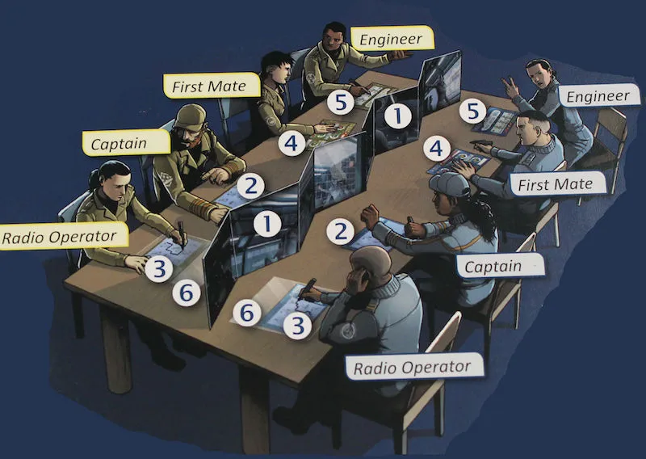

_Captain Sonar_ is een spel dat direct op mijn verlanglijstje kwam toen ik de eerste beelden zag. Het kan met veel spelers (_ik heb een grote speelgroep_), het is kort en heeft weinig uitleg nodig (_mijn speelgroep is ongeduldig_), en het is een compleet uniek idee (_ik hou van bijzondere_ _spellen_)_._

Heeft het aan mijn verwachtingen voldaan? Jazeker. Dit spel krijgt van mij negen sterren, en met een kleine aanpassing zou dat tien sterren worden.

{}

## Wat is het idee?

In Captain Sonar speel je in twee teams tegen elkaar. Elk team zit samen in een onderzeeër met maar één doel: de tegenstander laten zinken. Bovendien heeft iedere speler een eigen unieke rol binnen het team: Kapitein, First Mate, Engineer of Radio Operator.

_Wanneer zinkt de tegenstander?_ Als hun onderzeeër vier (of meer) schade heeft opgelopen.

_Hoe doe je schade?_ Jij kan de tegenstander schade aandoen door een _torpedo_ af te vuren of een _mijn_ te laten ontploffen. Vanzelfsprekend moet de tegenstander dan wel op de plek zijn waar je aanvalt: dan doe je 2 schade (een "directe hit"). Als de tegenstander één positie verwijderd is van die plek, doe je slechts 1 schade ("indirecte hit").

Een team kan ook zichzelf schade aandoen. Dit gebeurt als te veel onderdelen van hun schip kapot zijn.

_Hoe verplaatst de boot?_ De **Kapitein** mag de boot in een willekeurige richting verplaatsen. Hij roept bijvoorbeeld "richting het noorden!", zet een streepje op zijn vel in de juiste richting, en nu ineens staat de boot op die plek! Je mag natuurlijk niet door eilanden heen of van het veld af.

_Hoe kun je zo'n torpedo of mijn activeren?_ Elke keer als jouw boot verplaatst, moet de **First Mate** één "gadget" op jouw schip opladen. Sommige gadgets hebben maar twee ladingen nodig, sommige drie, etc. Als zo'n gadget helemaal opgeladen is, roept de kapitein van het schip: "Stop! Wij gebruiken onze <gadget>".

_Hoe gaan onderdelen van het schip kapot?_ Elke keer als jouw boot verplaatst, moet de **Engineer** één onderdeel van het schip kapot maken. (Door er een kruis doorheen te zetten.) Als alle onderdelen van één richting (noord, oost, zuid, west) kapot zijn, krijgt de boot direct 1 schade. Je mag dan wel je hele vel leegvegen zodat alle kapotte onderdelen weer werken.

Pas als de **First Mate** en de **Engineer** hun zet hebben gedaan, mag de **Kapitein** opnieuw bewegen.

_En de **Radio Operator** dan?_ Die probeert de tegenstander te vinden. Hij luistert aandachtig naar wat de andere kapitein roept ("richting het noorden! richting het westen!") en probeert zo hun positie te achterhalen.

Dit is het spel in een notendop. Je hebt natuurlijk nog meer gadgets (die je bijv. helpen om de tegenstander sneller te vinden), je kunt naar de oppervlakte gaan om je boot te repareren, en nog meer details. Maar hierboven staat het idee.

## Was het leuk?

Ja! Als je dit spel speelt, vliegt de tijd voorbij. Voordat je het weet ben je de halve kaart afgereisd en ben je al twintig minuten verder. Je hebt geen enkel dood spelmoment, want iedereen is constant tegelijkertijd hun eigen rol aan het uitvoeren.

Naarmate je steeds beter weet waar de tegenstander is, wordt iedereen steeds enthousiaster. Het is ook echt heel spannend. Je hoort het andere team smiespelen en denkt: weten ze waar we zijn? Of zitten ze ernaast? Of is dit een bluf?

Dan zegt je Radio Operator ineens: "volgens mij weet ik waar ze zijn". We bewegen subtiel dichterbij, laden onze torpedo op, en vuren hem af. We houden onze adem in. Hebben we hen geraakt of niet? Dan komt het verlossende antwoord: "indirecte hit". We weten dat ze in de buurt zijn, maar waar precies? Sterker nog: om de torpedo af te vuren moeten wij ook in de buurt van de anderen zijn, dus nu kunnen zij ook op ons schieten!

Richting het einde van het eerste potje was de kapitein van het andere team haast aan het gillen van enthousiasme. Dan is het een goed spel :p

Ik heb het daarna ook nog met een andere groep gespeeld, en die wilden meteen een tweede potje, en de volgende dag nóg een potje.

## Uitleg en begrip

Mijn tweede belangrijkste criterium voor een spel: hoe makkelijk is het uit te leggen en te begrijpen? Is het spel zo simpel en gestroomlijnd als mogelijk?

Ja! Hoewel deze "ja" minder overtuigend is dan de vorige. Er zijn een paar delen van het spel die misschien strakker hadden gekund. Ik moest veel moeite doen om het "naar de oppervlakte gaan" uit te leggen aan de groep, en uiteindelijk heeft niemand het gebruikt omdat ze het niet helemaal begrepen. Het was nét te veel en nét te onduidelijk. En dat terwijl het ongelofelijk slim is om te doen.

Als je dat deel weghaalt is het spel precies zo moeilijk als het moet zijn. (Het spel is bedoeld voor grote groepen, is semi-serieus, en speelt in een half uur. Daarvoor is de complexiteit van de spelregels nu net iets te hoog, vind ik.) Mijn broertje begreep het spel prima, misschien zelfs beter dan volwassenen aan tafel. Het spel is echt voor alle leeftijden. (Een volwassene moet het wel uitleggen, want er is geen Nederlandse versie van dit spel, alleen Engels.)

Het helpt natuurlijk wel dat iedereen een vel voor zich heeft met extra symbooltjes en hints naar wat alles doet. (Hoewel deze niet altijd even duidelijk zijn op het eerste gezicht.) Ook helpt het dat iedereen een eigen rol heeft en dus, zeker het eerste potje, vooral op zijn eigen dingetje focust.

**TIP:** als je dit spel voor het eerst uitlegt, negeer dan de "overbodige regels" die de spelregels net te complex maken. Speel de eerste potjes om de beurt en help iedereen met hun rol. (Wat doe je, waarom doe je dat, en waarom is dat leuk? :p) Pas als iedereen er goed in zit, ga je tegelijkertijd spelen. Ook kun je dan eventueel die andere regels al toevoegene.

## Gameplay

_Opmerking:_ wat is een Nederlands woord voor "gameplay"? Spelervaring? Spelmechanisme? Ik kan echt niks vinden.

De gameplay is uniek. Welk ander spel heeft zulke unieke rollen, onderdelen en doelstellingen? Welk ander spel laat je in teams het andere team opsporen en neerknallen, terwijl iedereen een eigen rol heeft en daadwerkelijk strategisch moet nadenken om de boot overeind te houden?

Er zijn slechts twee nadelen met dit spel:

  * Men speelt tegelijkertijd. Daardoor kun je het andere team, of misschien zelfs rollen binnen je eigen team, niet controleren of helpen. Ik heb een keer van de zijlijn meegekeken toen anderen dit spel speelden. De kapitein van het ene team bleef maar één van de belangrijkste regels van het spel breken. (Je mag pas opnieuw bewegen als je First Mate en Engineer hebben gezegd dat ze klaar zijn met hun deel. Zij hield zich daar niet aan. Ze riep dus een halve minuut lang richtingen: "noord! west! zuid! west! noord!" Natuurlijk kan het andere team dat niet volgen.) 
      * Dit spel duurde 2,5 uur, waarna het andere team zichzelf in wanhoop opblies met een zelfgeplaatste mijn. Waarom duurde het zo lang en was het onmogelijk? Omdat iemand die belangrijke regel brak en _niemand_ gaf daar iets om of kon er iets tegen doen. (Ik zei het wel een paar keer, maar er werd niet geluisterd. Daar kom ik zo op terug.)
  * Je moet roepen om het andere team te laten stoppen en iets door te geven. Zelfs als je duidelijke afspraken maakt, kan het lastig zijn voor mensen om zich eraan te houden. Iemand kan bijvoorbeeld het woordje "noord" zeggen, waarna de Radio Operator van de tegenstander niet weet of dat voor hem bedoeld was of niet. Misschien hoort diegene het niet eens omdat anderen erdoorheen schreeuwen.

Deze nadelen zijn allebei op te lossen als je een goede groep hebt. Deze punten waren namelijk alleen een groot probleem bij die ene groep (waarbij het spel ook veel te lang duurde), en totaal niet bij de andere groep. Daar was alles goed te horen en goed te volgen, omdat mensen hun best deden de regels te volgen.

Maak heel duidelijk wat de belangrijkste regels zijn en dat je verwacht dat iedereen zich daaraan houdt. Bij onzekerheid: leg het spel even stil en vraag het. Maak daarnaast heel duidelijk dat ALLEEN de kapitein dingen tegen het andere team zegt. De andere rollen mogen het niet eens volgens de regels, en het voegt ook niks toe om overal doorheen te praten.

> Bovendien voegde ik de volgende huisregel toe: als je "stop!" zegt, moet je je vuist in de lucht steken. Een opgestoken hand of vuist is veel beter op te merken. Nog belangrijker: als je het spel stillegt om iets te gebruiken, moet je al van tevoren weten wat je gaat gebruiken en waar. Anders roept een team "stop!", en gaat vervolgens vijf minuten discussiëren wat ze eigenlijk willen doen. Als je tegenstander dit doet zeg je gewoon "oké, we hoeven dus nog niet te stoppen", en je gaat weer verder :p

Als je de medespelers dit goed duidelijk maakt, zijn bovenstaande nadelen geen punt!

## Onderdelen

De onderdelen van het spel zijn van goede kwaliteit. De stiften schrijven goed en zijn ook goed uit te gummen. De vellen zijn stevig, ook de doorschijnende platen voor de Radio Operator. De doos is zeer stevig (ik krijg hem nauwelijks open of dicht). Het spelersscherm dat tussen beide teams zit is enorm groot en stevig! (Iemand liep een keertje weg vlak voordat ik het spel begon op te zetten, en toen hij drie minuten later terug kwam schrok hij van wat er ineens op tafel was verschenen.)

**TIP:** Als je het spel voor het eerst openmaakt, zit er een plastic velletje over die doorschijnende platen. Daardoor lijken ze kapot of gerimpeld, maar dat is dus niet zo :p Velletje eraf halen en alles is oké.

**TIP:** Druk mensen op het hart dat ze hun stift efficiënt moeten gebruiken. Als men iets wil opladen _(First_ _Mate_) of kapot maken (_Engineer_) hoeven ze niet het hele vakje in te kleuren. Eén snel streepje is voldoende. Ik heb namelijk met een groep gespeeld die alles constant inkleurde, en toen raakte één stift meteen op, terwijl dit pas het derde potje was met deze stift. Ze horen langer mee te gaan dan dat :p

## Conclusie

**Pluspunten:** Het spel is leuk, goed uit te leggen, goed te begrijpen, voor alle leeftijden, uniek, niet te lang, en verraderlijk spannend.

**Minpunten:** de spelregels zijn iets te complex en onhandig, en met de verkeerde groep moet je veel moeite doen om het spel überhaupt te laten werken.

**Mijn advies?** Als je een keer een grote groep hebt, zeker als daar verschillende leeftijden en soorten spelers inzitten, is dit spel een aanrader! Zorg dat je de regels goed doorleest en een "beginnersvariant" bedenkt om mensen op een leuke en geleidelijke manier alle rollen en gadgets in het spel uit te leggen.

Als je een groep hebt met---tja---stomme spelers, is dit spel geen goed idee. Het is zeer competitief en de kans op valsspelen is groot. (Met "stomme spelers" bedoel ik niet stomme mensen, maar mensen die niet goed weten hoe ze een bordspel moeten spelen. Mensen die bijvoorbeeld niet tegen hun verlies kunnen, of altijd zeuren, of de boel ophouden, of niet luisteren als je ze corrigeert, etc.)

## Leuke anekdote

De eerste keer dat ik dit spel speelde met mijn vrienden, was een bijzondere. Ik was de Kapitein. Al twintig minuten lang vroeg ik regelmatig aan mijn Radio Operator "heb je al enig idee?", en ze schudde elke keer het hoofd en keek sip. Ik vond dat apart. Ze moest inmiddels toch wel _iets_ weten.

Dus ik keek even mee terwijl ze aan het puzzelen was ... en zag dat ze de route over eilanden aan het leggen was :p Toen kwam de legendarische zin: "je---eh---hebt door dat ze niet dwars door eilanden kunnen toch?"

"Oh."

Een halve minuut later had de tegenstander ons wél gevonden---terwijl wij géén idee hadden---en werden we uit het water geblazen.

## Uitbreidingen & Varianten

Het spel heeft twee varianten: _real-time_ (tegelijkertijd) en _turn by turn_ (de teams spelen om de beurt). De tweede variant is vooral leuk bij minder spelers, en vereist ook véél meer denkwerk en puzzelen. Omdat je alle tijd van de wereld hebt, en perfect weet hoe die ander vaart, wordt het spel heel anders (maar ook leuk). Online las ik dat veel mensen de _turn by turn_ stom vonden, maar ik heb het meerdere keren gespeeld en iedereen kan er van genieten. Je hebt dus eigenlijk twee spellen in de doos, die je kunt toepassen afhankelijk van je spelers aantal!

Het spel heeft op dit moment één uitbreiding; _Captain Sonar: Upgrade One_. Deze heeft meer scenarios en 6 nieuwe gadgets. (En nieuwe stiften, natuurlijk, want die gaan altijd sneller op dan je denkt) Al deze toevoegingen maken het spel nóg leuker! Al moet ik zeggen dat de nieuwe gadgets duidelijk wat meer "swingy" zijn: ze kunnen heel sterk zijn, maar je hebt ook het risico dat je er het hele potje _niks_ aan hebt. Zo heb je een nieuwe soort mijn die de hele kolom en rij explodeert, maar die veel duurder is dan een normale mijn. Ik heb twee potjes met dit gadget gespeeld en heb beide potjes dik verloren, omdat het gewoon te lang duurde om de mijn op te laden. (In dit geval zou je huisregels kunnen toepassen: de mijn kost nog maar 4 ladingen, ipv 5.)

Er komt naar het schijnt een nieuwe uitbreiding. Ik hoop dat deze nog meer scenarios heeft, want die maken het spel echt compleet anders elke keer dat je het speelt. (Het ene scenario heeft bijvoorbeeld "oplaadpunten" waar beide teams dus een keer naartoe moeten, een ander scenario heeft meer/minder eilanden, en weer een ander heeft pijlen die aangeven hoe het water stroomt; en je mag natuurlijk niet tegen de pijlen in. Dit maakt de strategie compleet anders, en dat is leuk.)

 