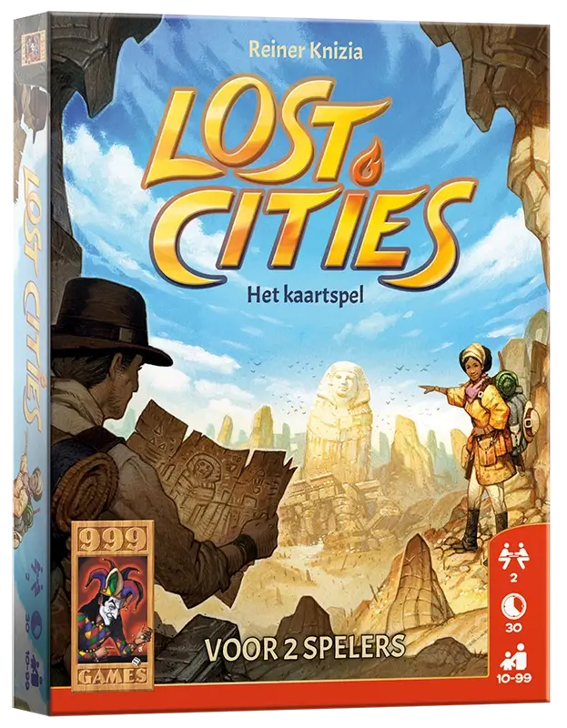
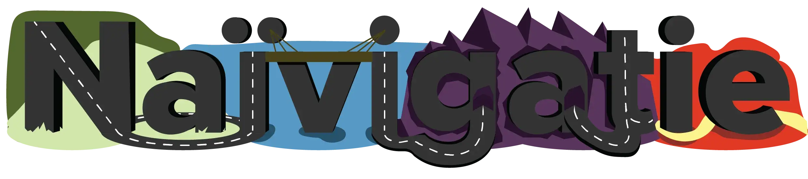
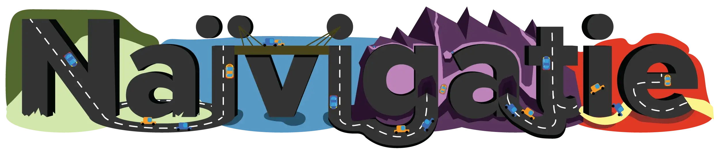
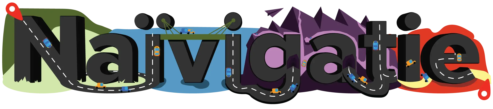
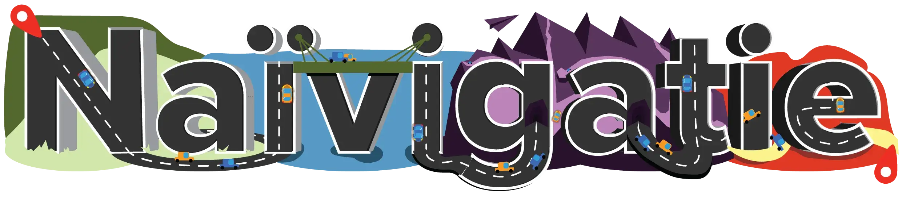
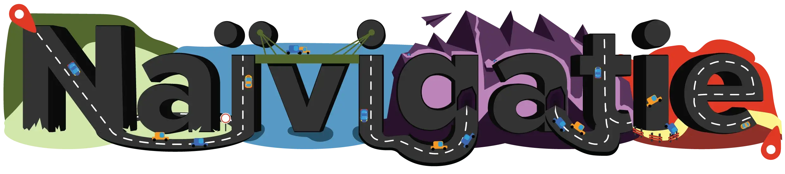

De laatste weken heb ik hard gewerkt aan een eigen bordspelletje. Inmiddels zijn alle kaarten/tegels ontworpen en spelregels geschreven. Slechts één ding resteert: het naamlogo.

_Wat is een naamlogo?_ Het is het "logo" van een bordspel, wat doorgaans bestaat uit de volledige naam van het spel. Dit logo staat dan op de voorkant van de doos, aan het begin van de spelregels, en verspreid over verscheidene andere onderdelen van het spel. (Denk maar aan de voorkant van "Kolonisten van Catan", of "Monopoly", of "Risk". Daarop staat de naam van het spel, maar niet in een saai standaardlettertype zonder opmaak. Nee nee, ze doen altijd moeite om er iets bijzonders van te maken.)

In dit artikel neem ik jullie mee in het ontwerpproces van dit naamlogo.

> Als je het spel zelf wilt bekijken (ontwerpen, regels, uitleg, proces, etc.), kun je naar deze pagina gaan: [[Bordspel] Naïvigatie](https://pandaqi.com/naivigation/).

## Stap 1: Wat is de naam?

Dit spel heette eerst "het TomTom-spel". Het was een grapje tussen mij en een vriend, en was nooit bedoeld als uiteindelijke titel van het spel. (Deels omdat TomTom misschien moeilijk zou doen, anderzijds omdat ik geen merk aan het spel wil verbinden of gratis reclame wil geven.)

Na lang titels verzinnen koos ik uiteindelijk voor: "Naïvigatie". Een combinatie tussen _navigatie_ en _naïef_. Het past bij het spel: je moet gezamenlijk een auto over een route navigeren, maar je weet niet welke kaarten de anderen hebben, of hoe de route eruit gaat zien. Je bent naïef aan het navigeren. (Het beste alternatief was "Navigatie Concentratie". Maar elke keer als ik dat in mijn hoofd uitsprak klonk het stommer en stommer.)

Het spel bestaat vooral uit wegen en routes. Alle ontwerpen voor de andere kaarten waren dan ook vrij rechthoekig en strak. Zodoende koos ik voor een modern, rechthoekig, sans-serif lettertype als basis. (Dit lettertype heet _Proxima Nova_ en is heel fijn.)

.

Als je een hele tekst lang de letters zo op en neer doet, wordt iedereen gillend gek. Maar voor zo'n naamlogo werkt het heel goed. Het geeft het iets dynamisch, speels, interactiefs.

Toch koos ik om dit _niet_ te doen. Het past niet bij de uitstraling van de rest van het spel. Alles is rechthoekig, perfect uitgelijnd, net zoals wegen in het echt. (Nou ja, tenzij je op de snelweg rijdt en ineens in België belandt.) Het zou raar zijn als het logo dan ineens heel speels is, met letters die allemaal niet op dezelfde lijn staan en zich in allerlei bochten wringen.

In plaats daarvan liet ik alle letters op dezelfde lijn staan, naast elkaar. Dit stelde mij in staat om iets redelijk vanzelfsprekends te doen: de letters veranderden in wegen! Door strepen op de letters te zetten, verandert de tekst meteen in een thematisch passend naamlogo.

Mijn oog zag de mogelijkheid om van de "v" een brug te maken. (Dat soort visuele trucjes worden vaak gebruikt in naamlogo's. Ik vind het ook leuk om ze te zoeken en te proberen.) Maar, dan moest ik onder de "v" een soort water maken, want een brug over gras is een beetje vreemd. Om consistent te blijven besloot ik om _alle vier de terreintypes uit het spel_ in het logo te gebruiken.

Dit gaf het volgende resultaat:

## Stap 3: Versiersels & Leesbaarheid

Zie jij wat ik zie? Het logo is een beetje kaal ... en tegelijkertijd moeilijk leesbaar. Dat is een verschrikkelijke combinatie natuurlijk. Het paars van de bergen is te donker. (En, als je het logo wat kleiner maakt, begint de rode kleur daarna ook wat problemen te geven.)

Het eerste wat ik deed was: autootjes toevoegen! Het was de meest logische stap, nadat ik alle letters had omgetoverd in een weg. In eerste instantie gebruikte ik alleen de autotekeningen uit het spel (waarbij je de auto van bovenaf bekijkt), maar dat bleek niet genoeg. Dus toen heb ik auto's van de zijkant gemaakt en verspreid over het logo.

Het tweede wat ik deed was: trucjes uithalen :p Het paars van de bergen is te donker, maar ik kan die kleur niet zomaar veranderen. Deze paarstint wordt namelijk in alle andere onderdelen van het spel (met succes) gebruikt. Wat ik wél kan doen, is een soort paden aanbrengen op de berg, die dan _compleet toevallig_ precies rondom de letters lopen. Zo loopt er een pad tussen de "g" en de "a", dat vertakt en precies de curve van beide letters omringt.

Hiermee sla ik drie vliegen in één klap:

  * De berg blijft de originele kleur paars
  * Er komt meer detail in de berg. (De lichtpaarse kleur heb ik ook gecontrasteerd met schaduwen her en der.)
  * De letters worden duidelijker leesbaar, omdat ze een achtergrondkleur hebben die hen beter accentueert.

Het is nog niet perfect. Maar deze eerste poging was een experiment, en dat experiment bleek geslaagd. In de volgende versie van het naamlogo wilde ik dan ook nog meer definitie aan de berg geven, wat _compleet toevallig_ de rest van de letters gaat omcirkelen.

Ten derde realiseerde ik dat ik eigenlijk weinig variatie had in de tekeningen van dit spel. Nog erger: de symbooltjes die ik wél had, was ik vergeten te gebruiken in het logo. (Zo had ik een papieren vliegtuigje getekend voor de actiekaarten. Zoiets kan ik makkelijk ergens in het logo verstoppen, zonder de leesbaarheid te verminderen.)

 

Het logo wordt nu wel steeds drukker. De letters verdwijnen een beetje achter de versierseltjes. Hoe lossen we dit op? Ik heb geen idee. Ik heb nog nooit zoveel gestoeid met een ontwerp. (Het helpt ook niet dat dit zo'n beetje de eerste keer was dat ik zo'n naamlogo ontwierp.)

Na lang nadenken en het logo bestuderen, kwam ik tot de volgende conclusie: de letters zijn verrassend plat en saai, zeker met al die andere kleuren en versiersels toegevoegd. Het zou helpen als de letters wat meer schaduwen en highlights hadden, wat prominenter in deze wereld aanwezig waren. Dat ging ik dus proberen.

_Opmerking:_ waarschijnlijk was je al opgevallen dat het logo een klein beetje perspectief heeft. Hoe dichter bij de zijkant, hoe meer diepte de letters hebben. Dit helpt het logo _enorm_, in mijn ogen. Het is subtiel, het is onopvallend, maar het geeft het logo meteen iets extra's en geeft de letters meer gewicht. Daarom wil ik dit "3D"-effect proberen te onderstrepen.

## Stap 4: Leesbaarheid gaat voor

Uiteindelijk wil je dat mensen de naam van je spel kunnen lezen. Daarom voeg ik _eerst_ de versiersels toe, maar eindigt een ontwerp _altijd_ met een leesbaarheidscheck.

Hieronder staat het logo "in zijn volste vorm" (met alle verbeteringen uit de vorige paragrafen doorgevoerd). Hier stopte ik met dingen toevoegen, want op dit punt vond ik het logo compleet en interessant genoeg.

(Ik probeerde ook een logo met een witte rand om de letters. Dit verhoogde de leesbaarheid, zeker op kleine grootte, maar ik kon het niet mooi verbinden met de andere elementen. Op diezelfde manier lukte het mij niet om de letters meer schaduwen en highlights te geven, terwijl het nog steeds op wegen leken. Dus toen heb ik de letters dikker gemaakt en nog meer perspectief gegeven.)

Maar is het leesbaar? Ik zoom in, ik zoom uit, ik gooi het logo op verschillende achtergronden, ik kijk weg en dan heel snel terug, en ik concludeer: het kan beter. Dus ik verander elementen totdat leesbaarheid voorop staat, in plaats van drukte of visuele trucjes.

Dit waren de laatste veranderingen:

  * De auto's op de wegen zijn wat groot. Op enkele plaatsen zijn ze ook best wel overbodig en zitten ze vooral in de weg.
  * De autostradestrepen (dit woord voor "strepen op de weg" heb ik gestolen van een Vlaamse artiest) volgen nauwgezetter de vormen van de letters. Zeker bij de "e" op het einde moest ik 'm veel verbeteren.
  * Iets groter contrast tussen kleuren.
  * Ik heb toch nog wat extra dingetjes toegevoegd (een stopbord en weghekken) om extra balans in het logo te brengen. Nu zat het overgrote deel van de complexiteit namelijk in het "berggedeelte", en leek de rest in verhouding dus wat kaal of slordig. (Ook wilde ik die blauwe auto voor de "e" weghebben, want die maakte de "e" minder leesbaar.)

## Stap 5: Uiteindelijke logo

Uiteindelijk was dit het logo dat ik op de spelregels heb gestopt:

 

Natuurlijk is het niet perfect, maar ik vind het meer dan goed genoeg voor een zelfgemaakt bordspel!

Ik ken mezelf: als ik niet uitkijk blijf ik mijn hobbyprojecten eindeloos perfectioneren. Er komt altijd een punt waarop ik zeg: "dit logo is goed genoeg voor nu; ik ben klaar met dit project, het komt op de website" Meestal gebeurt het namelijk dat ik enkele maanden later alsnog terugkeer en alles een klein beetje verbeter. In de tussentijd ben ik iets verbeterd en kan ik de laatste problemen oplossen.

Zeker met dit spel. _Hoezo?_ Ik heb uitbreidingen gepland! En met elke uitbreiding die ik maak, krijgen de ontwerpen en de spelregels natuurlijk een update.

Maar vooralsnog ben ik tevreden met dit naamlogo. (Als ik het aan mijn medebedenker laat zien, is hij ook enthousiast. Maar, om eerlijk te zijn, vrienden en familie zijn _altijd_ enthousiast als je iets laat zien, en ik heb geen idee of ze het menen of dat ze gewoon lage verwachtingen hebben.)

## Een eerlijk verhaal

Ik heb me dagenlang rot gevoeld over dit logo (en de rest van het spelontwerp). Ik wist dat het niet perfect was, ik wist dat ik nog veel miste, maar ik wist niet hoe ik het op moest lossen. Ik heb dagenlang naar dit logo gestaard, naar referenties gekeken, nieuwe technieken geprobeerd, maar niks werkte zoals ik wilde. Het was frustrerend en niet goed voor mijn gezondheid.

Bij het aanleren van elke vaardigheid ga je meestal door drie fases heen:

  1. Je denkt dat je geweldig bent, of in ieder geval goed op weg bent. Alles wat je maakt lijkt "oké voor iemand die net begonnen is". Denk maar aan de tekeningen die je vroeger maakte als kind: jij was er supertrots op en dacht dat er een kunstenaar in je schuilde, maar achteraf bekeken waren die tekeningen niet bepaald goed.
  2. Je komt erachter hoeveel je nog _niet_ kan en nog _niet_ weet. Je herkent goed werk en weet waar je naartoe wilt, maar je kan het nog niet waarmaken. Je vindt je eigen werk verschrikkelijk slecht, ook al is het beter dan vroeger.
  3. Je bent over die drempel heen en begint eindelijk wat zekerder te worden. Je hebt een goed fundament en kan consistent (redelijk) professionele dingen afleveren.

Ik zit nu in die tweede fase qua ontwerpen (voor bordspellen). Toen ik dit tegen mezelf zei, werd het al een stuk makkelijker om het los te laten. Dit is het beste wat ik nu kan. Als ik het nu niet probeer en op de website gooi, zal ik nooit beter worden.

Dus, om eerlijk te zijn, ik zie dit ontwerp nu als "afgerond" omdat ik niet beter kan, niet omdat ik er 100% tevreden mee ben.

_Waarom vertel je dit?_ Om een eerlijk en compleet beeld te schetsen van creatief werk. Als ik alleen het eindproduct laat zien zullen sommige mensen denken "pff wat lelijk, hij kan er echt niks van", terwijl anderen denken "dit is beter dan ik ooit ga worden! ik geef het op :(" En dat terwijl geen van beide waar is. Het is zwaar---dingen creëren---en er zijn veel drempels op de weg die je nou eenmaal moet nemen om te verbeteren.

 [1]: /uploads/2019/02/Naivigation-LOGO-AlleenTekst.png