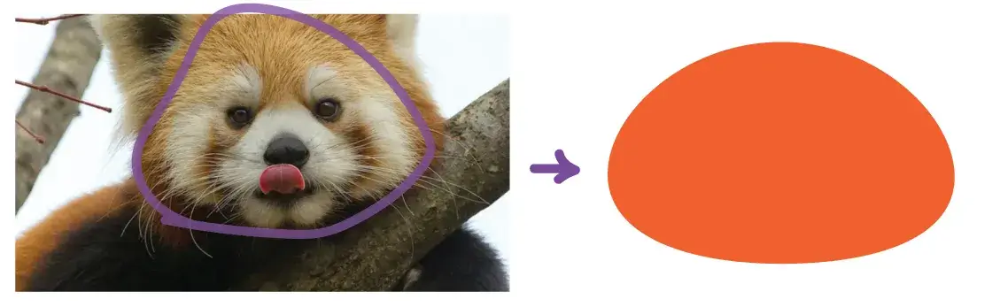
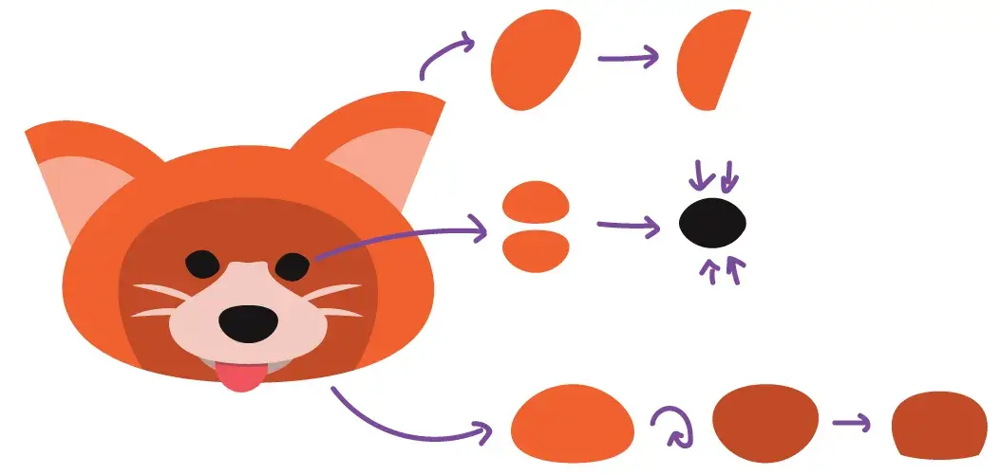
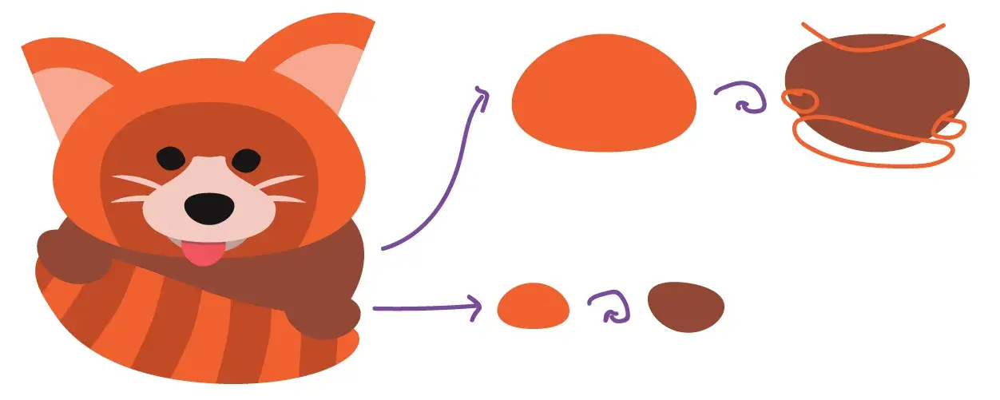
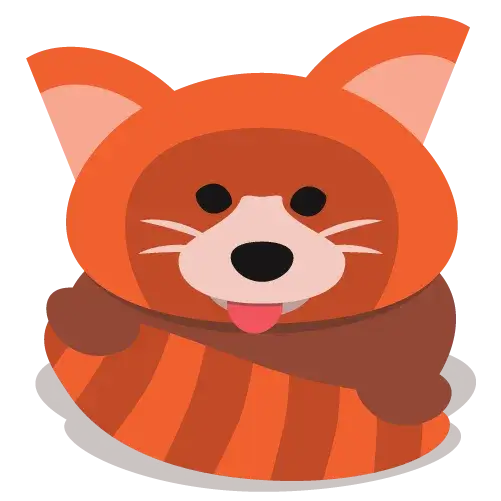
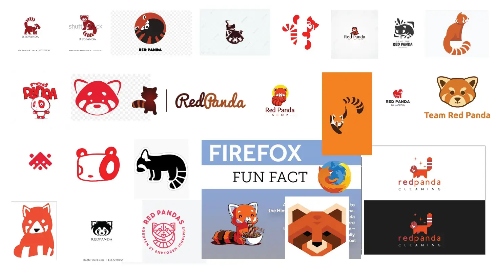
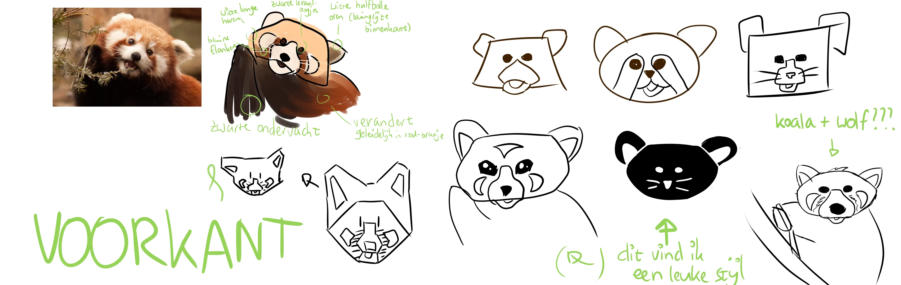
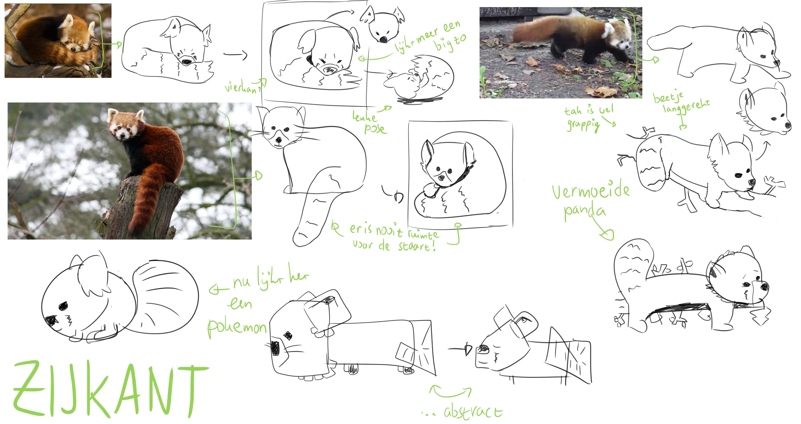

Ik twijfelde of ik dit artikel wel moest schrijven. Een logo is namelijk een van de belangrijkste elementen in de "branding" van een bedrijf/product. En waar ik voor andere mensen meestal exact weet wat ik wil maken, kon ik voor mezelf maar niet het juiste logo kiezen.

Uiteindelijk heb ik gekozen voor het meest schattige logo dat ik had. (Dat schijnt een terugkerend element te zijn in mijn keuzeproces. Hmm, wat mist er aan dit ontwerp? Niet schattig genoeg!)

Ik zal laten zien hoe ik deze heb ontworpen, maar ook de alternatieve logo's die ik misschien alsnog in de toekomst zal gebruiken. De voornaamste reden is dat het huidige logo misschien té complex en gedetailleerd is om als logo te functioneren.

_Opmerking:_ ik ben zo dom. Halverwege dit artikel herinnerde ik dat ik al enkele maanden geleden aan eenzelfde artikel was begonnen. Nu heb ik dus per ongeluk superveel schetsen van rode panda's (en uitleggende tekst eromheen). Ik zal eerst het proces achter het huidige logo uitleggen, maar aan het einde van het artikel zal ik al die eerste schetsen en ideeën van maanden geleden ook plaatsen.

## Het doel van logo's

Veel mensen denken dat logo's bedoeld zijn om _uit te leggen_. Dat je aan een logo moet kunnen aflezen wat een bedrijf precies doet of waar het voor staat. Dat hoeft niet. Het is een pluspunt als dat kan, maar het is niet het hoofddoel.

> Een logo is om te **herkennen**.

Wie heeft dit boek geschreven? Hé, ik herken dat logo, dat is _Rode Panda_!

Welk merk chips is dit? Ah, ik zie het al, _Rode Panda_. (Ik maak geen chips, het is maar een voorbeeld.)

Aan mijn bedrijfsnaam kun je niet aflezen wat ik precies doe. Het is gewoon een diersoort. Het zou ondoenlijk zijn om in de bedrijfsnaam uit te leggen wat ik allemaal doe. ("Rode Panda---schrijver, muzikant, ontwerper, programmeur, ...".)

Op diezelfde manier hoeft een logo die verantwoordelijkheid ook niet te dragen. Het enige wat ik hoef te doen, is een visueel symbool maken dat heel snel herkend kan worden als zijnde "Rode Panda"

Hoe doe je dat? Nou, eh, met een stylistische tekening van een rode panda natuurlijk!

## Stap 1: het hoofd

Als je een levend wezen tekent, begin je vrijwel altijd bij het hoofd. Mensen zijn getraind om naar hoofden te kijken. Het is het eerste wat opvalt en hetgeen waar wij karakter of gemoedstoestand aan aflezen.

Dus ik bestudeerde enkele rode pandahoofden en kwam tot de volgende conclusie: _hun hoofd is een soort uitgezakte pudding_.

Hun hoofd is rond, zacht, breder dan dat het hoog is, en wordt steeds wijder naar beneden toe. Kijk, deze vorm:

Als je deze vorm verandert, lijkt het al snel geen rode panda meer.

Toen ik deze vorm eenmaal had, gebruikte ik een truc die je bij elk ontwerp kan gebruiken: **kopieer en transformeer!**

  * Het donkerbruine deel van het hoofd is dezelfde vorm, maar dan ondersteboven. (En de punt is eraf gehaald.)
  * De ogen bestaan uit twee keer die vorm, gespiegeld op elkaar geplakt.
  * De tong is diezelfde vorm, maar dan een beetje uitgerekt.
  * De oren zijn dezelfde vorm, maar dan met de onderkant precies recht gemaakt.
  * Het puntje van de neus (zwarte gedeelte) is exact dezelfde vorm, maar dan ondersteboven.
  * De neus zelf (witte gedeelte) is ook dezelfde vorm, maar dan met een extra stukje toegevoegd tussen de ogen. (Anders zou het lijken alsof de neus uit het niets op het gezicht is geplakt.)

## Stap 2: het lichaam

Als je rode panda's bestudeert, zie je dat de onderkant (of "binnenkant") van hun vacht heel donker is, en alleen de bovenkant (bij hun rug en staart) die karakteristieke roodachtige kleur heeft.

Aangezien wij de panda van voren bekijken, zien wij alleen die binnenkant. Dus die moest ik een donkerbruine kleur geven. Om het lichaam te maken, pakte ik weer diezelfde vorm ("uitgezakte pudding") en draaide hem om.

Dit zag er op zichzelf heel stom uit. Dat was om twee redenen: het beest had nog geen poten en de verhoudingen klopten niet helemaal.

Het probleem van logo's is dat ze in een vierkante ruimte moeten passen. In het echt is een rode panda best wel langgerekt en zeker niet vierkant. Hoe lossen we dit op? We gooien de staart voor het lichaam!

Het resultaat zie je hieronder. (Merk opnieuw op dat de poten bestaan uit exact dezelfde vorm. Om eerlijk te zijn: in dit ontwerp heb ik wel héél veel gebruik gemaakt van dezelfde vorm. Normaal gesproken kan dat niet zo makkelijk.)

## Stap 3: finishing touches

Als laatste nog wat details om af te werken.

Ik heb schaduwen toegevoegd, hoewel ik twijfelde of ik dat wel moest doen. Het maakt een logo meteen een stuk gecompliceerder en kan de duidelijkheid op kleine groottes hinderen. Maar ik was van plan om dit logo ook op grotere formaten te gebruiken, en dan waren een paar schaduwen echt wel nodig.

De snorharen waren eigenlijk ook een late toevoeging. Ik vergeet altijd de snorharen.

Daarnaast heb ik enkele vormen nog een klein beetje aangepast. In eerste instantie had ik die "uitgezakte pudding" vorm ook gebruikt voor de _strepen_ op de staart. Maar dat zag er niet uit. Die strepen zijn namelijk recht, niet gekromd. Dus dat heb ik toen veranderd. Op diezelfde manier heb ik vele minuscule aanpassingen gedaan om het allemaal net wat beter te krijgen.

Dit is het (voorlopige) eindresultaat:

## Nou nou, dat ging makkelijk

Ja, dit logo was vrij snel gepiept. Maar dat kwam dus omdat ik twee maanden geleden al onderzoek had gedaan. (Daarnaast heb ik redelijk veel ervaring met logo's, maar ook niet _zoveel ervaring_ dat het altijd zo snel gaat.)

Ik wilde dit onderzoek niet aan het begin van het artikel plaatsen, omdat het niet het meest spannende deel is. Je moet een project altijd beginnen met onderzoek, maar het grootste deel ervan is niet interessant om te laten zien, omdat je er _niks mee hebt gedaan_.

Dus mocht je geïnteresseerd zijn in mijn andere logo ontwerpen en hun proces, lees dan vooral verder!

## Onderzoek & Schetsen

### Stap 1: Bestaande logo's bekijken

Er bestaan al héél veel logo's met rode panda's. (_Wist je dat het Firefox-logo dus een rode panda is en geen vos?_) Sterker nog, veel van deze logo's zijn echt heel mooi en goed uitgewerkt. Ik wilde niemand naäpen en iets unieks bedenken.

**Opmerking 1:** De meeste logo's laten de gehele rode panda vanaf de zijkant zien óf alleen het hoofd van de voorkant. Dat gaan we dus niet doen! Misschien kan ik wel de hele panda van de voorkant laten zien. Of alleen het hoofd _vanaf de zijkant_.

**Opmerking 2:** Vrijwel geen enkel logo heeft iets _bij_ de rode panda. Dat vond ik eigenlijk wel apart, want vrijwel iedereen denkt bij een rode panda meteen aan bomen, takken, bladeren, etc. Ik wilde dus kijken of ik één van die elementen in het logo kon verwerken.

**Opmerking 3:** De meeste logo's zijn vrij strak. Ze zijn hoekig, gebouwd uit vierkanten en driehoeken, helemaal ingekleurd met slechts één of twee kleuren, of maken gebruik van "negative space".

> Toen ik dat zag dacht ik meteen "nouhou dat wilde ik doen!" Het is heel slim, maar ook voor de hand liggend. Sommige delen van de rode panda zijn helemaal dezelfde neutrale kleur. (De strepen in de staart zijn nagenoeg zwart en grote delen in het gezicht nagenoeg wit.) Die kun je dus "weglaten" zodat de kijker die delen zelf invult. Het maakt het design meteen speels, dynamisch en actief.

### Stap 2: De restricties

Iedereen weet: elk ontwerp wordt beter van restricties. Daarom legde ik mezelf de volgende restricties op:

  * Het logo moet (nagenoeg) vierkant zijn.
  * Ik mag maximaal vier kleuren gebruiken. (Hierbij is een andere tint van dezelfde kleur ook een aparte kleur.)
  * Men moet het logo herkennen op minimale grootte (laten we zeggen "de grootte van het icoontje bij een tabblad in de browser"). Maar het moet ook niet lelijk worden als je hem heel groot afdrukt. (Bij hele simpele logo's kan een vergrote versie er lelijk uitzien omdat het te "simpel" of "ruw" is. Je kunt het vergelijken met "pixel art". In het klein zien die dingen er supergoed uit, in het groot lijken het een hoop blokjes in willekeurige kleuren.)
  * Ik mag niet (te veel) gebruik maken van "negative space". Dus nee, de strepen op de staart mag ik niet weglaten zodat de kijker die er zelf bijdenkt.
  * Ik mag niet (te veel) gebruik maken van "geometrische technieken". Ook wel bekend als "de moderne look": perfecte hoeken, precies rechte lijnen, pixel art, vlakke schaduwen, alles in één kleur, etc. Hoewel dit visueel mooi en strak kan zijn, merk ik dat ikzelf (en de rest van de wereld) het té vaak gebruik. Dus dat doen we deze keer niet.

Zo, met deze restricties kon ik aan de slag.

### Stap 3: Oude logo's van mezelf oprakelen

In een artikel van enkele maanden geleden liet ik zien hoe ik een nieuwe logo ontwierp voor dit blog. In dat proces schetste ik ook enkele panda logo's.

Vooral het vierde logo (met de kleine oogjes en de staart voor de mond) vond ik erg leuk. Het enige probleem: het gaat tegen de restricties in die ik mezelf had opgelegd. Dit logo is heel "strak" (of "modern") en maakt erg veel gebruik van witruimte ("negative space"). Als je kijkt naar mijn collage hierboven, zie je dat zo'n logo er misschien niet tussenuit zou springen, omdat het teveel lijkt op andere logo's.

Het enige grote voordeel dat ik heb is dat mijn logo vrij elegant en simpel is. Er zijn eigenlijk maar drie vormen. De grootste daarvan is een dikke mooie curve, afgeleid van het "yin/yang" symbool. (Ik dacht niet dat ik die zin ooit zou typen. Dit logo is mooi ... vanwege z'n dikke curves :p)

Dus ik houd dit logo in het achterhoofd, maar ga het vooralsnog niet gebruiken.

### Stap 4: Schetsen

De conclusie was eigenlijk: ik moet iets doen wat ik normaal gesproken nooit doe, anders lijkt mijn logo te veel op een bestaand logo. Ik moet mijn eerste vijf tot tien ideeën weggooien en pas die daarna pakken.

Dit zijn schetsen van de eerste ideeën die ik had. Veel daarvan leken in mijn ogen te veel op een al bestaand logo; enkele vond ik goed genoeg om verder uit te werken.

Het idee van onderstaande schetsen is dus niet om al meteen een eindproduct te hebben. Het is een manier om heel snel verschillende stijlen/ideeën uit te proberen.

Daarnaast gebruik ik deze methode om te leren welke elementen precies een rode panda maken. (De groene tekst in de linkerbovenhoek bevat een paar opmerkingen over "dit maakt een panda".) In één van de plaatjes zie je bijvoorbeeld een soort rare combi tussen een koala en een wolf. Dit gebeurde per ongeluk, omdat een paar subtiele veranderingen al meteen de diersoort veranderden.

## Stap 5: ??

Tja, hier stopte mijn initiële onderzoek. Ik weet het, ik weet het, het was heel dom van mij om te vergeten dat ik dit al had gedaan.

Maar je moet het zo zien: ik heb nu heel veel geoefend met schetsen en logo's bedenken, en misschien kan ik sommige ideeën ooit nog gebruiken.

 

 

 