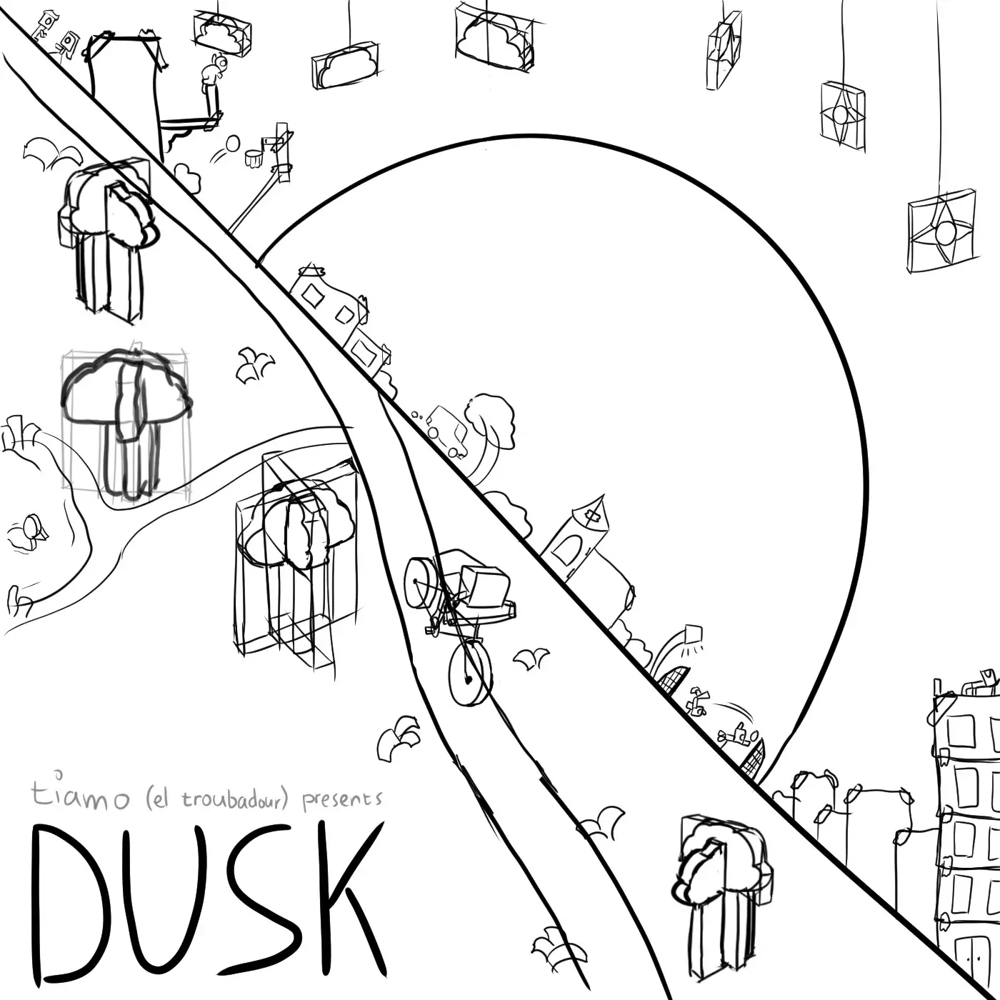
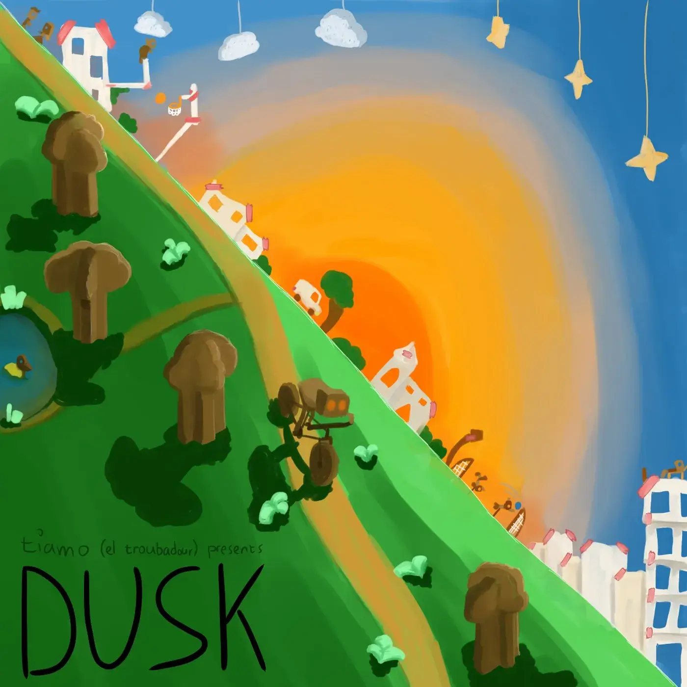
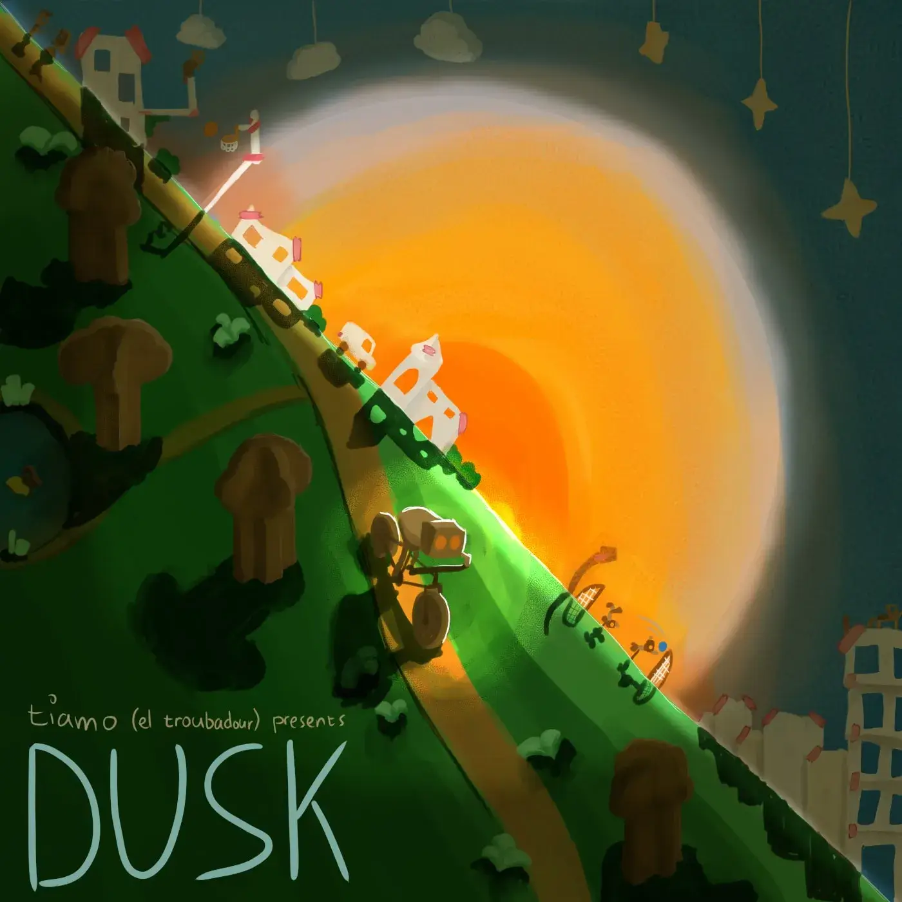

Onlangs bracht ik een nieuw instrumentaal album uit en daarvoor had ik natuurlijk een voorkant ("album cover") nodig. In dit artikel zal ik kort uitleggen hoe ik deze heb ontworpen en getekend!

Het album zelf (plus aanvullende informatie) is te vinden op deze pagina: [[Album] Dusk][1]

## Wat is het idee?

Dit album heet "Dusk" en is onderdeel van een tweeluik. Het tweede deel heet "Dawn". Oftewel, deze albums representeren "zonsondergang" (of schemering) en "zonsopgang" (of dauw)

Het ligt dan ook voor de hand om een ondergaande zon te maken. Dat is, echter, een beetje cliché, dus ik wilde wat speciaals toevoegen!

Ten eerste wilde ik de horizon niet recht maken, maar schuin. Mijn schets begon met een schuine lijn van de linkerbovenhoek naar de rechteronderhoek.

Bij het tweede deel gaat deze lijn gespiegeld. Niet alleen geeft dat een mooie samenhang en contrast, op die manier kun je beide album covers ook naast elkaar leggen om één geheel te krijgen!

Ten tweede wilde ik er een "papier/karton" thema van maken. (Ik weet niet precies waarom; het leek me gewoon leuk.) Alle gebouwen, bomen, wolken, etc. zijn getekend alsof ze met papier, karton en plakband in elkaar zijn gefrutseld. In de eerste schets (die ik dadelijk laat zien) is dit nog niet heel duidelijk, want als ik het inkleur kan ik pas de "textuur" van papier en karton toevoegen.

Als laatste moeten we natuurlijk het _thema_ van het album meenemen. Het gaat over het plotselinge overlijden van mijn broer, toen hij op een avond aan het wielrennen was. Van die schuine horizon wilde ik een heuvel maken, waar mijn broer op de fiets vanaf racet.

## De schets

Hieronder staat de uiteindelijke schets van het ontwerp. Deze heeft mij ongeveer anderhalf tot twee uur gekost.

Zoals je ziet, teken ik vaak vierkanten (of kubussen) om dingen heen, zoals bij de wolken en sterren aan de bovenkant. Dat is extreem handig! Het maakt het véél makkelijker om moeilijke vormen in perspectief te tekenen, omdat je alleen maar de dimensies van de kubus hoeft te volgen. (Natuurlijk moet je wel eerst leren om kubussen te tekenen :p)

Ook zie je dat ik vaak lijnen over andere lijnen teken. Dit zorgt dat het er soms wat messy/onduidelijk uit ziet, maar ik zie geen reden om veel tijd te besteden aan dingen netjes uitgummen bij een ontwerpschets.

Om het papier/karton gevoel erin te brengen, heb ik alles zoveel mogelijk met plakband (of nietjes) aan elkaar gemaakt, en waar mogelijk voorwerpen "dik" gemaakt.

Kijk bijvoorbeeld naar de wolken. Echte wolken zijn rond, organisch, met veel curves. Deze wolken passen precies in een kubus, alsof iemand ze uit een stuk karton heeft geknipt.

Ook hangen die wolken als het ware "van een touwtje". Dit vond ik ook erg leuk en passend. Iets van karton kan immers niet in de lucht zweven, dus ik heb geprobeerd niks zomaar te laten zweven.

Als laatste heb ik veel "gaten" in de gebouwen gestopt. Als ikzelf vroeger een gebouw van karton of papier maakte, dan knipte ik er vierkanten/rechthoeken uit om de ramen en deuren weer te geven. Ik stopte nooit een echt of echte deur terug, want dat was veel te lastig en ook niet echt nodig. Dus dat heb ik in de tekening ook niet gedaan. In plaats daarvan zie je gewoon door het papier heen.

_Opmerking:_ het is misschien leuk om te zien dat alle gebouwen binnen de zon _schuin_ staan, terwijl alle gebouwen eromheen _rechtop_ staan. Dit vond ik een interessant contrast en bracht de zon---het middelpunt van de tekening---mooi naar buiten. In eerste instantie had ik ook meer dingen voor de zon staan, zoals wolken, vliegtuigen en grotere gebouwen, maar die heb ik allemaal weggehaald. Anders werd het te druk en wist je niet waar je moest kijken.

_Opmerking:_ hetzelfde geldt voor de bomen en planten/gras op de heuvel. Eerst had ik de hele heuvel bezaaid met natuur. Dat was chaotisch en naam de aandacht weg van de wielrenner. Dus toen heb ik ze allemaal langs het pad van de wielrenner gezet, en een stukje vrijgelaten vóór de wielrenner (want daar gaat ie naartoe) en rond de album titel ("DUSK").

_Opmerking_: dit is de laatste opmerking, beloofd. Aangezien we een scheve horizon hebben, met daarvoor een bochtige heuvel, is het perspectief een beetje lastig. Ik wilde de tekening niet te stijf maken, dus uiteindelijk heb ik het perspectief grotendeels gegokt. De grote bomen op de heuvel worden wel kleiner naar achteren toe (want dingen worden kleiner dichterbij de horizon), en hun positie en grootte verandert over de heuvel, maar verder is het niet helemaal correct. Ik gebruik dan de regel: zolang het er maar goed uitziet :p

## De eerste kleuring

Als ik iets inkleur, doe ik dat het liefst in twee fases: een algemene grondlaag en een laag met details.

Voor de grondlaag heb ik plaatjes gezocht van een zonsondergang en dat kleurenschema overgenomen. Daarnaast heb ik alles van karton een bruinige tint gegeven en alles van papier een gebroken witte tint.

Hier en daar zijn er natuurlijk wel uitzonderingen. Bruine bosjes/grassprieten vond ik lelijk, bijvoorbeeld, dus die heb ik gewoon groen gemaakt. Het was even zoeken naar een balans tussen mijn kartonthema en iets wat er nog enigszins realistisch uitzag.

Als je denkt "hmm, die dingen aan de horizon zien er een beetje raar uit", dan heb je gelijk. Ik doe niet (of nauwelijks) schaduwen bij deze eerste laag. Aangezien de zon _achter_ de gebouwen staat, verwachten onze ogen dat de gebouwen aan die kant verlicht zijn. Dat betekent dat de kant die wij zien grotendeels in schaduw zou moeten zijn.

Ik twijfelde of ik de bovenkant van de bomen niet groen moest maken (zoals, je weet wel, in de echte wereld). Daarnaast zijn kartonnen bomen niet alleen vervelend om te tekenen, maar ook om te kleuren :p Het duurde heel lang voordat ik erachter kwam dat ik grote fouten maakte bij de inkleuring, waardoor de bomen al helemaal niet herkenbaar waren als bomen. Over het hele plaatje ben ik tevreden, behalve die verdraaide bomen. Misschien veranderen die hierna nog.

_Opmerking:_ ik hou me niet helemaal aan de schets. Tijdens het inkleuren zie je vaak extra dingen of loop je tegen problemen aan die de schets niet of minder had. Zolang deze "afwijkingen" niet al te groot zijn, is het prima om ter plekke iets anders te bedenken zonder dat je hele idee/compositie wordt verpest.

## De tweede kleuring

Hier voeg ik details toe, (fatsoenlijke) schaduwen en highlights, en textuur.

Aangezien de grote zon alles van achteren belicht, waren de schaduwen allemaal redelijk hetzelfde.

Ook heb ik een extra gloed rondom de zon en de wielrenner gedaan. Ik heb al vaker gemerkt dat dit enorm veel helpt met een ontwerp focussen op de juiste onderdelen. Bovendien voegt het een extra "sparkle" (ik haat dat woord eigenlijk) toe aan een anderzijds redelijk mat plaatje.

Daarnaast vond ik het contrast niet groot genoeg voor en _zonsondergang_. Deze heldere kleuren zien er meer uit als laat op de middag :p

Vaak teken ik dan een passende vorm, maak die helemaal zwart, en leg die over het deel van het plaatje heen dat ik donkerder wil hebben. In dit geval leidde dit tot een leuke ontdekking: als ik van de zon een cirkel maak, passen zowel de zon als de wielrenner er precies in! Dit was te mooi om niet te gebruiken.

Zoals je ziet, heb ik een aantal van de gebouwen aan de horizon verschoven om meer ruimte te geven aan de wielrenner. Eerst zat de _schaduw_ van het kerkje namelijk net achter de wielrenner, wat het plaatje onduidelijk maakte, zeker op kleine grootte. Ook vond ik dat er eigenlijk iets té veel dingen aan de horizon stonden. (Een beetje jammer van de tijd die ik had gespendeerd aan het inkleuren van die dingen, maar goed :p)

Ook denk ik dat het schaduwwerk beter zou kunnen, maar ik ken mezelf en zou dan eindeloos blijven perfectioneren (en dit album nooit uitbrengen). Bijvoorbeeld, als de zon de gebouwen van achteren belicht, zouden de gebouwen veel donkerder moeten zijn dan dit. De kant die wij zien heeft immers geen (direct) licht. Dus we zouden slechts aan de rand van de gebouwen (en diens ramen) een klein streepje licht moeten zien. Maar dan was het weer lastig om het "papier"-thema te laten zien, dus ik liet het hierbij.

## Conclusie

Ik ben blij met het eindresultaat 🙂

Achteraf gezien had ik meer kunnen doen met het papier/karton thema, maar aangezien dit pas een van de eerste keren is dat ik in deze stijl "digitaal verf", vind ik het een goed resultaat.

Ook lijkt de compositie rommeliger dan ik normaal maak, vanwege de vele elementen die erin zitten. Ik ben de hele tijd op zoek geweest naar een manier om de wielrenner echt als focuspunt eruit te laten springen, maar heb niks gevonden wat de doorslag gaf (zonder het hele plaatje lelijker te maken, natuurlijk).

Achja, ik heb er weer veel van geleerd, en ik hoop dat jij ook iets van dit artikel hebt geleerd!

 

 

 [1]: https://eltroubadour.com/albums/dusk/