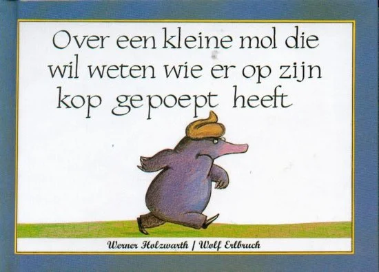

Eens in de zoveel tijd ga ik op ontdekkingsreis door prentenboekenland. Ik maak zelf prentenboeken en ben dus benieuwd wat voor andere meesterwerken er de laatste tijd zijn uitgekomen. 

Op alle websites, op alle lijstjes, staat één boek steevast tussen de bestsellers:

Ik herinner dit boek nog van toen ik zelf een kleuter was, zo lang bestaat het al. (Bij nader onderzoek: het kwam in 2002 uit in Nederland, in 1989 in Duitsland.) En nog steeds is het een bestseller met gloeiende 5-sterren reviews.

Maar nu ik ouder ben, en natuurlijk véél wijzer, heb ik toch mijn vraagtekens bij dit boekje.

Kinderen zijn enorm nieuwsgierig en leergierig. Ik zie in prentenboeken dan ook de ideale manier om hen op interessante wijze te leren over de belangrijke dingen in het leven. Achter elk boek zit een idee, een rode draad, een moraal van het verhaal.

Maar wat is het moraal van dit verhaal? "Mocht er ooit iemand op je hoofd poepen, dan moet je het er niet bij laten zitten! Nee hoor, je moet echt even alle dieren afgaan om de dader op te sporen!"

Het hele boekje lang houdt de mol de drol ook gewoon op zijn hoofd. Is dat het moraal van het verhaal? "Als er iemand op je hoofd poept, _moet_ je dit op je hoofd laten zitten totdat je wraak hebt genomen!"

Ik bedoel, het is niet eens alsof je dit een uitzonderlijke situatie kunt noemen. Een mol is altijd dicht bij de grond. De kans dat er op zijn hoofd wordt gepoept is vrij groot. Mijn gedachten als kind waren al meer in de trant van "eigen schuld, dikke bult". Het was niet alsof ik meeleefde met het hoofdpersonage of zijn avonturen herkenbaar vond. Is dat soms het moraal van het verhaal? "Wees geen mol, dan poept men op je hoofd!"

Het wordt nog leuker als de mol andere diersoorten afgaat. Bij elk dier vraagt hij "is deze drol van jou?", waarbij het andere dier _op_ _commando_ een drol op de grond gooit, met zo'n gezicht van "nee joh idioot, zo ziet mijn poep eruit, zou je moeten weten!" Is dat het moraal van het verhaal? "Andere diersoorten kunnen gewoon op commando poepen."

En eigenlijk vind ik dat het verhaal een beetje valsspeelt, want de daadwerkelijke dader (de hond) wordt niet overhoord. De mol komt er via via achter dat hij het was. Want ja, de schrijver van dit boekje wist ook wel dat de hond zichzelf niet ging verraden. "Is deze drol van jou?" "Nee joh, mijn poep ziet er zo uit---" \*legt identieke drol\* "---eh wow dat is toevallig, ziet er precies hetzelfde uit, maar nee ik was het echt niet hoor".

Of zou de hond de mol dan even aankijken ... en vervolgens keihard wegsprinten? Vluchten voor de molautoriteiten? Het is niet alsof een mol een hond kan bijhouden, en het had kunnen leiden tot een spannende achtervolgingsscene.

Achteraf gezien blijkt het boekje te gaan over hoe verschillende dieren poepen. Het zou een informatief boekje zijn waarbij het kind leert over de soort poep van verscheidene diersoorten. Nou, zo zag ik het als kind in ieder geval nooit.

De tweede vraag is natuurlijk: is dat _echt_ het meest belangrijke wat je kon bedenken? Je hebt een prentenboek dat door veel kinderen zal worden gelezen, zo'n 30 pagina's om iets gaafs te doen, en je besluit het over POEP TE DOEN!?

Het is een beetje alsof iemand op de middelbare school zijn profielwerkstuk schrijft over de kleur van onze plas. Of iemand die een spreekbeurt geeft over de geschiedenis en ontwikkeling van toiletten. Natuurlijk, je kunt er altijd wat van leren, maar waren er geen belangrijkere onderwerpen? Je weet wel, verhalen die de kinderen iets leren over gezondheid, over de maatschappij, over liefde/vriendschap/geluk/etc. Waar blijven die verhalen in de bestsellerlijsten?

Het geeft mij in ieder geval hoop. Als een mol met poep op z'n hoofd een bestseller kan worden, hebben werkelijk al mijn ideeën ineens grote potentie. Nu moet ik ze alleen nog uitwerken en een uitgever zien te vinden :p

Ach ja. Er zal vast een reden zijn dat dit boekje al decennia lang zo populair is. Het is simpel, het is kort, ik kan zien dat kleine kinderen het grappig vinden. In prentenboekenland is poep blijkbaar de shit.

_Opmerking 1:_ neem even tijd om stil te staan bij die woordgrap. Daar leidde het hele artikel naartoe namelijk.

_Opmerking 2:_ je vraagt je misschien af hoe ik de inhoud van het boek nog zo vers op mijn netvlies heb. Dat komt omdat ik een PDF online vond met de Engelse versie van het boekje. Geen zorgen, dit is niet illegaal of iets dergelijks. Dit boekje is inmiddels deel van het publieke domein. Dit is de link: [The Story of the Little Mole who knew it was None of his Business][1]

_Opmerking 3:_ De Nederlandse titel van het boekje is "Over de kleine mol die wil weten wie er op zijn kop gepoept heeft". Ten eerste vind ik het jammer dat ze niet de woordgrap van het Engels hebben meegenomen. Ten tweede moet het natuurlijk zijn "Over de kleine mol die wil weten wie er op zijn kop _heeft_ _gepoept_". Ik weet het, het zijn onbelangrijke details, maar ik wilde ze toch even noemen.

 

 

 [1]: https://ia801206.us.archive.org/13/items/TheStoryOfTheLittleMoleWhoKnewItWasNoneOfHisBusiness/WernerHolzwarth_WolfErlbruch-theStoryOfTheLittleMoleWhoKnewItWasNoneOfHisBusiness-pavilionChilderensBooks2001.pdf