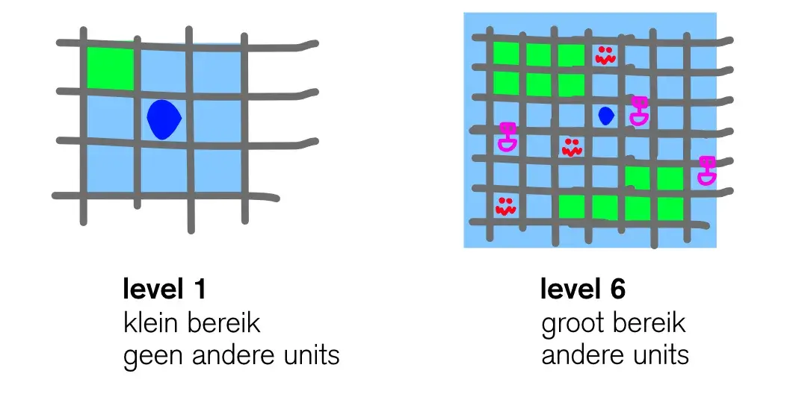
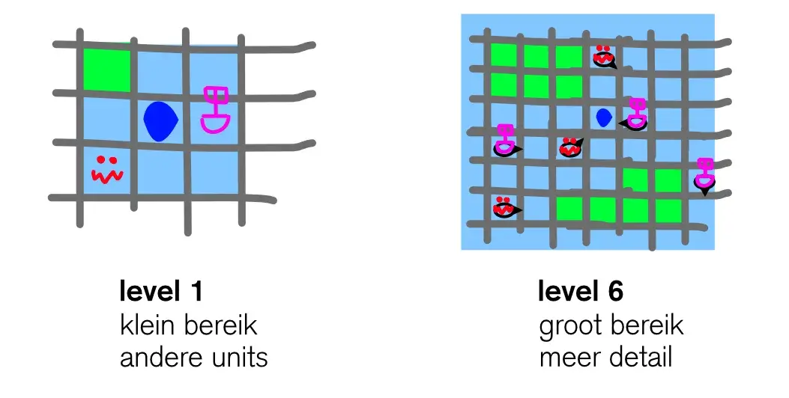

Ik ben al een tijdje bezig met een computerspel. In dit spel zit je samen op een piratenschip, terwijl iedereen een andere rol moet vervullen. De een moet sturen, de ander zet de zeilen bij, de ander laadt de kannonnen op, etc.

Misschien wel de belangrijkste rol is die van de kaartlezer (ook wel _Cartograaf_). Hij kan als enige zien waar het schip is en wat er rondom het schip gebeurt.

Dit is hoe ik de rol invulde voor de eerste versie van het spel:

> De Cartograaf heeft 6 levels. Elke keer als je een level omhoog gaat, kun je een groter deel van de kaart zien, én meer "detail" zien.

> Bij level 1 kun je alleen zien wat er direct naast je schip gebeurt => Bij level 6 kun je in een grotere omgeving rond je schip kijken

> Bij level 1 kun je alleen zien of ergens _zee_ of _land _is => Bij level 6 kun je alle tegenstanders altijd zien (monsters, schepen, etc.)

Klinkt goed toch? Ik vond het ook een heel goed idee ... totdat ik het met anderen uitprobeerde.

De kaartlezer was de minst interessante rol en kon eigenlijk niks betekenen voor anderen. Je wist niks. Je kon te weinig zien, waardoor je niet wist waar je schip was of waar je heen moest. Er kon een monster vlak naast je schip staan ... en je had geen idee. (Je zag het alleen als je level 5 of 6 had.)

Dus toen heb ik het veranderd. Nu heeft de Cartograaf de volgende invulling:

> Je begint nog steeds met weinig zicht, maar dat wordt al snel groter, zodat je al eerder dan level 6 in een grote omgeving rondom je schip kunt kijken.

> De Cartograaf kan altijd alle dingen binnen zijn bereik zien, zelfs op level 1. Als het spel begint en er staat een monster naast je schip, dan zie je dat meteen.

> Tegelijkertijd heeft upgraden nog steeds een voordeel: je ziet meer _details_ van de dingen om je heen. Op level 1 zie je alleen het monster => op level 6 zie je ook wat voor monster het is, hoe snel hij beweegt, en hoeveel je krijgt als je hem verslaat.

Wat denk je? De rol is nu véél beter!

Eerst wist je helemaal niks. Nu heb je informatie, maar die is niet compleet en kan worden verbeterd/aangevuld.

  * Je ziet een monster van afstand aankomen ... maar je weet niet hoe snel hij is of dat hij jou überhaupt ziet. (Monsters hebben ook beperkt zicht. En als ze eenmaal een slachtoffer hebben gekozen, gaan ze daar een X aantal beurten achteraan.)
  * Je ziet een haven in de verte ... maar je weet niet van wie de haven is en wat ze daar verkopen. (Eén van de belangrijkste manieren om aan grondstoffen te komen, is door te onderhandelen bij een haven. Maar als de haven jou niet aardig vindt, weigert hij te handelen.)
  * Je ziet een eiland in de verte ... maar je weet niet of ze je gaan beschieten als je langs de kust gaat varen.

Door de informatie kun je goede en interessante beslissingen nemen. Je kunt dichterbij je doel komen. Maar door de vaagheid moet je keuzes maken, overleggen met je teamgenoten, verschillende mogelijkheden afgaan. Niet de persoon die het snelste kan rekenen of lezen wint, maar de persoon die het spel het beste speelt.

## Twijfelkennis

Ik maak nu al tien jaar spelletjes en dit patroon heb ik vaak voorbij zien komen. Ik heb er veel over nagedacht en denk dat dit misschien wel één van de grootste geheimen is achter het maken van een goed spel.

Ik noem dit **twijfelkennis** of **vage informatie**.

De definitie is heel erg simpel:

> _Geef je spelers zoveel mogelijk informatie, maar zorg dat de informatie nooit 100% perfect en compleet is._

Met dit in het achterhoofd wordt het maken van een goed spel een stuk makkelijker.

De vraag is alleen: hoe doe je dit? Hoe vind je plekken in het spel waar je informatie _wel_ moet geven, en andere plekken waar je dat _niet_ moet geven? (En waarom is schaken dan zo'n populair spel, aangezien daar alle informatie beschikbaar is?)

In de rest van het artikel zal ik, door middel van voorbeelden, proberen een intuïtie voor twijfelkennis door te geven 🙂

## Voorbeeld 1: Het Piratenspel

In dat piratenspel van mij zit nog veel meer twijfelkennis.

### Vechten

Als je iemand succesvol aanvalt, krijg je hier een bericht van.

> "You hit a target!"

Maar het bericht zegt niet _wat je hebt geraakt_ of _hoeveel schade je precies hebt gedaan_.

Hierdoor krijg je een kleine onzekerheid. Is het monster bijna dood? Of heeft hij eigenlijk nog veel levens? Dit kan een groot verschil maken. Gaan we vluchten? Doorvechten? Eerst een lading kanonskogels kopen bij de haven?

(Ik moet zeggen dat dit misschien nog kan veranderen, aangezien ik het hele vechtsysteem een beetje aan het omgooien ben. Maar dat heeft hele andere redenen. Over een paar weken komt er een "devlog" van dit spel waarin ik dit beschrijf.)

### Schatkisten

Door de wereld zijn schatkisten verspreid. Ook zijn er "aanwijzingen" op verschillende plekken. Als je bij een stad bent, kun je kiezen om "rond te vragen" (tegen een bepaalde prijs natuurlijk), en met een beetje geluk krijg je een aanwijzing.

Het zou natuurlijk makkelijk zijn om precies de locatie van de schatkist te geven. "I have a mission/quest for you! Find the treasure at A4!" Veel spellen doen dit, door middel van een "quest"-systeem, en ik vind dat doorgaans heel erg lui.

Het is veel leuker met twijfelkennis. Iedereen die je spreekt heeft maar een klein deel van de puzzel.

  * "Yeah, I heard of Blackbeards treasure. People say he used to sail the _Forgotten Sea._"
  * "Blackbeard? His ship sank 50 years ago, in the _Great Battle of 1500_, and he died with it."
  * "I used to sail the trade route to _Tortuga_. You might find people there who know more."

Uit deze stukjes kun je het volgende halen: iemand in de haven van _Tortuga_ kan je meer hints geven, Blackbeard was vaak te vinden op de _Forgotten Sea_, en zijn schip ging onder tijdens de _Great Battle of 1500_.

Je hebt nu een hoop aankopingspunten. Als je kunt ontdekken _waar_ die Great Battle plaatsvond, weet je waar Blackbeard's schip is gezonken. Als je in Tortuga weet te komen, krijg je een extra aanwijzing. De kans is groot dat Blackbeard's schat ergens rond de _Forgotten Sea_ te vinden is.

Je hebt nu véél informatie, zonder dat deze kennis gewoon pats-boem in je schoot is geworpen.

### Verplaatsing

Dit spel is "turn-based". Elke beurt duurt 60 seconden. In die beurt kun je alles doen wat je wilt (wachten, het roer allerlei verschillende richtingen op draaien, etc.), zolang je maar binnen de tijd je keuze hebt gemaakt.

Als de beurt voorbij is, voert de server alle gevechten uit, en verplaatst daarna alle schepen.

Hierdoor heb je veel informatie. Als een schip recht voor je staat, en jij schiet naar voren, weet je dat je de tegenstander sowieso gaat raken. Ze bewegen pas ná het vechten.

Ook weet je precies in welke richting je schiet, hoeveel kogels je hebt, hoe ver die kogels kunnen, etc.

Maar wat je _niet_ weet, is waar de tegenstander de volgende beurt naartoe gaat. Je weet niet hoe hard diegene gaat, hoe ver hij kan sturen, aan welke kant diens kannonnen zitten.

Dus je moet gokken en proberen "slimmer te zijn dan de tegenstander". Je hebt kennis, maar hij is niet compleet.

## Twijfelkennis---een uitbreiding

Het laatste voorbeeld ("verplaatsing") is erg interessant.

In dit geval kun je wel meer informatie vergaren, maar daarvoor moet je moeite doen. Als je oplet waar de tegenstander afgelopen beurten was, kun je diens snelheid goed gokken. ("Het schip verplaatste de vorige beurten elke keer 3 vakjes, dus dat zal ongeveer de snelheid zijn.") Als je de Cartograaf heel ver upgradet, kun je meer details zien.

Maar als je de aandacht daarop legt, zal je andere onderdelen van het schip moeten verwaarlozen. Doordat jij naar de tegenstander stond te kijken, heb je niet meer goed op je eigen schip gelet. Doordat je alle grondstoffen in de Cartograaf stopte, hebben de andere rollen te weinig liefde gekregen.

Het principe van twijfelkennis wordt duizend keer beter als je de volgende uitbreiding toepast:

> _Zorg altijd dat spelers meer informatie kunnen krijgen, maar dat dit moeite kost en een trade-off vereist_.

Elk spel probeert zijn spelers te stimuleren om _interessante keuzes_ te maken. Door te zeggen "je kunt meer informatie over X krijgen, maar dat gaat ten koste van Y", krijg je dit voordeel er gratis bij. Ja, natuurlijk willen de spelers meer informatie over X! Hoe meer kennis, hoe groter de kans dat ze winnen! Maar ... is het waardevoller dan Y?

## Voorbeeld 2: Brieven aan Whitechapel

"Brieven aan Whitechapel" is een bordspel waarbij één iemand _Jack the_ _Ripper_ speelt en alle anderen _politieagenten_ spelen die hem proberen te vangen.

Het spel speelt over 4 nachten. Elke nacht kiest Jack een slachtoffer en moet vervolgens vanaf die plek naar zijn schuilplaats toe vluchten. De politie probeert hem natuurlijk ondertussen te vangen.

  * Als Jack alle nachten veilig thuiskomt, wint hij het spel!
  * Als de politie hem arresteert (of insluit), winnen zij het spel!

Voor de duidelijkheid: Jack staat niet als pionnetje op het bord. De speler die Jack speelt, krijgt een geheim scherm, waarachter hij op een blaadje zijn schuilplaats en huidige locatie opschrijft. Dus de politie heeft geen idee waar hij is.

Dit spel staat bomvol van de twijfelkennis. Het hele idee van het spel is namelijk:

> De politie weet niet waar Jack is, maar kan wel bij elk vakje vragen: "ben je hier vannacht geweest?"

> Jack weet niet wat de politie gaat doen, maar kan wel zien waar de politie op dit moment staat.

Iedereen heeft informatie, maar niet genoeg. Ze kunnen wel aan meer informatie komen, door de politieagenten de juiste vragen te laten stellen, maar dan moeten ze dat wel slim spelen.

(Ik ben wel een beetje teleurgesteld in hoe ingewikkeld ze het spel uiteindelijk hebben gemaakt. Deze kern is zó sterk. De spelregels hadden veel simpeler moeten zijn, en er is veel potentie voor interessante uitbreidingen.)

## Twijfelkennis---een aanvulling

In het vorige voorbeeld zagen we dat twijfelkennis ook de kern van het spel kan zijn.

Ik wil hier even duidelijk maken dat dit zelfs de voorkeur heeft. Elk spel heeft een kern. Eén of twee belangrijke elementen, die overal doorheen zitten, en die het spel uniek en leuk maken.

Als je het principe van twijfelkennis op die kern kan toepassen, hoef je het bijna niet meer op alle details eromheen te gebruiken.

Kaartspellen hebben vaak een kern van twijfelkennis.

  * Wat weet je wel? Welke kaarten in het spel zitten en jij in de hand hebt. Bovendien geven dat soort spellen subtiel informatie over andermans kaarten. Als een regel zegt dat je kaart altijd hetzelfde _getal_ als de vorige moet hebben, en iemand zegt "ik kan niet!", dan weet je dus dat hij geen kaarten met dat getal heeft.
  * Wat weet je niet? Je weet niet precies welke kaarten anderen in de hand hebben. En dat is toch een behoorlijk gat in je kennis.

Dit geldt voor alle kaartspellen, ongeacht hoe ze die kern uitwerken of welke details eromheen worden bedacht. (En daarom zijn kaartspellen zo makkelijk en tegelijkertijd zo leuk en divers.)

## Voorbeeld 3: De spion

Als ik terugkijk naar alle spellen die ik heb bedacht, zie ik verdraaid vaak een spion voorbijkomen. Soms is er letterlijk een spionnenrol in het spel, soms is het een actie of een overheersend thema, maar het is er bijna altijd.

Het is cool om een spion te spelen, en iedereen associeert het met een bepaalde spanning of actie, maar de hoofdreden is natuurlijk weer de twijfelkennis!

Stel je hebt een spel met geheime rollen. Iedereen krijgt aan het begin een kaartje waarop hun geheime identiteit staat, inclusief speciale vaardigheden of hoe ze het spel winnen. (Ik hou dit nu even heel algemeen, maar denk bij geheime rollen aan het bekende _Weerwolven_ of iets dergelijks.)_  
_ 

Stel nu dat één iemand de vaardigheid heeft om andermans identiteit te bekijken. We noemen diegene de "Ziener". Als diegene aan de beurt is, pakt hij iemands kaartje en bekijkt diens rol. Hij weet, na deze actie, precies welke rol iemand heeft.

Je denkt nu waarschijnlijk al: dit klinkt veel te krachtig. Die persoon kan heel makkelijk binnen een paar beurten het hele spel beslissen!

Hoe lossen we dit op? Met het spionnenmechanisme!

Ik introduceer een rol die zich kan _voordoen_ als een andere rol. Misschien ziet de Ziener een ander kaartje. Of alle goederiken denken dat deze rol bij hen hoort, maar eigenlijk hoort deze persoon bij de slechteriken. Er zit simpelweg een spion aan tafel.

Wat is het effect hiervan? Iedereen begint te twijfelen aan hun kennis! Als de Ziener iemands kaartje bekijkt, is de kans misschien 90% dat dit gewoon de juiste rol weergeeft. Maar puur vanwege de aanwezigheid van een spion, vanwege de _mogelijkheid_ dat informatie verstoort wordt, verandert ALLE informatie in twijfelkennis.

Hopelijk zie je inmiddels in hoe krachtig zo'n mechanisme is. De spion hoeft niet eens in het spel te zitten :p Alleen al de angst dat de spion informatie heeft verstoord, maakt alle informatie een klein beetje onbetrouwbaar of incompleet. Het spel kan verder 100% transparant zijn---zolang men weet van de spion, voelt het spel geen 100% transparant.

Ik noem het nu "de spion", maar je kunt hier natuurlijk veel andere implementaties voor bedenken. Zo had ik ooit het idee van een spel waarbij je berichten naar elkaar moest sturen door middel van (radio)signalen. (Zogenaamd, natuurlijk.) Als jouw tegenstander het signaal kon onderscheppen, kon deze de inhoud veranderen, voordat het signaal werd doorgestuurd.

Elke keer als jij een bericht kreeg, wist je dus niet of er mee geknoeid was of niet. Voor hetzelfde geld had niemand het bericht gezien. Of had de tegenstander de inhoud gewoon hetzelfde gelaten. Maar door de mogelijkheid van geknoei wordt alle informatie twijfelkennis.

(Wat overigens behoorlijk frustrerend kan zijn in een coöperatief spel. Als de ene persoon met man en macht probeert een bericht over te dragen, maar jij elke keer zeg "Tja, kan ik dit wel vertrouwen? Nee, ik geloof het niet." :p)

## Twijfelkennis---een opmerking

Als je het idee van de spion té vaak toepast, wordt een spel natuurlijk te willekeurig. En daarmee komen we bij de kern van dit principe: het zoekt een balans tussen _complete willekeurigheid/onwetendheid_ en _complete zekerheid/informatie_.

Een spel waarbij niemand weet wat er gebeurt of wat de gevolgen van hun acties zijn, is geen goed spel. Als alles wordt bepaald door het gooien van een dobbelsteen of trekken van een kaart, kun je het niet eens een spel noemen eigenlijk.

Tegelijkertijd is complete zekerheid geen wenselijk resultaat. Als jij 10 beurten van tevoren weet dat je gaat verliezen, hoe leuk is zo'n spel dan nog? Als de persoon die het beste kan hoofdrekenen altijd het spel wint, hoe leuk is het spel dan nog?

Maar complete zekerheid is er bijna nooit. Je hebt altijd de onzekerheid over _wat_ _de andere spelers gaan doen_. Daarom is schaken ook zo'n populair spel. Hoewel iedereen precies weet waar alle stukken staan en wat ze kunnen doen, wordt het spel niet saai of voorspelbaar, omdat je niet weet wat er in het hoofd van je tegenstander omgaat.

Zolang je meer dan één speler hebt, krijg je altijd een beetje onzekerheid. Daarom is het altijd goed om, voor de zekerheid, meer te leunen naar de kant van _informatie_ dan de kant van _willekeur_.

Met twijfelkennis probeer ik _zoveel mogelijk informatie te geven_, en toch _nooit complete zekerheid te geven_. Niet andersom. Je moet niet proberen om zoveel mogelijk willekeur te krijgen, maar toch nog één onderdeeltje uit informatie te laten bestaan.

En als je bang bent dat je te veel informatie geeft, kan je dus in stapjes gaan werken. Kijk, deze informatie krijg je pas als je level 2 bent. Kijk, je kunt deze informatie wel krijgen, maar dan moet je iets anders opofferen.

## Conclusie

Twijfelkennis is, in mijn ogen, één van de geheimen achter een goed spel. Het helpt bij het vinden van een balans tussen onzekerheid en zekerheid, wat weer leidt tot spelers die interessante beslisingen moeten maken.

Stel jezelf de hele tijd de vraag: _hoe kan ik hier meer twijfelkennis van maken?_

Gebruik twijfelkennis liever in de kern van je spel, dan in de details eromheen.

Probeer zoveel mogelijk informatie te geven, maar toch een deel vaag te laten, en niet andersom. Eventueel kan je werken met stapjes of trade-offs.

Maar het allerbelangrijkste: experimenteer! Ik begon dit artikel met mijn voorbeeld van de Cartograaf, omdat die rol meerdere versies heeft gehad. Mijn eerste idee is héél anders dan hoe de rol uiteindelijk is geworden. Je kunt wel leuk theoretisch overal over nadenken, maar uiteindelijk leer je het snelste van de praktijk. Eén oefenpotje was genoeg om alle grote fouten met de Cartograaf te vinden.