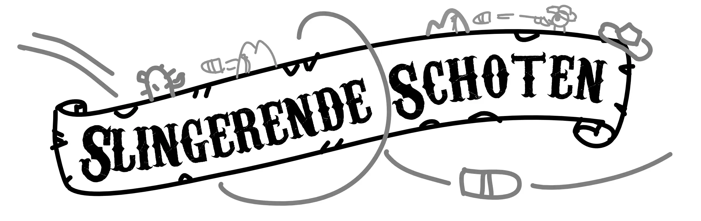
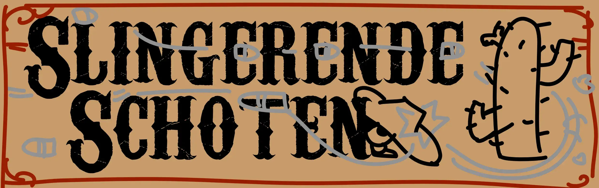
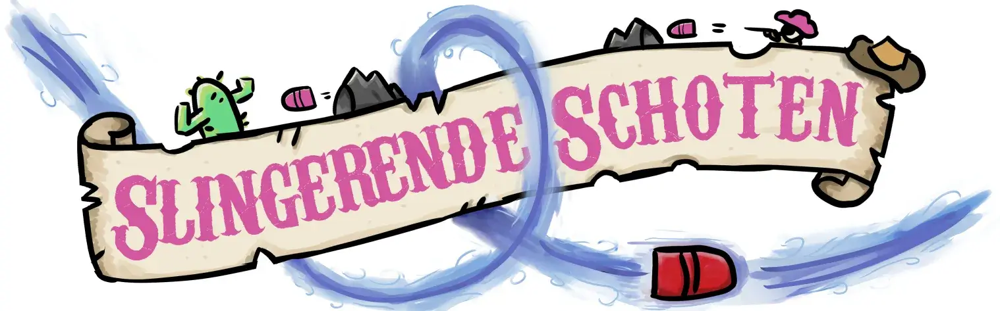

Onlangs heb ik weer een nieuw bordspel ontworpen en op deze website geplaatst!

> Dit spel heet "Slingerende Schoten" en is te bekijken/downloaden op deze pagina: [Slingerende Schoten](https://pandaqi.com/swerving-shots/)

En zoals gebruikelijk had ik weer een (naam)logo nodig voor dit spel. Dit is een logo waarin letterlijk de naam van het spel staat, zoals je normaal gesproken op de voorkant van een spellendoos vindt. Dit helpt om het spel te herkennen en geef het een professionele afwerking.

In dit artikel ga ik uitleggen hoe ik dit logo heb ontworpen en natuurlijk het eindresultaat laten zien!

## De "western" look

Als eerste ga ik (meestal) op onderzoek uit.

Mijn eigen spel heeft een Western thema: je speelt cowboys (of gewoon mensjes met een pistool) verwikkeld in een duel. Je kogel kan een cactus raken, of een doos TNT, en in de uitbreidingen heb je zelfs koeien, paarden, lasso's en nog meer.

Ik ken redelijk wat bordspellen met een Western thema, en toen ik die voor de geest haalde, merkte ik dat ze bijna altijd dezelfde elementen hebben:

  * Een dik, ietwat "imperfect" lettertype. (Er zitten gaten, strepen, gerafelde randjes in.)
  * Alleen maar bruine en beige tinten.
  * De tekst is een beetje vervormd: het slingert op en neer, of het wordt samengedrukt en weer uitgerekt, etc.
  * De tekst staat vaak op een houten plank/bordje als achtergrond, of op een stuk gerafeld papier.

Voor referentiemateriaal had ik uiteindelijk onderstaande lijst van bordspellen. (Als je een paar spellen uit deze lijst bekijkt, zie je meteen wat ik bedoel met de punten hierboven.)

  * Western Legends
  * Great Western Trail
  * Flick 'em Up
  * Old West Impresario
  * Pioneer Days
  * Colt Express
  * Tiny Epic Western
  * Deadwood

## Twee (ruwe) schetsen

Ik maakte toen twee keuzes:

  * Veel spellen gebruiken echt _alleen maar_ het Western lettertype, zoals bij Colt Express. Dit vind ik saai. Bovendien past het niet echt bij mijn spel, aangezien het _slingerende_ schoten zijn, en dus een iets meer rond en minder statisch ontwerp suggereren.
  * Sommige spellen hebben geen specifieke achtergrond voor de tekst, zoals Western Legends. Daar loopt de tekst simpelweg over de grote schildering op de voorkant van de spellendoos. Dit ging voor mij niet werken, aangezien ik geen spellendoos heb :p

Dus ik had twee opties:

  * Ik maak de tekst slingerend en plaats het over een stuk gerafeld papier
  * Ik plaats de woorden onder elkaar, met nadruk op de alliteratie (**S**lingerende **S**choten), op een verweerd houten plankje.

Zo ontstonden deze twee ruwe schetsen:

## Een keuze maken

Ik haat keuzes maken. Ik vind allebei de schetsen veelbelovend en zie meteen hoe ik ze zou kunnen gebruiken en verbeteren. Maar, uiteindelijk kan ik maar één logo maken. (Ik _kan_ wel twee logo's maken, maar dat is alleen maar verwarrend en voegt niks toe.)

Mijn broertje liep langs terwijl ik aan het schetsen was en vond de tweede leuker. Maar zijn argumentatie liet te wensen over: "ja, de eerste is zo zwart-wit, en die tweede is AGRESSIEVER"

Ik leun zelf naar de eerste, maar dat komt vooral omdat ik weet dat het logo ook op deze website (en mijn portfolio) gaat komen, en daar zal dat logo beter staan.

Dus ik vroeg het aan mijn vrienden, en die kozen optie 1.

Dus we doen optie 1.

(Zoals je merkt ben ik heel goed in op goed beargumenteerde wijze dingen ontwerpen. Ik laat het echt niet afhangen van een democratische stemming onder de mensen die toevallig in mijn omgeving zijn. Echt niet.)

## De uitwerking

Het was eigenlijk een verrassend simpele weg vanaf dit moment. Normaal gesproken kom ik er drie keer achter dat dingen niet kloppen of niet gaan werken, of dat mijn tekenprogramma nou nét dat ene gereedschap mist dat nodig heb.

Maar in dit geval heb ik de tekening netjes overgetekend, ietsje aangepast (zodat de letters beter stonden), en ingekleurd.

Het enige probleem was de windvlaag (van de kogel die om de tekst heen zwiert en zwaait). Ik bedoel ... hoe schilder je een windvlaag? :p

  * Uiteindelijk heb ik gewoon strepen van verschillende tinten blauw/wit/paars gebruikt. Deze bewegen allemaal mee met de richting van de kogel, om de illusie te wekken dat dit windvlagen zijn.
  * Daarnaast heb ik er blauwe kringeltjes (zoals je vaak bij cartoons ziet) doorheen getekend, vooral aan de zijkanten.
  * Ik heb de windvlaag donkerder gemaakt op plekken waar hij onder de tekst doorgaat (want daar zal schaduw zijn)
  * En uiteindelijk heb ik de zijkanten een beetje uitgegumd (met een "soft eraser"), zodat het allemaal wat makkelijker in elkaar over ging.

Ik ben er nog niet helemaal tevreden over, maar het is de beste windvlaag die ik nu in me heb.

## Het eindresultaat

Dit is het eindresultaat:

Waarom is de tekst ineens roze? Nou, die wilde ik eerst donkerbruin maken (zoals typisch is bij Western spellen), maar door een fout maakte ik hem roze, en toen dacht ik: "hé, dat staat ook wel leuk"

Daarnaast heb ik het stuk papier (achter de tekst) veel inkepingen en rafels gegeven, want ik heb ooit geleerd dat "imperfectie maakt mooi", en met elk ontwerp blijkt daar méér waarheid in te schuilen.

Als laatste wilde ik de tekst nog een 3D effect geven: ofwel door te doen alsof het _in het papier_ _gekerft was_, ofwel door het juist naar buiten te brengen en de letters _dikte_ te geven. Het zag er op zich goed uit, maar het maakte de tekening onnodig druk, en dan vind ik dat leesbaarheid voor gaat.

Verder is alles gewoon heel losjes getekend en ingekleurd, en voor dit logo (wat slingert en zwaait) pakte dat mijns inziens heel goed uit.

Zoals altijd: ik heb nog wat kritiekpuntjes op mezelf, maar ik vind dit meer dan goed genoeg voor een gratis te downloaden bordspel, dus hier stopte mijn tekenproces.

Sorry dat het artikel deze keer niet zo informatief was, maar hopelijk heb je er toch iets van opgestoken!