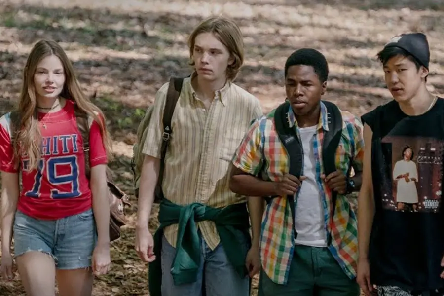

Het Grote Misschien (ook wel "_Looking for Alaska_") is het favoriete boek van mijn zusje. Althans, dat dacht ik te hebben gehoord. Als mijn zusje het zo goed vond, en ik vond mijn vorige aanvaring met _John Green_ ook waardevol (ik las onlangs _The Fault in our Stars_), dan moest dit wel een geweldig boek zijn!

Met die instelling ben ik begonnen aan dit boek ... en misschien was dat oneerlijk. Toen ik het boek weglegde voelde ik teleurstelling. Ik wist dat het cijfer voor dit boek niet hoog ging zijn. Is dit alles? Maar na enkele weken van analyse, en een gesprek erover met mijn zusje, is het cijfer uiteindelijk toch iets omhoog gekropen.

Wat is mijn oordeel? Ik geef het boek **7 uit 10 sterren** ...

{}

Het is goed, leest vlot, op sommige plekken interessant en diepgaand ... maar niet meer dan dat. Wil je weten waarom? Lees verder, lees verder!

Voor wie het nog niet was opgevallen: deze recensie gaat over het _boek_, niet over de _serie_ waarvan ik zojuist het bestaan heb ontdekt. Aangezien ik voor de komende tijd even klaar ben met _John Green_, had ik geen motivatie om ook nog snel de serie te kijken voordat ik deze recensie schreef. Sorry.

**Wees niet bevreesd! Je weet géén _spoilers_ als je deze recensie leest!**<!--more-->

## Wat is het idee?

Miles (voor de rest van het boek aangesproken met _Pudge_, want bijnamen zijn blijkbaar een groot ding) besluit weg te gaan uit zijn veilige, comfortabele leventje en intrek te nemen in een kostschool hier ver vandaan.

Hij is op zoek naar het Grote Misschien. Op zoek naar een spannender, leuker, onvoorspelbaarder leven. Een nieuw en groots avontuur ... misschien.

Op die kostschool wordt hij onderdeel van een bijzonder drietal: hij, een grappig ventje genaamd de Kolonel, en de superslimme en sexy Alaska. En met laatstgenoemde raakt hij misschien wel meer dan bevriend.

Pudge heeft een fascinatie voor de laatste woorden van bekende personen. Zo is "ik ga nu naar het Grote Misschien" iemands laatste zin. Als Alaska die van haar idool vertelt---"Hoe kom ik ooit uit dit Labyrinth?!"---raakt hij geïntrigeerd. Wie is deze meid? Waarom zegt ze dit soort dingen? Waarom kan ze soms ineens hysterisch zijn, dan weer huilen, dan weer flirten, zonder enige verklaring voor dat alles?

Daar komt de titel van het boek vandaan: de zoektocht van Pudge (en eveneens de Kolonel en enkele andere klasgenoten) om te ontdekken wie de mysterieuze Alaska nou eigenlijk is en wat er in haar hoofd speelt.

En ik denk dat daarmee het idee van het verhaal al goed wordt uitgelegd. Het is eigenlijk een zoektocht, een soort ontdekkingstocht, naar de werking van onze feilbare mensenhersens en hoe iedereen probeert om te gaan met "het labyrinth"---een metafoor voor het doolhof van het leven, omgaan met lijden en puzzelen over de zin van dit alles.

## Dat was een moeilijke zin.

Ja, dat ben ik met je eens. Maar dit is dan ook geen simpel boek, althans niet als je voorbij de eerste laag kijkt.

De eerste laag van dit boek is een typisch verhaaltje over scholieren die van alles uithalen. Ze zijn geobsedeerd met "pranks" en alles wat God (en vooral hun decaan---"The Eagle") verboden heeft, waarbij je moet denken aan roken, alcohol, en in een meisjeskamer zijn na zeven uur 's avonds met de deur gesloten. (Hier kom ik dadelijk nog op terug.)

Maar de tweede laag is die hele metafoor van het labyrinth. Het boek doet heel veel moeite om, met elke hoofdstuk en elke gebeurtenis, het thema toch weer in beeld te brengen. Zo wordt er nauwelijks iets vertelt over hoe de school werkt of welke leraren er rondlopen, met grote uitzondering van meneer _Hyde_ die een soort levensbeschouwing geeft. In die les behandelen ze natuurlijk verschillende godsdiensten, verschillende manieren van naar het leven en het hiernamaals kijken.

Zodoende probeert dit boek je aan het denken te zetten over deze onderwerpen. Dat kan ik alleen maar applaudisseren. Daarvoor zijn boeken bedoeld, in mijn ogen. En door deze thema's overal mee te verwikkelen, voelt het niet alsof je eigenlijk een studieboek leest over godsdienst en filosofie.

Maar het is niet genoeg. Je kunt moeilijke zinnen maken, filosofische overwegingen beschrijven, en cryptische uitspraken aanhalen ("Het Grote Misschien", "het labyrinth van lijden") ... maar dat betekent nog niet dat je een onderwerp of thema écht behandelt. Dat het echt binnenkomt of een nieuw perspectief laat zien. De potentie is er, maar het is niet tot bloei gekomen.

_Voorbeeld!_ Richting het einde van het boek stelt meneer _Hyde_ de vraag aan iedereen: "wat is jouw manier om uit het labyrinth te komen?" (Of iets in die richting, ik heb het boek in het Engels gelezen.) Dat is interessant. Ik wilde weten hoe elk personage dit zou beantwoorden, of wat voor gevolgen dit zou hebben op hun leven. Ik denk dat iedere lezer ook met deze vraag in het hoofd blijft hangen. Maar in het boek zelf wordt het eigenlijk "vergeten". Vrijwel niemand gaat er diep op in. Er ontstaan geen (interessante) discussies over.

Nog belangrijker: het heeft geen invloed op het verhaal. En daarmee komen we bij het volgende punt ...

## Dit is geen verhaal, dit is een moment.

Dit hele verhaal draait om één moment.

De eerste helft van het boek heeft steeds titels die aftellen naar dit ene moment. (Denk aan "100 days before", "89 days before", ...)

De tweede helft kent, zoals verwacht, titels die verder tellen ná dit moment. ("5 days after", "10 days after", ...)

Ik vond dit een leuke en passende structuur, mede omdat het meteen laat zien dat dit hele verhaal draait om één moment.

Het probleem daarmee is, echter, dat het hele verhaal eromheen dus geen ene reet gebeurd. Dat ene moment moet alles goedmaken, alles opschudden en de personages aan het denken zetten (over ons hoofdthema: het labyrinth).

En, naar mijn mening, is dat niet genoeg. Terwijl ik de laatste 50% van het boek las, was ik steeds op zoek naar de oplossing van het mysterie van dat ene moment, naar de beetjes informatie die het hele verhaal zouden goedmaken. Maar ze kwamen niet. Ik had iets groots, iets interessants, iets diepgaands verwacht ... en het kwam niet.

Is dat mijn eigen schuld? Een beetje. Het boek was redelijk "gehypet" voordat ik begon met lezen en ik ben persoonlijk een fan van grote mysteries en plot twists. Maar voor een deel is het ook de schuld van het boek. Het is net té lang om zo weinig te laten gebeuren, maar net té kort en simpel om het thema echt goed te onderzoeken.

## Excellentie in foutloosheid

En zodoende is dit boek, net als het vorige boek dat ik las van dezelfde schrijver, vooral een schoolvoorbeeld van foutloosheid. Het leest lekker, het is goed beschreven, de filosofische overwegingen zijn interessant, er is hier en daar even iets grappigs of spannends, eigenlijk is er niks slechts aan het boek.

Maar het feit dat er niks slechts is, betekent niet dat het heel goed is. Het is gewoon ... oké?

_Voorbeeld!_ Het is slim (van de schrijver) om een groep scholieren/jongeren te volgen die "pranks" uithalen. Je voelt meteen dat dit interessante en stoere mensen zijn, dat je stoute dingen doet, en er kan steeds iets bijzonders gebeuren. (Nou ja, iets meer bijzonders dan lessen volgen en studieboeken lezen, waarmee scholieren doorgaans het overgrote deel van hun tijd vullen.) Maar verder was dit maar flauwtjes en matig uitgewerkt, alsof de schrijver dacht "oh nee! ik moet iets hebben wat jongeren grappig en stout gaan vinden, anders vallen ze in slaap!"

(_Jij hebt makkelijk praten_, hoor ik je denken, _hoe had jij het dan gedaan?_ Nou, zorgen dat de pranks daadwerkelijk gevolgen hebben en samenhangen met het thema van het verhaal. Zo moeilijk is dat niet: men doet de pranks juist _om te ontsnappen uit het labyrinth_. Dat beetje ondeugendheid, beetje grapjes maken en lolletjes trappen, dát zorgt dat ze hun lijden vergeten. Misschien gaat één van de pranks aan het begin van het boek wel mis. Relaties staan op scherp, mensen worden geforceerd na te denken over wat ze doen en hoe ze met hun onderwijs/toekomst omgaan, of het nog wel waard is om die grapjes uit te halen. En als kers op de taart zou ik de pranks opschalen, maar dat is misschien slechts mijn misplaatste gevoel voor grootsheid.)

_Voorbeeld!_ En waarom moesten ze nou allemaal roken en drinken enzo? Als je het serieus zo veel doet, dan kan dat al helemaal nooit goed gaan. Die gasten zouden niet eens meer moeten kunnen functioneren! Wilde de schrijver een boodschap sturen? Iets met: mensen roken/drinken om te ontsnappen van de _suffering_, van het _labyrinth_? Dat vind ik dan dermate vaag neergezet dat het eigenlijk niet uit de tekst te halen valt.

## Conclusie

Misschien is mijn gesprek met mijn zusje wel de beste samenvatting:

  * Ik: "Ja, ik vond het op zich wel leuk om te lezen ... maar er gebeurde gewoon niet zoveel?"
  * Zusje: "Ja nee er gebeurt inderdaad helemaal niks in dat boek. Dat is altijd zo met die schrijver, John Green."
  * Ik: "Oh, heb je meer van hem gelezen?"
  * Zusje: "Eh---alleen The Fault in our Stars. Waarin ook al niks gebeurde. Daarna had ik het wel gezien."

John Green is overduidelijk een goede schrijver, een slim persoon, en iemand die de juiste insteek heeft. Interessante thema's aankaarten, intelligentie eisen van je lezers, terwijl je een grappig en eigentijds verhaaltje vertelt. Het is alleen jammer dat hij nergens erbovenuit steekt. Dat hij nergens grote risico's neemt of probeert het geheel naar een hoger niveau te tillen.

Daardoor voelt dit boek als een interessant maar vergeetbaar experiment.

_Raad ik dit boek aan?_ Ja, ik denk dat de aangekaarte thema's heel interessant zijn om over na te denken. Het is altijd leuker om het te lezen in zo'n verhaal (met pranks en herkenbare/stoute hoofdpersonen) dan om het uit een droog levenbeschouwingboek te halen. (Voor alle leeftijden, overigens. Hoewel ik denk dat het boek het meest interessant is voor Young Adults, maar misschien te filosofisch ingesteld voor jongere leeftijden.)

_Wat vind ik de sterkste punten?_ De structuur, de thema's die worden behandelt (en hoe ze worden verweven met het verhaal), de grappige en toegankelijke schrijfstijl, en de hoofdpersonages. (Normaal gesproken besteed ik meer tijd aan de personages, maar deze recensie werd al wat lang. Dus ik wil alleen zeggen dat de schrijver erg goed is in herkenbare en leuke personages neerzetten, die een beetje verknipt zijn op de goede manier.)

_Wat vind ik de zwakste punten?_ Dat het verhaal uiteindelijk weinig inhoudt, niet echt speciaal of aangrijpend is, en het ene moment waar het allemaal om draait nét te weinig is om alles goed te maken (voor mij dan).