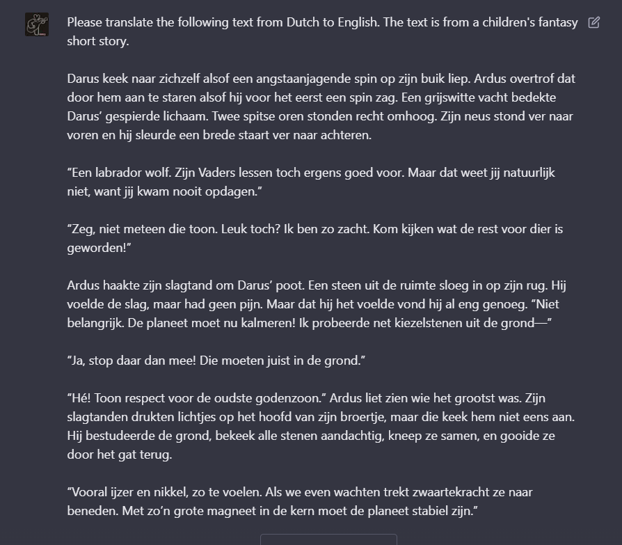
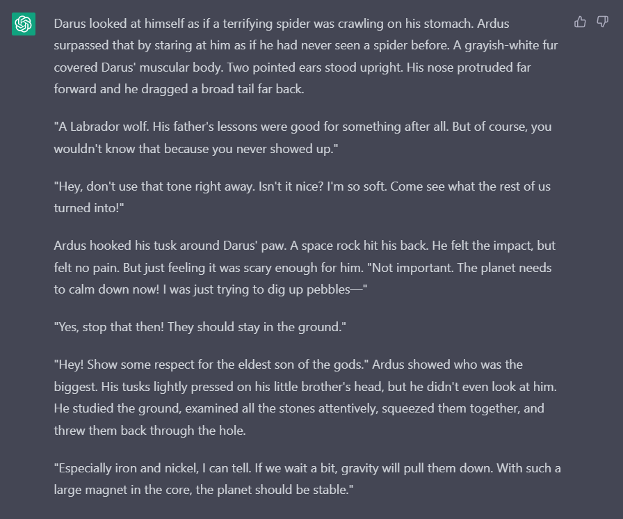
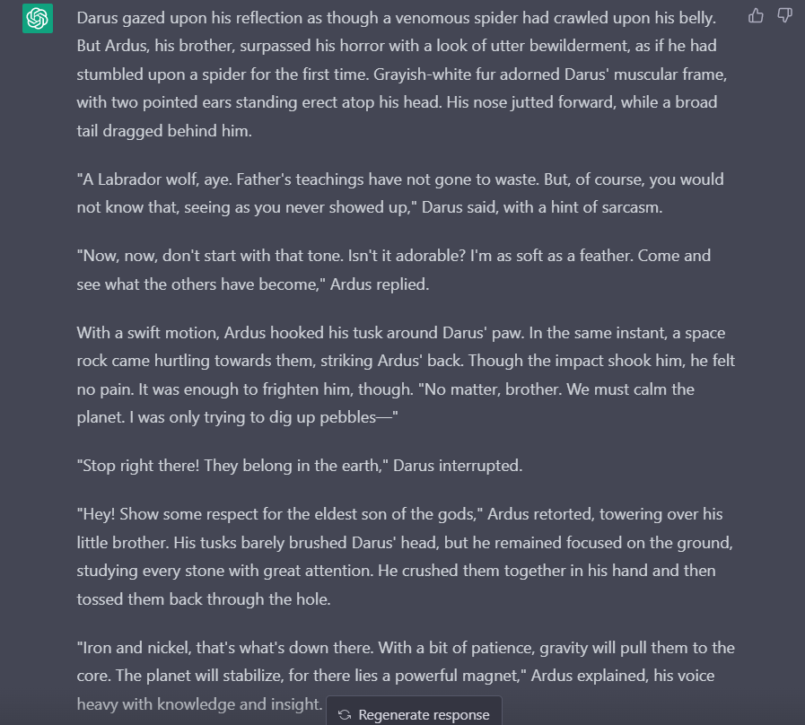

Ik heb inmiddels behoorlijk veel geschreven in het Nederlands. Maar weet je wat het grootste deel van de wereld niet spreekt? Nederlands. Ik maak langzaam de transitie naar Engels, want daarmee bereik je simpelweg een veel groter publiek, en het kost mij niet meer moeite om verhalen in die taal te schrijven.

Maar ik wilde kijken of ik mijn Nederlandse verhalen kon _laten_ vertalen door AI. Dit deed ik in eerste instantie als grappig experiment, een half uurtje voor het naar bed gaan, maar veranderde langzaam in iets dat serieus _haalbaar was._

Ik heb (sinds vorig jaar) [De Levenssaga](https://delevenssaga.nl) online staan. Korte verhalen, opgedeeld in 10 hoofdstukken elk van 1,000-1,500 woorden, geschreven in het Nederlands maar voor alle doelgroepen/leeftijden. Het systeem erachter heeft hele goede ondersteuning voor _meertaligheid_.

Dus dit was het idee:

* Ik geef ChatGPT één hoofdstuk per keer.
* En vraag om het te vertalen van Nederlands naar Engels.
* Eventueel met indicatie van stijl, of specifieke wensen, of extra informatie (voor een meer natuurlijke vertaling)
* Dat knip-en-plak ik terug in de website, en ta da, de Levenssaga is nu ook Engels.

{}
Inmiddels heb ik dus ook de Engelse domeinnaam die standaard de Engelse varianten laat zien: [The Saga of Life](https://thesagaoflife.com)
{}

## Werkt dat?

Alles begint natuurlijk met een naïeve eerste poging. "Please translate the following text from Dutch to English", met daarna het hele hoofdstuk erin geplakt. Ik deed dit in eerste instantie met ChatGPT.

Dit ... was zeker 50% van het werk.

De vertaling die volgt is _grotendeels_ leesbaar, accuraat, en bruikbaar. De grootste problemen zijn:

* Er zit een (niet geheel te voorspellen) limiet aan de antwoordlengte, waardoor hij soms maar de helft doet. Het is ongeveer 500 woorden, net iets minder dan de helft van de meeste hoofdstukken.
* Hij heeft geen besef van stijl of richting, waardoor het automatisch dingen heel droog en letterlijk vertaald, alsof het een wetenschappelijk paper moet worden.
* Tegelijkertijd heeft de AI natuurlijk een diepe kennis van taalgebruik, dus sommige zinnen worden _prachtig_ vertaald ... terwijl andere grammaticaal van geen kant kloppen.
* Ik zoek nog een manier om opmaak te behouden. Ik gebruik bijvoorbeeld regelmatig _schuingedrukte woorden_, en de notities hebben _kopjes_, en die raak je standaard kwijt. (Of ze verpesten de vertalingen van de AI omdat het die Markdown symbolen niet begrijpt.)

Hieronder een voorbeeld van een veel te letterlijke vertaling.

* Nederlands: "Zeg, maak eens wat minder herrie, sommige wezens proberen hier te slapen."
* Engels: "Hey, make a little less noise, some creatures are trying to sleep here."

_Make a little less noise_ ... vind ik nou niet zo'n lekkere vertaling. Correct, ja, maar het loopt niet en pakt niet dezelfde toon. Ik zou eerder iets doen als "keep that noise down" of "do you have to be so loud?"

Nog een voorbeeld.

* Nederlands: "Als ik het zo voel, worden we zo de zon ingezogen"
* Engels: "If I feel it like this, we'll be sucked into the sun in a moment"

_If I feel it like this_? Heeft _iemand_ dat ooit gezegd? Dit moet zoiets zijn als "The way I see it" of simpelweg "Feels like we'll be sucked into the sun any moment now."

Een laatste voorbeeld.

* Nederlands: "Dat is niet zo knap, hoor."
* Engels: "They're not so handsome, hear."

Het einde is natuurlijk lachwekkend ("hoor" naar "hear"), maar daarnaast verandert hij ook nog de betekenis van de zin door de verkeerde interpretatie van waar "knap" op slaat.

En toen vroeg ik ChatGPT om door te gaan (nadat de output te vroeg was afgekapt) ...

## De wondere wereld van AI

Toen ik zei "please continue your response", gebeurde er iets raars. Het was vergeten dat het moest vertalen. In plaats daarvan begon het zelf te verzinnen---in het Nederlands---hoe het verhaal verder zou gaan.

En het was schokkend hoeveel dingen het had opgepikt over het verhaal.

Het gebruikte de namen en eigenschappen juist. Het begreep het algemene idee van het hoofdstuk:

* Godenkinderen zijn verbannen door hun vader
* En neergestort op een barre planeet vol lava en vlammen
* En veranderd in de gedaante van dieren
* Onze hoofdpersoon is hard op zoek naar zijn broers en zussen, terwijl hij zich afvraagt waarom ze zijn verbannen.

Al deze feiten had het opgepikt uit de 500 woorden van daarvoor (die het al wel had vertaald), en vervolgens accuraat gebruikt in diens verzonnen vervolg.

De kwaliteit van het stuk was, daarentegen, niet al te best. Het liep niet echt. Het ging nergens heen: het was meer een herhaling van zetten. (Wat logisch is, want de computer kent die zetten, maar weet niet magisch een richting waarin het verhaal volgend hoofdstuk gaat.) 

Dus deze elementen, zoals dat ze de rest moeten vinden en terug naar het hemelpaleis van Vader, werden gewoon _keer op keer herhaald_ op net iets andere manieren in de dialoog :p En verder gebeurde er niks. Behalve dan een cliché vondst van een grot en een monster dat erin woonde.

Het is _totaal_ niet alsof ik nu de computer maar kan vragen om mijn verhalen (af) te schrijven. Maar _vertalen_? Dat lijkt veelbelovend.

## Volgende poging

Dus we proberen wat nieuws.

* We leggen uit dat het voor een (jeugd) fantasy verhaal is. => "The text is for a children's fantasy short story."
* Als het wordt afgesneden, vragen we het om verder te gaan. => "Your response was cut off. Please continue your previous response from: "_laatste zin hier_". Please only translate from Dutch to English, do NOT change the story or invent anything new."
* En _na_ de generatie, vragen we ChatGPT om zelf de tekst te verbeteren en natuurlijker te schrijven. => "Please rewrite the text above to sound more natural, interesting and beautiful. It should fit in a chapter from an acclaimed fantasy novel."

Wat ik ook probeerde, het wilde _niet_ onthouden dat het moest vertalen. Soms bleef het een paar paragrafen goed (alleen vertalen, niks nieuws verzinnen), maar ging het daarna alsnog mis. Ik heb minstens 20 variaties op zinnen en prompts geprobeerd, maar uiteindelijk moest ik maar de simpele oplossing accepteren: alleen maar stukjes geven die niet té lang zijn en worden afgekapt.

De andere twee toevoegingen maken wél veel (positief) verschil. 

Ik zal een voorbeeld geven. Eerste tekst is het origineel, de tweede is de eerste vertaling, de derde is de vertaling na aanmoediging.

{}
 
 
 
{} 

Zoals je ziet, is de eerste vertaling meestal _correct_, maar leest vaak voor geen meter en verliest toon of gevoel. De tweede vertaling is véél mooier, gevarieerder, passender. Maar om dat te bereiken verandert het wel een paar (cruciale) feiten: zoals dat Ardus zogenaamd de laatste zin zou zeggen, wat helemaal **niet waar is**.

Spelen met dit systeem gaf mij verrassend veel inzicht over mijn eigen schrijfstijl :p De meeste zinnen die "clunky" werden vertaald, waren zinnen die in het Nederlands misschien beter klonken ... maar nog steeds onnodige woorden hadden of een onhandige volgorde. 

Zo'n AI legt enkele valkuilen of slechte gewoontes bloot, wat heel leerzaam was.

Het ideale resultaat is iets tussen het eerste en tweede plaatje in.

## Alternatieven

Natuurlijk zijn er meer aanbieders van vertalingen, de meeste inmiddels gebaseerd op AI. 

De meeste, echter, zijn _niet gratis_. Zelfs als je betaalt hebben ze vaak nog strengere restricties dan ChatGPT. De enige alternatieven die ertoe deden, na lang onderzoek, waren:

* **Google Translate:** niet de beste, maar goed genoeg als begin. Ik kan simpelweg de URL geven naar elk hoofdstuk en het vertaalt de hele pagina op de plek.
* **DeepL:** restricties in het gratis plan, maar doorgaans goede vertalingen en iets makkelijker mee te werken dan ChatGPT.
* **Claude**: een nieuwe speler die verscheen in de tijd tussen het begin van dit artikel ("hé misschien wil ik de verhalen vertalen met AI") en toen ik het daadwerkelijk uitvoerde en afschreef.

Voor de eerste paar hoofdstukken probeerde ik al deze services en vergeleek welke resultaten ik het meest bruikbaar vond.

Uiteindelijk koos ik voor **Claude.ai**

## Vertalen met Claude

Ten eerste is deze service ... eigenlijk alleen voor mensen vanuit Amerika of Engeland. Sst, niemand vertellen. Maar een gratis VPN aanzetten en doen alsof je uit Londen komt doet wonderen ;)

Een gratis account later, zet ik de VPN uit en heb de service compleet kunnen gebruiken.

Waarom koos ik hiervoor?

* Deze service kan véél meer woorden (of "tokens") innemen. In één chat kon ik vijf of zes hoofdstukken vertalen voordat de limiet was bereikt. (Wel één hoofdstuk per keer, om het overzichtelijk te houden, en te voorkomen dat de AI halverwege ineens stopt of een limiet bereikt ... en je helemaal opnieuw mag beginnen.)
* Snel.
* Simpele en duidelijke interface.
* De vertalingen waren de beste van allemaal.

Dus wat heb ik uiteindelijk gedaan?

* Eén verhaal per dag (dus tien dagen op rij voor de hele eerste cyclus)
* Ik heb elk hoofdstuk van een verhaal los erin geplakt, inclusief een prompt om het te laten vertalen.
* En het resultaat steeds terug gekopieerd naar het hoofdstuk.

Dit kostte zo'n 30-45 minuten per verhaal. (Knippen, plakken, wachten op vertaling, terug kopiëren, eventuele problemen weghalen.)

### Eventuele problemen? 

Ja, de AI voegt soms ineens iets anders toe. Zoals een zin aan het begin ("Here is my translation bla bla") of een mysterieuze code eromheen (`<filename attachment="nogiets">`).

Tja, dit is vervelend en goed opletten, maar uiteindelijk relatief weinig werk om overal op te speuren en weg te knippen.

Een ander probleem is natuurlijk dat **betekenis of opmaak worden aangepast**.

Na veel proberen en bijschaven, kwam ik uiteindelijk uit op deze "prompt".

> You are a professional editor and translator. Please translate and edit the following text from Dutch to English. Keep the style whimsical and fantastical, like a children's folktale, and make the writing more engaging and creative where possible. Do NOT change any facts or meaning. Make sure your sentences use correct grammar. The input is formatted as Markdown; the output should be formatted as valid Markdown as well.

Met deze prompt was zeker 99+% van de inhoud correct. Het enige probleem was eigenlijk dat soms ineens zinnen of zinsdelen werden _weggelaten_. Er werden nooit feiten aangepast of toegevoegd.

De laatste zin zorgt er dus voor dat hij al die extra symbolen (zoals dingen schuingedrukt maken) begrijpt en _niet weghaalt_.

Ook, als de AI een goede dag had, zorgde dit voor meer creatieve vertalingen.

"Als de AI een goede dag had?" Ja, de AI heeft ook een mate van willekeurigheid. Zo voorkomt het dat het _exact_ hetzelfde antwoord geeft elke keer. Zo heeft het de mogelijkheid om te leren (in chat-vorm) of fouten op te lossen.

Dus als je hetzelfde hoofdstuk twee keer laat vertalen, zal deze vertaling **niet** identiek zijn.

Op goede dagen zorgde de AI regelmatig voor mooie zinnen met precies de juiste woorden. Ik leerde zelfs enkele nieuwe woorden! Maar op andere dagen vertaalde hij extreem letterlijk zonder _enige_ creativiteit of literaire invulling.

Eén keer zei de AI "I've also changed the parts that were offensive or hateful." Ik schrijf totáál geen extreme of haatdragende teksten, en een snelle review onthulde ook niks dat het had weggehaald of veranderd. Dus ik weet niet wat dat betekende.

Maar dat is dus wel het risico. De AI doet waar het zin in heeft. Het kan delen weghalen, het kan dingen veranderen als het niet strookt met "de mening die het is ingefluisterd door de makers", het hoeft geen trouwe vertaler te zijn.

Hoe meer ik deze vertalingen bestudeerde, hoe meer ik zeker was dat ik sowieso nog de hele vertaling zelf moest checken en editen.

### Kopiëren?

Jammer genoeg kon ik het niet direct selecteren en kopiëren. Dan kopieert de browser namelijk alleen het _resultaat_, waardoor eventuele opmaak of paragrafen verloren raken. Ik moest de originele HTML kopiëren. (Dus rechtermuisknop, inspecteren, het element selecteren dat de vertaling bevat, en de inhoud _daarvan_ kopiëren.)

Dit nam dus automatisch alle HTML opmaak mee. Bijvoorbeeld, een schuingedrukt stuk tekst is dan `<em>TEKST</em>`. 

Toen alle vertalingen klaar waren, moest ik het dus nog "opschonen". Gelukkig ken ik _Regular Expressions_: een manier om patronen te matchen in tekstbestanden en te vervangen door andere patronen.

Zo kan ik bijvoorbeeld een "Find-and-Replace" actie doen met ...

* Find = `<em>(.+?)</em>`
* Replace = `_$1_`

En tada, alle schuingedrukte dingen zijn omgezet naar de juiste Markdown daarvoor. Na zo'n 15-20 minuten van zulke opdrachten (mede omdat mijn laptop oud is en langzaam met de vervangingen), was alles helemaal netjes terug naar Markdown.

### Snelheid van vertalen?

Ja, dit is een frustratie van mij. De AI doet deze vertaling echt in _een paar seconden_. Het hele hoofdstuk klaar!

Hoe weet ik dat? Nou, het geeft de chat een _titel_ die een samenvatting is van de vertaling. Nadat ik op ENTER had gedrukt, verscheen een _correcte_ samenvatting van wat gebeurt in het hoofdstuk binnen vijf seconden.

Maar het is een "chat", dus dat antwoord wordt woord voor woord getypt. De meeste tijd werd dus verspild met wachten ... wachten ... wachten ... totdat hij eindelijk de hele vertaling op het scherm had.

Dit zou een reden zijn om toch betaalde toegang te vragen tot een bepaalde AI. Dan kan je namelijk hun API gebruiken om _direct_ resultaten te vragen en terug te krijgen. (Tevens heb je dan natuurlijk geen last van de limieten van een gratis account of minder woorden per chat.)

Maar aangezien dit slechts een experiment was en ik het geld niet heb, bleven we bij gratis services.

### Kwaliteit van de vertalingen?

De kwaliteit is ... prima. Zoals gezegd is het vooral inconsistent. Soms iets prachtigs en poëtisch, soms letterlijk of simpelweg incorrect.

Dit kan ook te maken hebben met mijn schrijfstijl. Ik schrijf meer efficiënt en praktisch, in plaats van beeldend en poëtisch. (Bovendien heb ik nu geleerd dat ik véél poëtischer schrijf in het Engels, want ik vind het gewoon een fijnere taal waarin veel dingen beter zijn uit te drukken.)

Het is enerzijds echt wel een paar stappen boven Google Translate. De meeste zinnen kloppen en lopen prima. Zelfs bijzondere constructies, waarin ik speel met spreekstijl of vertelstijl, begrijpt het vaak. Ook mijn verzonnen woorden (zoals de Oerschildpadden of de Schaduwsluipers) vertaalt het zonder blikken of blozen naar iets in het Engels dat net zo passend is.

Anderzijds zitten er té veel fouten in om het zo te accepteren, of na een "snelle blik" uit te geven.

Het heeft moeite met de volgorde van woorden. 

* In het Nederlands zeg je bijvoorbeeld al snel zoiets: "Verdrietig keek ze naar het water."
* Maar de AI vertaalt dat natuurlijk naar "Sadly she looked at the water." Maar dit betekent eerder zoiets als "Jammer genoeg keek ze naar het water" => Natuurlijker is "She looked sadly at the water", of liever zoiets als "She studied the water with sad eyes"

Nog meer voorbeelden daarvan ...

{}
AI: Already around the Sunset River the green forest landscape changed into barren brown plains.

BETER: Around the Sunset River, the green forest landscape already changed into barren brown plains. 
{}

{}
AI: The turtle now spoke almost at the same speed as other creatures, a sign he had to be _very_ irritated.

BETER: The turtle now spoke at nearly the same speed as other creatures, a sign of _extreme_ irritation.
{}

{}
AI: She flapped her wings desperately.

BETER: She desperately flapped her wings.
{}

Het heeft moeite met woorden in het Nederlands die dubbele betekenissen hebben of afhangen van context---meestal negeert de AI dat volledig en vertaalt het letterlijk.

Twee hilarische (terugkerende) vertalingen waren bijvoorbeeld.

{}
ORIGINEEL: "Hij begreep er niets van."

AI: "He understood nothing."
{}

{}
ORIGINEEL: "Hij zag maar één optie." (of uitweg, of weg, oid)

AI: "He saw one thing."
{}

Het gebruikt _meerdere_ vertalingen voor hetzelfde ding. (Nogmaals die kleine willekeurigheid van de AI!) In hetzelfde _hoofdstuk_ zijn Oerschildpadden ...

* Ancient Turtles
* Proto Turtles
* Proto-Turtles
* Old Turtles
* Turtles
* Oldshield Turtles

Maar bovenal lopen veel zinnen gewoon niet lekker. Het vertaalt letterlijk en mist daardoor het ritme. Het herhaalt vier keer hetzelfde woord of gebruikt een ingewikkelde constructie in plaats van het exacte werkwoord dat we zochten.

Dus ... uiteindelijk heb ik alsnog alle verhalen volledig zelf moeten teruglezen en editen.

## Mijn eigen edit

Ik deed twee verhalen per dag. Dat betekent dat ik na vijf dagen helemaal klaar zou zijn, en dat was een week voor mijn zelf ingestelde deadline. 

Per verhaal kostte de edit gemiddeld zo'n 2.5 uur.

Wat houdt dit in?

* Ik lees het verhaal terug van begin tot eind.
* Overal waar ik denk dat het mooier kan, of beter, of poëtischer, herschrijf ik het zelf.
* En ik check of geen cruciale informatie ineens is weggelaten (door het Nederlandse verhaal erbij te pakken)

Zo'n verhaal teruglezen kost hoogstens 45 minuten, zeker omdat ik het zelf heb geschreven. Al die extra tijd (bijna twee uur) ... komt dus door de **vele aanpassingen die ik moet doen**.

Zoals ik net al zei,

* Eén woord consistent gebruiken voor mijn verzonnen plaatsen, namen, concepten.
* Verkeerde vertalingen opsporen en veranderen.
* Zinnen veel beter laten lopen, zowel op zichzelf als in context
* Terwijl ik alles moet teruglezen, want ik weet niet wat de AI precies heeft gedaan.

Overigens slaat mijn Levenssaga ook enkele statistieken op, zoals het aantal woorden in het verhaal en de leesbaarheid.

De Engelse vertalingen zijn consistent 500 tot 1000 woorden korter. (Zelfs als ik nog extra dingen _toevoeg_ of moeite doe om iets mooier taalgebruik te hanteren.) Op deze korte verhalen betekent dat dus zo'n 10% minder woorden. Over de hele cyclus bespaar ik zo'n 10,000 woorden, zonder inhoud te veranderen!

Engels is een meer compacte taal dan Nederlands. Misschien heeft het daarom wel mijn voorkeur.

## Waarom schrijf je niet gewoon Engels?

Misschien verandert dit in de toekomst. Misschien dat dan de Levenssaga verhalen eerst _Engels_ verschijnen, en eventueel later vertaald naar het Nederlands.

Maar voor nu is het een geweldig leerproces om het in twee talen te doen. De vertalingen tonen mij fouten en verbeterpunten in het originele werk, omdat _vertalen_ een ander soort werk is dan _editen_. Dus die specifieke problemen vind ik minder snel bij een tweede of derde versie.

{}
Elk verhaal had wel 2 of 3 momenten waarop een overgang _compleet_ onduidelijk was. Hij kwam uit het niets. Of het was onduidelijk naar welk eerdere stukje het verwees. In het Nederlands was het ietsje duidelijker, maar de subtiel andere manier waarop je dezelfde zin in het Engels zou zeggen, legde deze vaagheid pijnlijk bloot.

Op dezelfde manier zorgt de andere taal dat ik sommige scenes of uitspraken ineens in een ander licht lees, waardoor ik ook zie dat ze beter kunnen verwoord of uitgelegd in de Nederlandse versie.
{}

Ook schrijf je natuurlijk _andere_ soorten verhalen in andere talen. Want je hoofd maakt andere connecties met die taal. Ik heb bijvoorbeeld andere boeken _gelezen_ in het Engels dan het Nederlands.

Hoewel al mijn andere fictie vanaf nu Engels wordt, wil ik dit project dus in eerste instantie Nederlands houden. Om die diversiteit qua taal, ideeën, schrijfstijl, etcetera te behouden en te blijven ontwikkelen.

Zoals gezegd kan dit veranderen. Misschien blijkt het over vijf jaar waanzin om eerst Nederlands te doen. We zullen zien---eerst moeten de Engelse vertalingen de Nederlandse verhalen nog bijhalen (zelfs nu lopen ze tien verhalen achter).

## Conclusie

De vertalingen van de AI zijn een soort "basis", maar het is verre van goed genoeg, en ik durf het ook geen "springplank" te noemen.

Na enkele verhalen begon ik te twijfelen of ik hiermee nou wel tijd had uitgespaard.

* De vertaling van elk verhaal heeft nu, alles bij elkaar, zo'n 4 uur gekost.
* Dat betekent zo'n 3,500 woorden vertaald per uur.
* Ik gok dat ik zeker 50% van de tekst uiteindelijk zelf moest herschrijven of veranderen op _een_ manier.

Was het sneller geweest als ik het helemaal zelf had vertaald? Ik denk **even snel**.

* Ik kan 3,500 woorden lezen en typen in een uur, al is het aan de krappe kant.
* Veel zinnen zijn vrij snel en natuurlijk te vertalen. Daar hoef ik niet lang op te blokkeren.
* Als ik het helemaal zelf doe, heb ik natuurlijk geen fouten of weggelaten onderdelen.

Tegelijkertijd ...

* De AI leverde nieuwe ideeën en woorden. Het vertaalde dingen op een manier die ik _zelf_ nooit had bedacht. Het hebben van zo'n basis voelt veiliger en makkelijker dan een lege pagina die naar je kijkt. 
* Ook voorkomt dat juist een heel letterlijke vertaling (die ik, op de automatische piloot, al snel zou doen). Wat in het Nederlands bijvoorbeeld één zin is, wordt door de AI ineens twee losse zinnen.
* Een deel van het werk is een stuk relaxter ("knippen, plakken, wachten, terug plakken") dan als ik die vier uur volle bak zelf had moeten vertalen.
* In de toekomst wordt dit beter. (Hopelijk kan ik het _hele_ verhaal plakken. Hopelijk is ergens een service die de reactie _meteen_ geeft. Hopelijk zijn de vertalingen foutlozer.)

Voor de volgende cyclus ga ik waarschijnlijk helemaal zelf vertalen. (Dat zal pas over een jaar zijn, misschien iets minder.) Ik wil op zo'n minst twee of drie verhalen op die manier doen, om te kijken of het nou echt tijd en energie spaart, of betere resultaten oplevert.

Tegelijkertijd is het allemaal veelbelovend. Die hele AI is "veelbelovend". Het staat nu nog in de kinderschoenen, maar met specifieke verbeteringen links en rechts zie je dus dat het een serieus hulpmiddel kan zijn.

Maar voor nu? Het is allemaal wat inconsistent en onhandig. Er zijn kinderziektes. Zeker zoiets als vertalen van _fictie_ is lastig, omdat je te maken hebt met context, schrijfstijl, geïmpliceerde betekenis, etcetera.

Als ik de AI vroeg om mijn notities te vertalen (die ik altijd meegeef aan het einde van het verhaal), ging dat eigenlijk compleet foutloos. Dat is een droog, non-fictie, ietwat formeel stuk tekst. Iets dat de AI geweldig vindt en waarmee het veel ervaring heeft.

Ik heb nauwelijks iets hoeven editen aan die bestanden, dus die blijf ik lekker met AI doen. (Er zit ook geen "menselijke" of "creatieve" touch hier. Het zijn letterlijk alle droge notities die ik gebruikte voor, tijdens, en na het verhaal.)

Tot zover dit experiment omtrent **vertalen met AI**. 

Hopelijk was het interessant of leerzaam om te lezen. Je kan in ieder geval de resultaten bekijken op de Levenssaga website (je kan bij elk verhaal zo van taal switchen). Vergelijk het Engels met het Nederlands en laat maar weten of het een geslaagd project was!