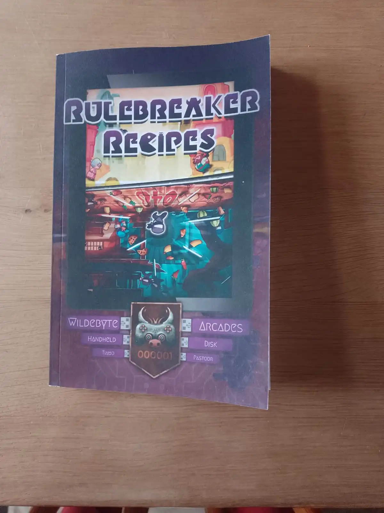
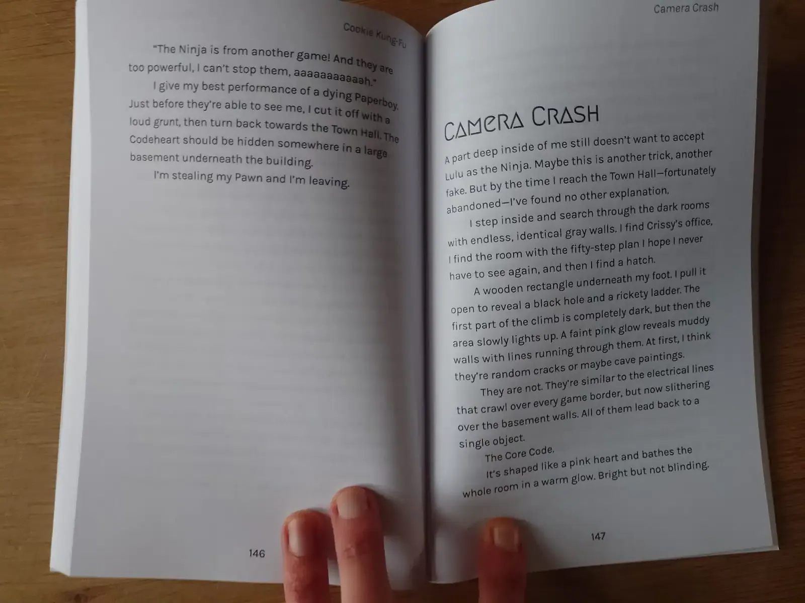
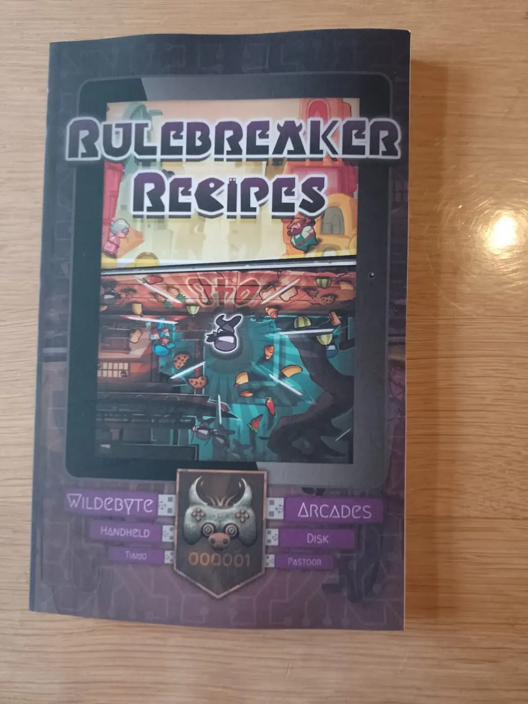
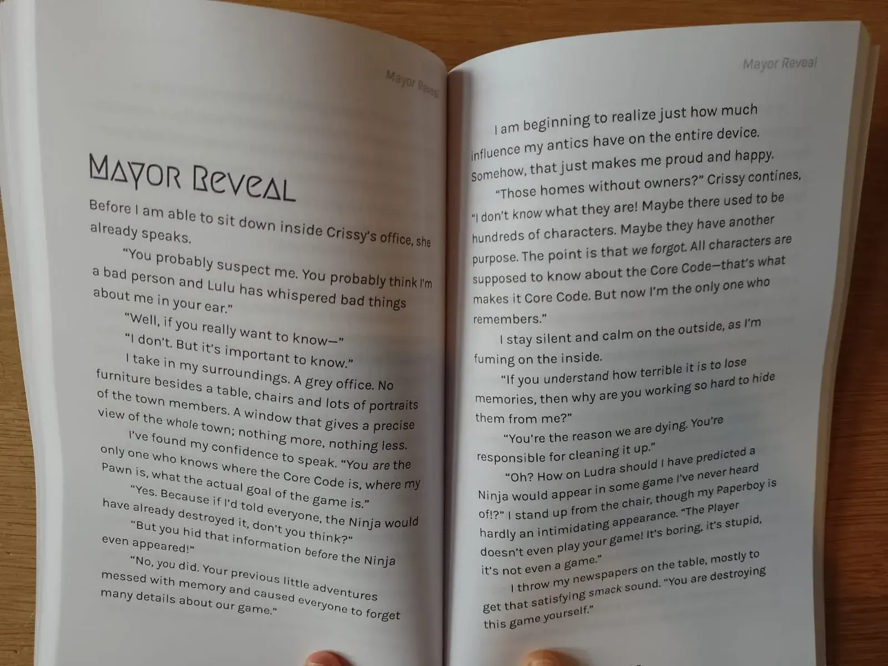
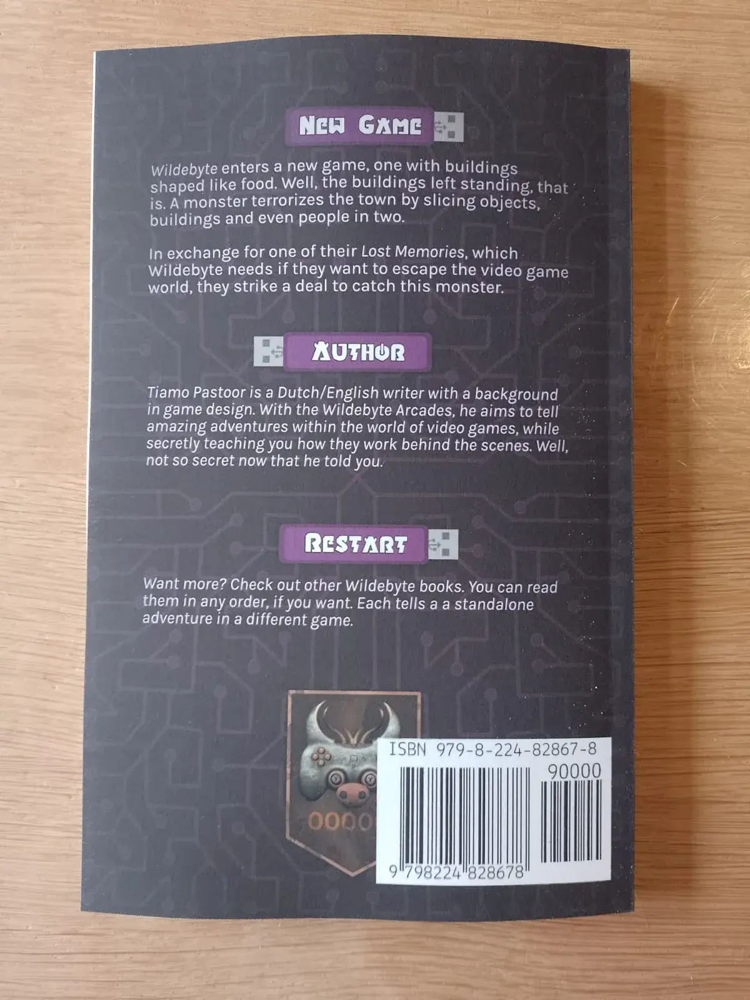

About halfway last year (May 2023), I decided to switch publishers for my books. My new self-publishing platforms have since been Amazon (for, well, _Amazon_) and Draft2Digital (for _everything else_). This means I have published some 7 books with each and seen all parts of the process (multiple times).

In this article I wanted to give my thoughts on all of that.

## Why switch in the first place?

My old publisher was based in the Netherlands. This meant it was only really suited to publishing Dutch works, which clashed with my desire to start writing in English. 

It also had to follow Dutch laws that kept increasing the price of paper and printing. At some point, I saw that the cost of printing a book there was _double_ the cost for printing at Amazon. It was ridiculous. 

(A local monopoly from the eshop website Bol.com also made matters worse and worse every year. If you're from the Netherlands, please don't buy anything from Bol. They screw over everyone else and keep huge profit margins themselves---without actually being cheaper or providing better service.)

So I switched to D2D. I could sell my books for an actually _reasonable_ price. It would appear in all the major international bookstores. (And they had a few other features that lacked in my previous service, which was incredibly simplistic in hindsight.)

And D2D _should_ be able to publish your works to Amazon too.

When publishing my very first book, however, I ran into issue ... after issue ... after issue. Eventually, the D2D service mailed me that Amazon's support for receiving EPUB3 files (from external distributors) was basically non-existent. I would save time and energy making my own Amazon KDP account and just uploading the books there myself. I've been doing so ever since.

## Amazon

### Publishing a new Project

Making the account and getting the first book setup is a breeze. Their layout and 3-step-process for uploading a new project is easy to understand and work through.

I always wish uploading + processing times were much faster, though. I noticed myself _dreading_ having to publish a new project, because I'd need to upload ... then go do something else ... regularly check if it's done already ... and waste way more time than needed on this. (D2D is faster, though not as fast as I'd like :p)

You can easily add books to a series. (You can also make an actual "Series Page" with extra description.) If you tag books as being from the same series, it's updated automatically and quickly. Which is nice, especially if your main work is the Wildebyte Arcades: an episodic series with 5 new books per year.

What you get in return for slow processing, though, is actually useful feedback or tools.

* Possible spelling errors (in ebook).
* Elements dangerously close to the page edge (in print; this actually caught a major mistake once before I published something)
* A Previewer that loads quickly and accurately displays your entire book as it will be printed/displayed on ereaders.

The first thing I do now is upload the ebook to Amazon, and see what it has to say. It usually allows me to fix some mistakes before I deliver the final files to both Amazon and D2D.

### Proof Copies & Print Quality

Amazon allows you to purchase author copies at print cost. (Which is _cheap_ for most types of books.)

When you do, you must pick the location from where they'll be printed and delivered. In my case, the Netherlands wasn't an option, so I just chose Germany. 

I had to pay ~4 euros in transport costs. The proof copies (I ordered them at once for multiple Wildebyte books) arrived within a week.

I am quite impressed by the quality. The books are sturdy, the pages clean and high resolution, much better than what my previous printer did. 

It also revealed, again, that my laptop screen _sucks_. It just displays all the colors wrong. This isn't an RGB vs CMYK thing, it's literally a "my laptop is incapable of displaying what things actually look like". The proof copies I received had a much _darker_ cover than they should have. But that's not a printing mistake. Once I finally got my hands on another, functioning device and opened my covers ... I saw that this was their actual darkness.

The main lessons?

Amazon has an easy system for proof copies, which is cheap and fast. The quality of those copies is quite high.

If you have the money, buy a proper computer :p It's quite literally impossible to create strong designs if you cannot trust anything your screen does. Of course, the issue for me here is the _have money_ part ...

### Ease of creating multiple versions

This is one of the lesser parts. When you have one version of a book (e.g. the ebook), you can click a link/button to create other versions (e.g. paperback).

It fills in some of the fields for you. It doesn't fill in others. So I'm annoyed every time when I need to write the exact same keywords again, find the exact same genres/tags, etcetera.

Most importantly, the **date** isn't copied. This is how I accidentally released the print version of Wildebyte #2 _immediately_, instead of at the planned date (a few months later). I had stupidly assumed or misremembered that the publish date would also be kept the same between versions, but it just resets that. (Fortunately, the book was ready and the version accidentally published final.)

But in the overview, it does _group_ those versions together in a nice and compact way.

### Review & Communication

Amazon indeed reviews all submissions. It usually takes half a day up to a day for both my ebook and print book to be reviewed and accepted.

I'm not sure how strict they are or where people might struggle. I've read many reviews about people being angry Amazon rejected them "for no reason" or banned their book "willy-nilly". I find no proof of that. I have years of experience with professional book interiors and covers, so maybe I'm just not making the mistakes they're making.

They also send (_numerous_) reminder emails when nearing the deadline, after which you can't make any more changes to your pre-order. This is fine. I usually don't need them and delete them right away. But the entire _point_ of such emails is to make sure you get one when you _do_ need it. Such as the one time I checked and realized I had still used a placeholder cover (of the _previous_ Wildebyte book), because the real cover wasn't ready when I inputted the book originally.

I've never had any other communication with Amazon, good or bad. Never had any questions or issues; they never had issues with what I was doing (apparently).

### Results

So far, Amazon has sold _less_ than Draft2Digital for each book. Especially my Dutch books---the last few I still had to publish---did _great_ on Draft2Digital but did absolutely nothing on Amazon.

I can't say much more than that. Amazon has **extensive** analytics, with as much detail or graphs as you want. I don't really use it, though, especially because it's a bit useless with so little data. I don't do marketing and don't care. All I know is that _when_ a purchase happens, it accurately and quickly pops up there.

## Draft2Digital

### Publishing a new Project

D2D has very similar steps and questions to Amazon, just phrased differently or cut into different parts.

One major omission is the lack of _subtitle_.

As stated, uploading (and getting confirmation it's all good) is _faster_ than Amazon. But it's still slow enough that I go and take a walk around the house every time after pressing that button.

It also does some processing, but only for ...

* _Color Content_: D2D simply can't print color interiors. If it detects any color, it auto-converts it to grayscale. In my case, my books often have a few images that were already grayscale from the start---but they're still recognized as color (only D2D, not Amazon).
* _Ebook Syntax Errors_: for the first few books, I created the EPUB "manually". That's how I ran into a woooorld of issues. So many things that might go wrong and cause an ebook to be "corrupted". Well, after clicking a few times, you can get a log of the entire issue that _usually_ tells you exactly what to fix.

Also, keywords are only registered if you press _enter_ :p The first time, I was dumbfounded as to how you input keywords and why they wouldn't be saved. Well, you do it by writing the word and then pressing enter (for each individual keyword). _Or_ you input a comma-seperated list: `video games, computer, ...` (and then press enter).

Very little, silly thing to get hung up on. But this is the point: if the interface literally _never explains_ what you're doing with a field or how to input your data, then how do you know?

You can use your own ISBN, or get a free one from D2D. (Another reason for my switch. My previous publisher asked 13 euros per ISBN. With 5 Wildebyte books per year, we're paying 80 euros for something that _could_ be free!)

Finally, their interface feels more minimalistic and "cobbled together" than Amazon's. It all works and is pretty easy to read/follow. But please, give me two days and I can make it look much prettier and more professional. Surely they should be able to do that, with how big D2D is?

### Proof Copies & Print Quality

Requesting author copies from D2D is slightly more convoluted. You need to wait a while until it says that they're "available".

If so, pressing the "buy author copy" button just places this order in your shopping cart. Then you need to tell it how _fast_ you want to receive the books: a faster delivery is more expensive.

{}
You _can_ immediately order a proof copy after inputting your book. But it is _very_ expensive. If I remember correctly, it was like 40 euros for my first 4 euro book.
{}

After placing the order, you can pay with CreditCard---no PayPal :(---and then ... hope and pray.

The interface for orders and shopping is _extremely_ simplistic. There are no updates, no progress, nothing else to do. In fact, it's quite hard to even find your orders later.

They promised it would take 5 days for the books to be delivered.

* It took 2 weeks for the books to arrive in the Netherlands. (During that time, trying to "track" the package or get updates yielded errors and nothing else.)
* Where I needed to pay a 7 euros import fee.
* After which it took 3 weeks for the package to finally arrive at my house. (Admittedly, our post service is swamped and also lazy because they have a monopoly.)

As you can see in the pictures below, the colors of the cover are _completely different_ at this printer. They're more ... flat and bleak. Which is actually more true to how my laptop displays the cover, but this is exaggerated. As if their printer wanted to absolutely use the _least_ color possible and still recreate the image faithfully :p

The same is true for the interior. The few images inside these books are much _lighter_ inside this proof copy than Amazon's. Otherwise, the interior is identical. Which is great, because that is the most important part.

D2D's paper is also less _thick_. This makes the entire book smaller, which wrongly offset my cover and is the reason why the text at the front isn't centered but shifted to the right.

The price of printing is a bit _higher_ at D2D, about 0.5 to 1 euro. That's quite a lot, if you ask me, on a small and cheap book. In fact, if they decide to raise their prices in the future, I might be forced to push the Wildebyte books to a higher price if I want to make any profit :p

The transport costs were similar to Amazon's. (But don't forget the extra fees if shipping to Europe. Yes, I ended up paying more _extra fees_ than actual printing costs for the books.)

In the end, however, a _middle ground_ between the two covers would be ideal. More color and contrast than D2D's printer, but less dark than Amazon's. This obviously can't be achieved with one and the same cover, so I decided to do something else. 

I wrote a piece of code that can _generate_ the cover on the fly. That way, I can input the exact numbers that each individual printer uses (like "base size + number of pages * page thickness"), and the specific data and files for this book (such as the installment number). After a second or two, the computer spits out a cover image with the perfect size and placement for everything. 

This way I can easily hand _different_ covers to the different printers. And besides matching size, I can add filters or change colors to get the printed book covers as consistent as possible. (For Amazon, it applies a filter to slightly lighten the cover. For D2D, it applies a filter to slightly saturate and increase contrast.)

I recognize this is far outside of the realm of possibilities for most writers. You need to know a lot about programming, web design, graphic design, etcetera. But I see no other way: the different printers are just way _too_ different, so using the same cover for both will just make it look wrong on both.

### Ease of creating multiple versions

This is a big plus of D2D. After creating one version, anything that _should_ be shared between the books is actually saved as "Shared Metadata". That's how it should be!

This means creating that second version barely takes a few minutes, after doing the first one.

It also means that, if I make a mistake or want to update both books, I only need to do it _once_ in _one place_: the Shared Metadata.

Far, far more usable than Amazon's take. 

(Also, D2D allows one free change to books every 90 days. Yes, you can even change the cover of all versions---easily---a year after publication. Amazon reminds you to make sure everything is perfect before officially publishing, because afterwards it's not allowed.)

### Review & Communication

D2D does not review submissions. 

Except the very first one by a new user, it seems, especially if they have Amazon as one of their marketplaces. But that's because of the strict requirements by _Amazon_ and D2D's convoluted system to try and make sense of that. This is also why they sent me those emails explaining I should just make my own Amazon account: I didn't ask for help, they voluntarily sent that email after auto-checking my first contribution.

Afterwards, new projects are almost instantly accepted. Distribution might take much longer for certain stores, but that's not really up to them.

### Results

As stated, Draft2Digital has sold much more for me thus far. Amazon might have a huge slice of the marketplace, but the sheer _number_ of different shops and services that D2D delivers to apparently makes up for it.

(Also the general argument of: yes, Amazon has more users, but also more books, so you're presenting your products as a much smaller fish in a much bigger pond.)

It's still not much. I'm not well-known, I only just started writing English, and I don't actively hunt more sales. But it's more than I expected in that situation.

Their analytics are far simpler and more barebones, just like their whole website and system. On its front page, it shows a big number of units sold and profit made (this and previous month), which is fine, because it's all I really care about when I quickly check the stats.

## Conclusion

In general, I am content with both services. They are better than anything I tried before, and using them in combination hasn't created any issues so far.

* It's very cheap to print at both.
* Free ISBN (or not needed at all) at both.
* You can input one version of a book, and then _mostly_ get other versions for free. (If you've prepared your files and metadata in advance, and you get used to the systems, you _can_ properly publish an entire project in less than an hour.)
* Both do rudimentary checking of the file, but Amazon does it more thoroughly.
* Amazon reviews submissions (which is good, but also causes slight delay), D2D does not. Both accept and distribute your book rather quickly. (You shouldn't be inputting the book 1 day ahead of publication anyways :p I try to have the pre-order ready 3+ months in advance.)
* So far, D2D has sold more than Amazon, but that's also because of those three Dutch books. I already had a Dutch audience, not an English one.
* Amazon is far quicker and more friendly for requesting proof copies. D2D is so slow and cumbersome that I don't even want to waste my time and money there. I assume their delivery to regular customers (through the other reputable shops) is much faster and cleaner, as there have been many purchases that way without any complaints.
* Both have similar print quality, though Amazon edges it out here too.

All in all, these services allow me to self-publish professional books around the globe. It costs me no money beforehand, while royalty margins are pretty good. I think they're trustworthy and reliable, though D2D might not _look_ like it. I've had no unexpected fees, nasty tricks or bad issues.

At the same time, don't think that just publishing will get your book read. Despite my portfolio that grows larger and larger, a track record in several disciplines, I still struggle to sell any books most of the time. Without marketing, without tricks, without networking. 

At least, these services make it _possible_. They are the first step: get the book right and get it out. What comes after still remains a bit of an annoying mystery to me. Maybe, one day, I'll convince myself to stop just _writing the next story_ to spend more time on more proactively selling those stories.

Hopefully this was informative, keep reading,

Tiamo Pastoor