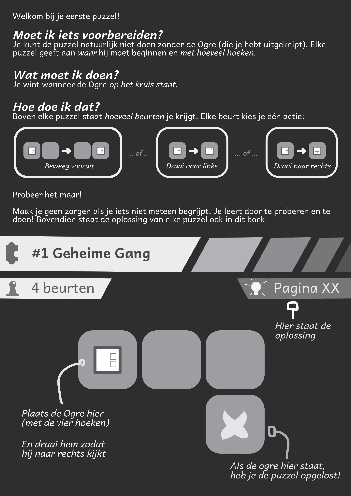
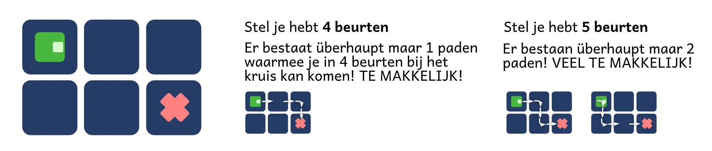
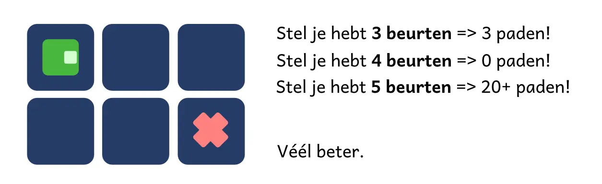
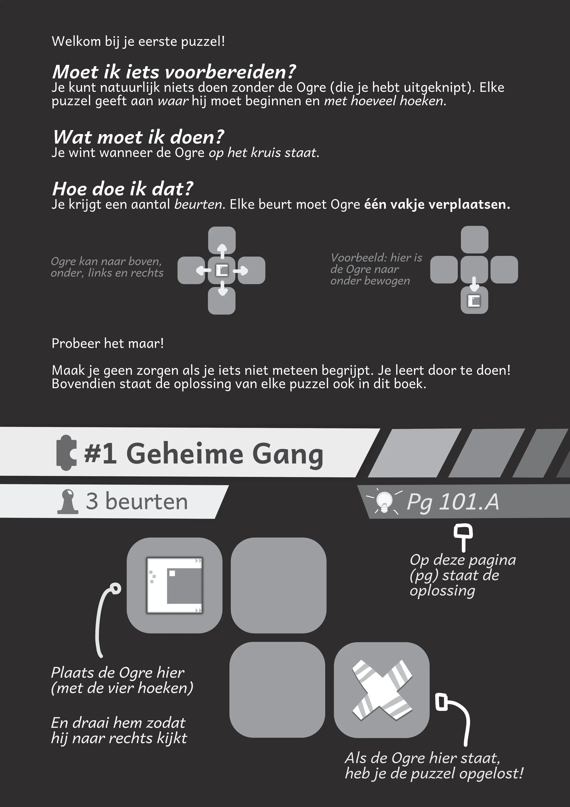
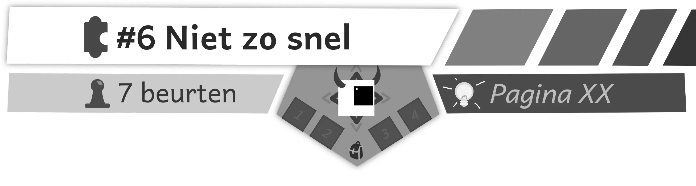
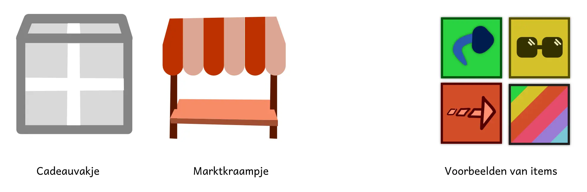
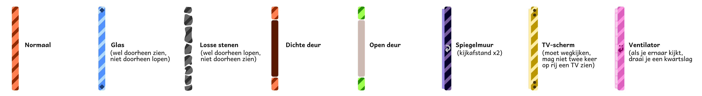

Welkom bij mijn "devlog" voor [Vierkante Ogre][1]!

_Wat is een devlog?_ Het is een "ontwikkelaarsdagboek", wat betekent dat ik uitleg hoe een project tot stand is gekomen. Het originele idee, de fouten die ik maakte, hoe ik grote problemen oploste, dat soort dingen.

Hopelijk is het leuk en interessant om te lezen. En als je zelf van plan bent een (interactief) prentenboek te maken, hoop ik dat mijn ervaringen daarbij helpen (en vele fouten voorkomen).

{}
Dit artikel is enorm waardevol, maar ook _enorm lang_. Als je alleen de belangrijkste conclusies en tips wilt weten, lees dan slechts de kopjes "Wat is het idee?", "Hoe werkt zo’n puzzel?" en dan de "Conclusie" (helemaal onderaan).
{}

{}
Vanzelfsprekend bevat dit devlog _alle mogelijke spoilers voor alles_. Tevens kan het helpen om het puzzelspel, of het boek zelf, bij de hand te houden als je precies wilt zien wat ik bedoel of hoe iets uiteindelijk is geïmplementeerd.
{}

## Wat is het idee?

_Vierkante Ogre_ is een _interactief prentenboek_: Het is een **geïllustreerd verhaal** dat tegelijkertijd **puzzels** bevat.

Terwijl je het verhaal van de vierkante Ogre leest die probeert te ontsnappen uit een grot, leer je in elk hoofdstuk iets nieuws waarmee je vervolgens een paar puzzels moet oplossen.

Die puzzels beginnen natuurlijk simpel: beweeg de Ogre met een paar stapjes naar de uitgang. Maar met elk hoofdstuk komen nieuwe speciale regels, totdat je ongelofelijk slim moet zijn om de laatste puzzels op te lossen en te ontsnappen.

Het algemene thema is "zicht". De Ogre ziet wazig, omdat hij zijn hele leven in een kleine donkere grot opgesloten heeft gezeten. Middels de puzzels leer je dat ogen _beter_ worden als ze veel variatie zien, maar _slechter_ als ze steeds naar hetzelfde kijken.

(Dit gebeurt vrij letterlijk. Aan het einde van elke beurt, tel je hoe ver de Ogre kan zien. Is dit hetzelfde als vorige beurt? Je verliest een leven. Is dit anders? Je krijgt een leven.)

Natuurlijk is dit bewust zo gekozen. Ik wil kinderen leren om hun ogen rust te geven, niet steeds achter een scherm te zitten, meer naar buiten te gaan, en ook _waarom_ dat goed is voor je ogen. (Om diezelfde reden zijn alle pagina’s in het boek _zwart_ met _witte letters_, want dat is rustiger voor je ogen.)

Voor zover ik kan zien, is zoiets nog nooit eerder gemaakt. Ik kon niks vinden ter inspiratie, of verduidelijking, of als handvat. Dus we moeten dit idee van de grond af aan opbouwen!

## Hoe werkt zo’n puzzel?

Oké, dus we weten dat de puzzel _geprint_ zal worden in een _prentenboek_. Dit brengt enkele restricties met zich mee.

**Restrictie #1:** ik kan geen _geheime_ elementen hebben. Bijvoorbeeld, het is niet alsof je een geheime gang kan ontdekken.

**Restrictie #2:** ik kan geen _willekeurige_ elementen hebben. In veel spellen worden bepaalde elementen, zoals hoeveel levens de tegenstander heeft of hoeveel schade een aanval doet, een beetje willekeurig gemaakt. Dat kan natuurlijk niet als het vaststaat op de pagina. (Ook wil ik niet van mensen eisen dat ze altijd een stel dobbelstenen bij hebben als ze dit boek lezen.)

**Restrictie #3:** de regels moeten _zeer simpel zijn_, want je moet ze allemaal zelf voeren. Het is geen computerspel waarbij je apparaat alles voor je regelt.

**Restrictie #4:** de puzzels kunnen _niet al te groot zijn_. Ik heb slechts de afmetingen van een pagina. En pagina’s zijn duur, zeker in kleur, dus het liefst zet ik gemiddeld twee puzzels op een A4-tje.

Om deze redenen koos ik voor de volgende soort puzzel:

  * Je speelt één poppetje (de Ogre).
  * Elke beurt kan je precies drie dezelfde acties doen: vooruit, draai naar rechts, draai naar links
  * En je wint meteen als je op de uitgang staat

Dit is het simpelste dat ik kan bedenken. Als je ergens een groot kruis tekent, snapt iedereen dat je daarop moet eindigen om te winnen. Ook zijn drie simpele, consistente acties beter dan bijvoorbeeld een instructie als "je mag ook bewegen in een rechte lijn totdat je niet verder kunt, maar dat kost twee beurten"

Voor de "bewegende" elementen besloot ik dat de lezer die zelf kon knippen (en desnoods zelf kon tekenen). Voor de meeste puzzels hoef je slechts een Ogre, in de vorm van een vierkant, op de pagina te leggen en te verschuiven.

Is dit perfect? Nee. Het liefst zou ik de middelen hebben om enkele mooie figuurtjes bij het boek te voegen, maar dat heb ik niet, zeker niet als self-publisher. Dit is het beste, goedkoopste en makkelijkste alternatief. (En als iemand niet in z’n boek wil knippen, kan diegene van mijn website zelf een blaadje downloaden en printen.)

## Is dit een succes?

Toen ik dit had bedacht, heb ik meteen de eerste paar puzzels geprint en laten proberen.

Eerst het **positieve nieuws**: ja! Het is makkelijk te begrijpen, er waren geen misverstanden, men vond het leuk.

Ook kan ik hier makkelijk een verhaal omheen schrijven. (Nu kwam ik pas op het idee van de Ogres die vastzaten in de grot en probeerden te ontsnappen. Hiervoor had ik géén idee wat het verhaal moest worden.)

Elke puzzel is simpelweg een nieuwe gang in de grot waarvan je de uitgang moet vinden. Elke puzzel brengt je een stapje dichterbij die felbegeerde buitenlucht.

Maar dan komt het **negatieve nieuws**: het is té makkelijk. Na de eerste hoofdstukken liep ik compleet vast.

Om dit uit te leggen, moet ik onthullen dat ik stiekem een tweede truc uit de hoge hoed had getrokken: een **simulatie**!

## Puzzels simuleren

Een hele tijd geleden raakte ik geïnteresseerd in _computers puzzels laten bedenken_. Immers, computers kunnen héél snel rekenen en logisch nadenken, dus die kan toch véél interessantere puzzels bedenken dan ik met mijn slechte hersenen?

Het idee is heel simpel. Ik schrijf een programma dat het volgende doet:

  * Bedenk een willekeurig veld. (Plaats de Ogre ergens, het doelwit ergens, en vul de rest op met iets leuks. Of niet. Het is compleet willekeurig.)
  * Probeer _alle_ zetten uit. En dan weer alle zetten. Ga zo door tot je alle mogelijkheden bent afgegaan.
  * Is de puzzel op te lossen? Geweldig! Laat hem aan mij zien en ik stop hem in het boek.
  * Is er geen enkele oplossing? Prima, we doen dit hele stappenplan opnieuw.

Dit werkt best goed. Binnen twee dagen kon ik op een knopje drukken, drie seconden wachten, en de computer gaf mij een nieuwe puzzel (inclusief oplossing).

Maar ... de computer is niet "intelligent". Het heeft geen idee van wat "interessant" of "moeilijk" is. Dus de meeste puzzels hebben een _overduidelijke_ oplossing. (Zoals: loop drie keer vooruit, en je bent klaar!)

Wat ik ook probeerde, welke gave nieuwe regels ik ook bedacht, de computer kon niks anders bedenken dan één van de volgende oplossingen:

  * De **zigzag:** het poppetje loopt naar de beste plek, en gaat dan links-rechts heen en weer, totdat hij een vrije doortocht heeft naar de uitgang.
  * De **draaimolen**: het poppetje loopt (opnieuw) naar een goede plek, en draait dan een paar rondjes om z’n eigen as.

Het is heel logisch dat de computer dit deed. Door te "zigzaggen" kon hij superveel levens erbij krijgen, alle obstakels wegkijken, totdat hij gewoon naar de uitgang kon lopen. Het was _de snelste oplossing_ uit alle mogelijke oplossingen.

Waarom is dit een probleem? Nou, de simulatie gaat _alle mogelijkheden_ af, dus als de computer niks beters kan bedenken ... dan kan ik dat ook niet. Dan is er gewoon geen interessante puzzel om in het boek te stoppen.

Ik wil _op z’n minst_ dat de simulatie regelmatig een goede puzzel kan bedenken, anders zijn mijn regels simpelweg niet goed genoeg.

## Hoe gaan we om met de zigzag?

Ik ken drie methodes om te controleren of een puzzel goed is:

  * **Haal alles weg**: haal alle "speciale blokjes" uit de puzzel, en vind dan opnieuw de snelste oplossing. Is die precies hetzelfde? Tja, dan hadden die speciale blokjes dus geen zin. De puzzel is geen puzzel.
  * **Tel de actie**: voer de oplossing uit en houdt bij _hoeveel_ je gebruik maakt van de speciale blokjes. (Je hebt bijvoorbeeld een blokje waarop je niet mag _draaien_, alleen vooruit/achteruit. Als je daarover heen loopt, dan telt hij dat.) Hoe méér je die dingen gebruikt, hoe beter de puzzel.
  * **Tel alle mogelijkheden:** laat de simulatie doorgaan, zelfs als je de oplossing al hebt gevonden. Tel vervolgens hoeveel _kortste oplossingen_ je hebt en hoeveel een _langere oplossing_ Een goede puzzel heeft maar één kortste oplossing, maar heel veel langere. (Waarom? Die langere zijn "makkelijk" en leiden je om de tuin. Die ene kortere oplossing is in de meeste gevallen een hele slimme en creatieve.)

Dus die heb ik ingebouwd. Het resultaat? Je raadt het al: ofwel de computer vindt _alsnog_ een manier om te zigzaggen, of de computer denkt een half uur en kan nog stééds geen puzzel vinden. (Want ze worden allemaal afgewezen omdat ze niet aan bovenstaande criteria voldoen.)

Dit was geen weggegooid werk, zeker niet. Die checks hierboven garanderen dat elke bedachte puzzel op z’n minst _iets_ van denkwerk vereist om deze op te lossen. Maar het is niet genoeg.

Nee, dit wijst op een probleem met de _kernregels van het spel!_

Denk er eens over na. In deze puzzels wil je _in zo min mogelijk zetten_ bij de _uitgang komen_. Dus het is héél nadelig om _weg te lopen_ van de uitgang. Je gaat liever ronddraaien op dezelfde plek. Saai, maar effectief. (Als je wegloopt, moet je uiteindelijk met moeite weer omdraaien, vooruit bewegen, en terug richting de uitgang komen.)

Op diezelfde manier word je beloond voor _waar je naar kijkt_ en de variatie daarin. Tja, als je steeds rondjes draait, optimaliseer je dat.

De conclusie? Ik moest de regels veranderen als ik goede puzzels wilde krijgen.

## Nieuwe regels

Ik bedacht enkele manieren om dit op te lossen. (Sterker nog, na het schrijven van dit stuk, had ik héél véél manieren om het op te lossen.)

### #1 Verbieden

Ten eerste: **verbieden**. Heel simpel, ook heel slecht. Het is niet moeilijk om vanaf de vijfde puzzel te zeggen: je mag niet zigzaggen of een volledig rondje draaien.

Als ik de simulatie dit vertel, krijg ik wel degelijk betere puzzels, waarbij de computer slim door het level moet lopen en draaien. Maar het is geen ideale oplossing, omdat de speler nu te allen tijde twee extra uitzonderingen moet onthouden, die verder weinig "uitleg" hebben binnen het verhaal.

(Nou ja, op zich kan ik wel een stukje maken over hoe de Ogre "duizelig" wordt van zigzaggen en rondjes draaien. Maar het is niet de perfecte oplossing.)

### #2 Meerdere kanten

Ten tweede: **bekijk het eens van een andere kant.** Letterlijk. Ik heb nu bijvoorbeeld een blokje dat je eerst "X keer moet bekijken" voordat je eroverheen kan lopen. Dus wat doet de computer? Die zigzagt twee keer heen en weer, en hij kan eroverheen! Geweldig. (Niet dus.)

Maar wat nou ... als je het blokje van _verschillende kanten_ moet bekijken? Dus bijvoorbeeld één keer van links en één keer van rechts? Dan moet je wel een stukje lopen en meer moeite doen.

(Dit past ook perfect bij het thema. Omdat de Ogre slecht ziet, moet hij iets van verschillende kanten bekijken voordat hij het voorwerp identificeert en veilig kan doorlopen.)

Dit werkt ... deels. Heel veel puzzels worden verworpen door de computer, maar als hij terugkomt met iets, is er meestal wel iets van een trucje waardoor hij het sneller kan oplossen. Tegelijkertijd zijn de oplossingen vaak vrij saai, en dat heeft wederom te maken met hoe _langzaam_ de Ogre heen en weer beweegt. (De computer loopt letterlijk _om_ de moeilijke vakjes heen, wat al snel zes of zeven beurten kan kosten.)

Dus dat lijkt me het volgende probleem om op te lossen ...

### #3 Sneller bewegen

Ten tweede: **sneller bewegen.** Het moet lonen om soms weg te gaan van de uitgang. Vervolgens moet je middels een unieke route, zoals teleporteren of misschien "ijs" waarover je glijdt, sneller terug kunnen komen.

(Aan de andere kant kan ik ook juist een "handicap" geven. Bijvoorbeeld: als je op dit vakje komt, mag je vanaf nu alleen nog naar links draaien. Maar het is voor de speler natuurlijk altijd leuker om _speciale krachten_ te ontvangen, dan om door het spel een handicap te worden opgelegd.)

Ik denk dat hier veel te halen valt, maar het is moeilijk om goede regels te bedenken (die simpel blijven). Zoiets simpels als: "beweeg zover vooruit als je kan" is toch vrij moeilijk om steeds uit te rekenen voor spelers. (Want een muur kan je tegenhouden, maar ook de rand van het level, of enkele speciale vakjes, etc.)

**Dit is Tiamo vanuit de toekomst:** ja! Hier was heel veel te halen. Zoveel zelfs, dat ik uiteindelijk het hele basisbeginsel van de puzzel heb veranderd zodat je sneller kan bewegen en manoeuvreren. Maar dat zal ik dadelijk uitgebreid vertellen :p

### #4 Verander het level

Ten vierde: **verander het level**. De computer hoeft niet om te lopen, als hij de mogelijkheid heeft om dingen _te veranderen_ (zodat hij dichterbij is). Omgekeerd, de computer _kan_ niet omlopen of zigzaggen, als dat betekent dat hij het level zodanig verandert dat het onoplosbaar is.

Dit is veruit het _leukst_ (in mijn ogen), maar ook _moeilijk uitvoerbaar_. Want het level is geprint op papier. Dus alles wat kan _veranderen_, zal je zelf moeten uitknippen en op het papier moeten leggen.

In veel puzzelspellen heb je het concept van een "knop" waar je op kunt staan of drukken. Maar dat kan ik niet zomaar doen. Als ik een knop print op het papier, zal die altijd zo blijven – hoe geef je duidelijk aan dat deze wel/niet is ingedrukt?

(Ook is het programmeren makkelijker gezegd dan gedaan. Maar hè, we zijn al zo ver gekomen, ik had er vertrouwen in dat dit zou lukken. Desondanks, omdat het zo lastig is, laat ik dit idee nu even zitten en vertel ik hier later in de devlog over.)

### #5 Voeg (bewegende) poppetjes toe

Ten vijfde: **laat _andere_ dingen (buiten de Ogre) bewegen.**

Bijvoorbeeld, stel er staat een monster middenin het level die na elke beurt een kwartslag draait. Dan kan je niet stil blijven staan en rondjes draaien, want na een paar beurten _ziet_ dat monster jou! En dan verlies je direct! Dus je moet blijven bewegen en alles goed timen.

Dit is best makkelijk uitvoerbaar voor de speler (leg het monsterfiche op het level, draai na elke beurt), maar moeilijker voor de simulatie. Dit soort concepten vraagt best ingewikkelde code en voegt zóveel mogelijkheden toe dat het véél langer duurt voordat een oplossing verschijnt.

Dit had ik gepland voor het _einde_ van het boek, als de lezer de basisregels (met alleen de Ogre) helemaal onder de knie had. Maar misschien schuiven ze iets naar voren.

### #6 Geef de Ogre een rugzakje

Als laatste kwam ik er, tijdens het ontwerpen van de simulatie, achter hoe makkelijk ik de speler bepaalde _eigenschappen_ kon meegeven. Bijvoorbeeld, jij staat op vakje A, en je wordt sneller, of vergiftigd, of krijgt een bijzondere kracht, etcetera.

Dit is tevens makkelijk voor de lezer om bij te houden. Je Ogre is vergiftigd? Oké, leg het "vergiffiche" op de pagina erbij.

Dus ik zou de speler op deze wijze meer snelheid kunnen geven (of juist een draaihandicap). Daarvoor zou ik een speciaal vakje moeten maken (de "winkel" of iets dergelijks) met daarop afgebeeld wat je dan "krijgt".

## Enkele belangrijke opmerkingen

### Zwart-wit

Ten eerste besefte ik vrij snel dat dit _veel pagina’s_ in beslag zou nemen. Het boek zou naar inschatting uiteindelijk zo’n 20-40 puzzels krijgen ... en dan tel je dus het hele verhaal nog niet mee.

Daarom besloot ik om, op z’n minst, **de puzzels in zwart-wit te doen.** Op die manier kan ik het zelf uitgeven voor een zeer redelijke prijs, anders wordt het simpelweg onbetaalbaar voor iedereen. (Waarom zeg ik dit? Omdat het betekent dat ik _niet_ met kleur kan werken om dingen te onderscheiden van elkaar.)

### Alles kan simpeler

Ten tweede ga ik in het boek een stuk _langzamer_ dan je misschien denkt. Ik maak elke nieuwe regel _zo simpel mogelijk_ (het liefst één korte zin) en gebruik 1-3 puzzels om zeker te weten dat je die begrijpt.

Mijn ervaring met (puzzel)spellen leert mij dat dit essentieel is. Het slechtste dat kan gebeuren, is dat iemand je puzzel simpelweg niet begrijpt, en het daardoor nooit speelt of een kans geeft.

Mijn originele idee is pas na _acht hoofdstukken_ volledig geïntroduceerd. (Je weet wel, het feit dat je levens verliest als je zicht hetzelfde blijft, en levens wint als je zicht verandert.)

Al die tijd daarvoor leg ik _stapje voor stapje_ uit wat je moet weten om dit te begrijpen:

  1. (Beweeg Ogre, drie acties, vind uitgang.)
  2. Check waar de Ogre naar kijkt. (Als je felle lamp ziet, verlies je!)
  3. (Iets heel simpels om het idee hierboven te laten indalen.)
  4. Tel de _kijkafstand_: hoeveel vakjes de Ogre kan zien.
  5. (Wederom, iets heel simpels om dat "vakjes tellen" een gewoonte te maken.)
  6. Als de kijkafstand _hetzelfde blijft_, verlies je een leven.
  7. (Iets tussendoor)
  8. Als de kijkafstand _verandert_, win je een leven.
  9. (Vanaf hier gaan we los!)

Mijn problemen zitten voornamelijk bij die laatste tussenhoofdstukken. Ik moet iets simpels vinden als "overgang" naar de totale puzzel, wat niet té simpel is.

### Een mobiel spelletje

Ten derde heb ik ook lang geleden geleerd hoe belangrijk _visualisatie_ is. Dus ik heb meteen een klein spelletje geschreven dat meteen de gesimuleerde puzzels _kan laten zien_. (En ik kan ze ook meteen spelen, aanpassen, de oplossing laten zien, etc.)

Dit is best veel werk, maar het voorkomt veel fouten. En is leuker/makkelijker om naar te kijken dan rijen getalletjes.

Maar ja ... eigenlijk bouw ik op die manier een volwaardig computerspel.

Dus op dit moment twijfel ik of ik niet gewoon dat spel op de App Store moet uitbrengen zodra het helemaal af is. Het zou sowieso meer mensen aantrekken. En ik kan véél meer puzzels presenteren.

Maar het hele boek gaat juist over "ga achter je scherm uit" ... dus dan is het ietwat stom om zelf een verslavend mobiel spelletje uit te brengen :p

Ach ja, we zien wel.

## Drie hoofdstukken later

Oké, dus, ik had mezelf voorgenomen om in ieder geval de eerste paar hoofdstukken uit te werken. Daarvan wist ik tenminste welke regels ik wilde gebruiken, dus die puzzels kon ik al maken.

**Dit gaf mij een doorbraak.** (Een essentiële Eureka.)

Toen ik langer naar de puzzels staarde, realiseerde ik dat je van _het aantal beurten_ dat je kreeg meestal kon _aflezen_ wat de oplossing was. Ongeacht wat er verder op het veld stond, ongeacht wat de truc was, je had de oplossing al meteen.

Hoe kan dat? Nou, omdat het veld een vierkant grid is, maar het poppetje alleen vooruit kan. Als je een andere richting in wilt, moet je draaien.

Dus als je bijvoorbeeld van A naar B wil (zie plaatje), dan wéét je al dat je precies twee keer moet draaien, en precies twee keer vooruit moet. Voordat je begint aan de puzzel, zijn er überhaupt nog maar één (of enkele) mogelijkheden over.

Tja ... daar kan inderdaad geen mechanisme, geen regel, geen trucje tegenop.

Ik zal het hele systeem moeten omgooien, ben ik bang. (Althans, ik moet het op z’n minst probéren.)

**Het nieuwe systeem:** de Ogre kan in alle vier de richtingen één stap zetten. (Dat zijn de "4 acties" die je kan doen tijdens je beurt.) De enige manier waarop hij kan draaien, is door op een speciaal "draaiveld" te staan.

(Desnoods geef ik je aan het begin een "X" aantal draaiingen die je moet gebruiken. Bijvoorbeeld: je mag 3 keer naar links, en 1 keer naar rechts.)

Dit geeft veel meer mogelijkheden. (Je kan nu op veel meer manieren van A naar B.)

Tegelijkertijd stopt het de zigzag én de draaimolen, terwijl het spel zelf niet moeilijker wordt. (Het wordt juist makkelijker, want de regel is letterlijk: "zet één stap")

Het zal véél werk worden om alle programma’s te veranderen en dit te proberen ... maar de argumenten hierboven zijn te sterk om het niet te doen. Ik probeer nu al een week non-stop het zigzagprobleem op te lossen, verder te komen dan hoofdstuk 5 van het boek, en het gaat maar niet weg. Misschien is dat een teken :p

## Versie 2.0

Alles is omgezet en ik heb eigenlijk alleen maar goed nieuws!

Dit werkt véél beter. De eerste puzzels die de simulatie me gaf waren al meteen interessanter, compacter, moeilijker dan alles wat ik daarvoor kreeg. (Zelfs de simpelste puzzels dwongen mij om er even wat langer over na te denken.)

Ook maakt het de uitleg en de code veel simpeler. Eerst moest ik onderscheid maken tussen "vooruit/achteruit bewegen" en "draaien", inclusief allerlei uitzonderingen tussen beide. Nu is er één heel simpel stukje code dat de speler een vakje in de juiste richting verplaatst, en dat is het. (Maakt het ook makkelijk om een _undo_-knop in te bouwen, bijvoorbeeld.)

Ik moet er wel bij zeggen dat ik, in typische Tiamo-fashion, een grote domme fout had gemaakt in de simulatie.

Weet je nog die drie "checks" die ik gebruikte? De eerste daarvan veegt dus het hele veld schoon ( = haalt alle speciale vakjes weg) en kijkt dan of de oplossing verandert. Tja ... ik was zo dom om het _schoongeveegde veld_ aan de andere checks te voeren, in plaats van het _originele_. Ja, geen wonder dat er bijna nooit een oplossing kwam, de computer probeerde een puzzel op te lossen waar niks in stond!

Toen ik dat had opgelost, werkte het allemaal zoals het in eerste instantie had gemoeten.

Het probleem is wel dat ik alle oude puzzels moet weggooien en enkele ideeën niet meer kan uitvoeren.

Bijvoorbeeld: eerst had ik een vakje (dat al in hoofdstuk twee werd uitgelegd, want het is heel simpel) waarop je niet mocht _draaien_, alleen _vooruit bewegen_. Je zat als het ware "vastgeplakt" aan de grond. Tja ... dat kan nu niet meer, want de draaiactie is helemaal uit het spel. Dus die moet vervangen door iets anders.

Uiteindelijk leken dit mij de meest simpele regels om mee te beginnen:

  * Als je op een draaivakje komt, draait je poppetje (automatisch) in de aangegeven richting. (Dit is _de enige manier_ waarop de Ogre draait. Elke puzzel zal dan ook enkele van deze vakjes hebben.)
  * Als je op een "struikelvakje" komt, struikel je en _verliest_ één van je bewegingen. (Bijvoorbeeld, het vakje heeft een pijl naar links en een groot kruis. Dat betekent dat je vanaf nu niet meer naar links kan bewegen.)
  * Als je een (felle) lamp aankijkt, verlies je meteen.

Deze drie vakjes zijn de simpelste versie van het spel. Je moet uitkijken waar je loopt, anders struikel je (te veel). Je moet uitkijken hoe je draait, anders kijk je een lamp aan. Maar verder zijn er geen regels en is er veel vrijheid.

Maar laten we niet te vroeg juichen! Ik ga nu nog meer vakjes toevoegen, nog meer puzzels genereren, en hoop dat het allemaal goed gaat.

## De vierde check

Hierboven legde ik het "fundamentele probleem" uit met het vorige systeem: je kon doodleuk "vakjes tellen" en zo de oplossing vinden zonder na te denken.

Dit is natuurlijk niet 100% opgelost in het nieuwe systeem. Het is nog steeds een grid en elke beurt zet je precies één stapje.

Dus ik schreef een _vierde check_ voor dit spel. Dit telt _alle mogelijke routes_ van beginpunt tot eindpunt (speler => doel). Hierbij kijkt de code puur naar de vakjes op het veld, en niet naar muren of speciale onderdelen.

Als het aantal mogelijke routes te laag is (bijvoorbeeld, minder dan 10), dan keur ik de puzzel af. Dan zijn er namelijk maar een paar routes die überhaupt de oplossing kunnen zijn, en als speler kan je die doodleuk één voor één afgaan en zo winnen. (Zonder na te denken!)

Dit is geen _perfecte_ berekening, want speciale vakjes kunnen natuurlijk nieuwe routes mogelijk maken (of juist verhinderen), maar het is een soort "bovengrens". Als dit algoritme 10 routes telt, betekent het slechts dat er 10 routes zouden zijn _als het veld leeg was geweest._

(Nu vraag je misschien: waarom maak je het niet "perfect"? Omdat dat véél te langzaam is en in sommige gevallen moeilijk te programmeren. De methode hierboven is, daarentegen, razendsnel.)

Met deze check wordt elke puzzel alweer een beetje beter!

## To better puzzles and beyond!

Oké, ik krijg consistent leuke puzzels, maar het is nog niet perfect. Soms doet de computer de _shuffle_: het gaat voor-achter-voor-achter om de juiste draaiing te krijgen. (Dit gebeurt vooral bij puzzels waar géén struikelvakjes zijn.)

Hoewel dit niet erg is, en ook niet vaak gebeurt, lijkt het me toch slim om dit een beetje in te dammen.

### De Vijfde Check

Ten eerste kan ik natuurlijk de computer ontmoedigen om dit te doen. Als je _shufflet_, dan gebruik je eigenlijk hetzelfde element meerdere keren. Dit wordt als iets "goeds" gezien door de simulatie, want je gebruikt heel veel speciale elementen! Maar het is niet goed.

Oftewel, ik herschreef de code om elk element maar één keer te triggeren. Sterker nog, ik houd bij welke _locaties_ allemaal zijn getriggered. Hiermee kan ik een **vijfde check** toevoegen: het liefst heb ik een puzzel waarbij de speler een groot deel van het level bestrijkt. Ik wil het liefst dat je _minstens_ 50% van de vakjes hebt belopen in je oplossing.

Ook deze check leverde weer nét iets vaker een interessante puzzel op. (Hoewel de "denktijd" van de computer ook steeds langer wordt, dus daar zal ik ergens iets aan moeten verbeteren.)

(Ik hoop wel dat dit de _laatste_ check is die ik moet schrijven, want het wordt wel erg ingewikkeld allemaal zo.)

### De volgende Eureka

Vanaf het moment dat de puzzels écht groot en lang worden (groter dan 4×4, meer zetten dan 10) wordt het de computer te veel. Immers, het aantal mogelijkheden groeit snel richting de miljarden als je 10-20 zetten mag doen.

Ik was eigenlijk op zoek naar een manier om dit op te lossen. Ik had wel enkele ideetjes, maar die leverden maar kleine verbeteringen op. (Bijvoorbeeld: schat de afstand tussen de speler en het doel, als dat na 5 zetten nog steeds erg groot is, is de kans klein dat hier een oplossing uit gaat komen. Vergeet dit bord.)

Maar, toen zag ik dat alle succesvolle puzzels helemaal niet een grote "boom" aan mogelijkheden hadden. Succesvolle puzzels hadden, op hun hoogtepunt, tussen de 100 en 10000 unieke toestanden om te overwegen.

Alles daarboven liep nergens op uit. En dat is eigenlijk ook heel logisch. Als er _miljoenen_ zetten zijn om te doen ... is de puzzel véél te open en doen de speciale vakjes dus niks. Er zijn te weinig obstakels, daarom heeft de computer zóveel opties om af te gaan.

Dus nu zeg ik simpelweg dat alles boven de ~30000 "unieke speelborden" meteen vergeten mag worden. De simulatie is véél sneller en de resultaten zijn alleen maar beter.

Een tweede inzicht was dat _de eerste beurten van levensbelang zijn_. Als je de eerste beurt überhaupt maar één ding kan doen ... tja, dan wordt de rest van de puzzel ook wel erg makkelijk. Dus ik voegde een tweede regel toe: **het _aantal unieke speelborden_ moet minstens evenveel zijn als het aantal zetten in het kwadraat**.

_Wat?_ Nou, stel je hebt 1 zet gedaan. Dan wil ik méér dan één mogelijkheid hebben, dus meer dan 1\*1. Dan doe je een tweede zet. Ik wil dat er nu méér dan 2\*2 = 4 mogelijkheden zijn, anders is het te makkelijk. Dit gaat zo maar door.

Als ik dit aanlaat, komen er prima resultaten uit. Maar ik kan het ook uitzetten voor alles ná de eerste vijf zetten, omdat de kans groot is dat het aantal mogelijkheden daar juist weer afneemt (naarmate je dichterbij je doel komt en de puzzel langzaam afbreekt).

En natuurlijk: hier wordt de simulatie sneller van! 9/10 borden kan al meteen weggegooid omdat het begin niet veelbelovend is, en de puzzels die ik wél terugkrijg zijn beter dan eerst.

**Om je een idee te geven:** Het programma kan tot zo’n 100,000 unieke situaties met gemak aan (binnen een seconde is hij door alles heen en kan door), daarboven begint hij echt langzaam te worden en moet ik te lang wachten. Naarmate ik meer speciale onderdelen erbij moet programmeren, zal dit alleen maar trager en trager worden.

### Nóg een Eureka

(Zoals je merkt, bestaat creatief werk vooral uit een reeks Eureka-momenten.)

Ik was al enkele dagen allerlei nieuwe regels aan het proberen, maar niks bleef echt hangen.

Zo wilde ik bijvoorbeeld lampen maken met een "maximale afstand". Als je daarbuiten liep, was er geen probleem. Pas als je binnen die afstand naar de lamp keek, verloor je.

In theorie een prachtidee, in de praktijk kwam er hélemaal niks goeds uit.

Een ander idee was het "gat in de grond". Elk level kon 2+ gaten hebben waartussen je kon "teleporteren". Dus als je op een gat kwam te staan, mocht je meteen naar een andere verplaatsen. Ook een leuk idee ... maar het levert weinig op. Het maakt het vooral _moeilijker_ voor de lezer (want die moet ineens een extra actie onthouden) en de simulatie.

Toen bedacht ik het volgende: al mijn ideeën tot nu toe zijn _statisch_. Het vakje doet _altijd hetzelfde_, ongeacht hoe je speler eruitziet, ongeacht hoe het bord eruitziet. Het maakt bijvoorbeeld niet uit van welke kant je op een "draaikolk" loopt, hij draait je altijd op dezelfde manier.

Dat kan beter! Er zijn bepaalde gegevens die je als lezer altijd hebt. Dit zijn:

  * De plek van de Ogre
  * De kijkrichting ( = "oriëntatie") van de Ogre
  * Je laatste zet ( = in welke richting je bent bewogen)
  * Hoeveel levens je hebt en hoe ver je kan kijken. (Maar dit is nog niet uitgelegd op dit punt in het boek.)
  * Andere dingen die de Ogre in z’n rugtas heeft zitten.

Ik denk dat puzzels véél beter worden als de speciale acties afhangen van dit soort informatie.

**Bijvoorbeeld:** als je op een "struikelvakje" komt, verlies je nu een bepaalde actie. Laten we zeggen: je mag niet meer naar links.

Maar wat nou ... als je de actie verliest _die je net hebt gedaan_? Dus als je vanaf boven op het vakje bent gelopen, mag je niet meer naar boven vanaf dat moment.

Dit is veel dynamischer, terwijl het nergens een hoge moeilijkheidsgraad toevoegt. (Niet bij de puzzeloplosser, noch bij mijn simulatie.)

**Ander voorbeeld:** een "draaikolk" die de Ogre evenveel kwartslagen draait als diens kijkafstand. (Dus als je één vakje vooruit kunt kijken, draai je één kwartslag. Maar als je twee vakjes kunt zien, draai je een halve slag.)

Het effect is voorspelbaar en simpel, maar hangt wél af van hoe je Ogre op dat moment kijkt.

### De laatste Eureka (voor nu)

Omdat je als speler zelf niet meer kan draaien, zie ik dat veel puzzels vastlopen als ze geen (of te weinig) draaikolken hebben. De oplossing is dan erg simpel te vinden, omdat je Ogre de hele puzzel dezelfde kant op moet blijven kijken, en geen andere opties heeft.

Dus moet ik andere – _creatieve_ – manieren vinden waarop je óók van draairichting kan veranderen.

Dit zijn wat ideeën:

  * "Hyperactief": als je deze eigenschap krijgt, draai je _na elke beurt_ een kwartslag naar rechts.
  * "Rugzak-draaikolk": als ik dadelijk het idee van rugzakjes verder uitleg, zie je wat ik bedoel. Je kunt deze sparen en later betalen om X kwartslagen te draaien.
  * "Giftige muur": als je naar deze muur kijkt (of hij staat aan je zijkant?), draai je automatisch weg aan het einde van je beurt.

**Dit is Tiamo uit de toekomst:** hoewel bovenstaande ideeën leuk zijn, bleek dit probleem niet zo groot als ik dacht. De hoeveelheid speciale vakjes is nooit zó hoog geworden, en de levels nooit zó groot, dat de simulatie echt vastliep. Meestal kwamen er (bij toeval) wel genoeg draaikolken in het level om een oplossing mogelijk te maken.

## Een beslissing

Naarmate de regels en ideeën voor de puzzels nét ietsje moeilijker worden, merk ik hoe makkelijk het is om iets te vergeten (bij het oplossen van de puzzel), en hoe moeilijk het is om de code foutloos te laten lopen.

Dus ik heb een beslissing gemaakt: de _enige actie_ ( = keuze) die je hebt in het spel is _in welke richting je een stap zet_. Elke beurt zet je één stap, punt uit. Er is geen andere keuze, er is geen enkel ander moment waarop je een andere actie kan of moet doen, dit is het.

Ik was bang dat dit misschien niet genoeg zou zijn. Dat na twintig puzzels het idee "op" was en je als speler iets nieuws wilde. (Zoals teleporteren, of zelf kiezen wanneer je draait, of springen, of weet ik veel.)

Maar ik merk dat het méér dan genoeg is, als je wat creatiever denkt.

(**Dit is Tiamo uit de toekomst:** het spel heeft inmiddels 200 levels. En dat aantal zal nog flink groeien. Deze ene simpele actie is echt méér dan genoeg :p)

Ik realiseerde dit vooral toen ik probeerde _trampolines_ toe te voegen ...

## Trampolines en IJspartijtjes

Ja. Gewoon ja! Alle puzzels die de computer heeft bedacht met trampolines zijn interessant geweest.

De regel is simpel: als je vanaf een trampoline komt, verplaats je _twee_ vakjes, waarbij je het eerste vakje negeert. (Je springt eroverheen, dus het maakt niks uit wat daar staat, je negeert het.)

Het gevolg is een reeks puzzels waarbij je "out of the box" moet denken om op de juiste plekken te komen. (Of om juist te _voorkomen_ dat een trampoline je te ver uit de richting brengt.)

Het is bijzonder hoe zoiets meteen raak kan zijn.

Ik focuste dagenlang op het _draaien_ en _kijken_, terwijl de _positie_ eigenlijk nog belangrijker is! Hoe dom om zoiets te vergeten!

Op diezelfde manier zijn de _ijsvakjes_ een groot succes. Als je hier vanaf beweegt, glijdt je net zo lang door tot iets je tegenhoudt. (Zoals een muur.) Alles wat je ondertussen tegenkomt hoef je _niet_ uit te voeren. (Dus als je bijvoorbeeld over een draaivakje zoeft, hoef je niet te draaien.)

Dit zorgt wederom dat ijsvakjes kunnen helpen, maar ook tegenwerken, wat in alle puzzels tot nog toe een mooie uitdaging vormt.

Oftewel: dit zijn twee grote toevoegingen. Ik leer steeds meer wat deze puzzels graag willen: enerzijds dus dynamische vakjes (die niet _altijd_ hetzelfde resultaat hebben), anderzijds vakjes die iets "onverwachts" doen.

Wat betekent dat? Nou, hoewel de regel van het ijs heel simpel en vanzelfsprekend is (_glijd uit totdat je ergens tegenaan botst_), zijn de _gevolgen_ hiervan niet meteen duidelijk voor een speler.

Bijvoorbeeld, in één van de puzzels moest je een ijsje eerst gebruiken om heel snel aan de overkant te komen, maar daarna moest je er juist _omheen_ omdat je anders óver het doelwit werd gegleden. (En dus te veel beurten nodig had om nog bij de uitgang te komen.) Het kostte mij zeker tientallen pogingen om zelf deze puzzel op te lossen.

Dus dat is de richting waarin ik moet denken. Het probleem is natuurlijk dat ik niet _bewust_ iets _onverwachts_ kan maken :p Ik kan alleen gokken.

**Voorbeeld:** Ik loop al een tijdje met het idee van _deuren_, waardoor je sommige muren zou kunnen "openen" en "sluiten". Dit verandert natuurlijk constant waarheen je kunt lopen én wat je kunt zien, dus ik _denk_ dat dit onverwachte gevolgen gaat hebben ...

(dit is Tiamo enkele dagen later) ... en dat is ook zo! Toen ik deuren had gemaakt, werd elke puzzel die ik terugkreeg zo uitdagend dat ik zelf meerdere keren vastliep. Wat, misschien, juist betekent dat het te moeilijk is voor in het prentenboek, maar goed. (Bijvoorbeeld, bij één puzzel moest je heel sneaky éérst een deur openen, vervolgens tien andere zetten doen, zodat je met je laatste zet door die ene deur de uitgang kon bereiken.)

## Ogre’s Rugzakje

Het hele devlog lang hoor je mij al praten over hoe _handig_ het idee van een rugzak zou zijn.

Dit idee werd nog sterker toen ik merkte dat je het liefst informatie wilt opslaan tijdens het spelen. Bijvoorbeeld: als een "struikelvakje" een actie afschermt, wil je het liefst _iets_ kunnen doen om je daaraan te herinneren. (Anders vergeet je het sowieso.)

Daarom besloot ik om bovenaan elke puzzel een groot stuk te reserveren als "rugzakgebied"

Daarin teken ik het icoontje van de Ogre + enkele vakjes voor de inhoud van diens rugzak. Dit is dan de aangewezen plek om fiches neer te leggen die de "huidige toestand" van de Ogre aangeven.

Niet alleen is het veel duidelijker en opgeruimder (dan willekeurig fiches ergens op het veld pleuren en hopen op het beste), het ziet er ook beter uit dan de nogal lege kop die nu boven elke puzzel staat.

### Cadeautjes en Marktkraampjes

Het algemene idee is simpel.

Eerst introduceer ik **cadeauvakjes**. Deze laten een voorwerp zien (zoals een zonnebril). Als je op het vakje staat, mag je dat voorwerp in je rugzakje stoppen!

Dan introduceer ik **marktkraampjes**. Deze laten ook een voorwerp zien. Als je op het vakje staat, _gebruik_ je alle voorwerpen (van die soort) die in je rugzak zitten.

**Bijvoorbeeld:** je loopt langs twee cadeautjes en pakt twee "draaikolken" op. Als je even later op een marktkraampje komt (die een draaikolk laat zien), moet je dus meteen die twee draaikolken uit je rugzak "betalen", en twee keer draaien.

Dit idee was zo simpel, en algemeen, dat ik het behoorlijk snel in de simulatie wist te krijgen. Het probleem? Het werkt niet zo goed als ik hoopte.

Bij het invoeren van de "zonnebril" liep ik al tegen het eerste probleem. Wat doet dit? Nou, stel je ziet een lamp (waardoor je normaal gesproken zou verliezen), maar je hebt een zonnebril, dan word je gered! Je betaalt de zonnebril en mag doorspelen.

Maar ... dit heeft niks meer met die marktkraampjes te maken. Die doen nu gewoon niks, als ze een zonnebril laten zien.

Hoe vaak ik de computer ook een puzzel liet simuleren, bijna alles wat ik kreeg was ... oninteressant en voorspelbaar. De cadeaus en markten werden nauwelijks tot niet gebruikt, zelfs als ik de computer streng _verplichtte_ om dat te doen.

Eigenlijk is dit de manier van de computer om te zeggen: **dit is niet nuttig genoeg**.

En dat was ook waar. Veel vakjes deden niks. Er waren te veel uitzonderingen om puzzels te maken (die in het algemeen goed waren), want een _zonnebril_ werkte al compléét anders dan die _draaikolk_.

**Opmerking:** en je raadt het nooit, maar hier kwam de computer weer met de _shuffle_ op de proppen. Want ja, als je aan het begin van de puzzel gewoon 4 zonnebrillen verzamelt – door steeds over hetzelfde vakje heen en weer te lopen – wordt het oplossen daarna wel héél simpel!

### Versie 2

Het shuffle-probleem kan ik natuurlijk oplossen door cadeautjes eenmalig te maken. Je staat op het vakje? Top, je krijgt het voorwerp, het cadeautje verdwijnt. (Het enige nadeel is dat je nu dus moeilijker veel items in je backpack kan hebben, zonder het hele veld over te moeten.)

Voor het andere probleem waren enkele opties:

  * Je _mag_ alleen op een marktkraam komen van soort X, als je voorwerp X in je rugzak hebt. (Hiermee worden die kraampjes een soort voorwaardelijke muur.)
  * Geef alles een "actie" wanneer je op een marktkraam komt. (Dus een zonnebril beschermt je alleen tegen lampen _tijdens de beurt dat je op de marktkraam staat_.)
  * Geef sommige items simpelweg ... geen marktkraam. Dus een draaikolk heeft een markt, een zonnebril niet. (En voeg eventueel een "zwarte markt" toe waarbij je _alle_ items die je hebt verliest.)

Ik heb géén idee welke van deze opties het beste is. Dus ik moet ze maar allemaal inbouwen en kijken wat het resultaat is.

### Probeersels

Idee 1 werkt best goed, maar is nog niet perfect.

Idee 2 is te ingewikkeld. Ofwel de speler moet véél te veel regels onthouden, ofwel de voorwerpen zijn te zwak (omdat ze alleen in hele specifieke gevallen werken).

Idee 3 is dan automatisch de betere optie.

Wat mist er nog bij idee 1? Nou, omdat markten een "voorwaardelijke muur" zijn, wéét je als speler dat je het aangegeven voorwerp moet verzamelen. Dat maakt het vaak overduidelijk wat je moet doen.

Oh, er staat een "draaikolk"-markt voor het einde? Tja, dan _moet_ ik dat draaikolkcadeau aan de andere kant van het veld wel oppakken.

(Als dat niet zo is, komen er wel degelijk goed puzzels uit, maar dat is _te weinig._)

Dus hier is een idee: voorwerpen kunnen voor _meerdere_ dingen worden gebruikt. Maar ... zonder dat dit extra regels introduceert die de speler moet onthouden.

Na lang nadenken kwam ik hierop uit: er zijn _joker_ voorwerpen (die dus voor alles gelden) en _joker_ markten (die je hele rugzak leegmaken en alles gebruiken). Bovendien wil ik een aantal voorwerpen invoeren die weer "onverwacht" zijn. Eentje die je laat teleporteren, eentje waarmee je door muren mag beuken, dat soort dingen.

(Eerst dacht ik veel moeilijker. Iets als: voorwerpen kunnen groen, rood of blauw zijn, markten hebben ook een kleur, en als je op een markt komt voer je _alle_ voorwerpen van de aangegeven kleur uit. Maar dat was veel te ingewikkeld en leek geen strak plan.)

### Acht voorwerpen later

Ik heb alles ingebouwd wat ik had opgeschreven en de resultaten bekeken.

**Dit is Tiamo uit de toekomst:** ik zal dadelijk uitleggen waarom ik dit hele idee _niet_ in Vierkante Ogre heb gestopt, maar heb overgeheveld naar iets genaamd "Ronde Ogre". Dus ik leg er nu niks meer over uit.

## Andere levende wezens

Eindelijk, eindelijk zijn we op het punt gekomen dat ik kan nadenken over de allerlaatste grote toevoeging: andere bewegende wezens.

Jammer genoeg, toen ik er langer over nadacht en aanstalten maakte om het in te bouwen, bleek dit helemaal niet zo’n groot onderdeel te zijn. Als ik de simulatie zinvol wil houden (en dus niet veel te langzaam), en de regels behapbaar, moeten deze levende wezens héél simpel zijn.

Eigenlijk moeten ze maar één ding doen, dat ook nog eens lijkt op wat de Ogre kan, en dat een computer supersnel kan uitrekenen. Dus de lijst aan mogelijkheden werd al snel een stuk kleiner en kwam neer op dit soort dingen:

**Wederom Tiamo uit de toekomst:** zelfde verhaal. Ronde Ogre krijgt de andere levende wezens.

## Terugkomst na een lange reis

Zoals altijd, heb ik het project weer veel te groot gemaakt, was ik te perfectionistisch, en wilde ik te veel. Dus na _aaaaaal_ die ideeën te hebben geprobeerd, ingebouwd, uitgewerkt, verbeterd, moet ik weer terugkeren naar de basis: een prentenboek met puzzels, waarbij je uiteindelijk (als kind) leert om je ogen afwisseling te geven, want dat is goed voor ze.

Dus nu ga ik het prentenboek vormgeven, wat eigenlijk betekent dat ik de meest _simpele_ speciale vakjes pak uit de hele lijst, en daarmee een stuk of 20-40 puzzels maak (met betrekking tot het verhaal).

En ja ... dat betekent dat héél veel niet in het prentenboek komt. Dat komt in het mobiele spelletje, misschien de bonuspuzzels (die je kan downloaden van mijn website), of het komt nergens meer in. Maar dat is hoe het creatieve proces werkt: eerst _alles_ verzamelen wat je kan vinden; dan de beste selectie maken.

(Het is deels ook mijn eigen fout, ik kan dingen nooit eens _klein_ en _behapbaar_ houden!)

### Betere muren

Langzamerhand ben ik erachter gekomen dat ik één leuk element eigenlijk compleet heb genegeerd: de muren. De code om _compleet willekeurig_ muren in het level te plaatsen was het allereerste dat ik schreef, en daarna heb ik er niks meer mee gedaan. Ik was vergeten dat het überhaupt bestond.

En dat is jammer. Want juist de muren leverden hele interessante puzzels op. Een vakje is één plek, met vier kanten. Een muur staat altijd in één specifieke richting, en kan slechts van twee kanten worden bekeken (of benaderd). Dus daar kan je hele _andere_ dingen mee doen.

Uiteindelijk heb ik acht verschillende muurtypes bedacht, die allemaal een leuke dimensie aan de puzzels toevoegden.

Waarom vertel ik dit? Omdat het de _volgorde_ van het prentenboek enorm heeft bepaald. Eerst wilde ik speciale muren, zoals _deuren_, pas helemaal aan het einde stoppen. Of zelfs helemaal niet in het prentenboek, alleen in het mobiele spelletje. Maar ze schoven steeds meer naar voren, omdat ze zo simpel doch interessant waren.

### De hoofdregels

Datzelfde geldt, in omgekeerde zin, voor mijn hoofdregels.

Weet je nog dat dit allemaal begon met deze regel?

Als je twee beurten op rij dezelfde _kijkafstand_ hebt, verlies je een leven. Twee beurten op rij een _andere kijkafstand_ en je krijgt een leven.

Nou, toen ik deze regels weer toevoegde aan het spel ... kwam ik erachter dat de puzzels behoorlijk pittig waren. Vanwege alle optimalisaties die ik heb gedaan, alle interessante elementen die zijn toegevoegd, zijn puzzels met deze regel nu (meestal) écht heel lastig!

(Tot het punt dat ik soms blij ben dat de computer mij ook de oplossing geeft :p Elke keer denk ik "ah, misschien zit er toch een fout in de code", maar dan blijkt er helemaal geen fout te zijn en kon ik de oplossing gewoon niet vinden.)

Dus ik vond het alsnog te vroeg om hem in te voeren. Ik besloot om deze regel opnieuw achteruit te schuiven en andere elementen voorrang te geven. (Dit kwam ook omdat ik al een stuk of twintig mooie levels daarmee had gegenereerd, helemaal aan het begin.)

De kans is nu groot dat het prentenboek _stopt_ na deze regel. Er is eigenlijk weinig ruimte meer – qua hoofdstukken en complexiteit van de puzzels – om hierna nóg meer toe te voegen (zoals het rugzakje of de levende wezens). Deze komen alleen in het spelletje (want daarin zitten ze al geprogrammeerd).

### Playtest

Op dit punt besloot ik de eerste _playtest_ te doen van het computerspelletje. (Ik had nog geen ruimte gehad om de juiste pagina’s in het prentenboek te maken en printen. Dus op dit punt zijn alleen de eerste 4 hoofdstukken "analoog" getest.)

Wat is een _playtest_? Nou, ik geef iemand het spel en zeg "succes!" Vervolgens blijf ik zwijgend achter die persoon zitten en kijk mee naar het speelproces.

Het resultaat? Een groot succes 🙂 Ik twijfelde over vele dingen, maar die twijfels bleken ongegrond.

  * Puzzels waarvan ik dacht dat ze té makkelijk of overduidelijk waren, bleken precies de juiste moeilijkheidsgraad te bevatten. (Voor iemand die de levels voor het eerst, op volgorde speelt.)
  * De "tutorials" ( = uitleg van elk nieuw vakje wanneer het verscheen) waren duidelijk. Ik hoefde nooit iets extra’s uit te leggen of op te helderen.
  * Alle code werkte. (Er waren geen errors, geen foute acties, wat dan ook. Hoewel ik in het algemeen vrij netjes programmeer, was ik toch blij verrast.)
  * Elke wereld duurde ~20 minuten. Dat is perfect. Niet te lang, niet te kort. Bovendien werkt het goed samen met de "20/20/20" regel voor ogen: kijk elke 20 minuten, voor 20 seconden, naar iets 20 feet ver weg.

Uiteindelijk kreeg ik vooral veel feedback op de _interface_ en de _gebruiksvriendelijkheid_ van het spel. (Bijvoorbeeld, als ik detecteer dat je een toetsenbord hebt ipv een touchscreen, kan ik beter toestaan dat je het hele spel daarmee bestuurt. Anders moet je steeds wisselen tussen _een toets indrukken_ en _ergens op klikken met je muis_.)

Echter, ik zag ook dat enkele _hulpmiddelen_ in het spel vrij essentieel waren. Het computerspel houdt automatisch bij hoeveel beurten je nog hebt, wat je kijkafstand was (van je laatste beurt), en alle andere regels.

Als je de puzzels _analoog_ speelt, dus in het prentenboek, heb je die hulp niet. Hoe lossen we dat op?

  * Ik pak niet de _allermoeilijkste_ puzzels voor het boek. Dat zou simpelweg vervelend zijn, met een grote kans op fouten.
  * Elk nieuw element moet minstens 3 à 4 puzzels krijgen, zodat ik zeker weet dat spelers het begrijpen en de gewoonte opbouwen.
  * Ik geef de spelers twee fiches ( = draaischijven) waarmee ze _beurten_ en _kijkafstand_ kunnen bijhouden.
  * Ik zet een duidelijk "stappenplan" in het boek waaraan je kunt refereren om zeker te weten dat je niks vergeet. 
      * Bovendien, als ik dit opstel, kan ik snel zien of de puzzels te moeilijk worden. Als het stappenplan 10 stappen heeft, dan denk ik niet dat dit prentenboek door iedereen wordt begrepen en uitgespeeld :p

## De tweede helft

Op dit moment is de eerste helft van het spel zo goed als af en "vastgezet". Er gaat niks meer veranderen aan de speciale vakjes en regels die ik daar introduceer, want het past allemaal perfect op elkaar en loopt lekker.

Nu komt de tweede helft. Het is mijn ervaring dat hier bij puzzelspellen een groot verschil in zit, en ook deze keer bleek die verwachting waarheid. Wederom heb ik op dit knelpunt een tijdje vastgezeten, want alles dat ik bedacht en invoerde was het nét niet.

(Waarom is er zo’n groot verschil? Nou, er komt een punt waarbij je _alle_ regels hebt verteld en alle "basic" vakjes hebt geïntroduceerd. Dus alle puzzels die hierna komen, moeten een meer creatief/speciaal element toevoegen, én ook nog samenwerken met alles wat hiervoor kwam.)

### De Hoofdregel

Het tweede stuk van de "hoofdregel" bleek te makkelijk.

Bij een gemiddelde puzzel, is de kans _zeer groot_ dat je twee beurten op rij een _andere kijkafstand hebt_. (Immers, elke beurt _beweegt_ de Ogre.)

Dus toen ik deze regel aanzette in de simulatie, kreeg ik allemaal puzzels die extreem makkelijk waren en waar je nooit risico liep om dood te gaan.

Dus ik besloot om de regel te veranderen: als de kijkafstand met _minstens twee verschilt_, krijg je een leven. Dat was meteen een stuk beter: dan moet je daadwerkelijk tactisch zijn en vooruitdenken!

**Opmerking:** de simulatie had nog wat optimalisaties nodig om dit goed te laten werken.

  * Toevoeging #1: als de computer een oplossing heeft, haalt hij één leven van de speler af en probeert nóg een keer deze oplossing. Dit herhaalt hij totdat de speler te weinig levens heeft (aan het begin) om de puzzel op te lossen. Zo maak ik de puzzel zo moeilijk mogelijk :p
  * Toevoeging #2: de speler _moet_ eindigen met 4 levens. Als je met meer levens eindigt, ben je namelijk een groot deel van de puzzel niet in gevaar geweest, wat saai is. (Deze restrictie kan later wel weg, als deze hoofdregel eenmaal goed is uitgelegd.)

### "Fuzzy cells"

Helemaal aan het begin schreef ik dat het waarschijnlijk _interessanter_ was als je een vakje van _meerdere kanten_ moet bekijken voordat je erop mag lopen. Dit werden "fuzzy cells": aan het begin zijn ze fuzzy en kan je ze dus niet _zien_ of _bewandelen_. Maar als je ze van meerdere kanten hebt bekeken, is alle fuzziness weg en is het vakje vrij.

Een goed idee. Leverde toentertijd een grote verbetering in puzzels op. Maar ... dat was nog in het oude systeem, met een Ogre die alleen vooruit kon en kon draaien, en verder nauwelijks speciale vakjes.

In het nieuwe systeem lijkt een fuzzy cell héél veel op een deur, maar dan moeilijker en strenger. Deuren zijn al lastig – fuzzy cells zorgen ervoor dat de simulatie een kwartier doet over het vinden van één level! En die is niet eens altijd goed.

Dit idee werkt _alleen_ als de vakjes die fuzzy zijn, ook _deel van de oplossing zijn_. Want dan moét je er langs, dus moét de simulatie een manier vinden om het vakje van meerdere kanten te bekijken. Maar er is slechts één vakje waarvan ik zeker weet dat het in de oplossing zit: _de uitgang_.

Dus dat is de enige die nu een fuzzy cell kan zijn. (Desondanks heb ik daar wel gewoon een hele wereld uitgekregen met 20 goede levels, dus zo slecht is het allemaal niet.)

**Opmerking:** ik wilde dit heel graag in het spel stoppen vanwege het _thematische_ aspect. Het gaat om een Ogre met slecht zicht die zijn ogen wil verbeteren. Dan is het heel leuk als je vakjes hebt die je eerst "wazig" ziet, maar die met elke kijkpoging helderder worden, tot je ze helemaal kan zien. Vandaar ook de naam "fuzzy cells" (en niet zoiets als "locked cells")

### Lampenknoppen

Al het héle proces schrijf ik op "misschien toch iets van een knop die lampen aan/uit zet?" (Of deuren open/dicht. Gewoon een _knop_ die iets bedient in het level.)

Maar steeds zaten er haken en ogen aan. (Een knop die _alle lampen_ uitdoet is veel te sterk. En knoppen weergeven op papier is vervelend. Maar als een knop slechts één lamp uitdoet, dan komen er waarschijnlijk té veel knoppen in het level en niks anders!)

Ik had het eigenlijk al opgegeven, tot ik iets anders realiseerde. Ik was _spiegels_ aan het inbouwen (dadelijk meer daarover), maar vond het een beetje "raar" dat je dus gewoon op een spiegel kon staan met je Ogre. Het voelt alsof een spiegel – een vast object – je zou moeten tegenhouden. Maar ja, dat was óók weer inconsistent, want niks anders in het spel werkte op die manier!

En toen dacht ik: "hé, maar ik kan er wel een _knop_ van maken!" Dus als je op een spiegel _staat_, dan _draait_ die. Heel belangrijk, want de draaiing bepaalt natuurlijk hoe hij het zicht reflecteert.

En dat kan dus ook met lampen. Een speciale lamp die aan/uit gaat als je erop staat. (Ja, als je er dus per ongeluk nóg een keer op staat, gaat hij weer aan. Leek me wel zo gebalanceerd.)

Dus dit is het volgende element dat ik in het spel inbouw.

### Spiegels

Spiegels hadden misschien al véél eerder in het spel gemoeten, maar ik vond het te lastig. Als je de puzzels analoog speelt, dus in het prentenboek, is het makkelijk om compleet te missen hoe een spiegel je blik afkaatst, of het verkeerd te berekenen.

Waarom zijn ze zo goed? Nou, ja, dit hele spel bestaat nu uit "probeer géén lamp te zien" en "let goed op je _kijkafstand_". Een spiegel beïnvloedt beide dingen op een interessante manier.

Dus dit is het volgende element dat ik weer aan ga zetten. (Het was al lang ingebouwd.)

**Opmerking:** de muurspiegels vereisten wat extra werk. Het zijn gewoon muren, maar als je ernaar kijkt, gaat je kijkafstand keer 2. (Want dat is hoe spiegels werken: je blik kaatst terug tot hij jou weer raakt.)

Echter, als die spiegels _in_ het level staan ... hebben ze bijna nooit een effect. Want je staat er met je neus bovenop, en 2×0 is nog steeds 0.

Pas na een tijd realiseerde ik dat ik natuurlijk vooral spiegelmuren _aan de rand_ wil hebben. Bovendien liet ik de simulatie checken of de afstand 0 was, en als dat zo is, telt hij het niet alsof je de spiegelmuur "hebt gebruikt".

### Kennis

Ook dit is grotendeels ingebouwd met een "thematische" reden. Het is goed voor je ogen om niet te veel naar schermen te kijken, of kleine lettertjes in een boek, maar ja ... dat betekent niet dat je _nooit_ naar iets moet (of kunt) gaan kijken.

Dus ik wilde een stuk perkament – onder de naam "kennis" – in levels stoppen die je moet verzamelen. Dit kan door ernaar te _kijken_ of erop te _lopen_.

Maar ... toen ik dit origineel inbouwde, was het net iets te makkelijk. Nu, echter, is het concept _levens_ geïntroduceerd! En hoe meer levens je hebt, hoe beter de Ogre kan zien. (Dat is het idee, tenminste.)

Dus elk perkament krijgt een getal en je moet minstens zoveel levens hebben om het op te pakken.

Ik denk dat dit wel werkt, maar het kan zijn dat het te streng is (en daardoor de puzzels te overduidelijk). We shall see.

### Speciale Muren

Hierboven benoemde ik al dat muren veel leuker waren dan ik dacht. Dus nu vond ik het tijd om de laatste muursoorten ook toe te voegen.

### Playtest

Ondertussen heb ik weer enkele _playtests_ gedaan en deze verliepen wederom goed!

De puzzels worden wel steeds lastiger. Mijn testers gaven dit aan, maar ik merkte het ook aan hoe lang ze deden over de werelden. (Eerst vrij consistent 20 minuten, nu steeds meer richting het halfuur, en toen drie kwartier.)

Daarnaast waren er allerlei piepkleine foutjes. (Bijvoorbeeld, ik laat elke 20 minuten die melding zien van "take a break! Rest your eyes!" Die kan je wegklikken door op elke toets te drukken. Maarja ... als je lekker bezig bent met puzzels oplossen, druk je dus steeds _per ongeluk_ direct die melding weg.)

Wat is de conclusie? Nou, dat ik denk dat het zo wel genoeg is geweest. Als de puzzels nóg moeilijker worden, is het gewoon niet leuk meer, en denk ik dat bijna iedereen afhaakt. Nu zweven ze nog net op die gulden middenweg van "dit is echt heel lastig, maar ook heel bevredigend als je een Eureka moment hebt en de oplossing vindt"

## Een moeilijke beslissing

Terwijl ik het prentenboek wilde afmaken, kwam ik erachter dat er héél veel elementen _niet_ in zouden komen.

Om het nog erger te maken, merkte ik dat sommige dingen te moeilijk werden. Het idee van "spiegels" is hartstikke logisch en toepasselijk, dus ik wilde het heel graag in het boek stoppen ... maar het gaat niet.

Stel je voor. Je maakt een puzzel op papier, en wat je ziet (en hoe _ver_ je kunt zien) is heel belangrijk. Als in de puzzel een paar spiegels staan, die constant je zicht afketsen en veranderen, dan is de kans zeer groot dat je de hele tijd fouten gaat maken en dingen over het hoofd gaat zien. Vooral omdat er inmiddels ook al een stuk of tien _andere_ elementen zijn waarmee je rekening moet houden.

### Een-na-laatste hoofdstuk

Dus na lang twijfelen en proberen, besloot ik om het **een-na-laatste hoofdstuk** van het prentenboek om _kennis_ te laten draaien.

Waarom? Dit was belangrijk voor het verhaal: de Ogre moet uitzoeken waar "de vloek" vandaan komt (waardoor ze allemaal slecht zien), en daarvoor moet hij oude mysterieuze teksten vinden en lezen. Uiteindelijk leidt het allemaal hiernaartoe: de Ogre vindt de teksten, heeft ogen die goed genoeg zijn om het te lezen, en dan komt de onthulling en het einde van het verhaal.

### Laatste hoofdstuk

Het **laatste hoofdstuk** draait dan om "in de verte kijken". Volgens mij heb ik dit nog niet eerder besproken, maar het idee is dan ook heel simpel: als Ogre _uit het veld_ kijkt, dan kijkt hij als het ware _in de verte_. (Tot dit punt stopte je gewoon als je de rand van het veld raakte met je zicht.) Oftewel,

  * Als je twee beurten op rij uit het veld kijkt, verlies je een leven. (Want je kijkafstand is hetzelfde.)
  * In elke andere situatie krijg je een leven. (Want "in de verte" kan je zien als een "oneindige kijkafstand", dus het verschil tussen deze en je vorige beurt is altijd meer dan twee.)

Waarom? Nou, in dit laatste hoofdstuk komt Ogre eindelijk uit de grot, en ziet eindelijk de buitenlucht en de horizon. Dus met deze laatste regel is diens reis compleet en heb je alles "geleerd" over zicht.

Maar dat betekent dat _spiegels_ niet in het boek komen, alleen in het spel. Op diezelfde manier komen allerlei speciale muren niet tevoorschijn, evenals het rugzakje en andere levende wezens.

**Belangrijke opmerking:** op dit punt heb ik het _computerspel_ en het _prentenboek_ van elkaar gesplitst. Dus ik heb een heel aantal levels gegenereerd die _alleen_ in het prentenboek voorkomen en die tevens een stukje _makkelijker_ zijn. (De levels van het computerspel krijgen meer bijzondere elementen en mogen van mij een stuk lastiger worden, want je hebt de hulp van de computer.)

Het voelt heel ... stom om expres simpele puzzels te maken. Alsof ik mijn lezer niet vertrouw om moeite te doen, of na te denken, of langzaamaan beter te worden in de puzzels.

Maar mijn ervaring vertelt mij dat dit een betere keuze is. Ik wil dat kinderen het prentenboek uitlezen met zo’n gevoel van "yeah, ik heb al deze dingen geleerd, ik kan nu superlastige puzzels uitvogelen!", in plaats van dat ze voor eeuwig vastzitten in de laatste hoofdstukken.

## Ronde Ogre

Toen dacht ik: _wacht, dat klinkt bijna alsof ik per ongeluk twee boeken heb gemaakt_. Ik heb genoeg puzzels, genoeg variatie en ideeën, om dit idee in tweeën te splitsen.

Dit tweede deel zou dan gaan over "Ronde Ogre". Wie is dat?

Nou, zij komt ook voor in het huidige verhaal. Haar eigenschap is dat ze altijd actief is, altijd spelletjes speelt en haar ogen afwisseling geeft, daarom heeft ze al goede ogen.

Maar het gevolg daarvan? Ze is hyperactief. Bovendien is ze aan het einde van de dag moe en valt in slaap.

Zij wil ook de uitgang van de grot vinden, maar doet dat los van Vierkante Ogre. Dus deel twee zou dan kunnen vertellen hoe _zij_ uit de grot is gekomen, met hele andere mechanismen.

Haar "hoofdregel" is dat ze in slaap valt als ze te veel heeft bewogen, en bij haar puzzels is het juist de uitdaging om haar een keer _stil te laten staan_. (Misschien beweegt ze automatisch als een ijsje: in een rechte lijn totdat ze ergens tegenaan botst.)

Eigenlijk moet je het zien als het verder onderzoeken van het thema "zicht" en "ogen".

De boodschap van _Vierkante Ogre_ is namelijk als volgt:

  * Kijk niet te veel naar felle schermen
  * Wissel je zicht af en beweeg genoeg

De boodschap van _Ronde Ogre_ is dan:

  * Soms heb je bepaalde informatie nou eenmaal nodig (en moet je dus schermen bekijken, even stilstaan, of dingen lezen)
  * Maar soms moet je ook je ogen sluiten en rust nemen

Ik weet oprecht niet of dit een goed idee is en of ik het überhaupt ga doen. Zo’n tweede boekje/spel is véél extra werk en dit project is al veel te groot geworden.

Tegelijkertijd kunnen al deze ideeën ook prima in het huidige computerspel erbij geplakt. En om nou twee computerspellen te maken die 50% overlap hebben qua inhoud, voelt ook een beetje raar.

{}
Uiteindelijk heb ik besloten om dit te doen, wat betekent dat Ronde Ogre haar _eigen_ boek en devlog zal krijgen. Ik stop nu met praten in dit artikel over Ronde Ogre en alle mechanismes die eraan verbonden zijn!
{}

## De puntjes op de i

### Het prentenboek

Dit is het overzicht van de hoofdstukken in het prentenboek. Ik zal uitleggen waarom ik koos voor elk puzzelelement op die plek.

  * **H0 en H1**: opzet, verhaal, geen puzzel
  * **H2**: basic uitleg (Ogre beweegt, bereik de uitgang) 
      * Ik wilde nog géén speciale vakjes uitleggen, ook al maakt dit die eerste puzzel ongelofelijk saai en simpel. Het belangrijkste is dat kinderen het _begrijpen_, niet dat ze vanaf de eerste puzzel hun hersens breken.
  * **H3**: draaikolken en felle lampen 
      * Deze zitten in vrijwel elke level en vormen de _backbone_ van de hele puzzel: een manier om te draaien, en iets dat je niet mag zien.
  * **H4**: struikelvakjes en muren 
      * Deze zijn een soort tweede _backbone_. Ze limiteren verplaatsing en zicht, maar niet op een extreme of ingewikkelde manier.
  * **H5**: trampoline 
      * Alle puzzels die hieruit kwamen waren leuk. Bovendien is het een logische volgende stap en denk ik dat kinderen dit wel leuk vinden.
      * Ik wilde ook het _ijsvakje_ hierbij stoppen, maar besloot dat dit toch te ingewikkeld werd in één hoofdstuk.
  * **H6**: deuren 
      * Ik wil nog een laatste keer _benadrukken_ dat je goed moet letten op wat Ogre kan zien, aan het einde van je beurt. Bovendien is dit element een efficiënte dubbelklapper: het verandert het level én het werkt op basis van zicht.
  * **H7**: voorwaardelijke vakjes 
      * Bijvoorbeeld: een draaikolk die net zoveel draait als _hoe ver jij kan zien_. Dit is een bekend vakje (de draaikolk), maar nu heeft hij een belangrijke voorwaarde.
      * Waarom? Enerzijds omdat dit alle puzzels vanaf nu beter kan maken. Anderzijds om de speler te leren vanaf nu ook te _tellen_ hoe ver ze kunnen zien.
      * Is dit wel leuk genoeg? Ja, nou, ik wilde dus eerst méér toevoegen. Zoals een spiegelmuur: als je die ziet, verdubbelt je kijkafstand. Maar hoe lang ik ook zocht, daar kwamen geen spectaculaire puzzels uit. Dus dan introduceer ik liever iets dat sowieso goed en nuttig is, al is het niet zo nieuw.
  * **H8**: afstandsafhankelijke vakjes 
      * Hier komen _eindelijk_ het vergroot- en verkleinglas terug, die helemaal in het begin een belangrijk element vormden. Hiervoor moet je steeds tellen hoe ver je kunt zien. Daarmee is deze regel nu, hopelijk, een gewoonte van de speler.
  * **H9**: ijsjes 
      * Dit is vooral een tussendoortje, iets om even op adem te komen voordat we bij het echte werk komen. (Net zoals de trampoline, zijn de ijsjes gewoon altijd goed en interessant en leuk.)
  * **H10**: afbrekende vakjes 
      * Afbrekende vakjes zijn een hit. Ze zijn goed in te bouwen in het fysieke prentenboek ( = "leg een leeg-vak-fiche over het afgebroken vakje"). Ook maken ze alle _andere_ elementen beter, want ze veranderen constant wat je ziet en waar je kan lopen.
  * **H11:** glazen muren en afbrokkelende stenen. (Je kunt wél door glas kijken, maar niet lopen. Losse stenen zijn andersom: je kunt er wel door lopen, maar níet door kijken.) 
      * Deze gaven meer mogelijkheden dan ik dacht. Bovendien vonden al mijn testers ze _erg_ Waarschijnlijk omdat ze wat meer variatie gaven en anders zijn dan de meeste elementen, maar ik weet eigenlijk niet precies waarom.
  * **H12**: de "hoekenregel" => als de Ogre twee beurten op rij dezelfde kijkafstand heeft, verlies je een leven 
      * Dit is eigenlijk één deel van de hoekenregel, maar ik wil het simpel houden, dus het andere deel komt later.
  * **H13:** "fuzzy cells" => enkele delen van het vakje zijn afgesloten. Je moet het vakje _van die kanten_ bekijken, voordat hij "helder" wordt en je hem kunt gebruiken.
  * **H14:** de "hoekenregel" => als de Ogre twee beurten op rij een verschillende kijkafstand heeft, krijg je een leven 
      * Dit is dus deel twee van de hoekenregel. Enerzijds maakt dit levels een stuk makkelijker (want je kan steeds levens vergaren), maar ik hoop dat de computer anderzijds ontdekt hoe je hiermee moeilijkere levels kan maken
  * **H15:** "kennis" => je moet ze allemaal oppakken, maar dat kan alleen als je genoeg levens hebt. 
      * Vanwege alle redenen die ik eerder beschreef. Het moest in het verhaal, het gebruikt "levens" op een leuke manier, en het levert goede puzzels op.
  * **H16:** "oneindig zicht" => als je uit de puzzel kijkt, kijk je "in de verte" en is je zicht oneindig 
      * Ook deze _moest_ in het verhaal en was het enige logische einde. De Ogre komt namelijk uit de grot en ziet de buitenlucht.

Tja, al die ideeën met de markt, en rugzak, en bewegende wezens en veranderende levels ... het is gewoon allemaal te complex (voor een interactief prentenboek, niet een computerspel).

Ik wil niet dat kinderen de laatste helft van dit boek gewoon totáál niet begrijpen, en ofwel opgeven, ofwel uren gefrustreerd vastzitten op puzzels. Alles moet langzaam geïntroduceerd, stap voor stap opgebouwd, en dan eindigen we maar met de belangrijkste boodschap: geef je ogen afwisseling, en ze zullen gezonder worden.

### Weggegooide ideeën

Hieronder geef ik een korte lijst van ideeën waar ik veel tijd aan heb besteed, en die ook volledig zijn ingebouwd in de simulatie/spellen, maar die ik uiteindelijk weer heb weggegooid.

Waarom? Enerzijds als back-up voor mezelf, anderzijds om te laten zien dat _niet alles de eerste keer werkt_. Dat is heel belangrijk om te realiseren.

Wat kan je hiervan leren? Nou, ik heb geleerd dat ik voor elk mechanisme eerst, _met de hand,_ een simpele puzzel wil kunnen maken. Als ik niet binnen een kwartier een klein 3×3 puzzeltje heb dat _laat zien_ hoe je dit speciale vakje gebruikt (en iets leuks dat je ermee kan), dan gaat het waarschijnlijk nooit werken.

Dit is de lijst:

  * **Afstandslampen:** een lamp die alleen "schadelijk" is voor je ogen, als je binnen de aangegeven afstand bent. (Meestal één of twee vakjes.) 
      * _Waarom werkte het niet?_ Het is niet dynamisch genoeg. Het getalletje op de lamp zegt vaak al precies hoe je erlangs moet lopen, want er zijn maar één of twee opties. Bovendien gebruikte de simulatie het zo goed als nooit, omdat er betere manieren waren om iets soortgelijks te bereiken.
  * **Fuzzy cells:** willekeurige "zijdes" van het vakje worden afgesloten. Je moet een zijde bekijken om de blokkade weg te halen. Pas als alle zijdes vrij zijn, mag je het vakje belopen en zien. 
      * _Waarom werkte het niet?_ Het deed nagenoeg hetzelfde als deuren, maar was zó streng, dat de simulatie er altijd een weg omheen vond, in plaats van ze te gebruiken.
  * **Drijfzand:** origineel bedoeld om je draai-actie te blokkeren. In de tweede versie probeerde ik het om te zetten naar iets waarin je "vast" zou komen te zitten als je niet oplet ... maar vond niks dat werkte.
  * **Muurknoppen:** als je tegen die muur aanloopt, druk je de knop in en gebeurt er ... iets. (Bijv: alle lampen gaan uit, of alle deuren gaan open, zoiets.) 
      * _Waarom werkte het niet?_ In het uiteindelijke spel zijn er geen vakjes gekomen die het speelveld _veranderen_ (met uitzondering van het _breekbare_ vakje), dus die knop had nooit een interessante functie. En als hij _alles_ uit of aanzette, was hij veel te sterk en niet in balans. Misschien komt hij in Ronde Ogre terug.
  * **Het hele originele idee van het spel:** laten we niet vergeten dat ik het hele _oorspronkelijke concept_ na een tijd heb weggegooid. (Ogre kan alleen vooruit of zelfstandig draaien. De hoofdregel was makkelijker: je kreeg al een extra leven als je kijkafstand _eentje_) En maar goed dat ik dat heb gedaan! Anders was dit hele spel, dit hele boek, niet mogelijk geweest en niet zo goed geworden.
  * **Als je rond bent, mag je wél naar lampen kijken**. In eerste instantie leek me dit een logische regel Je kunt immers niet nóg meer levens krijgen, dus moest ik iets hebben om het "rond zijn" speciaal te maken. 
      * _Waarom werkte_ _het niet?_ Nou, het hele idee van "je mag _niet_ naar een lamp kijken" vormt de complete _basis_ van dit spel! Als je dat weghaalt, haal je de fundering weg waarop alle puzzels zijn gebouwd. (Nou ja, de helft van de fundering.) Bovendien was het onnodig, bleek al vrij snel.

### Het computerspel

Het computerspel gaat verder waar het prentenboek stopt. Het voegt die _spiegels_ toe, _speciale muren_, _lampenknoppen_ (evenals enkele andere soorten knoppen), en uiteindelijk nog één laatste wereld met gigantische puzzels (de enige met 5×5 puzzels).

Dit was niet zo rechttoe-rechtaan als ik het hier beschrijf. Vooral de televisieschermen vergden veel werk.

Het **televisiescherm** is een muur. De originele regel was: je mag alleen op hetzelfde vakje staan als je _wegkijkt_.

Maar dit was nét te streng. Dus ik voegde toe: als je _van een afstand_ naar een TV kijkt, gaat hij aan/uit.

Maar dit was weer té losjes. Dus ik voegde toe: je mag niet _twee keer op rij_ een TV bekijken.

Dat werkte goed, hoewel het misschien net iets ingewikkelder was dan ik zou willen. (In het spel wordt dit ook niet in één keer uitgelegd: dit wordt netjes verspreid over meerdere levels.)

Daarna was **die laatste wereld** een beetje een tegenvaller, al zeg ik het zelf. Alle 5×5 puzzels die ik kreeg waren ... oké. Niet echt _moeilijker_. Vooral gewoon ... _groter_ :p

Ik probeerde en probeerde dit op te lossen. Maar als ik iets strenger werd voor de computer (bijv. je _moet_ minstens 50% van het hele bord _gebruiken_), kreeg ik geen enkele puzzel meer terug. Of slechts eentje per half uur, en die was niet eens veel beter.

En _als_ ik al iets kreeg, was de oplossing altijd weer de oude bekende: de _shuffle_. Dus toen heb ik maar een check ingebouwd die elke puzzel verwerpt als er een shuffle in zit. (Iets dat ik misschien eerder consistent had moeten doen ... )

Achteraf gezien is dit vrij logisch. Ik heb alle mechanismes zodanig ingesteld dat ze goed werken op _kleine levels_. Op grote levels, waar je dus grotere afstandsverschillen hebt, is het véél te makkelijk om extra levens te sparen en om obstakels simpelweg te ontwijken (door er omheen te lopen).

Dus de laatste wereld is nu vooral een testament aan hoeveel je hebt geleerd en een bijzondere afsluiter, niet per sé het "moeilijkste" van alles.

(Tevens heb ik één van die puzzels gepakt, degene die het meest "leeg" was, en die gebruikt als afsluiter van het prentenboek)

### Het computerspel: finishing touches

Uiteindelijk heeft het computerspel zo’n 500 levels. Het overgrote deel volgt het prentenboek (tot wereld 15), daarna gaat het spel nog even door met de aller moeilijkste speciale vakjes en regels. (Die niet werkten in het prentenboek.)

Verrassend genoeg was het inbouwen van het spel, en de simulatie, vrij probleemloos verlopen. Alles ... werkte gewoon :p Het ziet er goed uit, het is snel, het werkt zelfs op mijn oude kapotte smartphone.

Ik heb ondertussen het spel vaak laten testen, waardoor alle foutjes er al uit waren (en de plaatjes bijna allemaal af) toen ik de laatste puzzels invoerde.

Op het moment dat ik dit schrijf, hoef ik alleen nog geluidseffecten toe te voegen, extra visuele decoratie, en een mooi titelscherm. Maar die elementen (met uitzondering van het geluid natuurlijk) kan ik gewoon jatten van het prentenboek!

Tot zover het computerspel

## Het prentenboek zelf

Het prentenboek zelf, qua _tekeningen_ / _visueel ontwerp_ / _verhaal_, heb ik en apart artikel gegeven. Dat paste niet echt in deze hele technische devlog die vooral focust op de puzzels en het computerspelletje.

Als je daarover meer wilt weten, bezoek dan: **[Vierkante Ogre (prentenboek devlog)][3]  
** 

(Geen zorgen, deze is een stuk korter. Vergeleken met de gigantische uitdaging die ik mezelf oplegde qua puzzels/simulatie, was dit deel van het proces relatief makkelijk en zonder al te grote problemen.)

## Conclusie

Oké, dit was weer een lang, moeilijk, experimenteel project. Maar dat zijn ook de leukste, want daar leer je het meeste van!

(En uiteindelijk heb je ook wat: een uniek _interactief prentenboek_ en een mooi _computerspel met honderden puzzels_.)

Dit zijn de belangrijkste punten die ik meeneem naar mijn volgende project ...

### Wijsheid #1

_Gebruik bij (puzzel)spellen één simpele "input" en één simpel doel._

Tijdens de ontwikkeling wilde ik steeds méér mogelijkheden toevoegen, meer keuzes en creatieve manieren om te bewegen. (Bijvoorbeeld: wat nou als de Ogre ook kon teleporteren?! Of de kracht had om het vakje waarop hij staat te draaien!?)

Maar dat waren altijd slechte ideeën. Het is juist de _minst creatieve_ oplossing. In plaats van een probleem slim op te lossen _met de regels die ik had_, probeerde ik om de vijf puzzels een nieuwe set regels ertegenaan te gooien.

Op diezelfde manier was ik eerst van plan om van doel te wisselen. Halverwege de puzzels wilde ik wisselen van "bereik de uitgang" naar "zie de uitgang" of "verzamel alle schatten". Hartstikke dom en onnodig.

Als je maar één input hebt en één doel – Ogre kan altijd één vakje bewegen en moet altijd de uitgang halen – is het spel héél simpel uit te leggen. En toch, door goed na te denken en creatieve speciale vakjes te bedenken, heb ik er honderden uitdagende puzzels uitgehaald.

### Wijsheid #2

_Gebruik de "puzzelcyclus", maar laat ruimte om de vruchten van je werk te plukken._

Puzzelspellen werken volgens deze cyclus:

  * Hé, een nieuwe regel! (Bijvoorbeeld: een nieuw speciaal vakje op het veld.)
  * Enkele hele simpele puzzels om de nieuwe regel te begrijpen. (Deze moeten echt specifiek focussen op die nieuwigheid. De oplossing mag niet afhangen van iets anders.)
  * Enkele moeilijkere puzzels om de nuances van de nieuwe regel ook te ontdekken.
  * Begin weer van bovenaan!

Dit werkt goed. In al mijn "tests" had niemand problemen om nieuwe regels te begrijpen en constant moeilijkere puzzels te maken.

Maar ... idealiter zou je een laatste stap aan de cyclus toevoegen:

  * Enkele zéér uitdagende puzzels die _alles_ gebruiken wat je tot nog toe hebt bedacht.

Met die puzzels kan zowel jij als de speler genieten van al het werk dat ze hiervoor hebben gedaan. Je wordt beloond voor het leren en begrijpen van alles tot nog toe. Het is, zeg maar, de kroon op je werk, het toppunt van het puzzelspel.

In het prentenboek ga ik eigenlijk te snel door met iets nieuws. Ik had te weinig ruimte gelaten hiervoor, waardoor je steeds opnieuw met _simpele_ puzzels begint om iets _nieuws_ te leren. (Als ik dat nu nog zou toevoegen, zou het boek echt 100 pagina’s worden, en het "tempo" eruit worden gehaald, dus dat doe ik niet.)

Ach, leermomentje!

### Wijsheid #3

_Maak alles zichtbaar; de speler moet alleen focussen op de puzzel oplossen, niet de regels onthouden_

Het is eigenlijk heel bijzonder. Toen ik het computerspel maakte, ging ik automatisch _feedback_ geven aan de speler. ("Je mag hier niet heen", "Je hebt verloren want A en B", ...) Ik weet hoe belangrijk dit is. Het is cruciaal voor een fijne ervaring en een vlot spel.

Maar in het prentenboek ... vergat ik dat. Pas halverwege, toen de puzzels ook voor mij lastig werden, merkte ik dat ik te veel moest onthouden.

Toen heb ik een vaste ruimte gemaakt (op de pagina) om bepaalde informatie op te slaan, twee draaischijven (voor het aantal beurten dat je nog hebt én je laatste kijkafstand), en zoveel mogelijk aan de hand van _fiches_ gedaan.

Ook heb ik een stappenplan gemaakt dat je kan raadplegen, vooral in de laatste paar puzzels, en waar nodig een korte opmerking neergezet als "Let op! Dit vakje doet A, weet je nog?"

Vaak kleine aanpassingen, maar het scheelt gigantisch. Nu hoeft een speler niet te "onthouden" hoeveel beurten ze nog hebben, of welke kant ze op mogen, of wat dan ook. Ze kunnen volledig focussen op de puzzel zelf.

### Wijsheid #4

_Kies moeilijke maar lege puzzels voor het prentenboek, kies vollere puzzels voor het computerspel_

Omdat het computerspel alles voor jou regelt – wat je wel/niet mag, wanneer je gewonnen hebt, etc. – gaan spelers sneller _gewoon dingen proberen_. De computer laat vanzelf weten of je in de goede richting zit, er kan niks misgaan. Daardoor zijn "lege" puzzels, met niet al te veel onderdelen, al snel te "makkelijk" op de computer.

(Bijvoorbeeld, regelmatig liet ik iemand een wereld testen, en dan zeiden ze "tja, ik ga maar wat proberen", en dan liepen ze per ongeluk in één of twee pogingen naar de oplossing toe.)

Andersom zijn "volle" puzzels (met meer dan driekwart gevuld met speciale vakjes) haast onmogelijk op papier. Je moet té veel dingen onthouden en té veel zetten doen. Dus op een gegeven moment sloeg ik die standaard over als ik mijn "puzzelselectie" maakte voor het prentenboek.

Maar, omdat de computer wat meer "losjes" is, merkte ik ook dat je er alle soorten puzzels kwijt kan. Dingen die ik te makkelijk vond, of overduidelijk, of slechts "matig" ... waren voor anderen de moeilijkste van de hele wereld. In het prentenboek, daarentegen, moet je iets meer zelf nadenken en regelen, waardoor moeilijkheidsgraad beter in te schatten is.

**Opmerking:** uiteindelijk zijn de puzzels in het prentenboek een tandje moeilijker geworden dan ik hoopte, maar dat was onvermijdelijk. Het hele concept van het boek, het verhaal, het idee erachter ... ik snap niet hoe ik dacht dat zelfs de allerkleinsten ( = allerjongsten) daarin mee zouden kunnen gaan. Dus het is meer een prentenboek voor de oudere kinderen geworden.

### Wijsheid #5

_Maak onderscheid tussen "vaste regels" en "speciale vakjes" – en weet wanneer het genoeg is_

Puzzels hebben eigenlijk altijd twee afzonderlijke elementen:

  * **Vaste regels**: dit is een regel, een wet, een concept dat _altijd_ bij _elke zet_ Omdat het altijd geldt, moet je er als speler altijd over nadenken, maar wordt het niet steeds herhaald of aangewezen. 
      * Bijvoorbeeld: Ogre kan één vakje bewegen.
      * Bijvoorbeeld: Als Ogre twee beurten op rij dezelfde kijkafstand heeft, verliest hij een leven.
  * **Speciale vakjes**: deze worden alleen op specifieke momenten, door de speler zelf, aangeroepen. Daardoor hoeft de speler er alleen over na te denken _wanneer hij het wil gebruiken_, en kan vaak aan het plaatje zien wat het ook alweer deed. 
      * Bijvoorbeeld: als je van dit vakje afstapt, mag je _twee_ stappen springen ( = trampoline)
      * Bijvoorbeeld: als je op dit vakje stapt, draai je in de aangegeven richting ( = draaikolk)

Speciale vakjes zijn _makkelijk_. De speler hoeft ze nauwelijks te onthouden. Er zit een limiet aan hoeveel er in één level kunnen zitten. Hierdoor kan je eindeloos veel nieuwe ideeën invoeren, zonder dat de speler overweldigd raakt. (Althans, zolang je het goed uitlegt en de puzzelcyclus hierboven gebruikt.)

Vaste regels zijn _lastig_. Probeer ze dan ook zo _simpel_ mogelijk te maken en zo _lang mogelijk uit te stellen_.

(Moet je nagaan: de hoofdregel van dit spel wordt pas uitgelegd in wereld 11. Alles daarvoor is, stapje voor stapje, het opbouwen van gewoontes zodat je de regel meteen kan overnemen.)

En het beste is natuurlijk: probeer er zo min mogelijk te gebruiken. Uiteindelijk, in de aller-aller-laatste puzzel van het spel, zijn er slechts vier "vaste regels":

  * Als je een lamp ziet, ga je dood
  * De hoofdregel
  * Als er "perkamentrollen" in het level staan, moet je ze allemaal verzamelen om te kunnen winnen.
  * Uitbreiding hoofdregel: als je "uit het veld" kijkt, heb je een oneindige kijkafstand.

Dit is de limiet, heb ik gemerkt. Het hadden er niet meer moeten worden. Daarom is de lamp ook het _enige_ onderdeel dat je laat verliezen als je het ziet. Ik had hier meer mee kunnen doen – allemaal andere dingen kunnen introduceren die je niet mag zien – maar dat bracht slechts verwarring en complexiteit.

Dit bleek zelfs zo belangrijk, dat ik veel regels en vakjes die ik had bedacht, heb gebundeld in een soort uitbreiding genaamd "Ronde Ogre". Door ze los van elkaar te trekken, blijven ze stuk voor stuk behapbaar.

### Wijsheid #6

_Computers zijn niet slimmer dan mensen ... voor nu_

Uiteindelijk hebben alle puzzels nog een hoop menselijke curatie nodig gehad. Als de computer mij resultaten teruggaf, was dit de gemiddelde samenstelling:

  * 20% veel te makkelijk = onbruikbaar
  * 20% flauwe oplossing = gewoon niet leuk (of legde een nieuw vakje niet uit)
  * 30% makkelijk-gemiddeld
  * 30% gemiddeld-moeilijk

Dus ik moest zelf de puzzels spelen, weggooien wat niet bruikbaar was, en de rest op een logische volgorde zetten.

Bovendien kostte het veel werk om de computer te _leren_ wat ik wilde. Als ik niet extra checks, trucjes, en dergelijke toepaste, zou de computer alleen maar saaie, voorspelbare, stomme puzzels bedenken.

(Want het maakt een computer niks uit. Als hij een puzzel kan oplossen door alleen maar rechtdoor te lopen, of gewoon drie rondjes te maken, dan doet hij dat en geeft mij blij het resultaat.)

Maar ik word steeds beter. Deze puzzels behoefden al véél minder menselijke input dan de vorige keren dat ik zo’n systeem probeerde, terwijl ze juist sneller werden gemaakt. Dus voor nu zal ik de puzzels grotendeels zelf moeten bijwerken en corrigeren, maar wie weet ...

### Wijsheid #7

_Eerst divergeren, dan convergeren_

Eigenlijk wist ik dit al, maar het is zo belangrijk dat ik het blijf herhalen (en blijf onderschatten).

Je kunt niet van tevoren inschatten of een idee gaat werken. Je weet pas of een puzzel leuk is, of de elementen samen passen en uitdagend zijn ... als je het hebt ingebouwd en tientallen puzzels hebt geprobeerd.

Dus verspil geen tijd met denken "hmm, ik weet niet welke van deze twee ik nu moet toevoegen ... ik ga er een nachtje over slapen"

Voeg ze gewoon _alle twee toe_, probeer het uit, en hou degene die het beste was.

Uiteindelijk is zo’n ~20% van wat ik heb ingebouwd in het spel weggegooid. Maar het was geen verspilde tijd, want door het inbouwen leerde ik dat het dus niet werkte, en wat de puzzels wél wilden hebben.

Dus, in elk creatief project, eerst _divergeren_ (zovéél mogelijk bedenken, inbouwen, proberen, creatief zijn), en als je dan een grote selectie mogelijkheden hebt ga je _convergeren_ (alles terugbrengen tot één coherent, geheel, pakket zoals een boek of spel)

### Dat was het

Zo, dit was het dan. Een lang project, veel geleerd, veel gedaan, veel mijn hoofd gebroken over problemen.

Maar het resultaat mag er zijn! Klik de links hieronder om het eindproduct te proberen (en hopelijk aan te schaffen):

  * **[Vierkante Ogre (prentenboek)][1]:** een interactief prentenboek
  * [Square Ogre (game):][4] 500 puzzels voor mobiel/tablet/PC

En vergeet natuurlijk niet het vervolg. (Wat ook een soort uitbreiding is, omdat er veel overlap is.)

  * **Ronde Ogre (prentenboek):** <coming soon>
  * **Round Ogre (game):** <coming soon>

Heb je nog vragen? Laat maar weten.

Heb je feedback? Laat ook maar weten.

Heb je het gekocht/geprobeerd/gespeeld? Laat je reactie achter, ik wil graag weten wie mijn werk geniet en wat ze ervan vinden 🙂

Wil je zelf zoiets maken, maar loop je vast? Vraag maar raak. Voor zover ik weet ben ik één van de weinige die in deze richting werkt (interactieve prentenboeken en computer-gegenereerde puzzels) en er is dan ook weinig informatie online beschikbaar.

Hopelijk was dit interessant om te lezen!

Tot de volgende keer,

Tiamo

 [1]: /books/vierkante-ogre
 [3]: /blog/diaries/visueel-devlog-vierkante-ogre
 [4]: https://pandaqi.com/square-ogre