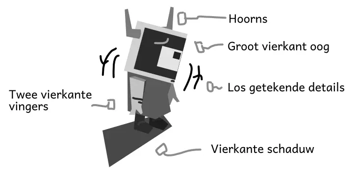
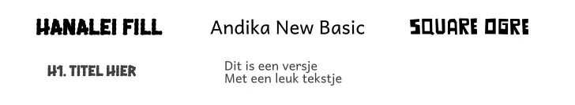
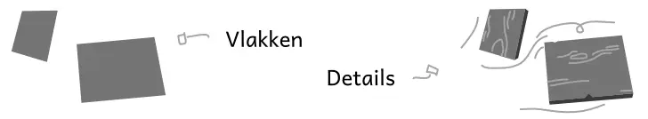
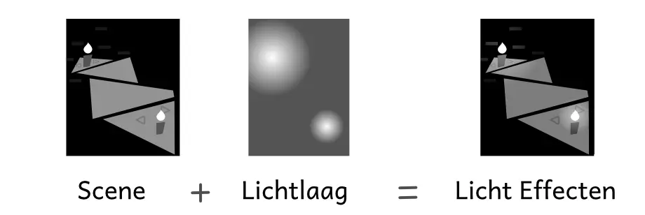
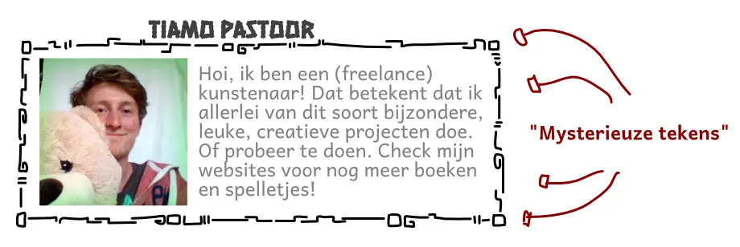
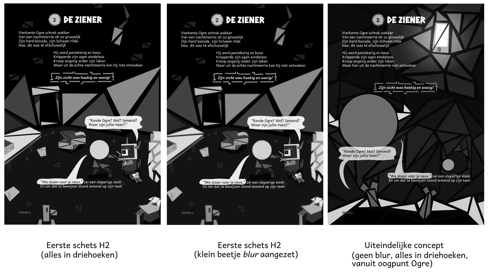

Welkom bij mijn "visuele devlog" voor [Vierkante Ogre][1]!

Hier leg ik – in het kort – uit hoe ik dit prentenboek heb _geschreven_ en _getekend_. Hopelijk is het interessant en leerzaam om te lezen!

(Natuurlijk ga ik hierbij enkele _spoilers_ geven, want ik moet uitleggen hoe ik het boek van begin tot eind heb gemaakt. Dus als je niet wilt weten hoe het eindigt of hoe het boek verloopt, stel ik voor dat je eerst het boek leest.)

## Stap 1: het algemene idee

Dit is een _interactief prentenboek_. Dat betekent dat je, na elk hoofdstuk, een paar puzzels hebt die je moet oplossen voordat je verder mag.

Hieronder een voorbeeld van de eerste puzzel:

(Natuurlijk is dat geen strenge vereiste. Het is niet alsof het boek je fysiek tegenhoudt om de pagina om te slaan als je de puzzel niet oplost :p)

Die puzzels heb ik eerst gemaakt. Ik moest immers weten of ze werkten, of ze leuk waren, wat de beste (en meest simpele) volgorde was voor alle nieuwe regels, enzovoort.

Zodoende had ik al een **strak overzicht van hoofdstukken** voordat ik ook maar een woord had geschreven. (Nouja, de proloog had ik al geschreven vóór ik de rest ontwikkelde, maar daarin komen dan ook geen puzzels voor.)

Het zouden **16 hoofdstukken** worden, waarbij elk hoofdstuk je een nieuw speciaal vakje geeft om de puzzels weer nét iets moeilijker te maken.

Aan het begin van het boek heeft onze hoofdpersoon (Vierkante Ogre) slechte ogen en moet hij de uitgang van zijn grot vinden. Aan het einde van het boek – spoiler alert – is zijn zicht hersteld en heeft hij de uitgang gevonden.

Dat is dus het algemene idee. We hebben een Ogre, die probeert uit een grot te komen en ondertussen uit te vinden wat die "vloek" inhoudt waardoor alle Ogres slechte ogen krijgen (wanneer ze volwassen worden).

## Stap 2: de visuele identiteit

Mijn redenering hierboven legt een aantal dingen vast:

  * Alle plaatjes zullen _ondergronds_ in een _grot_ zijn
  * Het boek is grotendeels _zwarte achtergrond_ met _witte tekst_. (Enerzijds omdat dit rustiger is voor je ogen, wat thematisch goed past, anderzijds omdat het ondergronds nou eenmaal donker is.)
  * Om toch genoeg licht te krijgen, zal ik in elk plaatje een lichtbron moeten stoppen.
  * Het boek zal bijna volledig zwart-wit worden. Met alles erop en eraan kan het boek zomaar 100 pagina’s worden, en dan is het simpelweg niet commercieel haalbaar om alles in kleur te doen. Ik ben van plan om slechts het _einde_ ( = de laatste paar pagina’s) in kleur te doen.

Deze restricties zijn niet vervelend. In tegendeel! Als je creatief werk doet, dan _hou_ je van restricties, want ze dwingen je om creatief te zijn én het simpel te houden.

### Meer restricties

Daarom ga ik zelf nog een aantal restricties toevoegen. Sommige zijn beargumenteerd, andere zijn simpelweg voor een consistente "visuele identiteit".

Dadelijk zal ik in detail uitleggen wat ik met elk punt bedoel, dit is een opsomming:

  * De hoofdpersoon is één groot vierkant oog. Dit past thematisch, maar is ook nodig om de puzzels simpel en duidelijk te maken.
  * De schaduw van de hoofdpersoon is altijd een scherp vierkant. (Waar andere schaduwen zachter, natuurlijker en waziger zijn.) Dit past wederom bij de titel en het verhaal, maar zorgt ook dat hij er "uitspringt" op een pagina.
  * Vanaf het moment dat Ogre "slechte ogen" krijgt, worden alle tekeningen "wazig". Naarmate hij langzaam weer verbeterd, zullen ook de prenten verbeteren.
  * Alles wordt _vlak_. Maar, daarbovenop teken ik details met losse penceelstreken.
  * Deze details worden vooral gebruikt om _textuur_ te geven aan steen, hout, de vloer, de muur, de ruwe huid van de Ogres, etc. (Een houten plank is bijvoorbeeld niets meer dan een rechthoek. Maar als ik er lijnen en groeven op teken, wordt het ineens hout, zelfs in zwart-wit.)
  * Zoveel mogelijk "spreads": dat zijn twee pagina’s naast elkaar die _samen_ een groot plaatje vormen. Ziet er mooier uit dan als elke pagina iets _anders_ doet. Bovendien kan je daarmee écht grote dingen tekenen, want je hebt ongelofelijk veel ruimte.

### Wat is een Ogre?

Dit boek gaat over Ogres, dus leek het me belangrijk om uit te vinden hoe je die tekent.

**Hoe zien Ogres eruit?** Ze hebben een groot hoekig hoofd, hoorns aan beide kanten, en hun handen zijn twee dikke vierkante vingers. Hun kleding doet er verder weinig toe, hoewel het vaak rafelig is.

**Waarom?** Geen idee. Ik probeerde enkele dingen en dit zag er het beste uit, voor dit specifieke boek.

### Lettertypes

Dit project gebruikt drie lettertypes. Dat raad ik meestal aan: eentje voor koppen, eentje voor tekst, en (optioneel) eentje voor speciale gelegenheden.

  * **Hanelei Fill:** voor alle koppen en grote teksten. Waarom? Het ziet er een beetje _grungy_ uit, alsof het gekerfd op een rotsmuur niet zou misstaan.
  * **Andika New Basic:** voor alle andere tekst. Waarom? Het is goed en duidelijk leesbaar op alle groottes en past goed bij het lettertype hierboven. Bovendien is het toch ietsje _anders_ dan de meeste lettertypes.
  * **Square Ogre:** een zelfgemaakt lettertype. Deze gebruik ik op de voorkant van het boek en als ik tekst _in_ het plaatje moet hebben. (Dus niet tekst uit het verhaal zelf, maar bijvoorbeeld een boodschap die in de rotswand is gespijkerd, of een geluidseffect.)

Ik hou van zelf lettertypes maken. (Ik doe het eigenlijk te weinig.) Niet geheel onverwacht heb ik "Square Ogre" ontworpen als een _hoekig_ lettertype dat heel veel _vierkante vormen_ gebruikt.

### De Tekenstijl

De tekenstijl is dus: alles is een vlakke vorm, maar bovenop teken ik details met een (digitaal) penseel.

Wat bedoel ik daarmee?

Nou, alles in het plaatje is een nette vorm die _helemaal_ dezelfde kleur heeft. Bijvoorbeeld: een vierkant die helemaal precies wit is. Hiermee kan je een duidelijke grondlaag leggen, met rechte muren, deuren, tafels, rotsen, etcetera

Maar het is ook een beetje "saai" en "steriel". (Dit is immers een techniek die je volledig met de _computer_ doet. Ik voer letterlijk met de muis _punten_ in die het vlak vormen, en ta da, de computer kleurt het in.)

Daarom teken ik er met de hand nog overheen. Dit geeft de plaatjes meer variatie, levendigheid en textuur, zonder dat het druk of onoverzichtelijk wordt.

### Hoe maak je lampen/lichteffecten?

Het duurde even voordat ik de beste methode vond, maar dit is de winnaar geworden:

  * Maak een nieuwe laag in je tekenprogramma
  * Zet de "blend mode" van deze laag naar "Soft Light". (Elk programma zou dit moeten hebben, op een makkelijk te bereiken plek.)
  * Gooi vervolgens een groot vierkant in een semi-donkergrijze kleur in deze laag. Dit maakt de _hele scene_ nét een klein beetje donkerder. Waarom? Zodat de lichten er dadelijk mooi uitspringen.
  * Voor elk licht: teken een cirkel en vul deze met een _gradiënt_ van puur wit naar transparant. Plaats deze cirkel vervolgens simpelweg over de lichtbron in de scene, en stop hem in deze laag.

Ta da!

### Visuele decoraties

Een groot deel van de "decoratie", in elk visueel medium, komt in de vorm van kleine details en textuur. Zo heeft de _grond_ in dit prentenboek vaak allerlei getekende driehoekjes of rondjes, om een soort steentjes aan te geven. Dit is interessanter dan gewoon een vlakke kleur gebruiken en klaar is kees. (Op dezelfde manier hebben _muren_ vaak uitstekende stenen, wat simpelweg vierkanten zijn in verschillende afmetingen en kleurvariaties.)

Maar de belangrijkste "decoratie" komt in de vorm van de "mysterieuze tekens".

Deze tekens bevatten een geheime boodschap (over o.a. de waarheid van de vloek), die je aan het eind van het prentenboek _eindelijk_ leert. Ik gebruik precies dezelfde vormen (maar dan in allerlei variaties en draaiingen) om _titels_ te versieren, om details aan te brengen op muren/ramen/deuren, en nog veel meer.

Dit heb ik _niet_ in deze volgorde bedacht :p

Het begon met de decoratie. Ik zag dat het mooi was om deze vormen rondom elementen te tekenen, dus dat bleef ik doen. Pas richting het einde besefte ik dat ze óók de functie van die mysterieuze tekens konden vervullen. Een paar dagen extra werk later had het boek ineens een extra (visuele) diepgaande laag!

### Hoe beeld je "slecht zicht" uit?

Hier heb ik veruit het meeste mee gestoeid.

De "ontwikkeling" in dit prentenboek gaat vooral over de Ogre die probeert zijn zicht/ogen te verbeteren. Om dat extra neer te zetten, wilde ik ook de _plaatjes_ in het boek zelf eerst "wazig" maken en daarna steeds scherper.

Nou, dat werkt natuurlijk niet. Als ik een plaatje teken en er dan een _blur filter_ overheen gooi, dan, tja, ziet het eruit alsof ik gewoon niet heb begrepen hoe je iets moet tekenen.

De tweede optie was om langzaam meer "hoeken" toe te voegen. Dus wanneer Ogre’s zicht op z’n slechtst is, ziet hij alles in _driehoeken_. Als het ietsje beter wordt, dan worden het _vierhoeken_, enzovoort, totdat hij weer alles kan zien zoals het is.

Dit was ... prima, maar haast onmogelijk om consistent toe te passen. Het belangrijkste is dat de _puzzels_ duidelijk zijn en het _verhaal_ te volgen is. Als elk plaatje alleen driehoeken mag zijn, zijn mijn opties té gelimiteerd om dit te bereiken. (Bovendien wordt het erg monotoon.)

Dus ik koos een derde optie: het _eerste_ plaatje van elk hoofdstuk is als het ware "vanuit het oogpunt van de Ogre" en bevat wazigheid, in meer of mindere mate. De rest wordt gewoon realistisch en volledig getekend.

Ik ben nog steeds niet 100% gelukkig hiermee, maar het is veruit de beste keuze die ik had kunnen maken. Nu heeft het prentenboek heel veel prachtige plaatjes die _niet_ mogelijk waren geweest met de andere opties.

## Stap 3: het script

Hoewel elk puzzelelement wordt uitgelegd _de eerste keer dat je het moet gebruiken_, vond ik dat niet genoeg. Ik weet uit ervaring dat je het beste informatie op alle mogelijke manieren kunt vertellen/benadrukken als je wil dat iedereen het begrijpt.

Dus elk hoofdstuk heeft eigenlijk het volgende patroon:

  * Ogre komt op een nieuwe plek
  * Daar ontmoet hij een nieuw persoon. Of hij heeft een nieuw obstakel.
  * De manier om het _op te lossen_ is precies het nieuwe puzzelelement!
  * Ogre ontdekt dit, begrijpt het, en gaat verder.

Bijvoorbeeld: je hebt een grote lege ruimte waar Ogre niet overheen kan lopen of springen. Maar wacht eens, staat daar nou een trampoline? Eens kijken wat die doet!

Twee pagina’s later is Ogre aan de overkant en weet je al (ongeveer) wat trampolines doen in de puzzel.

### Hoe lang duurt zo’n script?

Als je zo’n duidelijke structuur al vast hebt liggen, is zo’n script vrij snel gedaan. Ik weet niet of ik hier trots op ben, of dat het juist dom is, maar het hele script is in één dag geschreven. (De hele maand hiervoor heb ik het puzzelspel gemaakt en uitgewerkt, dus ik had er ook al lang over na kunnen denken.)

Terwijl ik het boek afmaak, zullen er zeker nog verbeteringen komen. Pas als je een plaatje hebt, of de tekst op de pagina zet, merk je of zinnen te lang zijn of niet lekker lopen. Ook gebruik ik soms wel héél lastige zinnen voor een prentenboek (voor kinderen).

> Dit is Tiamo uit de toekomst: ja, ik heb in elk hoofdstuk wel één of twee zinnen achteraf nog veranderd! Soms dan lees je oud werk terug en denk je "hmm, waarom dacht ik toentertijd dat dit wél rijmde?" Dáárom altijd minstens meerdere versies doen!

Hier is eigenlijk verder weinig over te zeggen.

Ik schrijf ongelofelijk veel, dus dit is voor mij het makkelijkste deel van zo’n project. Als je al miljoenen woorden hebt getypt, gaat je hoofd haast automatisch zinnen formuleren en een verhaal opstellen.

(Als iemand met mij meeleest, kan ik ook nooit uitleggen _waarom_ ik bepaalde keuzes maak of waar zinnen vandaan komen. Maar meestal komt het allemaal precies uit.)

### Waar moet je op letten?

Maar ik kan wel achteraf een paar dingen aanstippen:

  * Ik **verdeel het script in hoofdstukken en vervolgens in pagina’s.** 
      * Online zegt iedereen heel streng dat je dit _niet_ moet doen. Maar ik doe lekker wat ik zelf wil :p
      * Nee, dat advies is bedoeld voor mensen die _alleen_ de tekst schrijven en niet tevens zelf de plaatjes ontwikkelen en het hele boek uitgeven. In dat geval wil je inderdaad focussen op een perfect manuscript, en dan mag de illustrator uitzoeken hoe hij dat in hemelsnaam vormgeeft.
  * Terwijl ik de tekst typ, **schrijf** ik daarboven **alvast ideeën voor het plaatje**. (Niet vergeten om A te laten zien, misschien leuk als er meer actie in zit, etc.)
  * Ik probeer **geen enkel hoofdstuk langer dan 3-4 pagina’s** te laten zijn, met uitzondering van het eerste en laatste. Als dat wel gebeurt, is de kans groot dat je te langzaam gaat, te lang stilstaat bij één plek/onderwerp, of dingen te ingewikkeld maakt.
  * Ik schrijf het op rijm. **4-regelige verzen met korte zinnen van ongeveer dezelfde lengte.** Maar dit is geen harde regel: soms rijmt het nét niet, soms ga ik even voor de alliteratie, soms zijn het maar twee zinnen. 
      * In dit boek wordt nog redelijk veel met elkaar gesproken. In dat geval gebruik ik vaak tekstballonnetjes in het plaatje die laten zien _wie_ spreekt (en de dialoog er echt uit laten springen)
      * Maar dat hoeft niet. In mijn volgende prentenboek doe ik dat waarschijnlijk niet meer, want anders ga ik te veel "leunen" op dialoog.
      * _Waarom schrijf je het op rijm?_ Restricties!
  * Bij schrijven wil je eigenlijk altijd de **eerste versie** zo snel mogelijk maken. Niet twijfelen, niet wachten, gewoon doen. Dan heb daarná namelijk _alle tijd_ om een tweede versie te maken, en een derde versie, en alle kleine foutjes te verbeteren.

### Wat ik _probeer_ te doen

Ik wil verhalen een diepere laag en een praktisch nut geven. Kinderen zijn niet achterlijk. Ik verwacht veel van hen, en zij mogen daarom ook veel van mijn boeken verwachten.

Een prentenboek structureer ik daarom als een volwaardig verhaal:

  * Het eerste hoofdstuk is _beschrijving van het alledaagse_. Hoe ziet het leven van Vierkante Ogre eruit? Wie zijn de Ogres? Is er iets waar hij (niets) om geeft?
  * Het tweede hoofdstuk is de _verstoring van het alledaagse_. In dit geval: zijn zicht is ineens dramatisch verslechterd!
  * Daarna gaat hij proberen dit probleem op te lossen. Op ongeveer de helft/tweederde bereikt hij een dieptepunt: alles klopt niet, hij weet het niet, het is zo mysterieus allemaal, het einde is niet in zicht.
  * Maar dan komt er een belangrijke realisatie. Een goed moment voor het karakter.
  * En we gaan naar het einde, waarin het algemene thema wordt bevestigd en het loopt goed af. (Ook vind ik het leuk om _altijd_ een paar dingen open te laten zodat kinderen verder kunnen fantaseren over hoe het verder ging.)

In dit boek wilde ik het belang aanstippen van "_zorgen voor je ogen"_. Zit niet te veel achter een scherm en niet te veel binnen. Geef je ogen afwisseling.

Tijdens het verhaal ga ik dus allerlei verschillende _perspectieven_ af en laat ik verschillende kanten zien. (Zo is er iemand die probeert de uitgang te vinden door stil te zitten en heel lang in alle richtingen te kijken. En er is een stad waar ze brillen hebben ontwikkeld.)

Ook laat ik Ogre hierover twijfelen en experimenteren: dit zet (hopelijk) de kinderen aan om ook zelf hierover na te denken.

Ik wil niks voorkauwen. Het mag er in de conclusie best "een _beetje_ dik op liggen", maar niet meer dan dat. Anders is het een slecht verhaal, dat niks speciaals doet of vertelt, en dat ook niet zal blijven hangen bij de lezers. (Dan had je net zo goed op een A4-tje kunnen opschrijven: "DIT IS DE BOODSCHAP! DIT IS WAT JE MOET LEREN!")

Het grootste deel van het werk, echter, wordt geleverd door de _puzzels_. Daarom ben ik zo enthousiast over het idee van "interactieve prentenboeken": dingen _doen_ is duizendmaal beter voor een leerproces dan erover _lezen_ of _horen_.

Het was erg lastig, maar ik _denk_ een reeks puzzels te hebben gevonden die op een natuurlijke manier deze boodschap uitleggen. (Maar daar gaat deze devlog niet over, die gaat alleen over het _schrijven_ en _tekenen_ van het boek.)

### Binnengrapjes

Ja, binnengrapje is een slechte vertaling van _inside joke_.

Maar dat illustreert juist mijn punt. Als ik zoiets maak, dan wil ik het echt _uniek_ maken. Iets waar je langer naar kan kijken en steeds weer een nieuw detail, of een nieuw grapje, kan ontdekken.

Het heeft geen zin om plaatjes te maken die _precies_ hetzelfde vertellen als de tekst (of andersom). Als ik al twee keer de binnenkant van iemands kamertje heb getekend, of de lange gang waarin de Ogre loopt, wil ik ook iets anders maken.

Dus dan bedenk ik grapjes. Details die ik ergens in een hoekje kan tekenen, een raar perspectief, een bijzondere lichtval. Misschien kan ik de Ogre tekenen vlak vóór of ná de gebeurtenis in de tekst. Misschien kan ik stiekem een personage eens in de zoveel tijd laten terugkomen, als een soort "waar is Wally?"

Niet al die grapjes lukken. Soms ziet het er niet uit. Soms haal ik ze weer weg omdat ze in de weg zitten van het échte verhaal. Soms gaan ze aan iedereen voorbij.

Maar ik vind het leuk om dit te doen. En ik heb het gevoel dat dit mijn werk echt _anders_ en _uniek_ en _persoonlijk_ maakt.

En de grootste grap in dit boek is natuurlijk ... de enorme hoeveelheid spreekwoorden en woordspelingen over _ogen_ en _zicht_ :p

(En voor de mensen die het boek hebben gelezen ... Zoals men weet: in het land der blinden is Eenoog koning.)

## Stap 4: de afwerking

Oké, inmiddels is het algemene concept ontwikkeld, het script geschreven (eerste versie), en de visuele identiteit bepaald.

Rest mij "slechts" om alle tekeningen te maken, de tekst eroverheen te plaatsen, en het allemaal tot één prachtig geheel te vormen.

Wederom ben ik een snelle werker. Dit zeg ik niet uit arrogantie: dit is gewoon een _keuze_ die niet perse goed of slecht is.

Voor dit boek vond ik de _puzzels_ het belangrijkste. Het **interactieve** deel van het boek, dát is zo bijzonder en dáár heb ik al mijn tijd in gestoken.

Dus de tekeningen mochten wat simpeler. Ik heb één hoofdstuk per dag getekend, soms twee (als het een kort hoofdstuk was). In het weekend werkte ik aan een ander hobbyproject.

Meestal maakte ik de avond van tevoren, voor het slapengaan, een paar _schetsen_ van de volgende pagina’s op mijn notitieblok. (Met de hand dus, niet op de computer.)

Op de computer zette ik alvast alles klaar door een nieuw document te maken met de juiste instellingen/achtergrond/lettertypes.

Zodoende kon ik opstaan en meteen, in een paar uur, lekker alles invullen en afwerken. In vrijwel elk hoofdstuk heb ik tijdens het tekenen nog woorden weggehaald of veranderd. Ook gebruikte ik meestal maar 75% van mijn schets.

Meestal kom je pas achter de grootste _problemen_ (en de beste _oplossingen_) als je het gewoon _doet_. Het heeft geen zin om van tevoren hele plannen te maken, dingen uit te denken, te twijfelen over de uitkomst – praktische ervaring wint het altijd.

### De grootste problemen (en dus leerpunten)

Dit waren mijn grootste leerpunten tijdens dit project:

**Margins & Spreads:** Door mijn vorige prentenboeken weet ik nu exact hoe pagina’s eruit komen te zien in een fysiek, gebonden boek. Hierdoor heb ik van tevoren overal de juiste _margins_ ingesteld, zodat alles goed leesbaar blijft. (Om exact te zijn: 19.1 mm links en rechts, 12.7 mm boven en onder. Dit was een harde limiet: geen enkele tekst is in de margin terechtgekomen.) Bovendien heb ik direct alles opgedeeld in die _spreads_, zodat ik wist welk plaatje naast welk plaatje kwam.

**Contrast en Schaduw:** Omdat ik alles in zwart-wit moest doen, heb ik veel geleerd over contrast. Waar een lichtoranje en lichtblauw voorwerp bijvoorbeeld héél contrasterend zouden zijn in kleur, worden ze in grijstinten bijna onherkenbaar. Ik heb het idee dat ik na de 40 plaatjes van dit boek een véél beter idee heb van contrast en kleuren.

Bovendien moest ik een beetje spelen met schaduwen. Als de achtergrond al bijna donkerzwart is, dan vallen zwarte schaduwen nogal weg. Uiteindelijk besloot ik om schaduwen juist iets _lichter_ te maken, of om ze vooral op _lichte ondergronden_ te laten vallen.

**Licht:** daarop doorgaand, merkte ik al snel dat het invoegen van die _lichteffecten_ op elke pagina heel veel goedmaakte. Een pagina die eerst een beetje saai en plat was, kon met één goed geplaatste lamp (en wat schaduwen/highlights) ineens heel veel dimensie krijgen. Iets om te onthouden voor volgende prentenboeken: gooi zoveel mogelijk interessante lichtbronnen in plaatjes.

**Houd het klein:** Wederom is dit project een beetje uit de hand gelopen. Het heeft ongelofelijk veel inhoud, betekenis, prenten, en tekst gekregen. Dit project was oorspronkelijk bedoeld als een "tussendoortje": even een paar weken tot een maand een schattig interactief verhaaltje maken. Kijken of het überhaupt werkt.

Uiteindelijk werd het mijn grootste prentenboek ooit. Ik ben heel trots op het eindresultaat ... maar ik moet toch leren om het voortaan kleiner te houden.

**Het is donkerder dan je denkt:** Er is een verschil tussen hoe _schermen_ kleuren weergeven en hoe _inkt_ dat doet. Toen ik het eerste hoofdstuk af had, printte ik deze om te kijken hoe het eruitzag. Op het scherm had ik de juiste balans gevonden.

Nou, op papier waren sommige pagina’s _bijna helemaal zwart_. Alle details vielen weg, alleen de Ogre en wat lampen/felle attributen bleven over.

Dus toen heb ik alle plaatjes nét wat "te licht" gemaakt op mijn scherm, wetende dat het op papier precies juist zou zijn.

(Bovendien is papier altijd nét iets groter dan mijn laptopscherm, maar daarvoor compenseer ik inmiddels al. Als ik ooit een nieuwe computer krijg, zal ik enkele gewoontes moeten controleren denk ik :p)

### De tijdlijn

In totaal is dit de tijdlijn:

  * **1 week:** originele idee, uitproberen concept, werkte in eerste instantie totaal niet
  * **1 maand:** versie 2 van het idee werkt wel, puzzels uitgewerkt voor zowel het prentenboek als mijn computerspel. (Ja, ik heb tevens een _computerspel_ gemaakt met nog véél meer puzzels en elementen, maar natuurlijk zonder de plaatjes en het omringende verhaal.)
  * **1 dag:** script geschreven
  * **3 weken:** alle plaatjes afgemaakt en het hele boek samengesteld

En dan komt altijd het stuk waarin je _alles_ moet nalopen, controleren, samenvoegen, écht afmaken. Dit kost altijd véél meer tijd dan je denkt. En je hebt achteraf géén idee waar het allemaal heen is gegaan, want het zijn allemaal kleine aanpassingen, foutverbeteringen, etc. tussen de bedrijven door.

### Het eindresultaat

Het eindresultaat is een prentenboek met **111 pagina’s**, **16 hoofdstukken**, **61 puzzels**. Het boek is geheel zwart-wit, met uitzondering van 7 pagina’s (richting het einde) waar steeds meer kleur in zit).

Ik ben er zeer trots op 🙂

Naarmate ik verder kwam, werd ik steeds sneller in het toepassen van deze visuele identiteit en het vinden van interessante plaatjes. Daardoor heb ik uiteindelijk nog wat tijd verloren met het _opnieuw_ doen van de eerste paar plaatjes en puzzels, omdat ik inmiddels een paar dingen had veranderd. (Bijvoorbeeld, eerst was de uitgang letterlijk en lelijk geschetst ... iets. Dat heb ik pas helemaal aan het einde vervangen door iets wat er beter uitzag _bij alle puzzels_.)

Het hele boek is uiteindelijk getekend in **Affinity Designer**, met de muis. Ja, dat is niet geweldig, maar het was de stijl waarvoor ik had gekozen, dus dan zetten we door :p (In het vervolg hoop ik mijn tekentablet meer te kunnen gebruiken, zelfs bij dit soort stijlen.)

Uiteindelijk heb ik elk hoofdstuk een eigen bestand gegeven en de puzzels in secties opgedeeld (begin-H6, H7-H10, H11-H14, H16-eind). Toen alles eenmaal af was, heb ik het samengevoegd tot één grote PDF. (Deze is uiteindelijk 45.7 MB geworden, om je een idee te geven van de bestandsgrootte van zoiets. En het duurde zeker tien minuten om het te exporteren op mijn krakemikkige laptop.)

## Conclusie

Het devlog is deze keer enigszins kortaf, maar dat komt dus doordat de _puzzelkant_ alle aandacht en tijd vroeg. Bovendien is het lastig om uit te leggen wat ik precies doe en waarom, zeker als het om _tekeningen_ gaat

Misschien werkt het voor prentenboeken beter om mijn scherm op te nemen terwijl ik _teken._ Dan kan ik die daarna op YouTube zetten, misschien versneld afspelen, en dan _zie_ je precies wat ik doe.

Maar ja, op het moment kan mijn zeven jaar oude laptop nog geen simpel filmpje meer openen of editen, dus dat idee zal even moeten wachten :p

(Dit is tevens de reden waarom ik voor elk hoofdstuk een _nieuw document_ moest maken. Meer dan twee of drie getekende pagina’s tegelijk laten zien ... is een behoorlijke opgave voor m’n oude laptoppetje. Je moet het maar zo zien: apparatuur is 90% van de tijd geen reden om iets _niet_ te kunnen doen of uit te stellen!)

Desalniettemin, hopelijk vond je het interessant, tot de volgende devlog,

Tiamo

 [1]: /books/vierkante-ogre