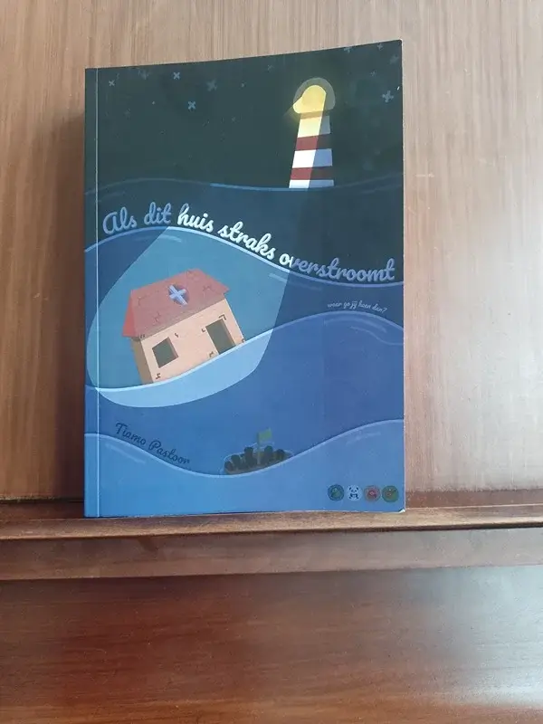
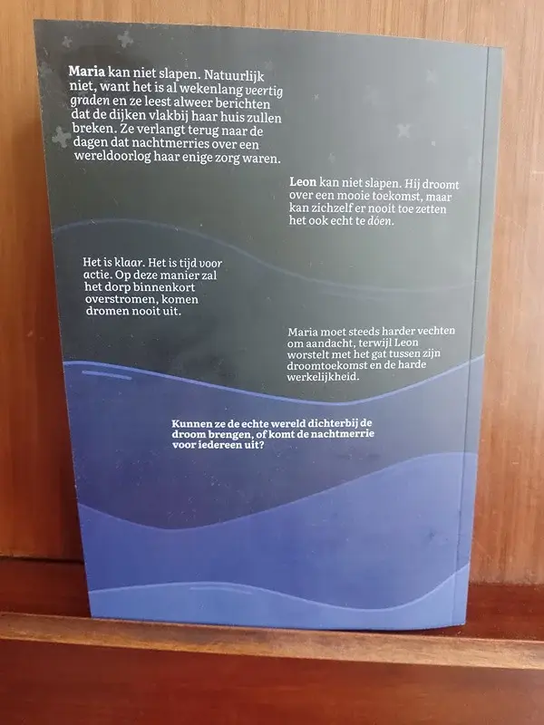
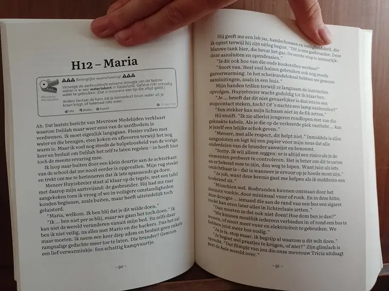
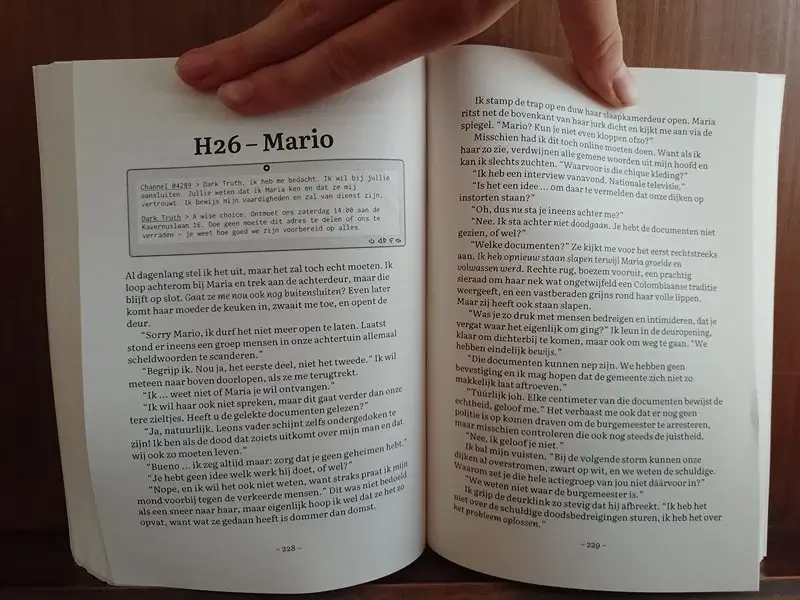

### Waarom dit boek?

Op de verkooppagina is een inkijkexemplaar beschikbaar met de eerste paar hoofdstukken.

Ik begon dit boek uit frustratie over klimaatverandering en het feit dat vrijwel niemand er iets om lijkt te geven, maar wij---jongeren---er wel mooi mee zullen zitten. Als we het al overleven.

Ik schreef het af vanwege de vele grappen, emotionele verhaallijnen en spannende situaties die ik kon vinden met dit grote gevaar altijd op de achtergrond. (En omdat het op het moment van schrijven inderdaad veertig graden is in Nederland en veel meer dan mijn vingers langzaam bewegen over een toetsenbord zit er dan niet in.)

Het is _zéker_ niet bedoeld als een saaie spreekbeurt of een vervelend activistisch boek. Het is vooral een jongerenroman over dromen, angsten, toekomst, leiderschap, en meer, allemaal in een dorpje dat wel erg vlakbij het water ligt. (Het dorpje bestaat niet echt. Ik zeg het er maar bij, want de naam _Midden-Roeringdam_ had bijna iedereen overtuigd dat het een plek was waarvan ze wel eens hadden gehoord.)

### Feedback

Gek genoeg denk ik _niet_ dat ik perfect ben. Als je het boek leest, laat me dan weten wat je ervan vond!

Het boek doet veel nieuwe dingen: 

* Hoofdstukken beginnen met plaatjes (die daadwerkelijk belangrijk zijn en veel inhoud hebben).
* Praten tegen de lezer.
* Een grootser verhaal dan de gemiddelde jongerenroman.

Het is de eerste _roman_ die ik officieel afmaak en publiceer. Al mijn werk hiervoor was _non-fictie_ of _prentenboeken_.

Ik weet zeker dat ik het niet allemaal even goed heb uitgewerkt. Geef me feedback, en elk volgend boek wordt beter.

**Waarom is de voorkant van het ebook zwart-wit?** Omdat ik dom ben en niet door had dat het systeem automatisch de zwart-wit foto van de eerste pagina binnenin het boek had gepakt (en mijn kleurenfoto daarmee vervangen). Dus toen heb ik het gepubliceerd met deze voorkant en ik kan het niet meer veranderen. Dit overkomt mij dus altijd de eerste keer dat ik iets nieuws probeer.

### Het boek in het wild!

Bij deze enkele foto's van een fysiek exemplaar. Ja, deze zijn genomen op een piano, want het was een héle warme en zonnige dag en elke andere plek had te veel licht, of lag juist te diep in schaduw. Ironisch eigenlijk.

{}

 
 
 
{}