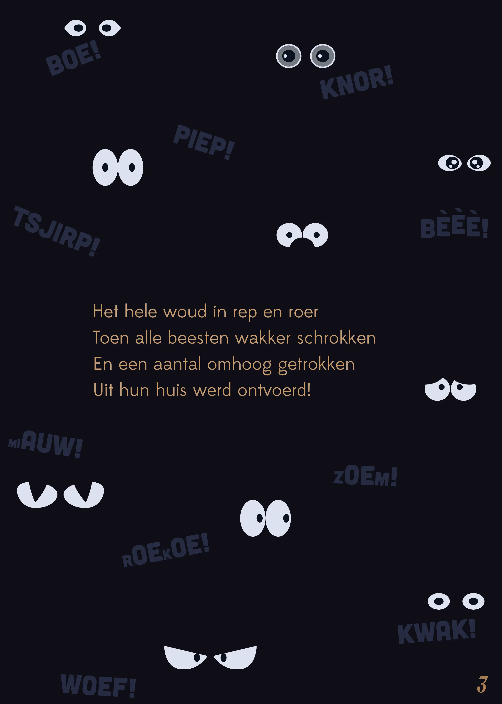
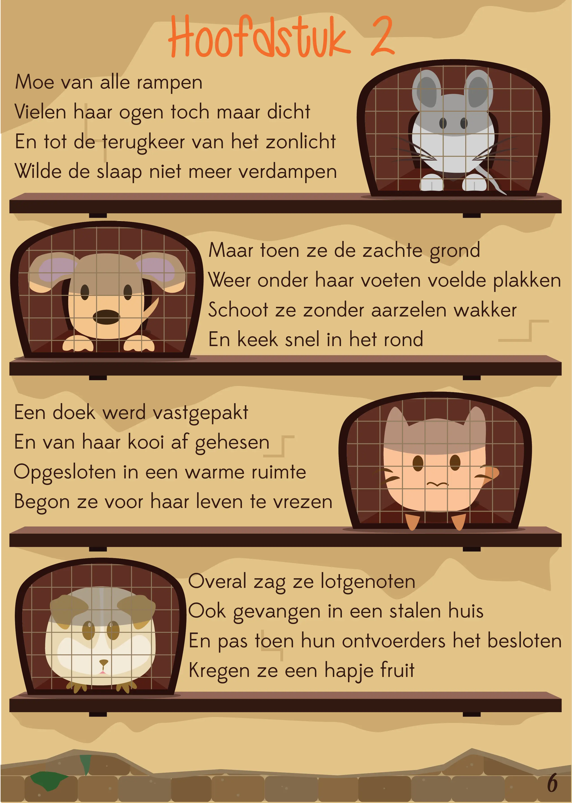
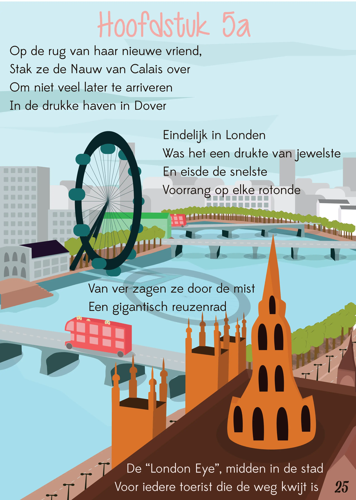
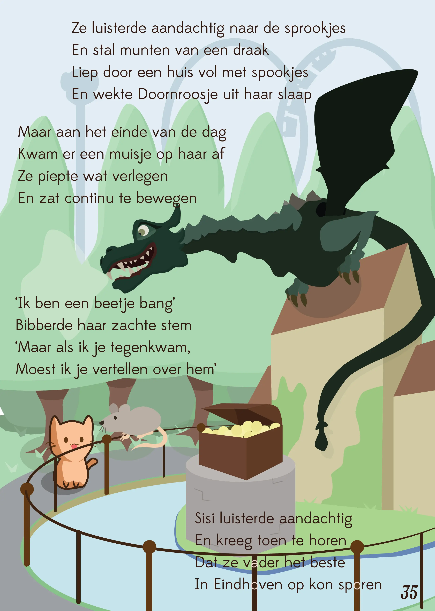
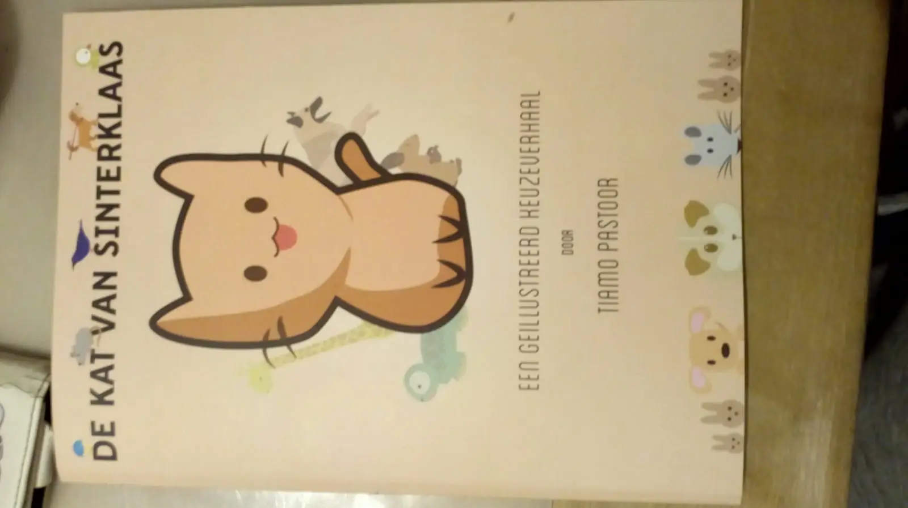
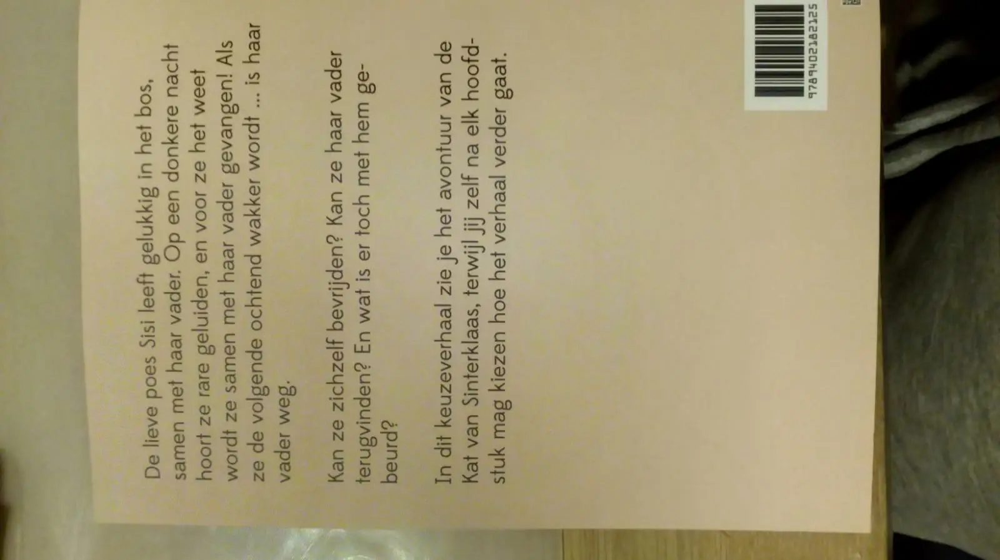
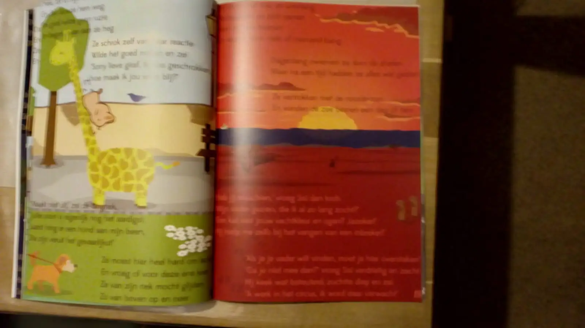
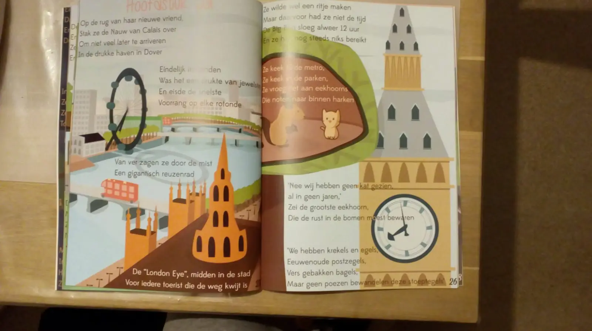

### Waarom dit boek?

Ik heb dit boek oorspronkelijk getekend voor mijn zusje, voor de surprises tijdens Sinterklaas. Ik gebruik die traditie eigenlijk elk jaar om mezelf uit te dagen met een bijzonder, persoonlijk project voor degene wiens lootje ik heb getrokken.

Dit boek werd dermate goed dat iedereen mij aanspoorde om het uit te brengen. Zo werd het mijn eerste prentenboek én mijn eerste boek uitgegeven in eigen beheer.

### Voorbeeldprenten 

Hieronder laat ik vier willekeurig gekozen pagina's zien uit het boek. (Online laat hij namelijk alleen de eerste pagina's zien in het inkijkexemplaar, maar die bevatten vooral uitleg over hoe het keuzeverhaal werkt. Dus dat helpt niemand echt.)

{}
 

{}

### Veelgestelde vragen 

**Wat is een _keuzeverhaal_?** Dat betekent dat de lezer aan het eind van elk hoofdstuk zelf mag kiezen hoe het verhaal verder gaat. (Als je optie A kiest, lees je verder vanaf een andere pagina dan als je optie B kiest.) Op die manier is het boek meerdere keren te lezen.

**Hoe heb je het zelf uitgegeven?** De "zelf-uitgever" die ik gebruik is Brave New Books. Mijn uitgave bij hen was een experiment, en ik moet zeggen dat er zeker voordelen zitten aan zelf uitgeven, maar ook vele nadelen. Mijn complete artikel hierover is hier te lezen: [Brave New Books](/blog/2018/2018-10-14-brave-new-books/)

**Is de (druk)kwaliteit wel goed?** Daarover maakte ik me inderdaad zorgen, maar nadat ik een proefdruk heb besteld en bestudeerd ben ik wel tevreden. De kleuren zien er mooi uit, alles zit goed op zijn plek, het boek voelt goed en professioneel. (Hieronder staan enkele snelle foto's van mijn proefexemplaar in het wild :p)

De enige opmerking die ik heb is dat soms ietwat onnauwkeurig afgesneden wordt. Waarschijnlijk is dat voor lezers niet te merken, maar ik weet bijvoorbeeld bij sommige plaatjes dat ze eigenlijk iets meer ruimte aan de zijkant over hebben die nu ineens is weggesneden. 

Ik heb alles dubbel gecheckt, maar aan mijn aangeleverde manuscript ligt het niet. Dus ik heb het opgelost door zelf extra zorgvuldig zijn met plaatsing van belangrijke tekst en dergelijke.

{}
 

{}