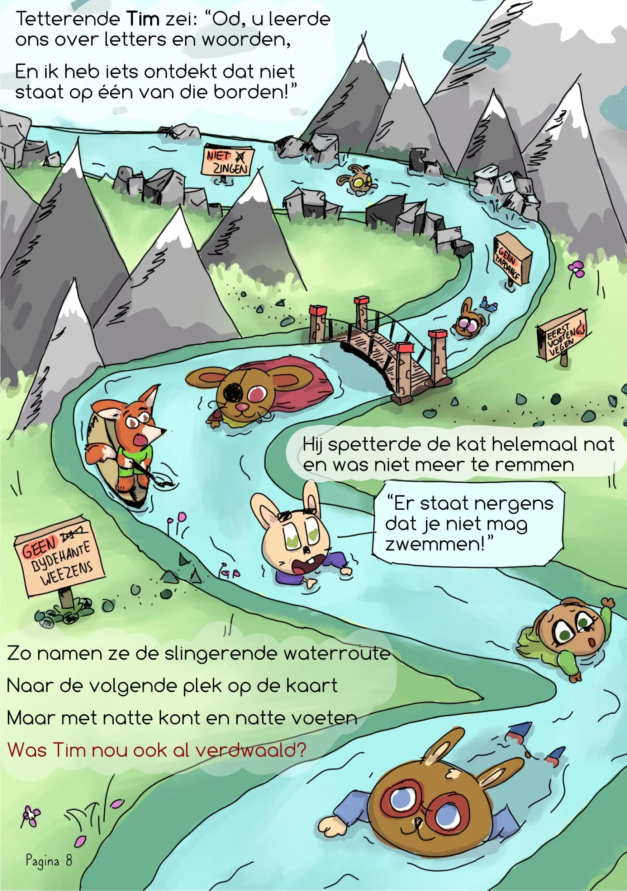
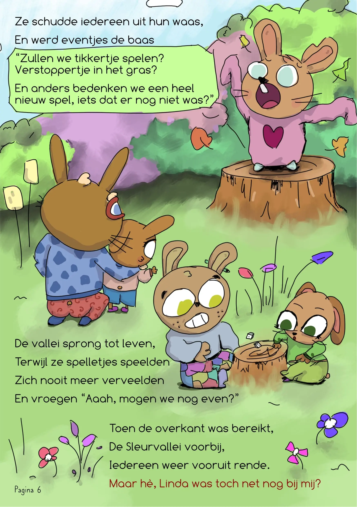
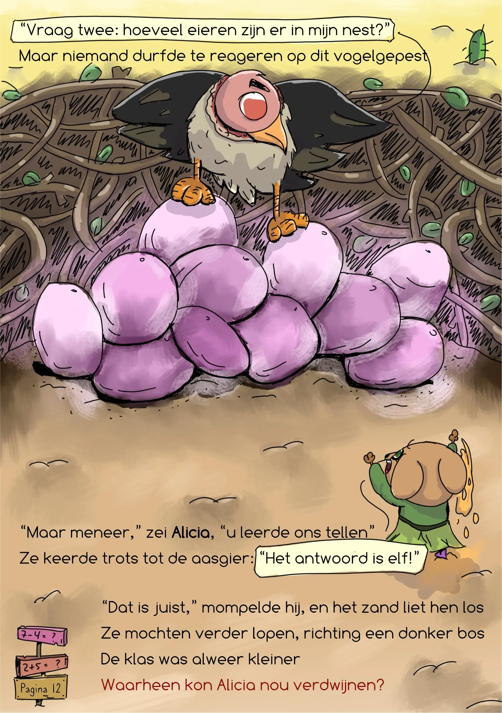
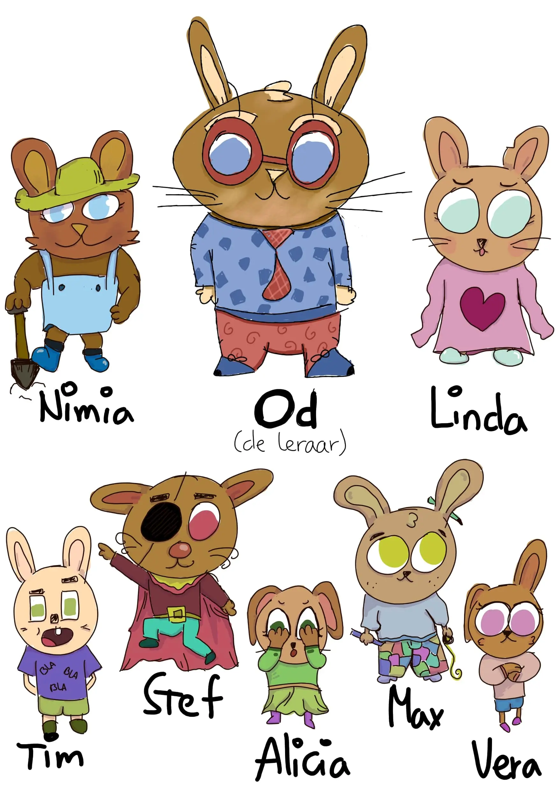
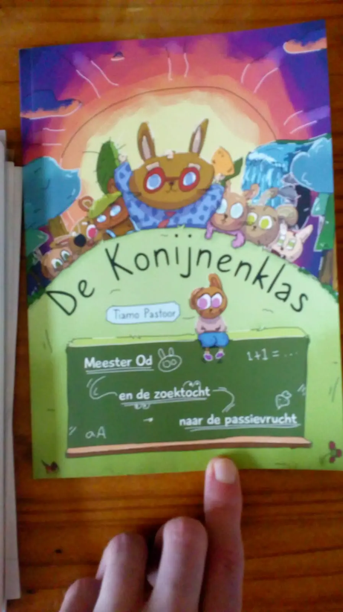
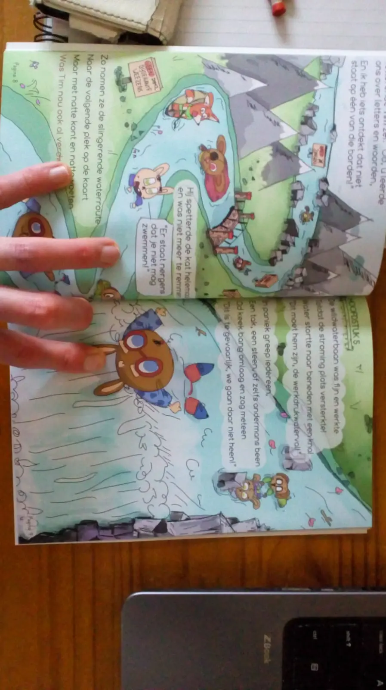
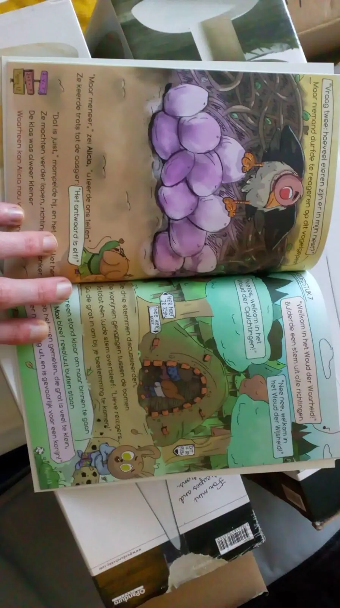

### Wat kan ik verwachten?

**De Konijnenklas** (subtitel: _Meester Od en de zoektocht naar de passievrucht_) is een prentenboek, geschreven en getekend door mij (_Tiamo Pastoor_) en uitgegeven in eigen beheer.

Het verhaal bestaat uit 20 volledige geïllustreerde (full-color) pagina's, met een verhaal op rijm. Ook kent het 18 pagina's bonusinhoud. (Zoals een kaart van de wereld waarin het verhaal zich afspeelt, spelletjes gerelateerd aan het verhaal, maar vooral een grote geheime bonus ...)

### Voorbeeldprenten 

De automatische "inkijkexemplaren" van webwinkels zijn niet echt toereikend voor prentenboeken, omdat ze dan slechts de eerste paar pagina's laten zien, die dikwijls de titel bevatten en verder leeg zijn. Dus hieronder vind je een paar pagina's uit het boek (die zo min mogelijk van het verhaal weggeven).

{}

{}

### Veelgestelde vragen 

**Hoe heb je het zelf uitgegeven?** Ik heb een diepgaand artikel geschreven over dit proces. Die vind je hier: [MijnBesteller (review en ervaringen)](/blog/2021/2021-01-12-mijn-bestseller)

**Hoe heb je dit gemaakt?** Ook hierover heb ik een diepgaand artikel: [Hoe maak je een prentenboek?](/blog/2021/2021-03-13-hoe-maak-je-een-prentenboek)

**Hoe heb je geleerd om prentenboeken te maken?** Door het jarenlang te proberen en te doen. Ik heb geen kunststudie gedaan, ik heb vooral een harde schijf vol verhalen en tekeningen. Zodoende heb ik ook véél geleerd van dit hele proces! Je raadt het nooit: ik heb hier een artikel over geschreven. Zie [Wat ik leerde van het maken van De Konijnenklas](/blog/2021/2021-01-19-wat-ik-leerde-van-mijn-tweede-prentenboek)

**Waarom heb je het zelf uitgegeven?** Ik ben er trots op en kreeg hele goede reacties (onder andere van mijn zus die het voorlas aan haar eigen klas) ... maar de kans is klein dat uitgeverijen het accepteren.

Dit heeft twee redenen.

1. Het is "pas" mijn tweede (afgemaakte) prentenboek. Dus ik heb geen grote bekendheid of connecties om hen te overtuigen. En ja, dat is véél belangrijker dan je denkt. (Mijn eerste prentenboek was [De Kat van Sinterklaas](/books/de-kat-van-sinterklaas))
2. Het is "anders" dan andere boeken op vele manieren. Het heeft een groter verhaal, plaatjes die de hele pagina vullen, en ik probeer het altijd _betekenisvol_ te maken (met een thema, iets om over na te denken, een dubbele laag). Dit komt mede doordat ik meer ervaring heb als _schrijver_ dan als _tekenaar_.

**Mag ik feedback geven?** Graag zelfs! Als je het hebt gelezen, laat me weten wat je vond, negatief of positief. De kans dat een boek wordt gekocht is véél groter als het online recensies heeft en mensen erover praten. Bovendien helpt het mij natuurlijk om te groeien als kunstenaar en mijn volgende boeken nóg beter te maken.

### De Konijnenklas ... in het wild! 

Ik vind het altijd fijn om een paar snelle foto's te geven van het fysieke boekje "in het wild". Hieronder zie je dat het een vrij dun boek is (zeker als hij naast de stapel papieren ligt), maar dat is te verwachten bij een _paperback prentenboek_. Ook zie je dat pagina's behoorlijk vol staan, iets dat ik bespreek in de artikelen hierboven. (En concludeer dat ik de volgende keer grotere pagina's en méér pagina's neem, ondanks de bijkomende kosten voor de koper.)

{}

{}