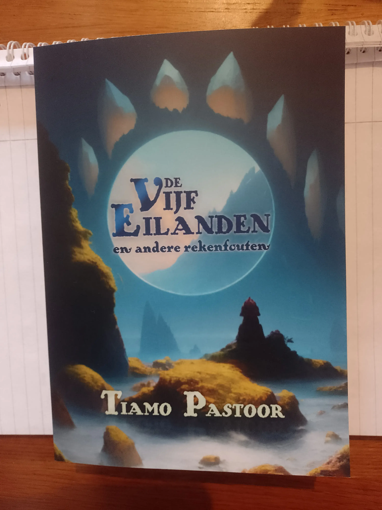
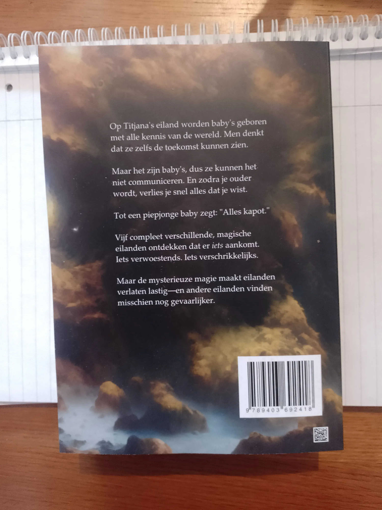
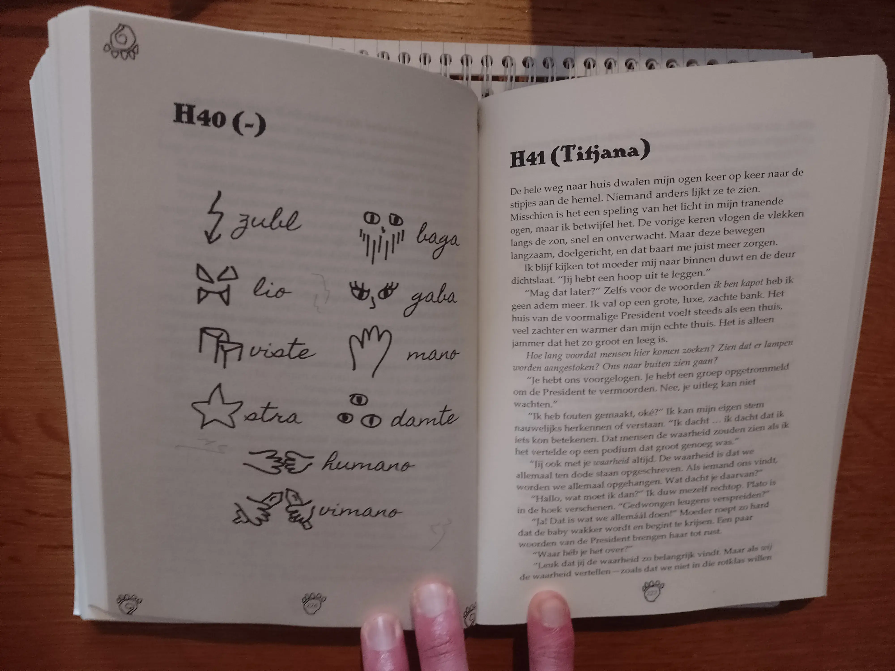
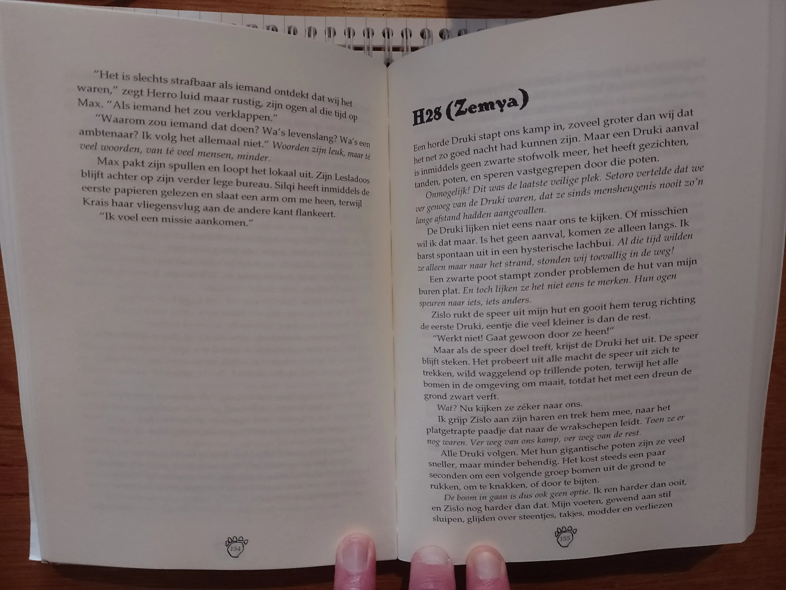

### Waarom dit boek?

Dit boek was origineel geschreven voor een grote schrijfwedstrijd. Je kreeg een jaar de tijd om een volledig manuscript te schrijven binnen het speculatieve genre (fantasy en science-fiction). Toen de wedstrijd werd aangekondigd, schreef ik dit idee op ... en ging terug naar mijn huidige project.

Pas een jaar later, een paar maanden voordat de wedstrijd voorbij was, pakte ik het weer op en besloot definitief mee te doen. Dat was best een grote beslissing, want ik had nog nooit een fantasy boek van volledige lengte afgemaakt!

Het boek behaalde de 11e plaats. Met de feedback van de jury kon ik het boek flink verbeteren en verbeterde ik weer als schrijver. Toen ik het goed genoeg vond, besloot ik het boek in eigen beheer uit te geven.

### In het wild

Hieronder enkele foto's van mijn eigen (proef)exemplaar van het boek. Het boek is in eigen beheer uitgegeven, en ik heb gemerkt dat mensen dan graag "bewijs" zien van hoe het boek eruitziet!

{}

{}