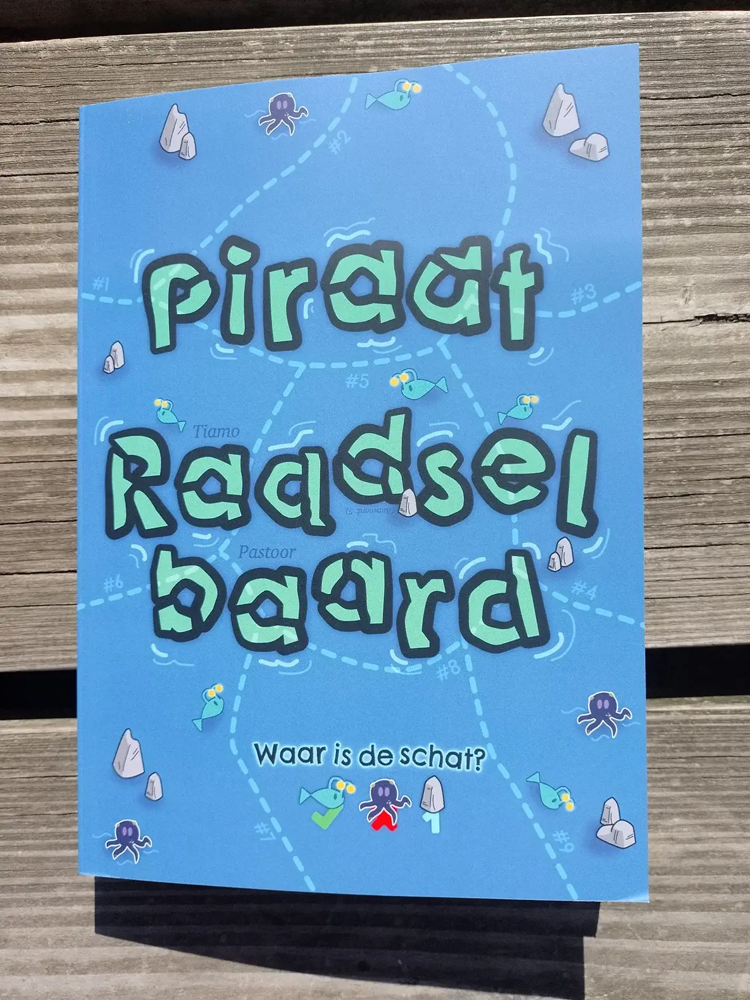
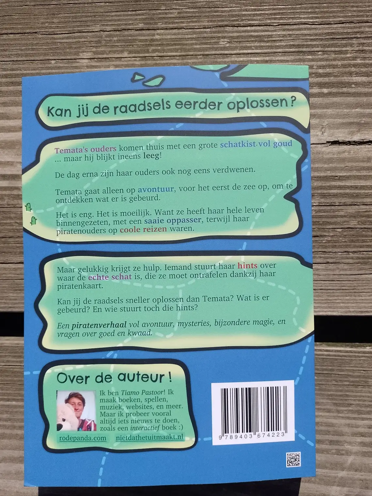
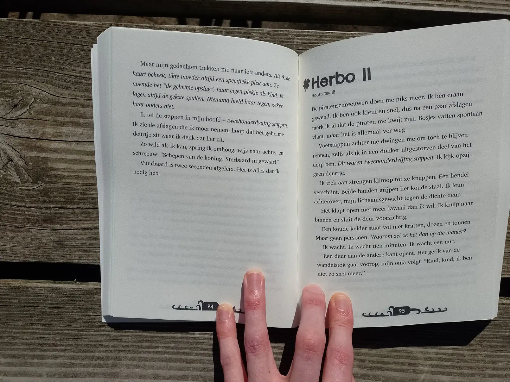
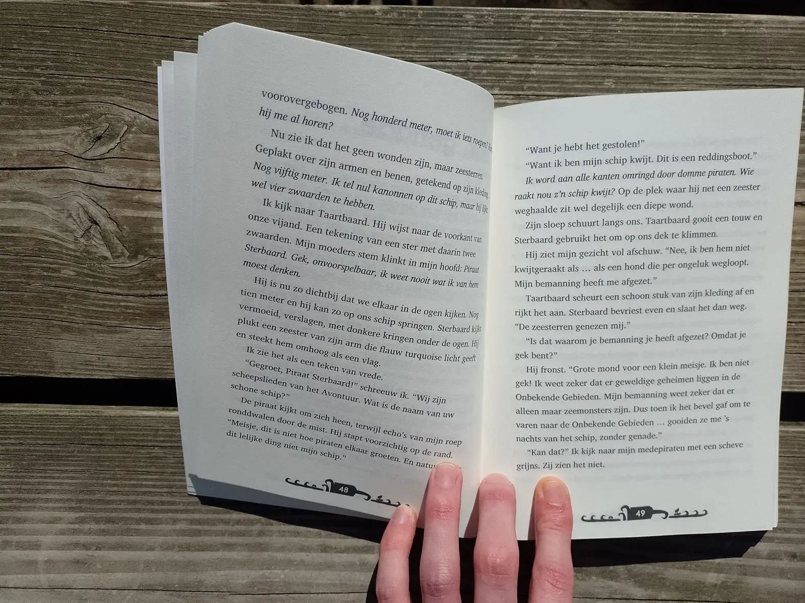

### Interactief? 

Dit boek is een roman. Het vertelt een verhaal van begin tot eind, met unieke personages, spannende scènes, magie en mysteries.

Maar daar _bovenop_ is het interactief. Aan het begin van het boek krijg je een grote kaart van de wereld, opgedeeld in gebieden. 

Gedurende het boek verschijnen hints die sommige gebieden laten afvallen. Sommige zijn makkelijk ("de schat ligt niet in een bosgebied"), andere zijn lastiger of moet je beter naar zoeken.

Als je goed oplet en goed nadenkt, kan je dus zelf de plek van de schat vinden terwijl je leest, voordat de hoofdpersoon erachter komt!

{}
De voorkant van het boek is een voorproefje van hoe zo'n puzzel werkt!
{}

### Wil je de kaarten los downloaden?

Ze zijn [hier](https://drive.google.com/drive/folders/1Oj2Rf24PV0ZjEhm5d4SScvUt7JjUjKMA) gratis te vinden. Deze kaarten zijn volledig in _kleur_! In het boek zijn de kaarten in grijstinten (om de prijs laag te houden).

### Over dit boek 

Dit boek is ontstaan door een bundel _bordspellen_ die ik zelf ontwikkelde ([Pirate Drawingbeard](/blog/2022/2022-07-28-pirate-drawingbeard/)). In die spellen is een schat verstopt op één vakje van de kaart. Iedereen krijgt andere _hints_ over waar de schat wel of niet kan zijn. De persoon die als eerste de hints van de rest kan raden, weet als eerste precies waar de schat is en wint!

Tijdens het maken dacht ik: zou het niet leuk zijn om dit element te verbinden aan een verhaal? Een avontuurlijk boek over piraten en schatzoeken waarbij je daadwerkelijk meespeelt en meedenkt? (Aan de hand van een kaart en hints.)

Voor ik het wist had ik al de eerste paar hoofdstukken, de eerste hints, een deel van de kaart.

Het feit dat elk hoofdstuk iets van een logische hint moest bevatten, hielp hierbij juist enorm. Het gaf richting en maakte het verhaal zelf _beter_. Je wilt constant blijven lezen, want om de paar pagina's gebeurt weer iets belangrijks!

En zo ontstond dit bijzondere boek.

**Wil je meer weten (met véél spoilers)?** Lees het uitgebreide [dagboek](/blog/diaries/dagboek-piraat-raadselbaard/) over het schrijfproces.

**Wil je meer weten over het tekenen van de wereldkaart?** Lees mijn artikel die uitlegt [hoe ik de kaart ontwierp](/blog/2023/2023-05-15-piraat-raadselbaard-mijn-eerste-poging-tot-fantasy-kaarten/). Het was mijn eerste poging tot een wereldkaart bij een boek stoppen.

**Onzeker of het iets is voor je kind?** De meeste winkels hebben de mogelijkheid om de eerste 10-20 pagina's te bekijken. Het verhaal is te lezen (en spelen) vanaf ongeveer acht jaar.

### Muziek 

Mijn hoofd bedenkt constant muziek, zeker als ik schrijf of creatief bezig ben. Dus ook Piraat Raadselbaard heeft een eigen _theme song_ en melodieën die horen bij belangrijke onderdelen (zoals een personage of een plek). 

Ik zie niet helemaal hoe ik de muziek anders kan delen, dus ik heb het maar als conceptalbum op Spotify gezet: [Piraat Raadselbaard (op Spotify)](https://open.spotify.com/album/3gi7DfgDJXM1E2cqZu2aal)

{}
Het staat ook op zo'n beetje alle andere muziekstreamingsdiensten. Zoek op "Piraat Raadselbaard: Soundtrack".
{}

### In het wild 

Hieronder staan plaatjes van een fysiek exemplaar (mijn eigen proefdruk). De pagina's in het boek zijn compleet willekeurig uitgezocht. Als je de kaarten wilt zien, raad ik dus de link bovenaan de pagina aan waar je de kleurenexemplaren kan downloaden.

{}

{}