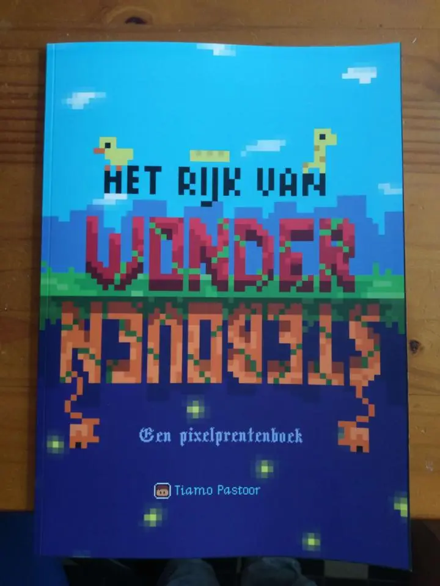
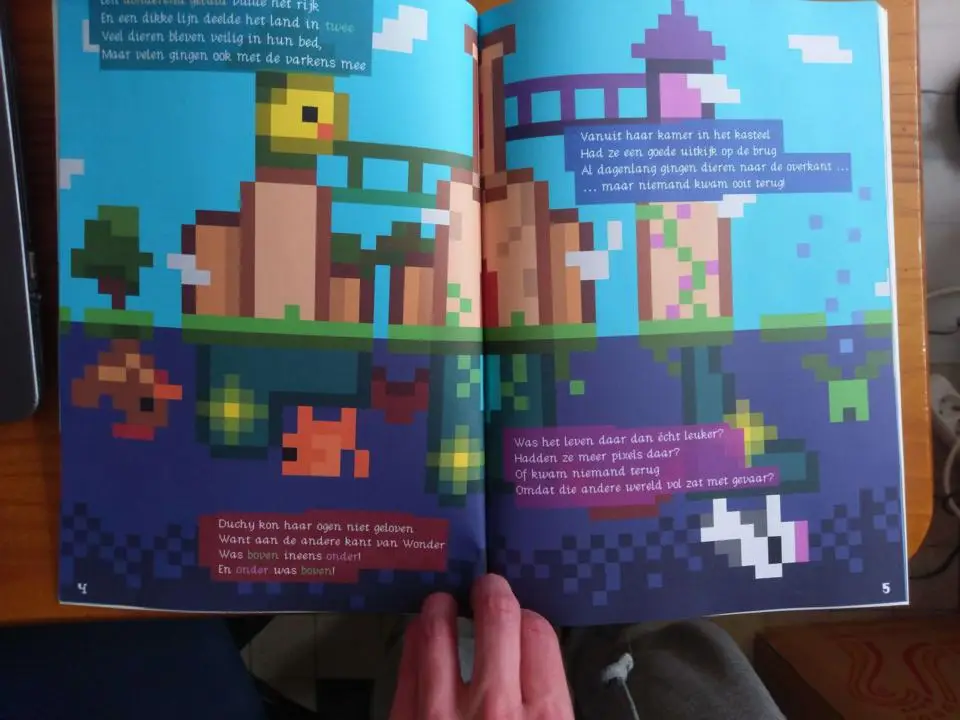
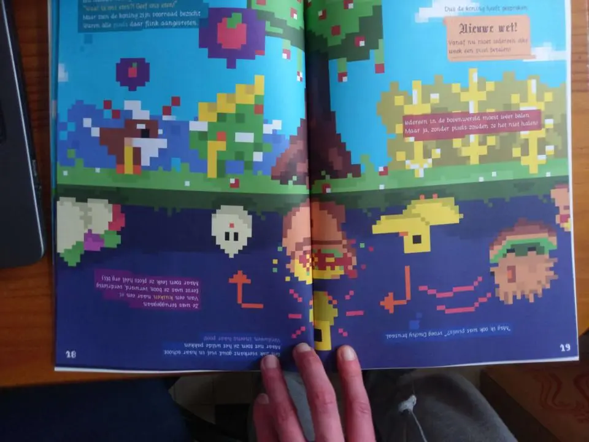
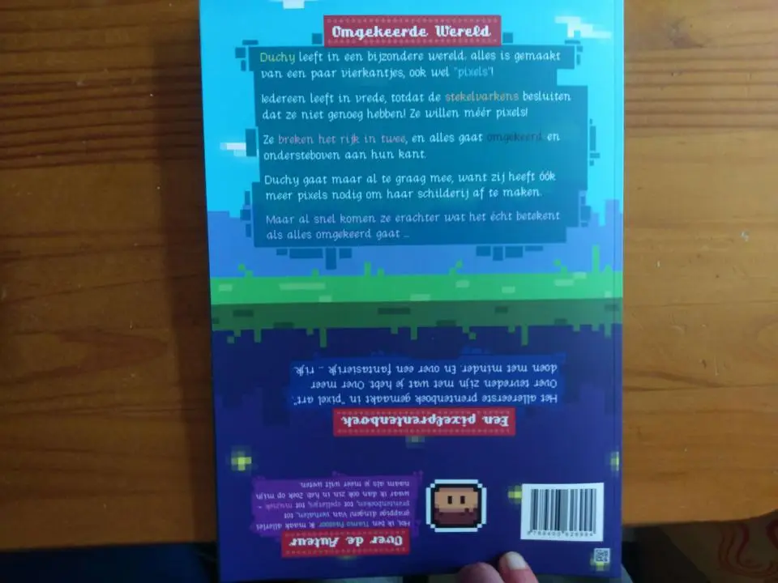

### Pixelprentenboek?

Dit boek heeft 34 full-color A4 pagina's, met daarachter nog 10 pagina's bonusinhoud. Dit is allemaal getekend in de stijl van _pixel art_. Alle tekeningen zijn opgebouwd uit vierkantjes van één kleur.

Toen ik dit maakte, kon ik geen enkel ander prentenboek vinden dat zoiets doet. Dus ik heb het genre "pixelprentenboek" maar uitgevonden en een naam gegeven!

### Bonusmateriaal 

Achterin het boek zit bonusmateriaal om zelf te oefenen met _pixel art_. Is dit niet genoeg ruimte? Of wil je niet in het boek tekenen? [Download dan hier los de bijlages.](https://drive.google.com/drive/folders/1o8Az1iiaPsAHwWglq_v106Z9mS5Foz8m)

Dit prentenboek is eigenlijk geïnspireerd door een **computerspelletje** dat ik maakte. Ironisch genoeg, echter, is het prentenboek afgekomen ... maar liep het spelletje tegen allerlei problemen aan. Daardoor bleek het uiteindelijk _onmogelijk_ om deze af te maken en uit te brengen. Jammer! En mijn excuses daarvoor.

### Voorbeeldplaatjes 

Zoals altijd, hieronder een paar plaatjes van het echte boek, in het wild, gemaakt met mijn mobiel.

{}

{}

_Waarom wazige foto's met een mobiel?_ Nou, prentenboeken zijn kort. Je kunt de eerste 10% online altijd inzien. Als ik daar nog meer voorbeeldplaatjes bij doe, heb je de helft van het boek al. Bovendien zorgt de automatische compressie van webshops dat de plaatjes soms worden vervormd.

Door foto's te maken van het echte boek, weet ik tenminste zeker hoe het er overal uitziet, geef ik niet te veel weg, en heb je een idee van hoe het fysieke product eruitziet.

{}
Ook leuk om te vermelden: de drukker (MijnBestseller) levert bij mij verschrikkelijk snel af. Elke keer krijg ik 's avonds (of zelfs 's nachts) een mailtje dat ze hem hebben gedrukt en afgegeven aan PostNL ... en dan de volgende ochtend ligt hij al in de bus. Blijkbaar staat hun drukkerij in mijn kelder.
{}

### Meer informatie 

Voor zover ik weet, is dit het eerste **pixelprentenboek** ooit gemaakt! (Als dat niet zo is, laat me vooral weten wie de voorgangers waren, want ik kan niks vinden.)

Ik probeer altijd iets unieks te bedenken, of te innoveren, met elk project. Dus het was niet moeilijk om motivatie te vinden voor dit leuke boekje en van alles te proberen.

Uiteindelijk zijn er, zoals verwacht, voordelen en nadelen aan deze stijl. En er zijn veel fouten gemaakt onderweg. Als je de belangrijkste lessen wilt weten, bezoek mijn artikel hierover: [Wat ik leerde van mijn vierde prentenboek](/blog/2021/2021-06-01-wat-ik-leerde-van-mijn-vierde-prentenboek)

Waar ik veruit de **meeste** problemen mee had bij dit boek---en eigenlijk de meeste projecten---waren de marketingtekstjes. Je krijgt op de meeste plekken maximaal 200-255 tekens om je boek _uit te leggen én mensen enthousiast te maken_. 

Dus omdat het misschien interessant is, hieronder de verschillende marketingteksten die ik probeerde:

> Wanneer Wonder in tweeën splitst, door boze dieren die méér "pixels" willen, komt men erachter dat alles aan de onderkant OMGEKEERD gaat! Duchy weet zeker dat ze óók meer pixels nodig heeft ... maar als ze eenmaal aan de andere kant is, komt ze achter de andere gevolgen ... **<- deze was net te lang**

> Oh nee! Het Rijk van Wonder is in tweeën gebroken! En aan de onderkant gaat alles ondersteboven. Duchy gaat naar onderen, want daar hebben ze meer "pixels": vierkantjes die haar hele wereld maken. Maar als ze daar is ... blijkt er meer aan de hand. **<- te vaag, beschrijft eigenlijk maar een ministukje van het boek**

> De dieren zijn ontevreden. Hun wereld bestaat uit "pixels"---en zij hebben er veel te weinig! Dus ze breken het Rijk in twee stukken, waar onderaan alles OMGEKEERD gaat. Nacht is dag. Dingen vallen naar boven. Maar dit heeft onvoorziene gevolgen ... **<- dit werd 'm uiteindelijk**

En op de achterkant van het boek staat wéér iets anders. (Want daar had ik meer ruimte en kon ik dingen kleurtjes en mooie vormen geven. Toen ben ik maar even helemaal losgegaan!)