### Bijlages

Wil je bonusmateriaal? Of wil je niet in het boek knippen? [Download hier los de bijlages.](https://drive.google.com/drive/folders/1RpEI53_OBbuW8OEtW6Sz0741UjYhzTrc)

### Computerspel

Probeer het **gratis** spel [Square Ogre](https://pandaqi.com/square-ogre)! Dit spel werkt op alle apparaten en bevat honderden zeer uitdagende bonuspuzzels. 

Deze puzzels zijn niet exact dezelfde als in het boek. Tevens bevat het spel natuurlijk niet het verhaal of de prenten uit het boek.

### Voorbeeldplaatjes

Hieronder volgen enkele voorbeeldplaatjes uit het boek (waarbij ik probeer om geen _spoilers_ te geven):

{}
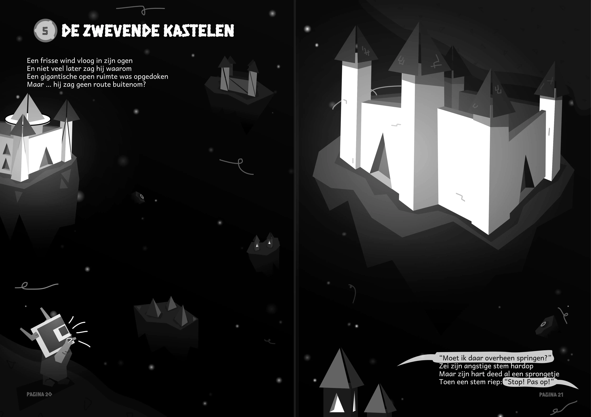
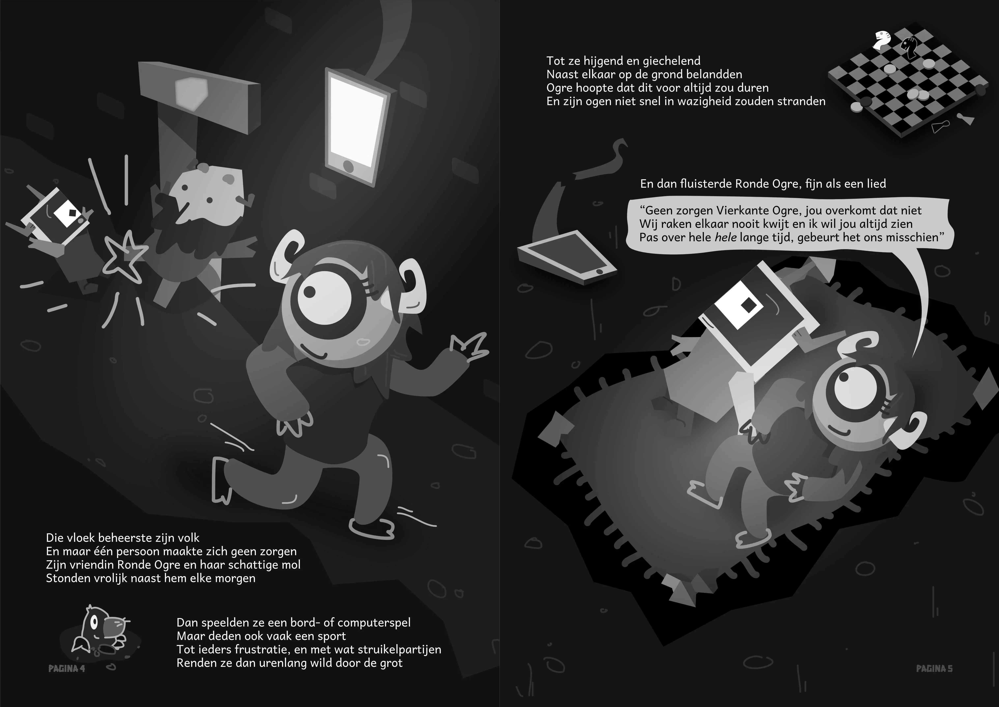
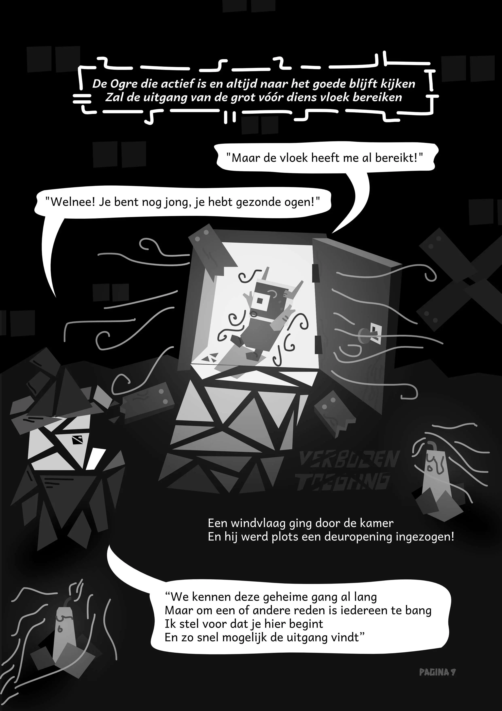
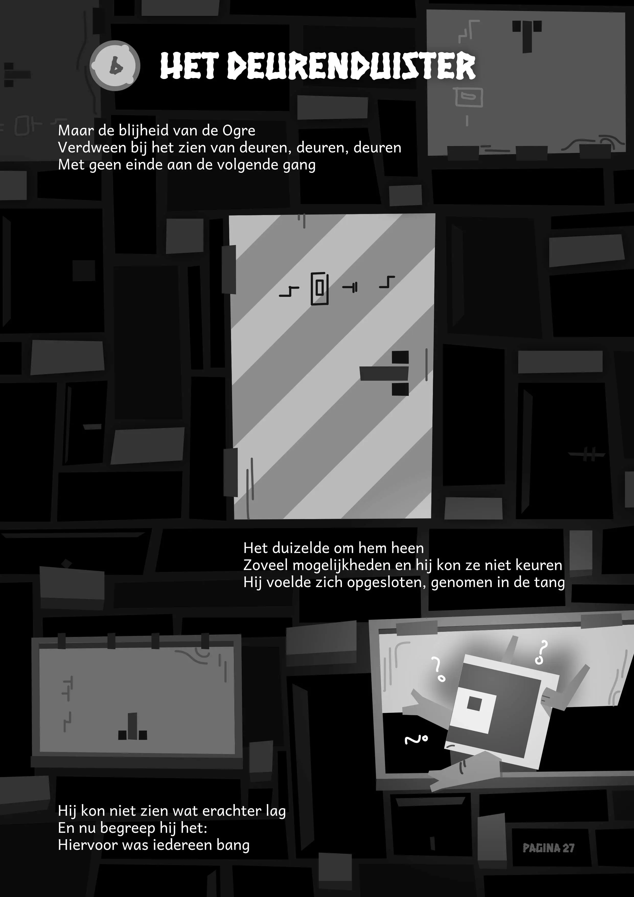
{}

### Wat is een interactief prentenboek? 

Na elk hoofdstuk moet je enkele _puzzels_ oplossen om verder te gaan. Die puzzels beginnen simpel en klein ... maar elk hoofdstuk komt er een nieuw bijzonder element, of een nieuwe regel, of een twist, en voor je het weet is het een hele uitdaging om Vierkante Ogre nog de uitgang te laten vinden.

Om de puzzels te spelen moet je zelf enkele figuren en fiches uit het prentenboek knippen. 

Wil je niet in het boek knippen? Scroll naar boven om losse bijlages te downloaden die je zelf kan printen.

Wil je een voorproefje van de puzzels? Of juist nóg meer puzzelplezier nadat je het boek uit hebt? Scroll naar boven om mijn gratis _computerspel_ te spelen!

Het prentenboek telt 60 puzzels, het computerspel maar liefst 500. Echter, het spel heeft niet het verhaal of de tekeningen van het prentenboek, en de gratis versie wordt ondersteund met advertenties.

### Plaatjes van puzzels

Hieronder volgen enkele plaatjes van puzzels (zowel uit het boek als het computerspel)

{}
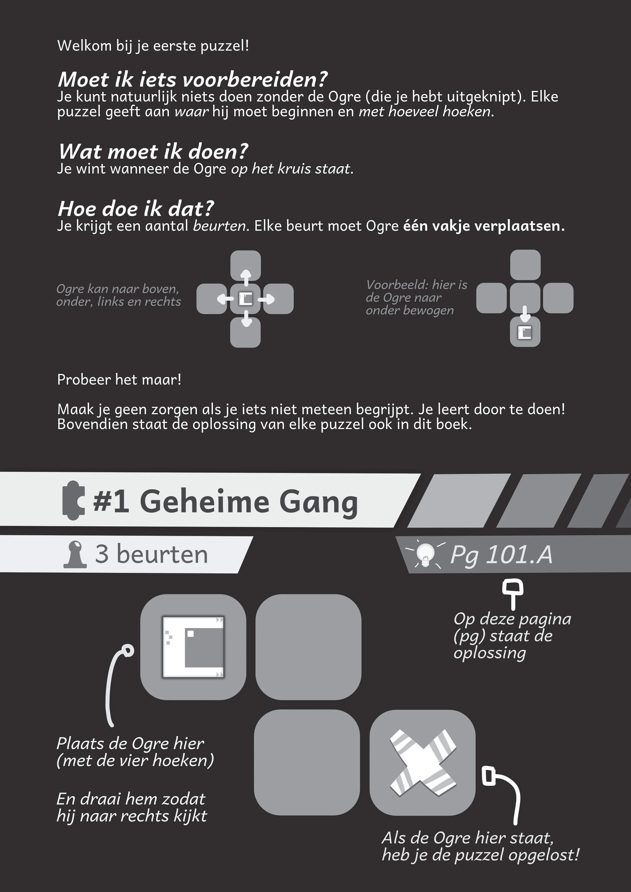
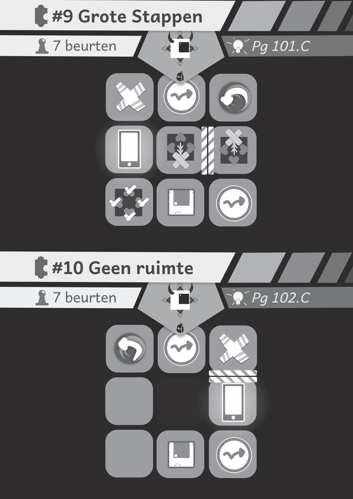
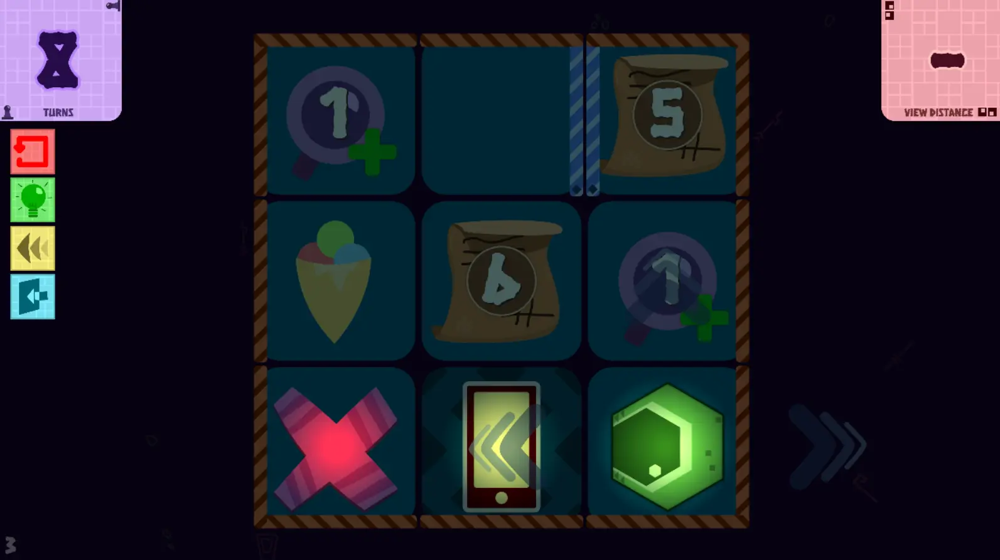
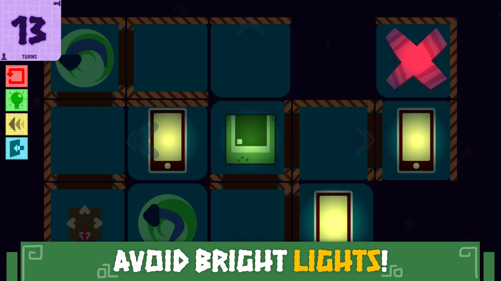
{}

### Hoe heb je dit gemaakt? 

Dit is mijn derde prentenboek en veruit de grootste en meest ambitieuze. Daarom heb ik het ontwikkelproces opgeschreven in enkele gedetailleerde "dagboeken":

* [Visueel Devlog](/blog/diaries/visueel-devlog-vierkante-ogre/): over het tot stand komen van het script en de plaatjes, die hand in hand gaan.
* [Puzzel Devlog](/blog/diaries/devlog-vierkante-ogre): over het tot stand komen van de puzzels. (De focus ligt op het computerspel, want die hielp mij bij het snel testen en verbeteren van de puzzels. En ja, deze is _lang_, want dit was _niet_ _bepaald_ _makkelijk_.)
* [Wat ik leerde van mijn derde prentenboek](/blog/2021/2021-03-03-wat-ik-leerde-van-mijn-derde-prentenboek): een kort artikel over de grootste fouten die ik maakte en de grootste wijsheden die ik heb meegekregen.

De voornaamste vraag die ik krijg is: _waarom is het in zwart-wit?_ Dat heeft enerzijds te maken met het thema en het verhaal in het boek, en daarvoor zal je het toch echt helemaal moeten lezen. Anderzijds kon ik daarmee de kosten van zo'n _gigantisch_ prentenboek tóch laag houden. En bovendien is misschien niet alles in zwart-wit ...

Daarnaast is het boek _in eigen beheer uitgegeven_. Geen uitgeverijen willen zich wagen aan iets dat zo groots en innovatief is. Begrijpelijk, want het is ook een groot risico.

(In zekere zin ben _ik_ dom dat ik altijd zulke experimentele ideeën bedenk en ze dan perse perfect wil uitwerken. Toen ik begon met dit project, had ik géén idee of een interactief prentenboek überhaupt zou werken, want het was nog nooit eerder gedaan. Gelukkig heb ik uiteindelijk loon na werken gekregen en iets heel moois kunnen maken!)

### Ronde Ogre 

In dit boek komt óók het personage Ronde Ogre voor. Zij heeft uiteindelijk haar eigen boek én spel gekregen, want stiekem, achter de schermen, heeft ze heel veel te maken met het avontuur van Vierkante Ogre 😉

> Klik hier om meer te lezen: [Ronde Ogre](/books/ronde-ogre/)

Dit werk kan je zien als een soort half vervolg/halve uitbreiding. In tegenstelling tot Vierkante Ogre, is haar zicht al geweldig, maar daardoor heeft ze weer _andere_ uitdagingen ...

### Vierkante Ogre ... in het wild 

Ik vind het altijd fijn om een paar plaatjes te maken van het echte boek, in een echte situatie, met een matige camera. Dat geeft een realistischer idee van de inhoud en kwaliteit dan "perfecte" plaatjes die alleen op de computer bestaan. Dus bij deze:

{}
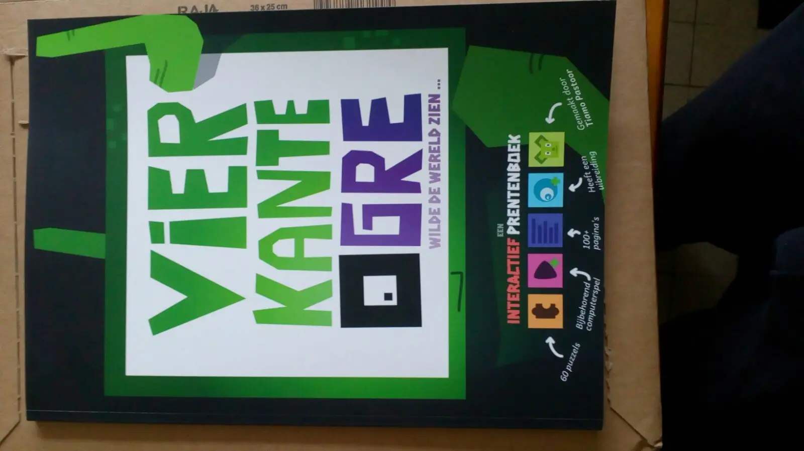
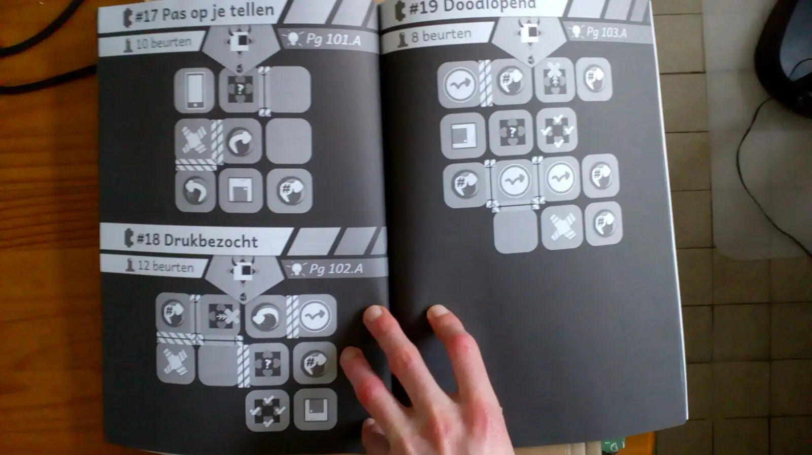
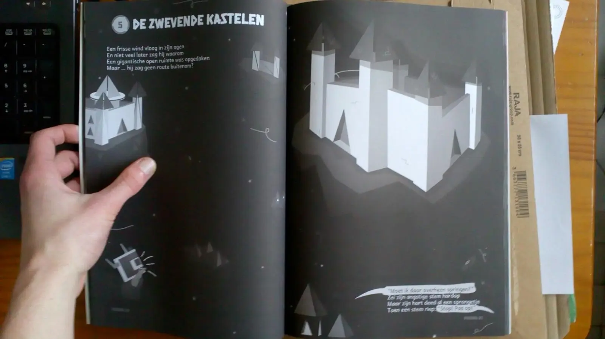
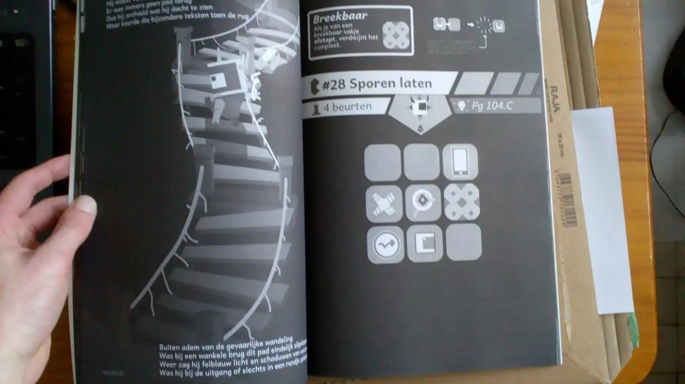
{}